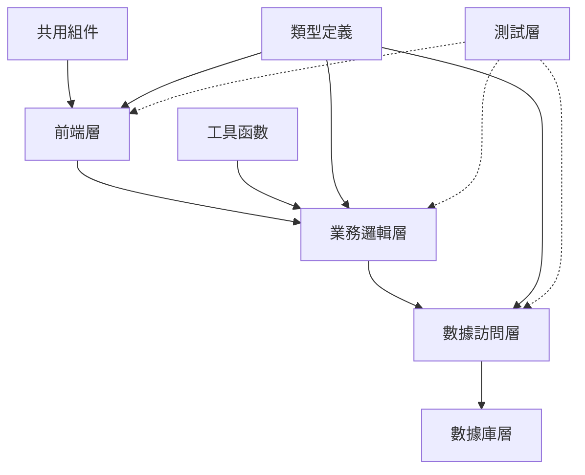

# 架構清理命令

## 用法
`/cleanup-architecture` 或 `/cleanup-architecture [模組路徑]`

## 執行流程
1. **啟動工具**
   - Ultrathink - 深度架構分析
   - Sequential-thinking - 系統性架構檢查
   - Task - 並行架構評估
   - Brave Search MCP - 最佳實踐研究

2. **架構分析**
   - 依賴關係檢查
   - 組件耦合度分析
   - 技術債務評估
   - 模組結構優化

## 角色建議
- 主要角色: 🏗️ Architect（系統架構專家）
- 協作角色: 🧹 Refactor + 📊 Analyzer + ⚡ Optimizer
- 設計審查: 📈 ProductManager（需求對齊）

## 架構檢查項目
### 🏗️ 系統架構
- [ ] 模組依賴關係清晰
- [ ] 循環依賴檢查
- [ ] 單一職責原則
- [ ] 開放封閉原則
- [ ] 依賴倒置原則

### 🧱 組件設計
- [ ] 組件耦合度 (<0.3)
- [ ] 組件內聚度 (>0.7)
- [ ] 接口設計合理
- [ ] 抽象層次一致
- [ ] 可測試性設計

### 📁 目錄結構
- [ ] 功能導向組織
- [ ] 關注點分離
- [ ] 命名規範統一
- [ ] 文件大小合理 (<300行)
- [ ] 嵌套深度控制 (<4層)

## 架構反模式檢查
### 🚫 常見反模式
| 反模式 | 檢查項目 | 影響 | 解決方案 |
|--------|----------|------|----------|
| 上帝類別 | 文件行數 >500 | 難維護 | 拆分職責 |
| 循環依賴 | import 關係 | 難測試 | 依賴注入 |
| 緊耦合 | 直接依賴 | 難擴展 | 接口抽象 |
| 重複代碼 | 相似邏輯 | 難維護 | 提取共用 |
| 過度抽象 | 不必要接口 | 難理解 | 簡化設計 |

## 架構評估指標
### 📊 複雜度指標
```javascript
// 計算認知複雜度
const calculateCognitiveComplexity = (filePath) => {
  const ast = parseFile(filePath);
  let complexity = 0;

  traverse(ast, {
    IfStatement: () => complexity++,
    SwitchStatement: () => complexity++,
    LoopStatement: () => complexity++,
    CatchClause: () => complexity++,
    ConditionalExpression: () => complexity++
  });

  return complexity;
};

// 檢查函數長度
const checkFunctionLength = (functions) => {
  return functions.filter(fn => fn.lines > 50);
};

// 分析依賴關係
const analyzeDependencies = (module) => {
  const imports = extractImports(module);
  const exports = extractExports(module);

  return {
    fanIn: imports.length,
    fanOut: exports.length,
    coupling: imports.length + exports.length
  };
};
```

### 🔍 依賴分析


## 架構優化策略
### 🎯 模組化設計
```typescript
// 清晰的模組接口
interface UserService {
  getUser(id: string): Promise<User>;
  updateUser(id: string, data: Partial<User>): Promise<User>;
  deleteUser(id: string): Promise<void>;
}

// 依賴注入
class UserController {
  constructor(
    private userService: UserService,
    private logger: Logger
  ) {}

  async handleGetUser(req: Request, res: Response) {
    try {
      const user = await this.userService.getUser(req.params.id);
      res.json(user);
    } catch (error) {
      this.logger.error('Get user failed', error);
      res.status(500).json({ error: 'Internal server error' });
    }
  }
}
```

### 🔄 重構策略
```typescript
// 提取共用邏輯
const createApiHandler = <T>(
  handler: (req: Request) => Promise<T>
) => {
  return async (req: Request, res: Response) => {
    try {
      const result = await handler(req);
      res.json(result);
    } catch (error) {
      console.error('API Error:', error);
      res.status(500).json({ error: 'Internal server error' });
    }
  };
};

// 組件合成
const withAuth = <P extends object>(
  Component: React.ComponentType<P>
) => {
  return (props: P) => {
    const { user } = useAuth();

    if (!user) {
      return <LoginForm />;
    }

    return <Component {...props} />;
  };
};
```

## 技術債務評估
### 📊 債務分類
```yaml
技術債務類型:
  設計債務:
    - 架構決策延遲
    - 模組設計不當
    - 接口設計缺陷

  代碼債務:
    - 重複代碼
    - 複雜邏輯
    - 命名不清

  測試債務:
    - 測試覆蓋不足
    - 測試質量差
    - 測試維護困難

  文檔債務:
    - 文檔過時
    - 文檔缺失
    - 註釋不足
```

### 📈 債務優先級
| 債務類型 | 影響程度 | 修復成本 | 優先級 | 建議行動 |
|---------|---------|---------|--------|----------|
| 架構設計 | 🔴 高 | 🔴 高 | P0 | 立即重構 |
| 循環依賴 | 🔴 高 | 🟡 中 | P0 | 立即解決 |
| 重複代碼 | 🟡 中 | 🟢 低 | P1 | 計劃重構 |
| 命名問題 | 🟢 低 | 🟢 低 | P2 | 逐步改善 |

## 架構改進計劃
### 🚀 短期改進 (1-2 Sprint)
```typescript
// 1. 解決循環依賴
// 使用依賴注入容器
const container = new Container();
container.bind<UserService>('UserService').to(UserServiceImpl);
container.bind<Logger>('Logger').to(ConsoleLogger);

// 2. 提取共用邏輯
// 建立 utils 模組
export const createValidator = (schema: Schema) => {
  return (data: unknown) => {
    const result = schema.safeParse(data);
    if (!result.success) {
      throw new ValidationError(result.error.issues);
    }
    return result.data;
  };
};

// 3. 統一錯誤處理
export class ErrorHandler {
  static handle(error: Error): ApiResponse {
    if (error instanceof ValidationError) {
      return { status: 400, message: error.message };
    }

    if (error instanceof NotFoundError) {
      return { status: 404, message: 'Resource not found' };
    }

    return { status: 500, message: 'Internal server error' };
  }
}
```

### 🎯 長期規劃 (3-6 Sprint)
```typescript
// 1. 實施領域驅動設計
// 定義領域邊界
export namespace UserDomain {
  export interface User {
    id: UserId;
    profile: UserProfile;
    permissions: Permission[];
  }

  export interface UserRepository {
    findById(id: UserId): Promise<User | null>;
    save(user: User): Promise<void>;
  }
}

// 2. 建立事件驅動架構
export class EventBus {
  private listeners: Map<string, Function[]> = new Map();

  emit(event: string, data: any) {
    const handlers = this.listeners.get(event) || [];
    handlers.forEach(handler => handler(data));
  }

  on(event: string, handler: Function) {
    const handlers = this.listeners.get(event) || [];
    handlers.push(handler);
    this.listeners.set(event, handlers);
  }
}
```

## 檢查命令
```bash
# 架構分析
npm run analyze:architecture

# 依賴檢查
npm run check:dependencies

# 複雜度分析
npm run analyze:complexity

# 技術債務評估
npm run analyze:debt
```

## 架構文檔
### 📚 文檔要求
```markdown
# 架構文檔清單
- [ ] 系統架構圖
- [ ] 模組依賴圖
- [ ] 數據流圖
- [ ] 部署架構圖
- [ ] 技術決策記錄 (ADR)
- [ ] 接口規範文檔
- [ ] 編碼規範文檔
```

## 報告輸出路徑
`docs/cleanup/architecture-cleanup-v[X.X.X].md`

---

**清理焦點**: 模組化設計 + 依賴管理 + 技術債務清理
**目標改善**: 耦合度降低50%，技術債務減少80%，可維護性提升300%
