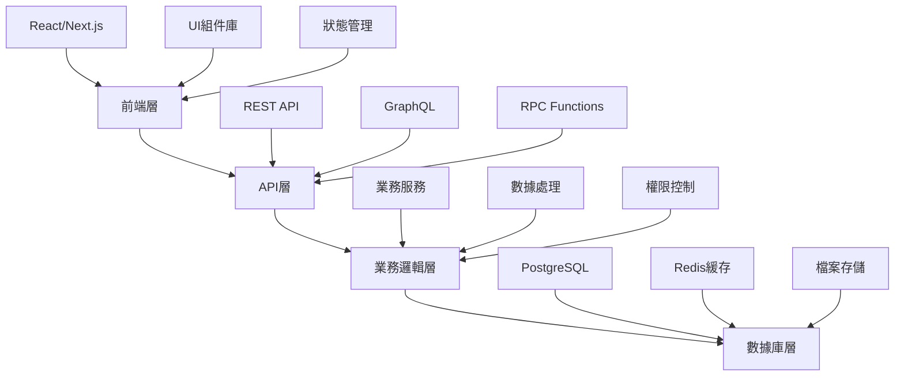
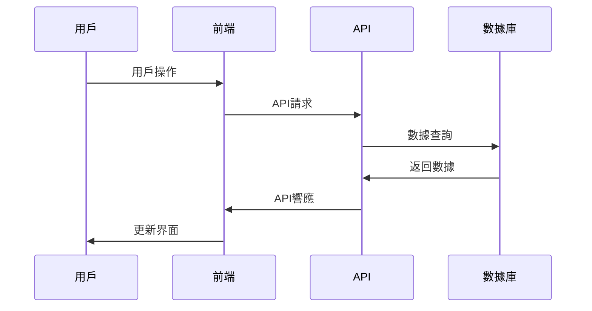
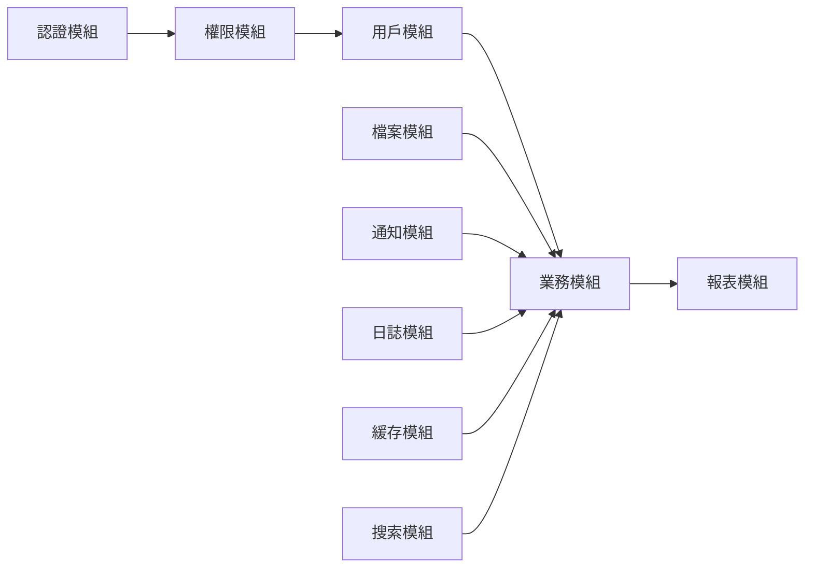

# Plan Mission Command (互動式計劃模式)

## 用法
`/plan [功能名稱]`

## 執行流程 (雙向互動模式)
1. **初始討論階段**
   - 開啟 Ultrathink, Sequential-thinking, Task 工具
   - 閱讀 docs\role_play 內的角色文檔
   - AI Agent 多角色討論分析需求

2. **用戶反饋階段**
   - 向用戶展示初步分析結果
   - 詢問用戶對方案的意見和建議
   - 收集用戶的補充需求

3. **迭代討論階段**
   - 根據用戶反饋，AI Agent 再次討論
   - 調整方案和優先級
   - 重新評估技術選型

4. **確認階段**
   - 再次向用戶確認修改後的方案
   - 如用戶滿意，生成最終計劃
   - 如仍有意見，重複步驟3-4

## 角色建議
- 根據 docs\role_play 內的角色文檔
- 主要角色: 🏗️ Architect（架構規劃）
- 協作角色: 📈 ProductManager + ⚙️ Backend
- 特殊場景: 針對AI、數據、流程等專項規劃
- **新增**: 💬 用戶代表（收集和整理用戶反饋）

## 互動模式詳細說明

### 第1階段：AI Agent 初始討論
```
🏗️ Architect: 從技術架構角度分析
📈 ProductManager: 從產品需求角度分析  
⚙️ Backend: 從實現可行性角度分析
💬 用戶代表: 整理和提出用戶視角問題
```

### 第2階段：用戶反饋收集
```
📊 向用戶展示：
- 初步方案摘要
- 技術選型建議
- 實施難度評估
- 預期時間和資源

❓ 詢問用戶：
- 對方案的整體意見
- 優先級是否正確
- 是否有遺漏需求
- 預算和時間限制
- 特殊要求或約束
```

### 第3階段：迭代討論
```
🔄 根據用戶反饋調整：
- 重新評估技術選型
- 調整功能優先級
- 修改實施策略
- 更新風險評估
```

### 第4階段：確認和定案
```
✅ 最終確認：
- 展示修改後方案
- 確認用戶滿意度
- 生成最終計劃文檔
- 建立執行時間表
```

## 互動式問題模板

### 初始方案展示
```
🎯 **初步方案摘要**
[AI Agent 討論結果摘要]

📊 **技術選型建議**
[技術方案和理由]

⏱️ **預估時間**
[開發時間預估]


❓ **用戶反饋問題**
1. 你對呢個方案嘅整體感覺如何？
2. 有邊啲功能係最重要嘅？
3. 有邊啲技術選型你有意見？
4. 預算同時間有咩限制？
5. 有咩特殊要求我哋冇考慮到？
```

### 迭代確認模板
```
🔄 **根據你嘅反饋，我哋調整咗：**
- 調整1: [具體調整]
- 調整2: [具體調整]
- 調整3: [具體調整]

❓ **請確認：**
1. 呢啲調整係咪符合你嘅期望？
2. 仲有咩地方需要修改？
3. 可以開始制定詳細計劃嗎？
```

## 計劃格式
- 版本規劃
- 功能清單  
- 技術方案
- 測試策略
- 風險評估
- **用戶反饋記錄**（新增）
- **迭代修改記錄**（新增）

## 計劃文檔輸出路徑
- 初稿: `docs/planning/[功能名稱]-draft.md`
- 最終版: `docs/planning/[功能名稱]-final.md`
- 討論記錄: `docs/planning/[功能名稱]-discussion.md`

---

# 互動式計劃文檔模板

## [功能名稱] 互動式開發計劃

**最後更新日期及時間**:[YYYY-MMM-DD HH:MM:SS]  
**負責人**: [姓名/角色]  
**項目狀態**: 📋 討論中 / 🔄 迭代中 / ✅ 已確認

## 💬 用戶反饋記錄

### 第1輪反饋 (YYYY-MM-DD)
**用戶意見**:
- 意見1: [具體意見]
- 意見2: [具體意見]
- 意見3: [具體意見]

**AI Agent 回應**:
- 回應1: [具體回應和調整]
- 回應2: [具體回應和調整]  
- 回應3: [具體回應和調整]

### 第2輪反饋 (YYYY-MM-DD)
**用戶意見**:
- 意見1: [具體意見]
- 意見2: [具體意見]

**AI Agent 回應**:
- 回應1: [具體回應和調整]
- 回應2: [具體回應和調整]

## 🔄 迭代修改記錄

### 迭代1: 初始方案調整
**修改原因**: [用戶反饋要求]
**修改內容**:
- 技術選型: [原方案] → [新方案]
- 功能優先級: [原優先級] → [新優先級]
- 實施策略: [原策略] → [新策略]

### 迭代2: 細節優化
**修改原因**: [用戶反饋要求]
**修改內容**:
- 修改1: [具體修改]
- 修改2: [具體修改]

## 📊 AI Agent 討論記錄

### 初始討論 (YYYY-MM-DD)
**🏗️ Architect 觀點**:
- 架構建議: [具體建議]
- 技術選型: [選型理由]
- 風險評估: [風險點]

**📈 ProductManager 觀點**:
- 產品需求: [需求分析]
- 優先級建議: [優先級理由]
- 商業價值: [價值評估]

**⚙️ Backend 觀點**:
- 實現可行性: [可行性分析]
- 技術難點: [難點識別]
- 開發時間: [時間評估]

**💬 用戶代表 觀點**:
- 用戶需求: [需求整理]
- 使用場景: [場景分析]
- 體驗要求: [體驗標準]

### 迭代討論 (YYYY-MM-DD)
**討論焦點**: [討論重點]
**達成共識**: [共識內容]
**分歧點**: [存在的分歧]
**解決方案**: [分歧解決方案]

## 📋 最終確認計劃概述

### 🎯 項目目標 (經用戶確認)
- **主要目標**: [經用戶確認的核心目標]
- **次要目標**: [經用戶確認的支援目標]
- **成功標準**: [經用戶確認的成功指標]

### 📊 項目範圍 (經用戶確認)
- **包含功能**: [經用戶確認的功能列表]
- **排除功能**: [經用戶確認排除的功能]
- **邊界條件**: [經用戶確認的邊界說明]

### 🏆 預期效益 (經用戶確認)
- **業務價值**: [經用戶確認的業務影響]
- **技術價值**: [經用戶確認的技術改進]
- **用戶價值**: [經用戶確認的體驗提升]

### 💡 用戶特殊要求
- **約束條件**: [用戶提出的約束]
- **偏好設定**: [用戶的技術偏好]
- **時間要求**: [用戶的時間限制]
- **預算限制**: [用戶的預算考量]

## 🗓️ 版本規劃

### v1.0 - 基礎版本
**依賴版本**: v[X.X.X]（前置需求）

#### 🎯 核心功能
- [ ] 功能1: [詳細描述]
- [ ] 功能2: [詳細描述]
- [ ] 功能3: [詳細描述]

#### 📋 技術任務
- [ ] 技術任務1: [具體內容]
- [ ] 技術任務2: [具體內容]
- [ ] 技術任務3: [具體內容]

#### ✅ 完成標準
- [ ] 標準1: [具體標準]
- [ ] 標準2: [具體標準]
- [ ] 標準3: [具體標準]

### v1.1 - 增強版本
**依賴版本**: v1.0（基礎版本完成）

#### 🎯 增強功能
- [ ] 增強功能1: [詳細描述]
- [ ] 增強功能2: [詳細描述]

#### 📋 優化任務
- [ ] 優化任務1: [具體內容]
- [ ] 優化任務2: [具體內容]

### v1.2 - 完善版本
**依賴版本**: v1.1（增強版本完成）

#### 🎯 完善功能
- [ ] 完善功能1: [詳細描述]
- [ ] 完善功能2: [詳細描述]

## 🏗️ 技術架構

### 🛠️ 技術棧
- **前端**: [技術選擇和理由]
- **後端**: [技術選擇和理由]
- **數據庫**: [技術選擇和理由]
- **部署**: [技術選擇和理由]

### 📐 架構設計

#### 🏗️ 系統架構圖


#### 🔄 序列圖


### 🔧 技術架構
```
┌─────────────────────────────────────────────────────────────┐
│                        前端層                                │
├─────────────────────────────────────────────────────────────┤
│ React/Next.js │ TypeScript │ Tailwind CSS │ shadcn/ui       │
├─────────────────────────────────────────────────────────────┤
│                        API層                                │
├─────────────────────────────────────────────────────────────┤
│ REST API     │ GraphQL     │ RPC Functions │ Middleware     │
├─────────────────────────────────────────────────────────────┤
│                      業務邏輯層                              │
├─────────────────────────────────────────────────────────────┤
│ 業務服務     │ 數據處理     │ 權限控制      │ 工作流程         │
├─────────────────────────────────────────────────────────────┤
│                      數據存儲層                              │
├─────────────────────────────────────────────────────────────┤
│ PostgreSQL   │ Redis      │ Supabase     │ 檔案存儲          │
└─────────────────────────────────────────────────────────────┘
```

### 🌐 部署架構
```
生產環境:
┌─────────────┐    ┌─────────────┐    ┌─────────────┐
│    CDN      │    │  前端服務    │    │  API服務    │
│  (靜態資源)  │    │ (Next.js)   │    │ (Supabase)  │
└─────────────┘    └─────────────┘    └─────────────┘
        │                  │                  │
        └──────────────────┼──────────────────┘
                           │
                   ┌─────────────┐
                   │  數據庫服務  │
                   │(PostgreSQL) │
                   └─────────────┘
```

### 🔗 模組關係圖


### 🔧 技術決策
| 決策點 | 選擇方案 | 理由 | 替代方案 |
|--------|----------|------|----------|
| [決策1] | [選擇] | [理由] | [替代] |
| [決策2] | [選擇] | [理由] | [替代] |

## 🧪 測試策略

### 📝 測試計劃
- **單元測試**: [覆蓋率目標和策略]
- **整合測試**: [測試範圍和方法]
- **E2E測試**: [關鍵路徑測試]
- **性能測試**: [性能指標和測試方法]

### 🎯 測試目標
- **代碼覆蓋率**: X%
- **關鍵路徑**: 100%
- **性能基準**: [具體指標]

## 🚨 風險評估

### ⚠️ 主要風險
| 風險 | 可能性 | 影響程度 | 風險等級 | 緩解策略 |
|------|--------|----------|----------|----------|
| [風險1] | 高/中/低 | 高/中/低 | 🔴/🟡/🟢 | [具體策略] |
| [風險2] | 高/中/低 | 高/中/低 | 🔴/🟡/🟢 | [具體策略] |

### 🛡️ 應急計劃
- **備選方案**: [具體備選方案]
- **回滾計劃**: [回滾步驟]
- **溝通計劃**: [風險溝通機制]

## 📊 資源規劃

### 👥 人力資源
- **開發團隊**: [人員配置]
- **測試團隊**: [人員配置]
- **項目管理**: [人員配置]

### ⏱️ 版本規劃
- **總版本數**: X 個版本
- **關鍵里程碑**: [具體版本節點]
- **緩衝版本**: 預留 X 個版本應急

## 📈 成功指標

### 🎯 版本目標
- **v1.0 目標**: [具體指標]
- **v1.1 目標**: [具體指標]
- **v1.2 目標**: [具體指標]

### 📊 量化指標
- **功能完成度**: 每版本 X% 提升
- **性能指標**: [具體數值目標]
- **質量指標**: [具體標準]

## 🔄 執行互動式計劃的步驟

### 步驟1: 啟動計劃
```bash
/plan [功能名稱]
```

### 步驟2: AI Agent 初始討論
- 系統會自動召集相關角色進行討論
- 生成初步方案草稿

### 步驟3: 用戶反饋階段
- 系統展示初步方案
- 用戶提供意見和建議
- 系統記錄所有反饋

### 步驟4: 迭代優化
- AI Agent 根據反饋重新討論
- 調整方案細節
- 再次徵求用戶意見

### 步驟5: 最終確認
- 生成最終計劃文檔
- 用戶確認執行
- 開始實施階段

## 🎯 互動式計劃的優勢

### 👥 用戶參與
- 確保需求準確性
- 減少後期修改
- 提高用戶滿意度

### 🔄 迭代優化
- 持續改進方案
- 降低實施風險
- 提高成功率

### 📝 完整記錄
- 保留討論過程
- 便於後期參考
- 經驗積累

---

**計劃建立人**: [姓名/角色]  
**計劃狀態**: 📋 初稿 / 🔄 迭代中 / ✅ 用戶確認 / 🚀 執行中  
**用戶參與度**: [用戶參與程度評估]  
**迭代次數**: [總迭代次數]  
**相關文檔**: [相關計劃或文檔連結]