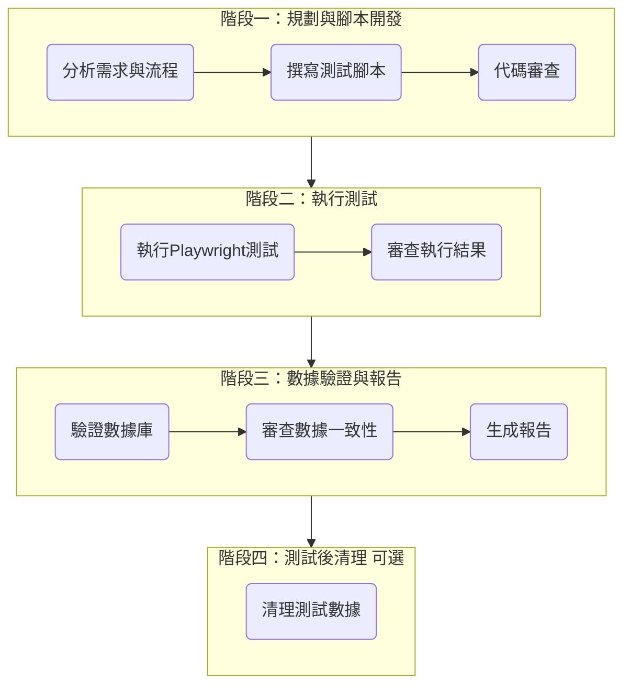

# QC 標籤卡測試執行指令

深度思考並執行全面的 `QCLabelCard` 組件功能測試，通過並行調用測試代理，自動化執行 UI 互動、數據驗證及報告生成。

## 變數

- **TARGET_COMPONENT**: `app/(app)/admin/cards/QCLabelCard.tsx`
  - 測試的主要目標組件
- **TEST_CASES**: 預定義的四組測試數據
  - 使用者：[test-automator](../agents/test-automator.md)
- 測試憑證
  - .env.local

## 執行代理群組



### 測試規劃與分析代理群組

- [business-analyst](../agents/business-analyst.md) (分析業務需求與測試案例)
- [frontend-developer](../agents/frontend-developer.md) (分析前端組件互動與 UI 流程)
- [backend-architect](../agents/backend-architect.md) (分析後端 RPC 函數與 API 邏輯)
- [ui-ux-designer](../agents/ui-ux-designer.md) (確保測試流程符合 UI/UX 設計)

### 執行測試與驗證測試代理群組

- [test-automator](../agents/test-automator.md) (撰寫並執行 Playwright 測試腳本)
- [database-admin](../agents/database-admin.md) (執行 Supabase MCP 查詢以驗證資料庫)
- **→ 執行完畢後立即調用 [progress-auditor](../agents/progress-auditor.md) 審查測試覆蓋率與數據準確性**

### 報告與文檔代理群組

- [docs-architect](../agents/docs-architect.md) (撰寫並歸檔測試報告)
- [code-reviewer](../agents/code-reviewer.md) (審查測試腳本的品質)
- [context-manager](../agents/context-manager.md) (更新上下文歷史記錄)
- **→ 執行完畢後立即調用 [progress-auditor](../agents/progress-auditor.md) 審查文檔完整性**

## 🚨 測試執行規則

### 核心原則

1.  **目標導向**：唯一目標是成功撰寫並執行測試，直到所有測試案例通過。
2.  **零硬編碼**：嚴格使用環境變量 (`process.env`) 讀取敏感資料，禁止在測試代碼中硬編碼登入憑證等資訊。
3.  **環境模擬**：測試必須在模擬單一操作員持續操作的系統預設的瀏覽器環境中執行。
4.  **檔案歸檔**：所有測試相關的檔案（腳本、報告）必須儲存於指定的目錄結構中。
5.  **虛擬打印**：涉及打印功能的步驟，只需驗證打印流程被觸發，無需進行物理打印。

### 品質標準

- **測試通過率**: 100%
- **數據一致性**: 數據庫驗證必須 100% 準確。
- **報告完整性**: 測試報告必須遵循指定模板，並包含所有必要部分。

## 執行指令

0. 完整閱讀 @CLAUDE.md [系統規範](../../CLAUDE.local.md)及文檔中的連結文案，以獲取全局設定及系統資訊
1. **前置作戰準備 (Pre-flight Check)**
   - [ ] **確認環境變數**: 檢查 `.env.local` 檔案是否存在，並包含 `TEST_SYS_LOGIN` 和 `TEST_SYS_PASSWORD`。
   - [ ] **確認依賴安裝**: 確保 `node_modules` 已存在，所有 Playwright 相關依賴已安裝。
   - [ ] **確認數據庫連線**: 執行 `npx supabase status`，確保與 Supabase 後端的連接正常。
   - [ ] **測試數據先決條件**:`pallet_number_buffer` 表中必須有足夠的可用托盤號碼 (`used` = `False`)。
2. 執行 `date +"%Y-%m-%d_%H-%M-%S"` 取得時間戳，並將其設為環境變數 `TIMESTAMP`。
3. 建立測試報告目錄：`docs/test/qc-label/$TIMESTAMP/`
4. **檢查 Playwright 環境與 Supabase 連接**

### 階段一：規劃與腳本開發

5.  **並行調用測試規劃與分析代理群組**
    - [business-analyst](../agents/business-analyst.md), [frontend-developer](../agents/frontend-developer.md), [backend-architect](../agents/backend-architect.md), [ui-ux-designer](../agents/ui-ux-designer.md)
    - **深度分析 `QCLabelCard` 組件、相關 RPC 函數及 UI 流程**
6.  **調用 [test-automator](../agents/test-automator.md) 撰寫 Playwright 測試腳本**
    - 腳本儲存於 `__tests__/e2e/qc-label-card.spec.ts`
    - 腳本需包含登入、導航、所有正向及負向測試案例的完整操作流程。
    - **腳本特別注意**：
      - 驗證 `Print` 按鈕在必填欄位未填寫前的禁用狀態。
      - 處理 `ACO Order Reference` 和 `Batch Number` 輸入框的條件性顯示。
      - 驗證產品代碼輸入後，無論大小寫，都能正確識別並自動校正。
7.  **立即調用 [code-reviewer](../agents/code-reviewer.md) 與 [progress-auditor](../agents/progress-auditor.md) 審查測試腳本**
    - 驗證代碼品質、環境變數使用、流程完整性。
    - 未通過 ≥95% 標準則重新開發。

### 階段二：執行測試

8.  **調用 [test-automator](../agents/test-automator.md) 執行 Playwright 測試**
    - 執行 `npx playwright test __tests__/e2e/qc-label-card.spec.ts`
    - **連續執行所有預定義的測試案例**
9.  **立即調用 [progress-auditor](../agents/progress-auditor.md) 審查執行結果**
    - 驗證所有測試案例 100% 通過。
    - 執行記錄寫入 `docs/test/qc-label/$TIMESTAMP/execution-log.md`
    - 若有失敗，返回階段一進行腳本修復。

### 階段三：數據驗證與報告生成

10. **調用 [database-admin](../agents/database-admin.md) 執行 Supabase MCP 查詢**
    - **針對成功的測試案例，精準驗證以下數據點**：
      - `record_palletinfo`: 驗證是否為每個 Pallet 創建了新紀錄，`product_code`, `product_qty` 和 `plt_remark` (ACO訂單號/批次號) 是否正確。
      - `record_history`: 驗證是否創建了 `Finished QC` 的歷史記錄，`id` 和 `loc` (`await`) 是否正確。
      - `record_inventory`: 驗證是否創建了庫存記錄，`await` 欄位的值是否等於 `product_qty`。
      - `stock_level`: 驗證對應產品的 `stock_level` 是否正確增加了 `product_qty`。
      - `work_level`: 驗證操作員當天的 `qc` 計數是否增加了 `Count of Pallet` 的數量。
      - `pallet_number_buffer`: 驗證對應的托盤號碼 `used` 欄位是否已更新為 `True`。
      - (僅ACO案例) `record_aco`: 驗證對應訂單的 `finished_qty` 是否正確增加了 `product_qty`。
    - **針對失敗的測試案例，驗證**：
      - 以上所有表格**不應**有任何與該次失敗操作相關的新增或修改紀錄。
11. **立即調用 [progress-auditor](../agents/progress-auditor.md) 審查數據一致性**
    - 驗證數據更新 100% 準確。
    - 驗證記錄寫入 `docs/test/qc-label/$TIMESTAMP/db-validation.md`
12. **並行調用報告與文檔代理群組**
    - [docs-architect](../agents/docs-architect.md) 根據模板生成完整測試報告 `docs/test/qc-label/$TIMESTAMP/Test Result.md`
    - [context-manager](../agents/context-manager.md)：執行[任務摘要](context_summary.md)指令

### 階段四：測試後清理

13. **調用 [database-admin](../agents/database-admin.md) 執行清理腳本**
    - 從 `qc_labels` 表格中刪除本次測試運行創建的所有紀錄，以保持數據庫清潔。

## 分階段品質標準

### 規劃與腳本開發階段標準

```yaml
腳本品質: ≥95% (ESLint 無錯誤, 遵循最佳實踐)
流程完整性: 100% (覆蓋登入、導航、所有測試案例)
環境變數使用: 100% (無硬編碼)
```

### 測試執行階段標準

```yaml
測試通過率: 100% (所有斷言成功)
執行穩定性: ≥90% (無 flakey tests)
```

### 數據驗證與報告階段標準

```yaml
數據準確性: 100% (DB 記錄與測試輸入匹配)
報告完整性: 100% (所有欄位已填寫)
文檔歸檔: 100% (所有產出物在正確位置)
```

## 交付物要求

### 產出檔案結構

```

├── __tests__/
│   └── e2e/
│       └──qc-label/
│              └── qc-label-card.spec.ts       # 測試腳本 ([test-automator](../agents/test-automator.md))
└── docs/
    ├── test/
         └──qc-label/
           └──2025-01-08_14-30-45/        # 時間戳
                   └── Test_Report ([docs-architect](../agents/docs-architect.md))

```

### 測試案例數據

| 測試次數 | 測試類型 | Product Code    | 特殊類型 | 訂單/批次號 | Quantity | Pallet Count | Verified Clock ID | 預期結果                                                |
| :------- | :------: | :-------------- | :------: | :---------- | :------- | :----------- | :---------------- | :------------------------------------------------------ |
| 1        | 正向測試 | `MEP9090150`    |   標準   | N/A         | 20       | 1            | 5997              | 成功生成標籤                                            |
| 2        | 正向測試 | `ACO_PRODUCT`   |   ACO    | `ORDER_123` | 50       | 2            | 6001              | 成功生成標籤，並更新ACO訂單                             |
| 3        | 正向測試 | `SLATE_PRODUCT` |  Slate   | `BATCH_456` | 100      | 1            | 5667              | 成功生成標籤，並記錄批次號                              |
| 4        | 正向測試 | `mel6060a`      |   標準   | N/A         | 20       | 2            | 5997              | 產品代碼自動校正為 `MEL6060A`，成功生成標籤             |
| 5        | 負向測試 | `INVALID_CODE`  |   標準   | N/A         | 20       | 1            | 5997              | 顯示產品代碼錯誤提示                                    |
| 6        | 負向測試 | `MEP9090150`    |   標準   | N/A         | 20       | 1            | `9999`            | 顯示操作員ID無效提示                                    |
| 7        | 負向測試 | `ACO_PRODUCT`   |   ACO    | `ORDER_123` | 9999     | 1            | 6001              | (假設9999超出訂單剩餘量) 顯示數量超出錯誤，數據庫無變化 |

---

## 測試報告模板

**注意**: 此模板應由 [docs-architect](../agents/docs-architect.md) 代理填充並保存為 `docs/test/qc-label/YYYY-MM-DD Test Result.md`。

````markdown
# QCLabelCard 測試報告

**測試日期**: `[YYYY-MM-DD]`

---

## 📋 測試概覽

### 測試目標

- **組件名稱**: `QCLabelCard`
- **測試工具**: `Playwright`，``
- **測試目的**: 驗證 QC 標籤卡功能嘅正確性，穩定性及資料庫更新情況

### 參與代理

| 代理名稱                                              | 角色             |
| ----------------------------------------------------- | ---------------- |
| [backend-architect](../agents/backend-architect.md)   | 後端架構師       |
| [business-analyst](../agents/business-analyst.md)     | 業務分析師       |
| [test-automator](../agents/test-automator.md)         | 測試自動化工程師 |
| [code-reviewer](../agents/code-reviewer.md)           | 代碼審查員       |
| [context-manager](../agents/context-manager.md)       | 上下文管理器     |
| [docs-architect](../agents/docs-architect.md)         | 文檔架構師       |
| [ui-ux-designer](../agents/ui-ux-designer.md)         | UI/UX 設計師     |
| [frontend-developer](../agents/frontend-developer.md) | 前端開發人員     |
| [database-admin](../agents/database-admin.md)         | 數據庫管理員     |

---

## 🔧 測試準備

### 前置檢查清單

- [ ] **RPC 功能檢查** - 確認所有 RPC 函數正常運作
- [ ] **數據庫準備** - 相關表格已更新並準備就緒
- [ ] **UI/UX 流程** - 前端介面流程已驗證
- [ ] **環境變量** - 確認 `process.env` 配置正確
- [ ] **測試數據** - 準備測試所需嘅產品代碼同操作員資料

### 測試環境配置

```yaml
測試瀏覽器: Brave
測試模式: 單一操作員連續操作模擬
測試文件路徑: /Users/chun/Documents/PennineWMS/online-stock-control-system/__tests__/
登入憑證:
  Email: ${process.env.TEST_SYS_LOGIN}
  Password: ${process.env.TEST_SYS_PASSWORD}
```

---

## 🚀 測試執行流程

### Step 1: 系統登入

- **頁面**: `app/(auth)/main-login/page.tsx`
- **操作**: 使用測試憑證登入系統
- **狀態**: `[✅ 成功 / ❌ 失敗]`
- **備註**: `[任何相關記錄]`

### Step 2: 導航到目標卡片

- **選擇器 1**: `app/(app)/admin/cards/AnalysisCardSelector.tsx`
- **選擇器 2**: `app/(app)/admin/cards/TabSelectorCard.tsx`
- **狀態**: `[✅ 成功 / ❌ 失敗]`
- **備註**: `[任何相關記錄]`

---

## 📊 測試案例執行詳情

### 測試案例 #1

| 欄位                  | 輸入值       | 預期結果          | 實際結果     | 狀態                  |
| --------------------- | ------------ | ----------------- | ------------ | --------------------- |
| **Product Code**      | `MEP9090150` | `[成功/失敗輸入]` | `[實際結果]` | `[✅ 成功 / ❌ 失敗]` |
| **Quantity**          | `20`         | `[成功/失敗輸入]` | `[實際結果]` | `[✅ 成功 / ❌ 失敗]` |
| **Pallet Count**      | `1`          | `[成功/失敗輸入]` | `[實際結果]` | `[✅ 成功 / ❌ 失敗]` |
| **Operator**          | `[Empty]`    | `[成功/失敗輸入]` | `[實際結果]` | `[✅ 成功 / ❌ 失敗]` |
| **Print Label 按鈕**  | `Pressed`    | `[成功/失敗輸入]` | `[實際結果]` | `[✅ 成功 / ❌ 失敗]` |
| **Verified Clock ID** | `5997`       | `[成功/失敗輸入]` | `[實際結果]` | `[✅ 成功 / ❌ 失敗]` |

**執行耗時**: `[HH:MM:SS]`
**錯誤日誌**:
`
````
