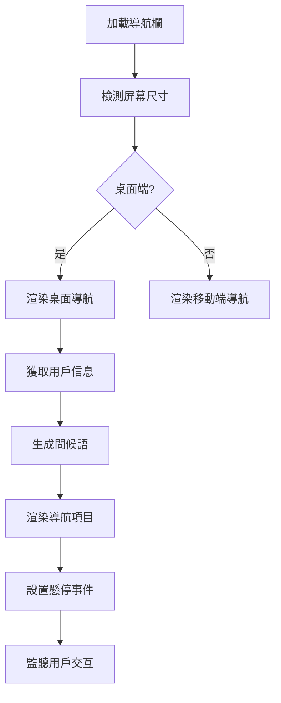
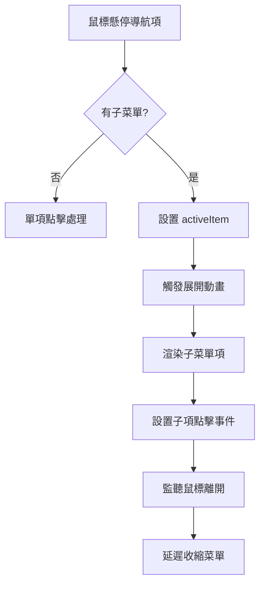
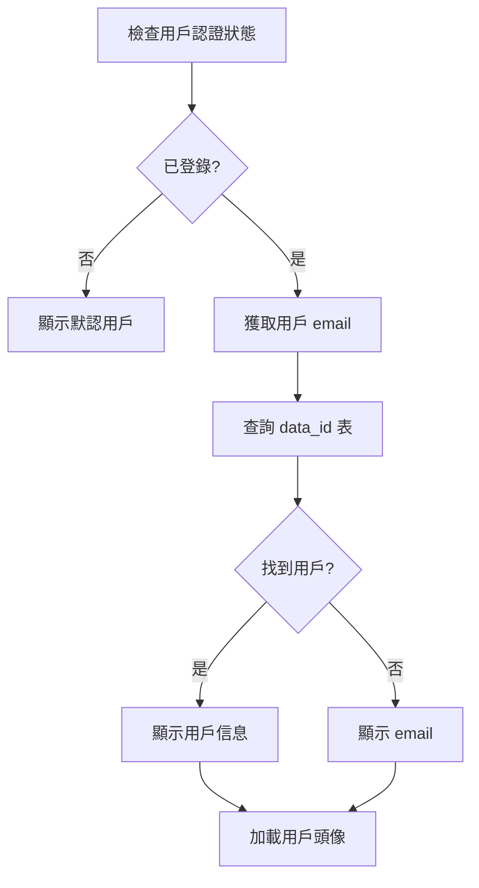

# 動態操作欄系統功能文檔

## 系統功能概述

動態操作欄系統（Dynamic Action Bar System）係 NewPennine WMS 嘅核心導航組件，提供現代化、響應式嘅用戶界面導航體驗。呢個系統採用 Framer Motion 動畫引擎，支援桌面同移動端，並集成用戶認證同權限管理功能。

### 主要功能特點
- **響應式設計**：自動適配桌面同移動端
- **動態動畫**：流暢嘅交互動畫效果
- **智能導航**：基於用戶權限嘅動態菜單
- **用戶集成**：完整嘅用戶信息展示
- **模組化設計**：可擴展嘅導航結構
- **多層級菜單**：支援子菜單同巢狀導航

## 主要組件和流程

### 核心組件架構

#### 1. 主導航欄 (`DynamicActionBar`)
```typescript
interface DynamicActionBarProps {
  className?: string;
}

// 主要功能
- 響應式佈局檢測
- 用戶信息獲取
- 動態菜單渲染
- 登出功能
- 問候語生成
```

#### 2. 導航項目組件 (`NavigationItem`)
```typescript
interface NavigationItemProps {
  item: NavigationItem;
  isActive: boolean;
  onActiveChange: (id: string | null) => void;
}

// 功能特點
- 懸停效果
- 子菜單展開
- 點擊導航
- 圖標展示
```

#### 3. 移動端視圖 (`MobileView`)
```typescript
interface MobileViewProps {
  items: NavigationItem[];
}

// 移動端特化
- 觸摸友好界面
- 滑動手勢支援
- 緊湊佈局
- 快速訪問
```

#### 4. 子菜單組件 (`SubMenu`)
```typescript
interface SubMenuProps {
  items: SubNavigationItem[];
  isVisible: boolean;
  onItemClick: (href: string) => void;
}

// 子菜單功能
- 動態展開/收縮
- 懸停延遲
- 平滑動畫
- 智能定位
```

### 導航配置系統

#### 1. 導航項目定義 (`navigation.ts`)
```typescript
interface NavigationItem {
  id: string;
  label: string;
  icon: React.ElementType;
  gradient: string;
  iconColor: string;
  href?: string;
  onClick?: () => void;
  children?: SubNavigationItem[];
}

// 主要導航項目
export const MAIN_NAVIGATION: NavigationItem[] = [
  {
    id: 'print-label',
    label: 'Print Label',
    icon: PrinterIcon,
    children: [
      { id: 'qc-label', label: 'Q.C. Label', href: '/print-label' },
      { id: 'grn-label', label: 'GRN Label', href: '/print-grnlabel' }
    ]
  },
  {
    id: 'stock-transfer',
    label: 'Stock Transfer',
    icon: TruckIcon,
    href: '/stock-transfer'
  },
  {
    id: 'loading-order',
    label: 'Loading Order',
    icon: ClipboardDocumentListIcon,
    href: '/order-loading'
  }
  // ... 更多導航項目
];
```

#### 2. 特殊功能集成
```typescript
// Ask Database 模態框觸發
const openAskDatabaseModal = () => {
  const event = new CustomEvent('openAskDatabase');
  window.dispatchEvent(event);
};

// 導航項目配置
{
  id: 'ask-database',
  label: 'Ask Database',
  icon: Brain,
  onClick: openAskDatabaseModal
}
```

### 用戶界面流程

#### 1. 桌面端導航流程


#### 2. 子菜單展開流程


#### 3. 用戶信息獲取流程


## 技術實現方案

### 動畫系統

#### 1. Framer Motion 集成
```typescript
// 容器動畫變體
const containerVariants = {
  hidden: { 
    y: 100, 
    opacity: 0,
    scale: 0.8
  },
  visible: {
    y: 0,
    opacity: 1,
    scale: 1,
    transition: {
      type: "spring",
      stiffness: 300,
      damping: 30,
      staggerChildren: 0.05
    }
  }
};

// 項目動畫
<motion.div 
  variants={containerVariants}
  initial="hidden"
  animate="visible"
>
```

#### 2. 懸停效果
```typescript
// 按鈕懸停動畫
<motion.button
  whileHover={{ scale: 1.05 }}
  whileTap={{ scale: 0.95 }}
  className="transition-all duration-300"
>
```

#### 3. 子菜單動畫
```typescript
// 子菜單進入/退出動畫
<AnimatePresence>
  {isVisible && (
    <motion.div
      initial={{ opacity: 0, y: -10 }}
      animate={{ opacity: 1, y: 0 }}
      exit={{ opacity: 0, y: -10 }}
      transition={{ duration: 0.2 }}
    >
```

### 響應式設計

#### 1. 設備檢測
```typescript
// 使用自定義 hook 檢測移動端
const isMobile = useMediaQuery('(max-width: 768px)');

// 條件渲染
if (isMobile) {
  return <MobileView items={MAIN_NAVIGATION} />;
}
```

#### 2. 移動端優化
```typescript
// 移動端特殊樣式
className={cn(
  "fixed inset-x-0 mx-auto w-fit",
  "bottom-[1%]",
  "bg-black/80 backdrop-blur-xl",
  "rounded-2xl border border-white/10",
  "shadow-2xl p-2 z-50"
)}
```

#### 3. 觸摸優化
```typescript
// 移動端觸摸友好設計
- 較大嘅觸摸目標
- 適當嘅間距
- 滑動手勢支援
- 觸覺反饋
```

### 用戶集成系統

#### 1. 用戶數據獲取
```typescript
// 從 data_id 表獲取用戶信息
useEffect(() => {
  const fetchUserData = async () => {
    if (user?.email) {
      const { data } = await supabase
        .from('data_id')
        .select('name, email, icon_url')
        .eq('email', user.email)
        .single();
      
      if (data) {
        setUserData(data);
      }
    }
  };
  
  fetchUserData();
}, [user, supabase]);
```

#### 2. 問候語生成
```typescript
// 基於時間嘅問候語
const getGreeting = () => {
  const hour = new Date().getHours();
  if (hour < 12) return 'Good Morning';
  if (hour < 18) return 'Good Afternoon';
  return 'Good Evening';
};
```

#### 3. 頭像處理
```typescript
// 用戶頭像展示邏輯
{userData?.icon_url ? (
  <Image 
    src={userData.icon_url} 
    alt={userData.name || 'User'} 
    width={40}
    height={40}
    className="w-10 h-10 rounded-full shadow-lg object-cover"
  />
) : (
  <div className="w-10 h-10 rounded-full bg-gradient-to-br from-blue-500 to-purple-600 flex items-center justify-center text-white font-bold shadow-lg">
    {userData?.name ? userData.name.charAt(0).toUpperCase() : 'U'}
  </div>
)}
```

### 登出功能

#### 1. 安全登出流程
```typescript
const handleLogout = async () => {
  const { error } = await supabase.auth.signOut();
  if (!error) {
    localStorage.removeItem('loggedInUserClockNumber');
    toast.success('You have logged out');
    router.push('/main-login');
  } else {
    toast.error('Failed to logout');
  }
};
```

## 安全性考慮

### 1. 權限驗證
```typescript
// 基於用戶權限嘅導航過濾
const filteredNavigation = MAIN_NAVIGATION.filter(item => {
  return hasPermission(user, item.requiredPermission);
});
```

### 2. 路由保護
```typescript
// 受保護路由檢查
const handleNavigation = (href: string) => {
  if (!user.allowedPaths.includes(href)) {
    toast.error('Access denied');
    return;
  }
  router.push(href);
};
```

### 3. 會話驗證
```typescript
// 導航欄會監控會話狀態
useEffect(() => {
  const { data: { subscription } } = supabase.auth.onAuthStateChange(
    (event, session) => {
      if (event === 'SIGNED_OUT') {
        router.push('/main-login');
      }
    }
  );

  return () => subscription.unsubscribe();
}, []);
```

## 與其他系統的協作

### 1. 用戶認證系統集成
```typescript
// 與 useAuth hook 緊密集成
const { user } = useAuth();

// 用戶狀態響應
- 登錄狀態變化
- 權限更新響應
- 會話超時處理
```

### 2. 路由系統協作
```typescript
// Next.js App Router 集成
import { useRouter } from 'next/navigation';

// 智能導航
- 程序化路由跳轉
- 歷史記錄管理
- 深層連結支援
```

### 3. 通知系統集成
```typescript
// Sonner toast 集成
import { toast } from 'sonner';

// 用戶反饋
- 操作成功提示
- 錯誤信息顯示
- 權限提醒
```

### 4. 模態框系統
```typescript
// Ask Database 模態框觸發
const openAskDatabaseModal = () => {
  const event = new CustomEvent('openAskDatabase');
  window.dispatchEvent(event);
};

// 全局事件監聽
window.addEventListener('openAskDatabase', handleModalOpen);
```

## 性能優化

### 1. 組件優化
```typescript
// React.memo 優化
const NavigationItem = React.memo(({ item, isActive, onActiveChange }) => {
  // 組件實現
});

// useCallback 優化
const handleItemClick = useCallback((href: string) => {
  router.push(href);
}, [router]);
```

### 2. 動畫性能
```typescript
// 硬件加速
transform: 'translateZ(0)',
willChange: 'transform',

// 防抖優化
const debouncedHover = useMemo(
  () => debounce(setActiveItem, 100),
  []
);
```

### 3. 圖標優化
```typescript
// Heroicons 動態導入
import { 
  PrinterIcon,
  TruckIcon,
  ClipboardDocumentListIcon 
} from '@heroicons/react/24/outline';

// Tree shaking 支援
```

## 擴展性設計

### 1. 配置驅動
```typescript
// 導航配置外部化
export const MAIN_NAVIGATION: NavigationItem[] = [
  // 可通過配置文件或 CMS 管理
];
```

### 2. 插件架構
```typescript
// 支援自定義導航項目
interface CustomNavigationPlugin {
  id: string;
  component: React.ComponentType;
  position: 'before' | 'after';
  target: string;
}
```

### 3. 主題支援
```typescript
// 主題變量
const theme = {
  background: 'bg-black/80',
  border: 'border-white/10',
  text: 'text-white',
  accent: 'from-blue-500 to-purple-600'
};
```

## 監控和維護

### 1. 用戶行為追蹤
```typescript
// 導航使用統計
const trackNavigation = (itemId: string) => {
  analytics.track('navigation_click', {
    item: itemId,
    timestamp: new Date(),
    user: user.id
  });
};
```

### 2. 性能監控
```typescript
// 渲染性能追蹤
const performanceObserver = new PerformanceObserver((list) => {
  const entries = list.getEntries();
  // 分析導航渲染性能
});
```

### 3. 錯誤處理
```typescript
// 導航錯誤邊界
class NavigationErrorBoundary extends React.Component {
  componentDidCatch(error, errorInfo) {
    console.error('Navigation error:', error, errorInfo);
    // 降級到簡單導航
  }
}
```

呢個動態操作欄系統為 NewPennine WMS 提供咗現代化、高效同用戶友好嘅導航體驗，係整個系統用戶界面嘅核心組件。