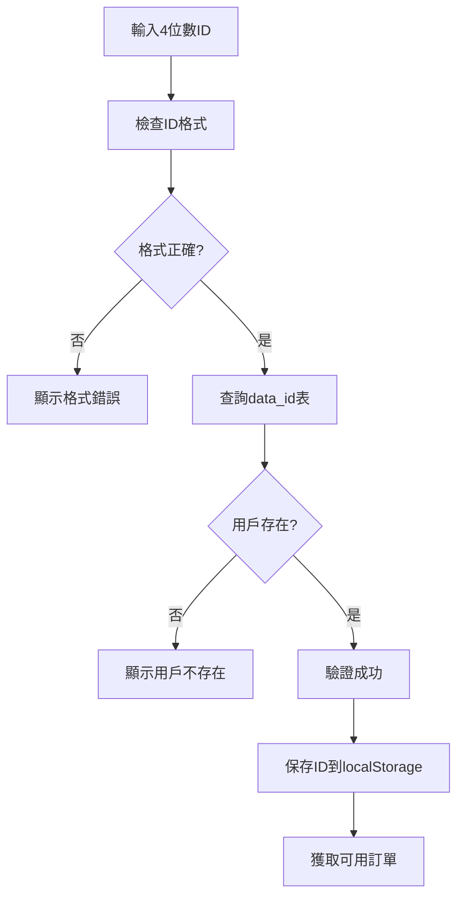
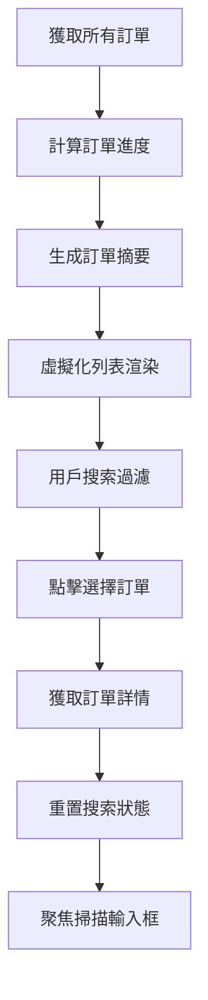
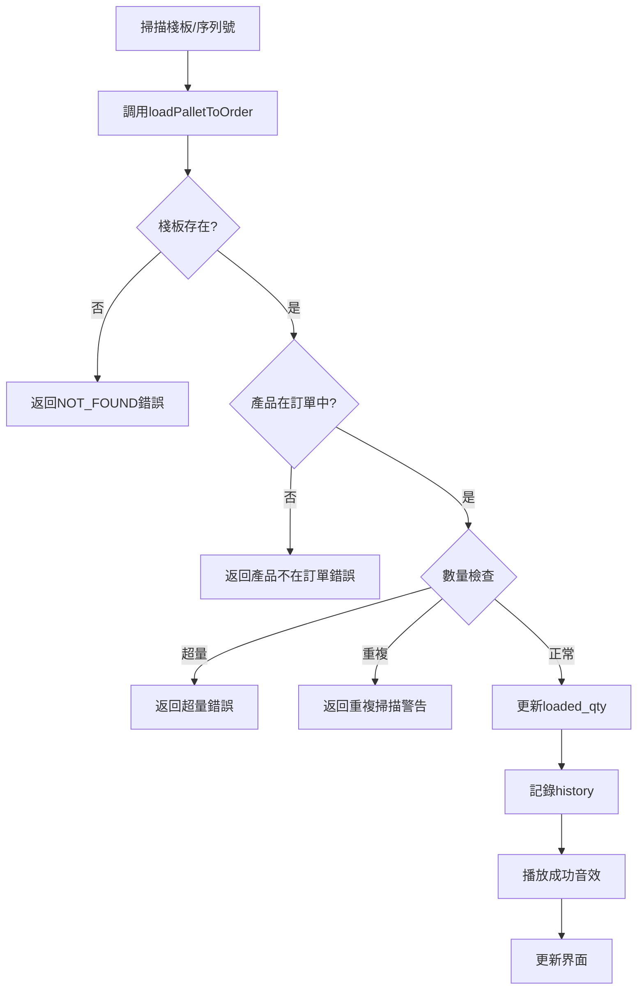
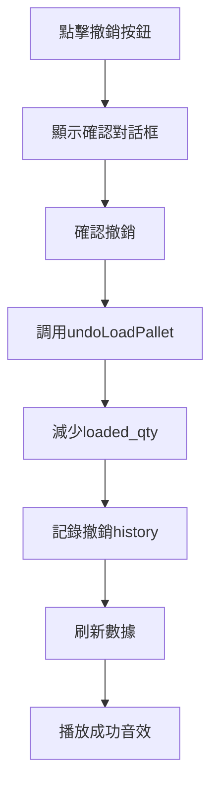

# 訂單裝載管理功能文檔

## 系統功能概述

訂單裝載管理系統（Order Loading Management System）係 NewPennine WMS 嘅核心物流模組，專門處理訂單揀貨、裝載驗證同出貨管理流程。呢個系統支援實時掃描、智能檢測、異常監控同完整嘅操作追蹤功能。

### 主要功能特點
- **實時掃描驗證**：支援棧板編號同序列號掃描
- **智能訂單匹配**：自動驗證產品同數量
- **異常檢測系統**：重複掃描、數量超標檢測
- **進度可視化**：實時裝載進度圖表
- **移動端優化**：觸摸友好嘅移動端界面
- **批量操作支援**：高效處理大量訂單
- **音效反饋**：操作成功/失敗音效提示

## 主要組件和流程

### 核心組件架構

#### 1. 主頁面組件 (`page.tsx`)
```typescript
// 主要狀態管理
interface OrderLoadingState {
  idNumber: string;                    // 用戶ID
  isIdValid: boolean;                  // ID驗證狀態
  availableOrders: string[];           // 可用訂單列表
  selectedOrderRef: string | null;     // 選中訂單
  orderData: OrderData[];              // 訂單詳情
  searchValue: string;                 // 掃描輸入值
  recentLoads: any[];                  // 最近裝載記錄
}

// 核心功能
- 用戶身份驗證
- 訂單選擇管理
- 掃描處理
- 進度追蹤
```

#### 2. 移動端組件 (`MobileOrderLoading`)
```typescript
// 移動端特化功能
- 觸摸優化界面
- 大按鈕設計
- 滑動操作支援
- 緊湊佈局
- 快速掃描
```

#### 3. 虛擬化列表 (`VirtualizedOrderList`)
```typescript
// 高性能訂單列表
- 虛擬滾動支援
- 大數據處理
- 搜索過濾
- 進度顯示
- 點擊選擇
```

#### 4. 進度圖表 (`LoadingProgressChart`)
```typescript
// 可視化進度展示
- 實時進度更新
- 完成度統計
- 歷史趨勢
- 彩色進度條
```

#### 5. 音效設置 (`SoundSettingsToggle`)
```typescript
// 音效反饋控制
- 成功音效
- 錯誤音效  
- 警告音效
- 音量控制
```

### 業務流程設計

#### 1. 用戶認證流程


#### 2. 訂單選擇流程


#### 3. 掃描裝載流程


#### 4. 撤銷操作流程


## 技術實現方案

### 資料庫設計

#### 1. 訂單數據表 (`data_order`)
```sql
data_order:
  - order_ref (訂單編號)
  - product_code (產品代碼)
  - product_desc (產品描述)
  - product_qty (訂單數量)
  - loaded_qty (已裝載數量)
```

#### 2. 棧板信息表 (`record_palletinfo`)
```sql
record_palletinfo:
  - plt_num (棧板編號)
  - product_code (產品代碼)
  - product_qty (棧板數量)
  - series (序列號)
  - plt_remark (備註)
  - generate_time (生成時間)
```

#### 3. 歷史記錄表 (`record_history`)
```sql
record_history:
  - uuid (唯一標識)
  - time (時間)
  - id (用戶ID)
  - action (動作類型)
  - plt_num (棧板編號)
  - loc (位置)
  - remark (備註信息)
```

### 服務端函數

#### 1. 裝載操作 (`loadPalletToOrder`)
```typescript
export async function loadPalletToOrder(
  orderRef: string,
  scanValue: string
): Promise<LoadResult> {
  // 1. 檢測掃描值類型
  const detectionResult = detectScanType(scanValue);
  
  // 2. 搜索棧板信息
  const palletInfo = await searchPallet(detectionResult);
  
  // 3. 驗證產品在訂單中
  const orderItem = await findOrderItem(orderRef, palletInfo.product_code);
  
  // 4. 檢查數量限制
  if (orderItem.loaded_qty + palletInfo.product_qty > orderItem.product_qty) {
    return { success: false, error: 'EXCEED_ORDER_QTY' };
  }
  
  // 5. 檢查重複掃描
  const isDuplicate = await checkDuplicateScan(orderRef, scanValue);
  if (isDuplicate) {
    return { success: false, error: 'DUPLICATE_SCAN' };
  }
  
  // 6. 更新loaded_qty
  await updateLoadedQuantity(orderRef, palletInfo.product_code, palletInfo.product_qty);
  
  // 7. 記錄歷史
  await recordLoadHistory(orderRef, palletInfo, userId);
  
  return { success: true, data: palletInfo };
}
```

#### 2. 撤銷操作 (`undoLoadPallet`)
```typescript
export async function undoLoadPallet(
  orderRef: string,
  palletNum: string,
  productCode: string,
  quantity: number
): Promise<UndoResult> {
  // 1. 驗證操作權限
  const canUndo = await verifyUndoPermission(palletNum);
  
  // 2. 減少loaded_qty
  await updateLoadedQuantity(orderRef, productCode, -quantity);
  
  // 3. 記錄撤銷歷史
  await recordUndoHistory(orderRef, palletNum, quantity, userId);
  
  return { success: true };
}
```

#### 3. 異常檢測服務 (`anomalyDetectionService`)
```typescript
export class AnomalyDetectionService {
  // 檢測重複掃描
  async detectDuplicateScans(orderRef: string, scanValue: string): Promise<boolean> {
    const recentScans = await getRecentScans(orderRef, '5 minutes');
    return recentScans.some(scan => scan.value === scanValue);
  }
  
  // 檢測數量異常
  async detectQuantityAnomaly(orderRef: string, productCode: string): Promise<AnomalyResult> {
    const orderItem = await getOrderItem(orderRef, productCode);
    const loadedPercentage = (orderItem.loaded_qty / orderItem.product_qty) * 100;
    
    if (loadedPercentage > 100) {
      return { type: 'OVERLOAD', severity: 'HIGH' };
    } else if (loadedPercentage > 90) {
      return { type: 'NEAR_COMPLETE', severity: 'MEDIUM' };
    }
    
    return { type: 'NORMAL', severity: 'LOW' };
  }
}
```

### 緩存系統

#### 1. 訂單數據緩存 (`useOrderCache`)
```typescript
// 訂單數據緩存策略
const useOrderDataCache = () => {
  const cache = new Map<string, OrderData[]>();
  const TTL = 5 * 60 * 1000; // 5分鐘

  return {
    get: (key: string) => {
      const cached = cache.get(key);
      if (cached && !isExpired(cached.timestamp, TTL)) {
        return cached.data;
      }
      return null;
    },
    set: (key: string, data: OrderData[]) => {
      cache.set(key, { data, timestamp: Date.now() });
    },
    remove: (key: string) => {
      cache.delete(key);
    }
  };
};
```

#### 2. 訂單摘要緩存
```typescript
// 訂單摘要緩存
interface OrderSummary {
  orderRef: string;
  totalQty: number;
  loadedQty: number;
  percentage: number;
  itemCount: number;
  completedItems: number;
}

const useOrderSummariesCache = () => {
  // 類似實現，針對訂單摘要優化
};
```

### 音效反饋系統

#### 1. 音效設置管理
```typescript
// 音效設置 Hook
const useSoundSettings = () => {
  const [enabled, setEnabled] = useState(true);
  const [volume, setVolume] = useState(0.7);

  return {
    getSoundEnabled: () => enabled,
    getSoundVolume: () => volume,
    setSoundEnabled: setEnabled,
    setSoundVolume: setVolume
  };
};
```

#### 2. 音效播放控制
```typescript
// 音效反饋 Hook
const useSoundFeedback = ({ enabled, volume }) => {
  const playSuccess = () => {
    if (enabled) {
      new Audio('/sounds/success.mp3').play().catch(() => {});
    }
  };

  const playError = () => {
    if (enabled) {
      new Audio('/sounds/error.mp3').play().catch(() => {});
    }
  };

  const playWarning = () => {
    if (enabled) {
      new Audio('/sounds/warning.mp3').play().catch(() => {});
    }
  };

  return { playSuccess, playError, playWarning };
};
```

## 安全性考慮

### 1. 用戶權限驗證
```typescript
// 操作權限檢查
const verifyLoadingPermission = async (userId: string): Promise<boolean> => {
  const user = await getUserById(userId);
  return user?.permissions?.loading === true;
};
```

### 2. 數據完整性保護
```typescript
// 事務性操作
const loadPalletTransaction = async (orderRef: string, palletInfo: PalletInfo) => {
  const transaction = await supabase.transaction();
  
  try {
    // 1. 更新訂單數量
    await transaction.updateOrderQuantity(orderRef, palletInfo);
    
    // 2. 記錄歷史
    await transaction.insertHistory(orderRef, palletInfo);
    
    // 3. 提交事務
    await transaction.commit();
  } catch (error) {
    // 4. 回滾事務
    await transaction.rollback();
    throw error;
  }
};
```

### 3. 輸入驗證
```typescript
// 掃描值驗證
const validateScanInput = (scanValue: string): ValidationResult => {
  // 檢查格式
  if (!scanValue || scanValue.trim().length === 0) {
    return { valid: false, error: 'Empty scan value' };
  }
  
  // 檢查長度
  if (scanValue.length > 100) {
    return { valid: false, error: 'Scan value too long' };
  }
  
  // 檢查特殊字符
  if (!/^[A-Za-z0-9\-_]+$/.test(scanValue)) {
    return { valid: false, error: 'Invalid characters' };
  }
  
  return { valid: true };
};
```

## 與其他系統的協作

### 1. 庫存系統集成
```typescript
// 實時庫存更新
const updateInventoryOnLoad = async (palletInfo: PalletInfo) => {
  await supabase
    .from('record_inventory')
    .insert({
      product_code: palletInfo.product_code,
      shipped: palletInfo.product_qty,
      latest_update: new Date().toISOString(),
      plt_num: palletInfo.plt_num
    });
};
```

### 2. 報告系統協作
```typescript
// 裝載報告生成
const generateLoadingReport = async (orderRef: string): Promise<LoadingReport> => {
  const orderData = await getOrderData(orderRef);
  const loadHistory = await getLoadHistory(orderRef);
  
  return {
    orderRef,
    totalItems: orderData.length,
    completedItems: orderData.filter(item => item.loaded_qty >= item.product_qty).length,
    totalQuantity: orderData.reduce((sum, item) => sum + parseInt(item.product_qty), 0),
    loadedQuantity: orderData.reduce((sum, item) => sum + parseInt(item.loaded_qty), 0),
    loadHistory
  };
};
```

### 3. 打印系統集成
```typescript
// 裝載清單打印
const printLoadingList = async (orderRef: string) => {
  const report = await generateLoadingReport(orderRef);
  
  // 觸發打印服務
  await printService.printLoadingList({
    template: 'loading-list',
    data: report
  });
};
```

### 4. 通知系統
```typescript
// 裝載完成通知
const notifyLoadingComplete = async (orderRef: string) => {
  const isComplete = await checkOrderComplete(orderRef);
  
  if (isComplete) {
    await notificationService.send({
      type: 'ORDER_LOADING_COMPLETE',
      orderRef,
      timestamp: new Date().toISOString()
    });
  }
};
```

## 性能優化

### 1. 虛擬化渲染
```typescript
// 大列表虛擬化
const VirtualizedOrderList = ({ orders, ...props }) => {
  const [visibleRange, setVisibleRange] = useState({ start: 0, end: 20 });
  
  const visibleOrders = orders.slice(visibleRange.start, visibleRange.end);
  
  return (
    <div className="virtual-list-container">
      {visibleOrders.map(order => (
        <OrderItem key={order.orderRef} order={order} />
      ))}
    </div>
  );
};
```

### 2. 搜索優化
```typescript
// 防抖搜索
const useDebounceSearch = (searchTerm: string, delay: number) => {
  const [debouncedTerm, setDebouncedTerm] = useState(searchTerm);

  useEffect(() => {
    const handler = setTimeout(() => {
      setDebouncedTerm(searchTerm);
    }, delay);

    return () => {
      clearTimeout(handler);
    };
  }, [searchTerm, delay]);

  return debouncedTerm;
};
```

### 3. 數據預加載
```typescript
// 智能預加載
const useOrderPreloading = () => {
  const preloadOrder = useCallback(async (orderRef: string) => {
    // 在後台預加載訂單數據
    const orderData = await fetchOrderData(orderRef);
    orderDataCache.set(`order-data-${orderRef}`, orderData);
  }, []);

  return { preloadOrder };
};
```

## 監控和維護

### 1. 性能監控
```typescript
// 裝載性能追蹤
const trackLoadingPerformance = (orderRef: string, startTime: number) => {
  const duration = Date.now() - startTime;
  
  analytics.track('loading_performance', {
    orderRef,
    duration,
    timestamp: new Date().toISOString()
  });
};
```

### 2. 錯誤監控
```typescript
// 錯誤自動報告
const reportLoadingError = (error: Error, context: any) => {
  errorReporting.report({
    error: error.message,
    stack: error.stack,
    context,
    timestamp: new Date().toISOString(),
    module: 'order-loading'
  });
};
```

### 3. 數據一致性檢查
```typescript
// 定期數據一致性驗證
const validateDataConsistency = async () => {
  const orders = await getAllActiveOrders();
  
  for (const order of orders) {
    const calculatedTotal = await calculateLoadedQuantity(order.orderRef);
    const storedTotal = order.loaded_qty;
    
    if (calculatedTotal !== storedTotal) {
      await reportInconsistency(order.orderRef, calculatedTotal, storedTotal);
    }
  }
};
```

呢個訂單裝載管理系統為 NewPennine WMS 提供咗高效、準確同用戶友好嘅訂單處理能力，確保出貨流程嘅順暢同準確性。