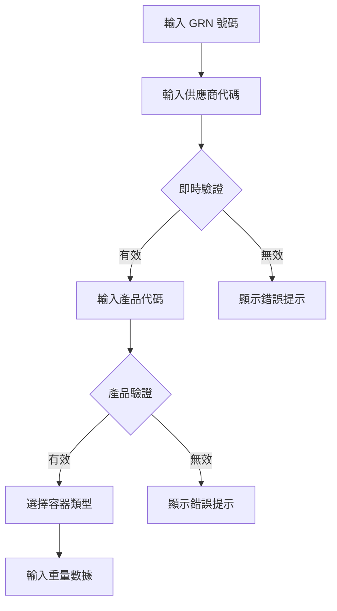
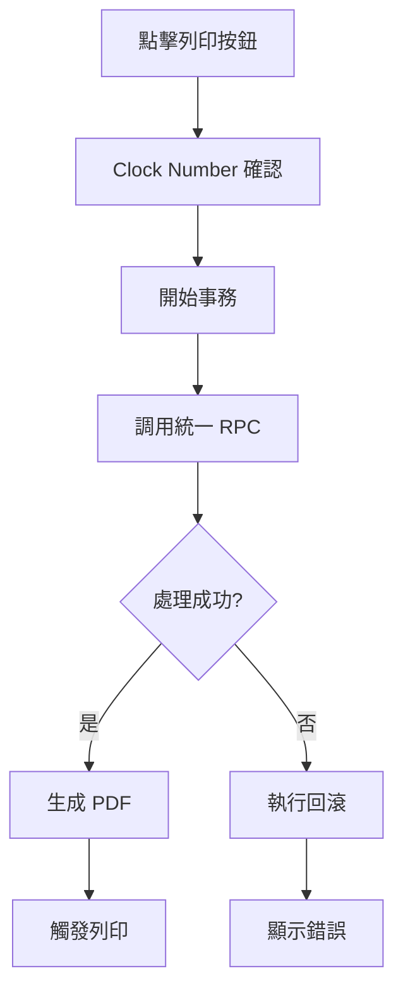

# GRN 標籤列印系統文檔

## 概述

GRN（Goods Received Note）標籤列印系統係 NewPennine 倉庫管理系統嘅核心功能之一，負責處理收貨記錄同生成標準化嘅收貨標籤。系統採用最新嘅 React 技術棧，整合咗即時驗證、批量處理、事務管理同 PDF 生成功能。

## 系統架構

### 技術棧
- **前端**: Next.js 14 (App Router), TypeScript, Tailwind CSS
- **UI 框架**: shadcn/ui, Framer Motion
- **狀態管理**: useReducer + Context Pattern
- **後端**: Supabase (PostgreSQL + RPC Functions)
- **PDF 生成**: @react-pdf/renderer
- **日誌系統**: Pino Logger

### 主要文件結構
```
/app/print-grnlabel/
├── page.tsx                    # 主頁面入口
├── components/
│   ├── GrnLabelFormV2.tsx     # 核心表單組件
│   ├── GrnDetailCard.tsx      # GRN 詳情顯示卡片
│   └── WeightInputList.tsx    # 重量輸入列表組件
├── hooks/
│   ├── useGrnFormReducer.tsx  # 表單狀態管理
│   ├── useGrnLabelBusinessV2.tsx # 業務邏輯處理
│   └── useWeightCalculation.ts # 重量計算邏輯
├── services/
│   └── ErrorHandler.ts        # 錯誤處理服務
└── constants/
    └── grnConstants.ts        # 常數定義
```

## 核心功能

### 1. 統一 RPC 批量處理 ⚡
系統採用統一嘅 RPC 調用機制，通過單一事務處理所有數據操作：

```typescript
// 統一 RPC 函數：process_grn_label_unified
- 生成棧板號碼同系列號
- 創建 record_palletinfo 記錄
- 創建 record_grn 記錄
- 創建 record_history 記錄
- 創建 record_inventory 記錄
- 更新 daily_pallet_sequence
```

### 2. 表單狀態管理
使用 `useReducer` 模式管理複雜表單狀態：

```typescript
interface GrnFormState {
  formData: {
    grnNumber: string;
    materialSupplier: string;
    productCode: string;
  };
  productInfo: ProductInfo | null;
  labelMode: 'single' | 'multiple';
  containerSettings: {
    palletType: PalletTypeKey;
    packageType: PackageTypeKey;
  };
  weights: WeightEntry[];
  uiState: {
    isProcessing: boolean;
    showInstructions: boolean;
    activeField: string | null;
  };
  progress: ProgressInfo;
}
```

### 3. 重量計算系統 📊

#### 最新重量標準（2025年1月）
**棧板重量**:
- White Dry: 14kg
- White Wet: 18kg
- Chep Dry: 26kg
- Chep Wet: 38kg
- Euro: 22kg
- Not Included: 0kg

**包裝重量**:
- Still: 50kg
- Bag: 1kg
- Tote: 10kg
- Octo: 20kg
- Not Included: 0kg

**計算公式**:
```typescript
淨重 = Math.max(0, 毛重 - 棧板重量 - 包裝重量)
```

### 4. 錯誤處理機制
系統實現咗全面嘅錯誤處理同回滾機制：

```typescript
// 事務日誌記錄
transaction_log 表：
- transaction_id: 唯一事務 ID
- source_module: 'GRN'
- operation: 'CREATE_GRN_LABELS'
- status: pending | completed | failed | rolled_back
- rollback_data: JSONB 格式嘅回滾數據

// 回滾功能
- 刪除已創建嘅棧板記錄
- 回收已使用嘅棧板號碼
- 清理所有相關記錄
```

### 5. PDF 生成同列印
系統為每個棧板生成標準化嘅 GRN 標籤：

**標籤內容**:
- Pennine 公司標誌
- QR Code（包含棧板資訊）
- 產品代碼同描述
- 數量同重量資訊
- GRN 號碼同供應商
- 棧板號碼同系列號
- 操作員同日期

## 工作流程

### 1. 用戶認證同初始化


### 2. 表單填寫同驗證


### 3. 數據處理流程


## 數據庫架構

### 主要數據表
1. **record_palletinfo** - 棧板基本資訊
2. **record_grn** - GRN 詳細記錄
3. **record_history** - 操作歷史
4. **record_inventory** - 庫存位置
5. **transaction_log** - 事務日誌
6. **daily_pallet_sequence** - 每日序列管理

### RPC 函數
- `process_grn_label_unified` - 統一處理函數
- `rollback_transaction` - 事務回滾函數
- `generate_pallet_numbers_batch_v7` - 批量號碼生成

## 性能優化

### 1. 批量處理
- 使用單一 RPC 調用處理多個棧板
- 減少網絡往返次數
- 提高處理效率

### 2. 緩存策略
- 供應商資料緩存 5 分鐘
- 產品資訊緩存 5 分鐘
- 表單數據自動保存

### 3. 樂觀更新
- UI 即時響應用戶操作
- 背景處理數據同步
- 失敗時自動回滾

## 安全措施

### 1. 身份驗證
- Clock Number 雙重確認
- 基於角色嘅訪問控制
- 操作審計記錄

### 2. 數據驗證
- 前端即時驗證
- 後端二次驗證
- SQL 注入防護

### 3. 事務完整性
- ACID 事務保證
- 自動回滾機制
- 數據一致性檢查

## 監控同維護

### 1. 日誌系統
```typescript
// 使用 Pino Logger
- API 請求日誌
- 錯誤追蹤
- 性能監控
- 用戶操作記錄
```

### 2. 錯誤追蹤
- GrnErrorStats 組件（開發模式）
- 實時錯誤統計
- 詳細錯誤堆疊

### 3. 維護建議
- 定期清理舊 PDF 文件
- 監控棧板序列使用情況
- 優化數據庫索引
- 備份關鍵數據

## 常見問題處理

### 1. 重複棧板號碼
**原因**: 並發請求或緩存問題
**解決**: 
- 使用原子性 RPC 函數
- 清除 Next.js 緩存
- 檢查 daily_pallet_sequence 表

### 2. PDF 生成失敗
**原因**: 存儲權限或模板錯誤
**解決**:
- 檢查 Supabase Storage 權限
- 驗證 PDF 模板完整性
- 查看瀏覽器控制台錯誤

### 3. 統一 RPC 失敗
**原因**: 網絡問題或數據驗證失敗
**解決**:
- 系統會自動 fallback 到逐個處理模式
- 檢查網絡連接
- 查看詳細錯誤日誌

## 未來改進計劃

### 短期目標
- [ ] 完全移除 legacy 代碼
- [ ] 優化 console.log 使用
- [ ] 實現實時日誌查看器
- [ ] 添加批量導入功能

### 長期目標
- [ ] WebSocket 實時更新
- [ ] 離線模式支援
- [ ] 移動應用整合
- [ ] AI 輔助數據驗證

## 版本歷史

### V2.0 (2025年7月)
- 實現統一 RPC 批量處理
- 添加完整事務管理
- 優化錯誤處理機制
- 更新重量計算標準

### V1.0 (2024年)
- 初始版本發布
- 基本 GRN 功能
- PDF 生成同列印

---

*最後更新: 2025年7月*
*維護者: NewPennine Development Team*