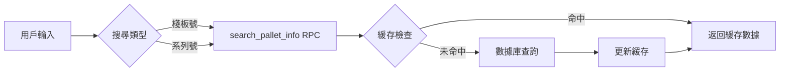
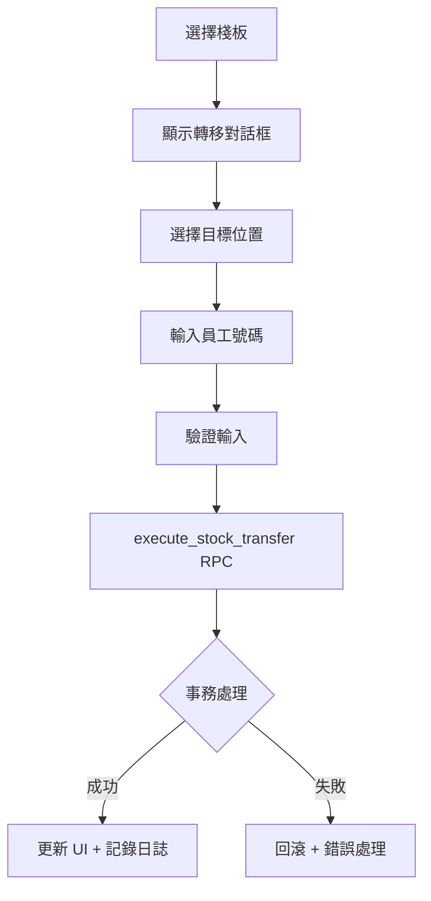

# 庫存轉移系統 v2.0

## 概述

庫存轉移系統係用嚟管理棧板喺唔同倉儲位置之間移動嘅核心功能。系統已升級為 RPC 架構，提供原子性事務保證，並引入視覺化目標選擇界面，大幅提升用戶體驗同系統可靠性。

## 系統架構

### 主要頁面
- `/stock-transfer`: 庫存轉移主頁面

### 核心組件結構

#### 前端組件
- `app/stock-transfer/page.tsx`: 主頁面組件
- `app/hooks/useStockMovementRPC.tsx`: RPC 實現嘅 Hook
- `app/stock-transfer/components/`:
  - `TransferConfirmDialogNew.tsx`: 新設計嘅轉移確認對話框
  - `TransferDestinationSelector.tsx`: 視覺化目標選擇器
  - `PalletSearchSection.tsx`: 棧板搜尋介面
  - `TransferLogSection.tsx`: 活動日誌顯示

#### 後端 RPC Functions
- `execute_stock_transfer`: 原子性庫存轉移
- `search_pallet_info`: 優化棧板搜尋

## 工作流程

### 1. 棧板搜尋


### 2. 轉移流程


## 主要功能改進

### 1. 視覺化目標選擇器 🎯

取代舊有嘅轉移代號系統，使用直觀嘅選項按鈕：

```
┌─────────────────────────────────────┐
│ Select Destination:                 │
│                                     │
│ ○ 📦 Fold Mill (Default)           │
│   Transfer to Fold Mill warehouse   │
│                                     │
│ ○ 🏭 Production                    │
│   Transfer to Production area       │
│                                     │
│ ○ 🚚 Pipeline                      │
│   Transfer to Pipeline storage      │
│                                     │
│ 📍 Current location: Await          │
└─────────────────────────────────────┘
```

#### 位置轉移規則
```typescript
const LOCATION_DESTINATIONS = {
  'Await': ['Fold Mill', 'Production', 'PipeLine'],
  'Await_grn': ['Production', 'PipeLine'],
  'Fold Mill': ['Production', 'PipeLine'],
  'PipeLine': ['Production', 'Fold Mill'],
  'Production': ['Fold Mill', 'PipeLine'],
  'Damage': [],    // 不能轉移
  'Voided': []     // 不能轉移
};
```

### 2. 原子性事務保證 ⚡

所有操作喺一個數據庫事務內完成：

```sql
BEGIN;
  -- 驗證操作員
  -- 驗證位置映射
  -- 插入歷史記錄 (record_history)
  -- 插入轉移記錄 (record_transfer)
  -- 更新庫存數量 (record_inventory)
  -- 更新工作量統計 (work_level)
  -- 記錄審計日誌 (report_log)
COMMIT;
```

### 3. 防錯機制 🛡️

#### 多層防護
1. **UI 層過濾**：排除當前位置，防止相同位置轉移
2. **視覺提示**：清晰顯示當前位置同可選目標
3. **輸入驗證**：實時驗證員工號碼
4. **後端檢查**：最後防線確保數據正確

#### 錯誤代碼
| 代碼 | 說明 | 用戶訊息 |
|------|------|----------|
| `SAME_LOCATION` | 來源同目標相同 | "Cannot transfer to the same location" |
| `INVALID_OPERATOR` | 無效操作員 | "Operator ID not found in system" |
| `INVALID_LOCATION` | 位置映射失敗 | "Invalid location mapping" |
| `TRANSFER_ERROR` | 一般錯誤 | "Stock transfer failed" |

### 4. 審計追蹤 📊

所有操作記錄到 `report_log` 表：

```sql
-- 成功記錄
INSERT INTO report_log (error, error_info, state, user_id)
VALUES ('STOCK_TRANSFER_SUCCESS', '詳細信息', true, 操作員ID);

-- 失敗記錄
INSERT INTO report_log (error, error_info, state, user_id)
VALUES ('STOCK_TRANSFER_ERROR', '錯誤信息', false, 操作員ID);
```

## 性能優化 🚀

### 緩存策略
```typescript
const cacheOptions = {
  ttl: 5 * 60 * 1000,              // 5分鐘 TTL
  maxSize: 50,                     // 最多緩存50個棧板
  preloadPatterns: ['PM-', 'PT-'], // 預加載常用前綴
  enableBackgroundRefresh: true    // 背景自動刷新
};
```

### 網絡效率
- **舊系統**：5次獨立請求
- **新系統**：1次 RPC 調用
- **改進**：延遲減少 ~80%

### 樂觀更新
- UI 立即反映操作
- 失敗時自動回滾
- 視覺狀態追蹤

## 數據庫結構

### 主要表格
- `record_palletinfo`: 棧板主數據
- `record_history`: 操作歷史
- `record_transfer`: 轉移記錄
- `record_inventory`: 庫存數量
- `work_level`: 員工工作量
- `report_log`: 審計日誌

### 位置映射
```typescript
// 數據庫欄位映射
const LOCATION_TO_COLUMN = {
  'Await': 'await',
  'Await_grn': 'await_grn',
  'Fold Mill': 'fold',
  'PipeLine': 'pipeline',
  'Production': 'injection',
  'Damage': 'damage',
  'Bulk': 'bulk',
  'Prebook': 'prebook',
  'Backcarpark': 'backcarpark'
};
```

## 操作指南

### 基本步驟
1. **搜尋棧板**：輸入棧板號或系列號
2. **選擇目標**：點選目標位置（預設 Fold Mill）
3. **輸入員工號**：輸入你嘅 clock number
4. **確認轉移**：系統自動完成所有操作

### 快捷操作
- **Enter**：快速提交
- **Tab**：切換欄位
- **Esc**：取消操作

### 最佳實踐
1. 確認棧板資訊正確
2. 留意當前位置提示
3. 選擇正確目標位置
4. 檢查活動日誌

## 監控工具

### 實時監控
```bash
# 監控庫存轉移操作
node scripts/monitor-stock-transfer.js
```

### 測試工具
```bash
# 測試 RPC 功能
node scripts/test-stock-transfer-rpc.js

# 測試防錯機制
node scripts/test-same-location-prevention.js
```

## 故障排除

### 常見問題

#### "Cannot transfer from location"
- 檢查是否為 Voided 或 Damage 位置
- 確認位置名稱正確

#### "Operator ID not found"
- 確保員工存在於 `data_id` 表
- 檢查輸入是否正確

#### "Cannot transfer to the same location"
- 系統防止轉移到相同位置
- 選擇不同嘅目標位置

### 調試步驟
1. 查看 `report_log` 錯誤詳情
2. 確認棧板當前位置
3. 驗證員工權限
4. 檢查網絡連接

## API 參考

### search_pallet_info RPC
```typescript
// 輸入
{
  p_search_type: 'pallet_num' | 'series',
  p_search_value: string
}

// 輸出
{
  success: boolean,
  data?: {
    plt_num: string,
    product_code: string,
    product_qty: number,
    plt_remark?: string,
    series?: string,
    current_plt_loc: string
  },
  message?: string
}
```

### execute_stock_transfer RPC
```typescript
// 輸入
{
  p_plt_num: string,
  p_product_code: string,
  p_product_qty: number,
  p_from_location: string,
  p_to_location: string,
  p_operator_id: number
}

// 輸出
{
  success: boolean,
  message: string,
  data?: {
    plt_num: string,
    from_location: string,
    to_location: string,
    operator_id: number,
    timestamp: string
  },
  error_code?: string,
  error_detail?: string
}
```

## 版本歷史

### v2.0.0 (2025-01-02) - 現行版本
- ✅ 遷移到 RPC 架構
- ✅ 實現視覺化目標選擇器
- ✅ 加入相同位置防錯檢查
- ✅ 完善審計追蹤功能
- ✅ 提升錯誤處理能力

### v1.0.0
- 初始版本（5個獨立 SQL 操作）
- 基於轉移代號系統
- 基本錯誤處理

## 未來改進計劃

1. **批量轉移**：支援多個棧板同時轉移
2. **轉移模板**：保存常用路線
3. **移動優化**：整合掃描器功能
4. **分析儀表板**：轉移模式分析
5. **離線模式**：離線時隊列轉移操作

---

最後更新：2025-01-02  
版本：2.0.0  
作者：系統開發團隊