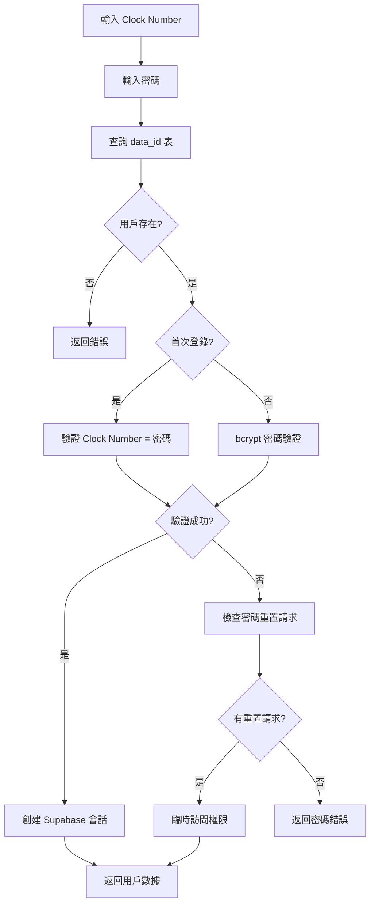
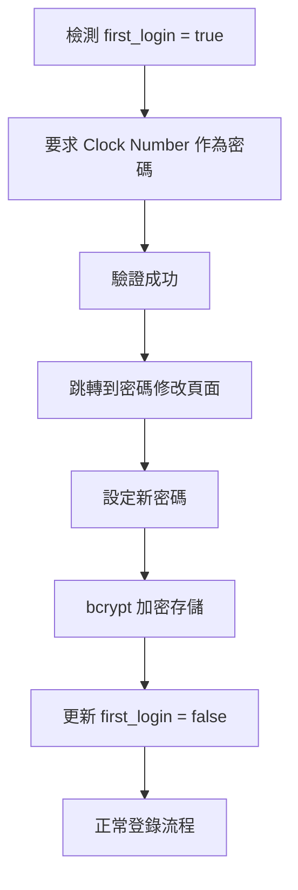
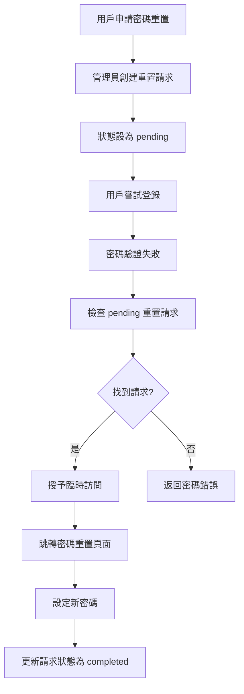

# 用戶管理系統功能文檔

## 系統功能概述

用戶管理系統（User Management System）係 NewPennine WMS 嘅核心安全模組，負責用戶身份驗證、權限管理、會話控制同安全策略執行。呢個系統基於 Supabase Auth 構建，提供現代化嘅身份管理解決方案。

### 主要功能特點
- **多層身份驗證**：Supabase Auth + 本地用戶數據驗證
- **基於角色嘅權限控制**：細粒度權限管理
- **密碼安全策略**：bcrypt 加密 + 密碼重置機制
- **會話管理**：安全會話控制同超時處理
- **首次登錄流程**：強制密碼修改機制
- **臨時訪問支援**：密碼重置期間嘅臨時登錄

## 主要組件和流程

### 核心組件架構

#### 1. 身份驗證服務 (`auth.ts`)
```typescript
// 核心驗證接口
interface UserData {
  id: string;
  name: string;
  department: string;
  permissions: {
    qc: boolean;
    receive: boolean;
    void: boolean;
    view: boolean;
    resume: boolean;
    report: boolean;
  };
}

// 主要驗證函數
export async function authenticateUser(
  userId: string, 
  passwordInput: string
): Promise<AuthResult>
```

#### 2. 權限管理 Hook (`useAuth.ts`)
```typescript
// 用戶角色定義
interface UserRole {
  type: 'production' | 'warehouse' | 'admin';
  allowedPaths: string[];
  defaultPath: string;
}

// 權限檢查函數
export const getUserRole = (email: string): UserRole
export const useAskDatabasePermission = ()
```

#### 3. 登錄組件 (`SimpleLoginForm.tsx`)
```typescript
// 登錄表單組件
- Clock Number 輸入
- 密碼輸入
- 首次登錄處理
- 錯誤顯示
- 自動跳轉
```

#### 4. 密碼管理組件
```typescript
// 密碼重置流程
- 密碼重置請求
- 臨時訪問權限
- 新密碼設定
- 安全驗證
```

### 用戶驗證流程

#### 1. 標準登錄流程


#### 2. 首次登錄流程


#### 3. 密碼重置流程


## 技術實現方案

### 資料庫設計

#### 1. 用戶數據表 (`data_id`)
```sql
data_id:
  - id (Clock Number, 主鍵)
  - name (用戶姓名)
  - department (部門)
  - email (電子郵件)
  - password (bcrypt 加密密碼)
  - first_login (首次登錄標識)
  - icon_url (用戶頭像)
  - qc/receive/void/view/resume/report (權限標識)
```

#### 2. 密碼重置請求表 (`password_reset_requests`)
```sql
password_reset_requests:
  - id (主鍵)
  - user_id (用戶ID)
  - status ('pending'/'completed'/'expired')
  - created_at (創建時間)
  - completed_at (完成時間)
  - requested_by (申請人)
```

#### 3. Supabase Auth 用戶表
```sql
auth.users:
  - id (UUID, Supabase 用戶ID)
  - email (電子郵件)
  - encrypted_password (Supabase 管理嘅密碼)
  - email_confirmed_at
  - created_at
  - updated_at
```

### 安全實現

#### 1. 密碼加密
```typescript
// 使用 bcryptjs 進行密碼加密
import bcrypt from 'bcryptjs';

// 密碼哈希
const hashedPassword = bcrypt.hashSync(plainPassword, 10);

// 密碼驗證
const isValid = bcrypt.compareSync(plainPassword, hashedPassword);
```

#### 2. 雙重驗證系統
```typescript
// 第一層：本地數據庫驗證
const { data: rawUserData } = await supabase
  .from('data_id')
  .select('id, name, department, password, first_login, ...')
  .eq('id', userId)
  .single();

// 第二層：Supabase Auth 驗證
const { error: signInError } = await supabase.auth.signInWithPassword({
  email: user.email,
  password,
});
```

#### 3. 會話管理
```typescript
// 會話狀態監控
const { data: { subscription } } = supabase.auth.onAuthStateChange(
  async (event, session) => {
    if (event === 'SIGNED_IN' && session?.user) {
      setIsAuthenticated(true);
      setUser(session.user);
    } else if (event === 'SIGNED_OUT') {
      setIsAuthenticated(false);
      setUser(null);
    }
  }
);
```

### 權限控制系統

#### 1. 角色定義
```typescript
// 生產角色
const productionRole: UserRole = {
  type: 'production',
  allowedPaths: ['/print-label', '/home'],
  defaultPath: '/print-label'
};

// 倉庫角色
const warehouseRole: UserRole = {
  type: 'warehouse',
  allowedPaths: ['/stock-transfer', '/order-loading', '/home'],
  defaultPath: '/stock-transfer'
};

// 管理員角色
const adminRole: UserRole = {
  type: 'admin',
  allowedPaths: [], // 無限制
  defaultPath: '/admin'
};
```

#### 2. 細粒度權限
```typescript
// 功能權限檢查
permissions: {
  qc: boolean,        // 質檢標籤權限
  receive: boolean,   // 接收權限
  void: boolean,      // 作廢權限
  view: boolean,      // 查看權限
  resume: boolean,    // 恢復權限
  report: boolean     // 報告權限
}
```

#### 3. 路徑保護
```typescript
// 中間件路徑檢查
export function middleware(request: NextRequest) {
  const { pathname } = request.nextUrl;
  
  // 檢查用戶是否有訪問該路徑嘅權限
  if (!userRole.allowedPaths.includes(pathname)) {
    return NextResponse.redirect(userRole.defaultPath);
  }
}
```

## 安全性考慮

### 1. 密碼安全策略
```typescript
// 密碼複雜度要求
- 最少 8 個字符
- 包含大小寫字母
- 包含數字
- 包含特殊字符

// 密碼存儲安全
- bcrypt 哈希 (cost factor 10)
- 絕不存儲明文密碼
- 定期密碼過期策略
```

### 2. 會話安全
```typescript
// 會話管理策略
- JWT token 自動過期
- 閒置超時檢測
- 並發會話限制
- 安全登出機制
```

### 3. 輸入驗證
```typescript
// 用戶輸入驗證
- Clock Number 格式驗證 (4位數字)
- Email 格式驗證
- SQL 注入防護
- XSS 攻擊防護
```

### 4. 審計日誌
```typescript
// 安全事件記錄
- 登錄嘗試記錄
- 權限變更記錄
- 密碼重置記錄
- 異常行為檢測
```

### 5. 數據保護
```typescript
// 敏感數據處理
- 密碼欄位永不返回到客戶端
- 個人信息最小化原則
- 數據傳輸加密 (HTTPS)
- 數據庫訪問控制
```

## 與其他系統的協作

### 1. 動態操作欄系統
```typescript
// 用戶身份展示
- 用戶姓名顯示
- 頭像展示
- 問候語生成
- 登出功能
```

### 2. 權限控制集成
```typescript
// 各功能模組權限檢查
- void 操作權限驗證
- 報告訪問權限
- 管理功能權限
- 數據查看權限
```

### 3. 審計系統
```typescript
// 操作記錄關聯
- 用戶操作追蹤
- 數據變更記錄
- 系統訪問日誌
- 安全事件監控
```

### 4. 通知系統
```typescript
// 安全通知
- 密碼過期提醒
- 異常登錄警告
- 權限變更通知
- 系統維護通知
```

## 性能優化

### 1. 緩存策略
```typescript
// 用戶數據緩存
- 權限信息緩存
- 用戶基本信息緩存
- 會話狀態緩存
- 合理緩存過期時間
```

### 2. 數據庫優化
```typescript
// 查詢優化
- 用戶查詢索引優化
- 權限檢查查詢優化
- 批量權限驗證
- 連接池管理
```

### 3. 前端優化
```typescript
// 用戶體驗優化
- 自動登錄狀態恢復
- 樂觀 UI 更新
- 錯誤重試機制
- 加載狀態管理
```

## 監控和維護

### 1. 安全監控
```typescript
// 實時安全監控
- 登錄失敗率監控
- 異常訪問模式檢測
- 密碼重置頻率監控
- 會話異常檢測
```

### 2. 用戶行為分析
```typescript
// 用戶使用分析
- 登錄時間模式
- 功能使用統計
- 權限需求分析
- 用戶活躍度追蹤
```

### 3. 系統健康檢查
```typescript
// 定期健康檢查
- 認證服務可用性
- 數據庫連接狀態
- 會話存儲狀態
- 權限同步狀態
```

### 4. 備份和恢復
```typescript
// 數據安全保護
- 用戶數據定期備份
- 權限配置備份
- 會話數據備份
- 災難恢復計劃
```

呢個用戶管理系統係 NewPennine WMS 嘅安全基石，確保系統嘅安全性、可靠性同合規性，為所有業務功能提供堅實嘅安全保障。