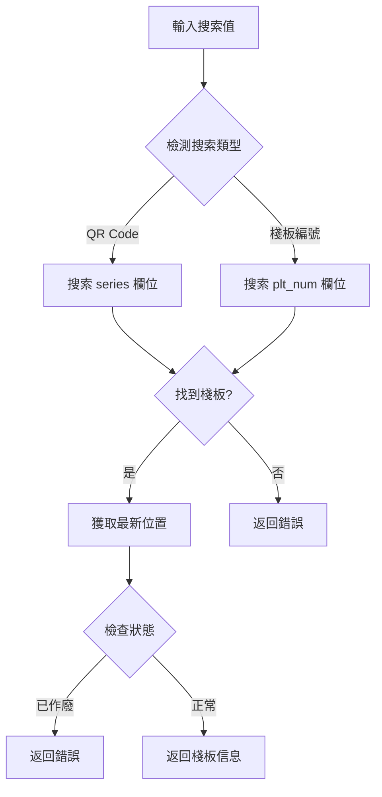
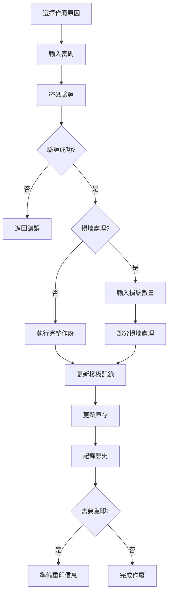
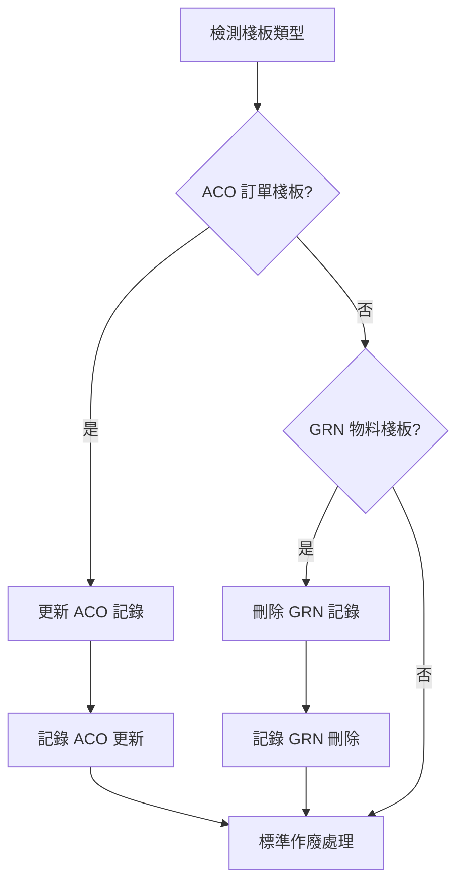

# 棧板作廢系統功能文檔

## 系統功能概述

棧板作廢系統（Void Pallet System）係一個專門用於處理棧板作廢、損壞同重新打印標籤嘅核心倉庫管理功能。呢個系統提供完整嘅棧板生命周期管理，包括搜索、驗證、作廢處理同庫存更新等功能。

### 主要功能特點
- **多種搜索方式**：支援 QR Code 掃描、棧板編號搜索
- **智能檢測**：自動檢測 ACO 訂單棧板同 GRN 物料棧板
- **密碼驗證**：基於 Supabase Auth 嘅用戶身份驗證
- **部分損壞處理**：支援部分數量損壞同重新打印
- **歷史記錄**：完整嘅操作歷史追蹤
- **批量處理**：支援批量作廢操作

## 主要組件和流程

### 核心組件架構

#### 1. 搜索模組 (`SearchSection`)
```typescript
// 支援多種搜索方式
- QR Code 掃描 (series 欄位)
- 棧板編號直接搜索 (plt_num 欄位)
- 自動檢測輸入類型
- 搜索歷史記錄
- 智能建議功能
```

#### 2. 資訊展示模組 (`PalletInfoCard`)
```typescript
// 棧板基本資訊顯示
- 棧板編號 (plt_num)
- 產品代碼 (product_code)
- 數量 (product_qty)
- 當前位置 (plt_loc)
- 備註信息 (plt_remark)
- 創建時間
```

#### 3. 作廢表單模組 (`VoidForm`)
```typescript
// 作廢原因選擇
const VOID_REASONS = [
  'Print Extra Label',
  'Wrong Label',
  'Wrong Qty', 
  'Wrong Product Code',
  'Damage',
  'Used Material',
  'Other'
];
```

#### 4. 確認對話框 (`VoidConfirmDialog`)
```typescript
// 操作確認機制
- 最終確認作廢操作
- 顯示所有相關資訊
- 防止誤操作
```

#### 5. 批量處理模組 (`BatchVoidPanel`)
```typescript
// 批量作廢功能
- CSV 文件上傳
- 批量搜索驗證
- 進度追蹤
- 結果報告
```

### 核心業務流程

#### 1. 棧板搜索流程


#### 2. 作廢處理流程


#### 3. 特殊棧板處理流程


## 技術實現方案

### 資料庫設計

#### 1. 主要資料表
```sql
-- 棧板資訊表
record_palletinfo:
  - plt_num (棧板編號)
  - product_code (產品代碼)
  - product_qty (數量)
  - series (序列號)
  - plt_remark (備註)
  - generate_time (創建時間)

-- 歷史記錄表
record_history:
  - time (時間)
  - id (用戶ID)
  - action (動作)
  - plt_num (棧板編號)
  - loc (位置)
  - remark (備註)

-- 作廢報告表
report_void:
  - plt_num (棧板編號)
  - reason (原因)
  - damage_qty (損壞數量)
  - time (時間)

-- 庫存記錄表
record_inventory:
  - product_code (產品代碼)
  - injection/pipeline/prebook/await/fold/bulk/backcarpark
  - damage (損壞數量)
  - latest_update (最後更新)
  - plt_num (棧板編號)
```

#### 2. 特殊處理邏輯
```typescript
// ACO 訂單棧板檢測
function isACOOrderPallet(plt_remark: string): boolean {
  const acoPatterns = [
    /ACO\s+Ref\s*:\s*(\d+)/i,
    /ACO\s+Reference\s*:\s*(\d+)/i,
    /ACO\s*:\s*(\d+)/i,
    /ACO\s+(\d+)/i,
    /Ref\s*:\s*(\d+)/i
  ];
}

// GRN 物料棧板檢測
function isMaterialGRNPallet(plt_remark: string): boolean {
  const grnPattern = /Material\s+GRN\s*-\s*(\w+)/i;
}
```

### 服務端函數 (`actions.ts`)

#### 1. 搜索功能
```typescript
export async function searchPalletAction(params: SearchParams): Promise<SearchResult>
- 支援多種搜索方式
- 自動檢測輸入類型
- 狀態驗證
- 位置追蹤
```

#### 2. 作廢處理
```typescript
export async function voidPalletAction(params: VoidParams): Promise<VoidResult>
- 密碼驗證
- 棧板更新
- 庫存調整
- 歷史記錄

export async function processDamageAction(params: VoidParams): Promise<VoidResult>
- 部分損壞處理
- 數量驗證
- 重印準備
- 特殊邏輯
```

#### 3. 用戶驗證
```typescript
export async function verifyPasswordWithSupabaseAuth(password: string)
- 基於 Supabase Auth
- 安全密碼驗證
- 用戶身份確認
```

### 客戶端組件

#### 1. 主頁面 (`page.tsx`)
```typescript
// 狀態管理
- 搜索狀態
- 棧板信息
- 作廢流程
- 錯誤處理
- UI 狀態
```

#### 2. 搜索組件
```typescript
// 智能搜索功能
- 自動檢測
- 歷史記錄
- 建議功能
- QR 掃描支援
```

#### 3. 表單組件
```typescript
// 作廢表單
- 原因選擇
- 數量輸入
- 密碼驗證
- 實時驗證
```

## 安全性考慮

### 1. 用戶驗證機制
```typescript
// 基於 Supabase Auth 嘅多層驗證
- 會話驗證
- 密碼重新確認
- 用戶權限檢查
- 操作記錄追蹤
```

### 2. 數據完整性保護
```typescript
// 事務處理機制
- 原子性操作
- 回滾機制
- 錯誤恢復
- 一致性檢查
```

### 3. 操作審計
```typescript
// 完整嘅操作記錄
- 時間戳記錄
- 用戶身份記錄
- 操作詳情記錄
- 結果狀態記錄
```

### 4. 權限控制
```typescript
// 基於角色嘅訪問控制
- void 權限檢查
- 操作範圍限制
- 敏感操作保護
- 管理員覆蓋機制
```

## 與其他系統的協作

### 1. 庫存管理系統
```typescript
// 實時庫存更新
- 自動庫存調整
- 多位置庫存管理
- 庫存水平同步
- 損壞庫存追蹤
```

### 2. 打印系統集成
```typescript
// 標籤重印功能
- 自動重印觸發
- 標籤內容生成
- 打印隊列管理
- 打印狀態追蹤
```

### 3. 報告系統
```typescript
// 作廢報告生成
- 實時數據統計
- 歷史趨勢分析
- 原因分析報告
- 用戶操作報告
```

### 4. ACO 訂單系統
```typescript
// ACO 訂單處理
- remain_qty 自動更新
- 訂單狀態同步
- 產品追蹤
- 數量平衡
```

### 5. GRN 系統
```typescript
// GRN 記錄管理
- 自動記錄刪除
- 物料追蹤
- 接收狀態更新
- 供應商協調
```

### 6. 用戶認證系統
```typescript
// 統一身份管理
- Supabase Auth 集成
- 用戶角色管理
- 會話管理
- 權限控制
```

## 性能優化

### 1. 搜索優化
```typescript
// 智能搜索策略
- 索引優化
- 緩存機制
- 並行搜索
- 結果預加載
```

### 2. 批量操作
```typescript
// 高效批量處理
- 分批處理
- 進度追蹤
- 錯誤隔離
- 結果聚合
```

### 3. 數據庫優化
```typescript
// 查詢優化
- 合理索引
- 查詢計劃優化
- 連接池管理
- 事務優化
```

## 維護和監控

### 1. 錯誤監控
```typescript
// 系統健康監控
- 錯誤日誌記錄
- 性能指標追蹤
- 用戶行為分析
- 系統狀態監控
```

### 2. 數據備份
```typescript
// 重要數據保護
- 定期備份
- 增量備份
- 恢復測試
- 災難恢復
```

### 3. 系統更新
```typescript
// 版本管理
- 漸進式部署
- 回滾機制
- 功能開關
- A/B 測試
```

呢個棧板作廢系統係 NewPennine WMS 嘅核心組件，提供完整嘅棧板生命周期管理，確保庫存數據嘅準確性同一致性。