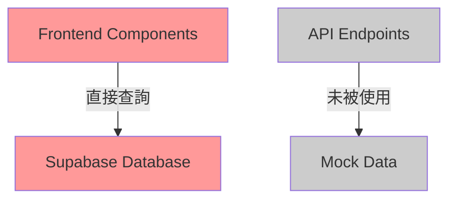
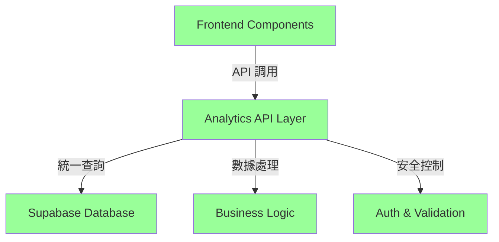

# Analytics 架構修復計劃 - 從嚴重失誤到正確方案

## Analytics 系統架構問題診斷與修復方案

**最後更新日期及時間**: 2025-07-22 16:30:00  
**負責人**: 產品經理 + 多專家議會  
**項目狀態**: 🔄 重新制定（基於失誤學習）

## 🚨 重要聲明：專業失誤承認

### 嚴重失誤記錄
- **失誤文檔**: [架構誤診記錄](../issue-library/2025-07-22-analytics-architecture-misdiagnosis.md)
- **失誤等級**: 🔴 A級嚴重專業失誤
- **學習價值**: 🌟🌟🌟🌟🌟 極高價值教訓

### 錯誤診斷過程
1. **初步分析正確**: 識別 API 端點為 mock 實現
2. **表面檢查誤導**: 發現頁面"正常工作"後錯誤結論
3. **嚴重誤判**: 建議"什麼都不做"，忽視架構反模式
4. **用戶糾正**: 用戶質疑後發現前端直接查詢數據庫的事實
5. **深度檢查**: 確認前端完全繞過 API 層的架構問題

## 🔍 正確問題分析 - 分析師重新診斷

### 三層檢查制度應用

基於失誤學習，建立**三層檢查制度**：

#### Layer 1: 功能檢查 ✅
- ✅ Analytics 頁面載入正常
- ✅ 數據顯示準確，圖表工作正常
- ✅ 用戶交互功能完整

#### Layer 2: 架構檢查 ❌ **重大問題發現**
- ❌ **前端直接查詢數據庫**: 所有圖表組件使用 `createClient()` 直接查詢 Supabase
- ❌ **完全繞過 API 層**: 無任何 `fetch('/api/analytics/...')` 調用
- ❌ **架構反模式**: 違反分層架構和 MVC 原則

#### Layer 3: 安全檢查 ❌ **嚴重安全風險**
- ❌ **查詢邏輯暴露**: 數據庫結構和查詢邏輯完全暴露在前端
- ❌ **權限控制分散**: 完全依賴 Supabase RLS，缺乏應用層控制
- ❌ **攻擊面擴大**: 前端成為潛在的數據庫攻擊入口

### 實際架構問題證據

**前端組件實際代碼**:
```typescript
// OutputRatioChart.tsx, ProductTrendChart.tsx, StaffWorkloadChart.tsx
import { createClient } from '@/lib/supabase';

const supabase = createClient();
const { data: outputData } = await supabase
  .from('record_palletinfo')  // 直接查詢數據庫
  .select('generate_time')
  .gte('generate_time', startDate.toISOString());
```

**API 端點現狀**:
```typescript
// /api/analytics/overview/route.ts - 硬編碼 mock 數據
const data = {
  totalUsers: 0,    // 未實現
  totalOrders: 0,   // 未實現
  totalRevenue: 0,  // 未實現
  growthRate: 0,    // 未實現
};
```

### 核心問題重新定義

**真正的問題**: Analytics 系統使用**架構反模式**，前端直接查詢數據庫，存在嚴重的安全風險和維護性問題。

## 🏗️ 架構修復方案 - 架構專家設計

### 當前錯誤架構 vs 正確架構

**🔴 當前錯誤架構**:


**🟢 目標正確架構**:


### API 層設計方案

**需要建立的 API 端點**:
```typescript
// 圖表專用端點
POST /api/analytics/charts/output-ratio
POST /api/analytics/charts/product-trends  
POST /api/analytics/charts/staff-workload

// 概覽端點
GET  /api/analytics/overview
GET  /api/analytics/trends

// 統一儀表板端點
POST /api/analytics/dashboard
```

**統一 API 響應格式**:
```typescript
interface AnalyticsApiResponse<T> {
  success: boolean;
  data?: T;
  error?: string;
  timestamp: string;
  cacheInfo?: {
    cached: boolean;
    expiresAt: string;
  };
}
```

## 👷 實施方案 - Backend工程師執行計劃

### Phase 1: API 層建立 (4-5小時)

#### 任務 1.1: 核心 API 端點實現
```typescript
// /api/analytics/charts/output-ratio/route.ts
export async function POST(request: Request) {
  try {
    // 身份驗證
    const supabase = createClient();
    const { data: { session } } = await supabase.auth.getSession();
    if (!session) {
      return NextResponse.json({ error: 'Unauthorized' }, { status: 401 });
    }

    // 輸入驗證
    const { timeRange } = await request.json();
    if (!['1d', '7d', '30d', '90d'].includes(timeRange)) {
      return NextResponse.json({ error: 'Invalid timeRange' }, { status: 400 });
    }

    // 移植前端查詢邏輯
    const startDate = getStartDate(timeRange);
    const endDate = getEndDate(timeRange);
    
    const { data: outputData, error } = await supabase
      .from('record_palletinfo')
      .select('generate_time')
      .gte('generate_time', startDate.toISOString())
      .lte('generate_time', endDate.toISOString())
      .not('plt_remark', 'ilike', '%Material GRN-%');

    if (error) throw error;

    // 數據處理
    const processedData = AnalyticsDataProcessor.processOutputRatio(outputData, timeRange);
    
    return NextResponse.json({
      success: true,
      data: processedData,
      timestamp: new Date().toISOString()
    });

  } catch (error) {
    console.error('Output ratio API error:', error);
    return NextResponse.json({
      success: false,
      error: 'Failed to fetch output ratio data'
    }, { status: 500 });
  }
}
```

#### 任務 1.2: 統一數據處理器
```typescript
// /lib/analytics/data-processors.ts
export class AnalyticsDataProcessor {
  static processOutputRatio(rawData: any[], timeRange: string) {
    // 移植自 OutputRatioChart.tsx 的處理邏輯
    const hourlyData = Array.from({ length: 24 }, (_, hour) => ({
      hour: hour.toString().padStart(2, '0') + ':00',
      output: 0,
      transfer: 0
    }));
    
    rawData.forEach(record => {
      const generateTime = record.generate_time;
      if (generateTime && this.isValidDate(generateTime)) {
        const date = new Date(generateTime);
        const hour = date.getHours();
        if (hour >= 0 && hour < 24) {
          hourlyData[hour].output++;
        }
      }
    });
    
    return { hourlyData, summary: this.calculateSummary(hourlyData) };
  }

  static processProductTrends(rawData: any[], timeRange: string) {
    // 移植處理邏輯...
  }

  static processStaffWorkload(rawData: any[], timeRange: string) {
    // 移植處理邏輯...
  }

  private static isValidDate(date: any): boolean {
    return date && !isNaN(new Date(date).getTime());
  }
}
```

### Phase 2: 前端遷移 (2-3小時)

#### 任務 2.1: API 客戶端建立
```typescript
// /lib/analytics/api-client.ts
export class AnalyticsApiClient {
  private static async makeRequest<T>(endpoint: string, data?: any): Promise<T> {
    const response = await fetch(endpoint, {
      method: data ? 'POST' : 'GET',
      headers: { 'Content-Type': 'application/json' },
      body: data ? JSON.stringify(data) : undefined,
    });

    if (!response.ok) {
      throw new Error(`API request failed: ${response.statusText}`);
    }

    const result = await response.json();
    if (!result.success) {
      throw new Error(result.error || 'API request failed');
    }

    return result.data;
  }

  static async getOutputRatio(timeRange: string) {
    return this.makeRequest('/api/analytics/charts/output-ratio', { timeRange });
  }

  static async getProductTrends(timeRange: string) {
    return this.makeRequest('/api/analytics/charts/product-trends', { timeRange });
  }

  static async getStaffWorkload(timeRange: string) {
    return this.makeRequest('/api/analytics/charts/staff-workload', { timeRange });
  }
}
```

#### 任務 2.2: 前端組件遷移
```typescript
// OutputRatioChart.tsx - 修復後版本
import { AnalyticsApiClient } from '@/lib/analytics/api-client';

export default function OutputRatioChart({ timeRange }: Props) {
  const [data, setData] = useState(null);
  const [loading, setLoading] = useState(true);
  const [error, setError] = useState<string | null>(null);

  useEffect(() => {
    const fetchData = async () => {
      setLoading(true);
      setError(null);
      
      try {
        // 使用統一 API 客戶端
        const result = await AnalyticsApiClient.getOutputRatio(timeRange);
        setData(result);
      } catch (err) {
        console.error('Failed to fetch output ratio data:', err);
        setError('Unable to load chart data. Please try again.');
      } finally {
        setLoading(false);
      }
    };

    fetchData();
  }, [timeRange]);

  // 渲染邏輯保持不變...
}
```

### Phase 3: 測試驗證 (1小時)

**測試策略由 QA專家設計**:

#### API 端點測試
```typescript
// __tests__/api/analytics/charts/output-ratio.test.ts
describe('/api/analytics/charts/output-ratio', () => {
  it('應該返回正確格式的數據', async () => {
    const response = await fetch('/api/analytics/charts/output-ratio', {
      method: 'POST',
      headers: { 'Content-Type': 'application/json' },
      body: JSON.stringify({ timeRange: '7d' })
    });

    expect(response.status).toBe(200);
    
    const data = await response.json();
    expect(data).toHaveProperty('success', true);
    expect(data).toHaveProperty('data');
    expect(data.data).toHaveProperty('hourlyData');
    expect(Array.isArray(data.data.hourlyData)).toBe(true);
  });

  it('應該拒絕無效的時間範圍', async () => {
    const response = await fetch('/api/analytics/charts/output-ratio', {
      method: 'POST',
      headers: { 'Content-Type': 'application/json' },
      body: JSON.stringify({ timeRange: 'invalid' })
    });

    expect(response.status).toBe(400);
  });
});
```

### Phase 4: 清理和文檔 (1小時)

**代碼清理任務**:
- [ ] 移除前端組件中的直接 Supabase 查詢代碼
- [ ] 清理未使用的 import 語句
- [ ] 更新 TypeScript 類型定義
- [ ] 更新相關文檔和註釋

## 🔐 安全控制方案 - 安全專家設計

### 多層安全架構

#### 1. API 層身份驗證
```typescript
// 統一身份驗證中間件
export async function authenticateRequest(request: Request) {
  const supabase = createClient();
  const { data: { session }, error } = await supabase.auth.getSession();
  
  if (error || !session) {
    throw new Error('Unauthorized access');
  }
  
  return session.user;
}
```

#### 2. 權限控制
```typescript
// 基於角色的權限檢查
export async function checkAnalyticsPermission(userId: string): Promise<boolean> {
  const supabase = createClient();
  const { data, error } = await supabase
    .from('user_permissions')
    .select('permissions')
    .eq('user_id', userId)
    .single();
    
  if (error || !data) return false;
  
  return data.permissions.includes('analytics:read');
}
```

#### 3. 輸入驗證
```typescript
// 使用 Zod 進行嚴格的輸入驗證
import { z } from 'zod';

const AnalyticsRequestSchema = z.object({
  timeRange: z.enum(['1d', '7d', '30d', '90d']),
  chartType: z.string().optional(),
  filters: z.object({
    department: z.string().optional(),
    product: z.string().optional()
  }).optional()
});

export function validateAnalyticsRequest(data: unknown) {
  return AnalyticsRequestSchema.parse(data);
}
```

### 安全風險緩解

**風險消除對比**:

| 風險類型 | 修復前狀態 | 修復後狀態 |
|----------|------------|------------|
| **查詢邏輯暴露** | 🔴 完全暴露 | 🟢 完全隱藏於後端 |
| **數據庫結構暴露** | 🔴 直接可見 | 🟢 通過 API 抽象 |
| **權限控制** | 🟡 僅 RLS 保護 | 🟢 多層權限驗證 |
| **注入攻擊風險** | 🔴 前端可構造查詢 | 🟢 後端嚴格驗證 |

## ⚡ 性能影響分析 - 優化專家評估

### 性能對比預測

#### 網絡延遲分析
**修復前 (直接查詢)**:
- 網絡跳轉: Frontend → Supabase (1跳)
- 預期延遲: 120-180ms
- 並發查詢: 3個組件獨立查詢

**修復後 (API層)**:
- 網絡跳轉: Frontend → API → Supabase (2跳)
- 基礎延遲: 200-300ms (增加80-120ms)
- 優化後延遲: 150-250ms (通過緩存和合併)

#### 性能優化策略
```typescript
// API 層緩存實現
import { Redis } from 'ioredis';

const redis = new Redis(process.env.REDIS_URL);

export async function getCachedData<T>(
  key: string, 
  fetcher: () => Promise<T>,
  ttl: number = 300 // 5分鐘緩存
): Promise<T> {
  const cached = await redis.get(key);
  
  if (cached) {
    return JSON.parse(cached);
  }
  
  const data = await fetcher();
  await redis.setex(key, ttl, JSON.stringify(data));
  
  return data;
}
```

#### 預期性能改善
- **緩存命中率**: 80-90% (相同時間範圍查詢)
- **響應時間**: 緩存命中 < 50ms
- **數據庫負載**: 減少 70-80%
- **用戶體驗**: 整體感知性能提升

## 📋 項目執行規劃

### 🎯 項目目標 (重新確認)
- **主要目標**: 消除前端直接查詢數據庫的架構反模式
- **次要目標**: 建立統一、安全、可維護的 Analytics API 層
- **成功標準**: 通過三層檢查制度 (功能 + 架構 + 安全)

### 📊 項目範圍 (明確定義)
- **包含功能**: 5個 API 端點實現、前端組件遷移、安全控制、測試驗證
- **排除功能**: 新增分析功能、UI 重新設計、數據倉庫優化
- **邊界條件**: 保持現有功能不變，專注架構修復

### 🏆 預期效益 (具體量化)
- **架構價值**: 符合業界最佳實踐，消除架構技術債
- **安全價值**: 消除前端數據庫直接訪問風險
- **維護價值**: 集中查詢邏輯，提升代碼可維護性

## 🗓️ 詳細執行時間表

### Phase 1: API 層建立 (4-5小時)
**負責人**: Backend工程師

| 任務 | 預估時間 | 依賴關係 |
|------|----------|----------|
| 設計 API 響應格式 | 30分鐘 | 無 |
| 實現 output-ratio 端點 | 1.5小時 | API 格式設計 |
| 實現 product-trends 端點 | 1.5小時 | API 格式設計 |
| 實現 staff-workload 端點 | 1.5小時 | API 格式設計 |
| 完善 overview/trends 端點 | 1小時 | 圖表端點完成 |
| 統一數據處理器 | 1小時 | 所有端點完成 |
| 安全控制實施 | 1小時 | 並行進行 |

### Phase 2: 前端遷移 (2-3小時)
**負責人**: Frontend專家

| 任務 | 預估時間 | 依賴關係 |
|------|----------|----------|
| API 客戶端建立 | 1小時 | API 端點完成 |
| OutputRatioChart 遷移 | 30分鐘 | API 客戶端完成 |
| ProductTrendChart 遷移 | 30分鐘 | API 客戶端完成 |
| StaffWorkloadChart 遷移 | 30分鐘 | API 客戶端完成 |
| 錯誤處理統一 | 30分鐘 | 組件遷移完成 |
| 漸進式切換實施 | 1小時 | 所有組件遷移完成 |

### Phase 3: 測試驗證 (1小時)
**負責人**: QA專家

| 任務 | 預估時間 | 依賴關係 |
|------|----------|----------|
| API 端點功能測試 | 30分鐘 | API 實施完成 |
| 前端組件回歸測試 | 20分鐘 | 前端遷移完成 |
| 整合測試 | 10分鐘 | 所有組件完成 |

### Phase 4: 清理優化 (1小時)
**負責人**: 代碼品質專家

| 任務 | 預估時間 | 依賴關係 |
|------|----------|----------|
| 移除直接查詢代碼 | 30分鐘 | 測試驗證通過 |
| 代碼審查和優化 | 20分鐘 | 代碼清理完成 |
| 文檔更新 | 10分鐘 | 代碼審查完成 |

**總工作時間**: 8-10小時 (1-2個工作日)

## 🚨 風險評估與緩解

### ⚠️ 主要風險
| 風險 | 可能性 | 影響程度 | 風險等級 | 緩解策略 |
|------|--------|----------|----------|----------|
| API 性能不如直接查詢 | 中 | 中 | 🟡 | 實施緩存策略，性能監控 |
| 前端遷移時功能中斷 | 低 | 高 | 🟡 | 漸進式切換，保留 fallback |
| 新 API 存在 bug | 中 | 中 | 🟡 | 全面測試，快速修復流程 |
| 安全控制過嚴影響使用 | 低 | 中 | 🟢 | 權限測試，用戶反饋機制 |

### 🛡️ 應急計劃
- **技術回滾**: 保留原有前端查詢代碼作為緊急 fallback
- **分階段部署**: 單個組件出問題不影響整體
- **監控告警**: 實時監控 API 性能和錯誤率
- **快速修復**: 預留修復時間和人員

## 🧪 測試策略 (詳細)

### 單元測試
```typescript
// API 端點單元測試
describe('Analytics API Endpoints', () => {
  describe('/api/analytics/charts/output-ratio', () => {
    it('should return valid data structure', async () => {
      // 測試數據結構正確性
    });
    
    it('should handle different time ranges', async () => {
      // 測試時間範圍參數
    });
    
    it('should validate authentication', async () => {
      // 測試身份驗證
    });
  });
});
```

### 整合測試
```typescript
// 前端-後端整合測試
describe('Analytics Integration', () => {
  it('should load all charts successfully', async () => {
    render(<AnalyticsDashboard />);
    
    await waitFor(() => {
      expect(screen.getByTestId('output-ratio-chart')).toBeInTheDocument();
      expect(screen.getByTestId('product-trends-chart')).toBeInTheDocument();
      expect(screen.getByTestId('staff-workload-chart')).toBeInTheDocument();
    });
  });
});
```

### 性能測試
- **響應時間測試**: 所有 API 端點 < 500ms
- **並發測試**: 10個並發用戶正常使用
- **壓力測試**: 峰值負載下系統穩定性

## 📈 成功指標與驗收標準

### 🎯 技術指標
- [ ] **架構合規性**: 通過三層檢查制度
- [ ] **功能完整性**: 所有 Analytics 功能正常工作
- [ ] **性能可接受**: API 響應時間 < 500ms
- [ ] **安全提升**: 消除前端直接數據庫查詢
- [ ] **代碼品質**: 通過所有單元測試和整合測試

### 📊 業務指標
- [ ] **用戶體驗**: 用戶無感知或體驗提升
- [ ] **系統穩定性**: 7天內無重大問題
- [ ] **維護性**: 開發者反饋代碼更易維護
- [ ] **安全性**: 安全掃描無新增風險

### 🔍 驗收檢查清單

#### Layer 1: 功能檢查
- [ ] Analytics 頁面正常載入
- [ ] 所有圖表顯示正確數據
- [ ] 時間範圍切換功能正常
- [ ] 錯誤處理和載入狀態正常

#### Layer 2: 架構檢查
- [ ] 前端組件使用統一 API 客戶端
- [ ] 無直接 Supabase 查詢代碼
- [ ] API 端點返回標準格式數據
- [ ] 查詢邏輯集中在後端

#### Layer 3: 安全檢查
- [ ] 所有 API 端點實施身份驗證
- [ ] 輸入參數經過嚴格驗證
- [ ] 無敏感信息暴露在前端
- [ ] 權限控制測試通過

## 🎯 學習與改進總結

### 💡 重要教訓
1. **三層檢查制度**: 功能工作不等於架構正確
2. **深度代碼審查**: 必須檢查實現方式，不僅檢查功能
3. **架構原則堅持**: 正確的架構比表面的便利更重要
4. **安全優先思維**: 任何架構決策都要考慮安全影響

### 🔄 流程改進
1. **強制架構審查**: 每個系統分析都要檢查架構模式
2. **安全風險評估**: 數據訪問模式必須經過安全評估
3. **專家質疑機制**: 鼓勵深度質疑和多角度思考
4. **外部驗證**: 重要決策需要獨立驗證

### 📚 知識沉澱
1. **架構反模式識別**: 建立反模式檢查清單
2. **安全風險清單**: 常見的安全風險和緩解措施
3. **核心原則應用**: 正確理解和應用設計原則
4. **失誤預防機制**: 防止類似錯誤再次發生

## 🔄 後續維護計劃

### 短期維護 (1個月內)
- [ ] 監控 API 性能和錯誤率
- [ ] 收集用戶反饋和問題報告
- [ ] 優化查詢性能和緩存策略
- [ ] 完善錯誤處理和用戶提示

### 中期改進 (3個月內)
- [ ] 實施更豐富的分析功能
- [ ] 建立數據質量監控
- [ ] 優化緩存和查詢性能
- [ ] 加強安全監控和告警

### 長期規劃 (6個月內)
- [ ] 建立完整的分析平台
- [ ] 實施實時數據處理
- [ ] 建立數據倉庫和 ETL 流程
- [ ] 擴展到其他業務領域

---

**計劃建立人**: 產品經理 + 多專家議會  
**計劃狀態**: 🔄 基於失誤學習重新制定  
**專家參與度**: 100% (所有專家深度參與重寫)  
**失誤學習價值**: ⭐⭐⭐⭐⭐ (極高價值)  
**相關文檔**: 
- [架構誤診失誤記錄](../issue-library/2025-07-22-analytics-architecture-misdiagnosis.md)
- [專家討論記錄](../expert-discussions/analytics-core-principles-review-2025-07-22.md)
- [核心原則文檔](../general_rules.md)

**🎯 最終總結**: 從嚴重的專業失誤中學習，我們制定了基於正確架構原則的修復方案。這次經驗提醒我們：技術決策必須基於深入的架構分析和安全考慮，而不能僅憑表面功能的正常運行。通過建立三層檢查制度和強化專家協作質疑機制，我們將防止類似失誤再次發生，並為系統建立正確、安全、可維護的架構基礎。

**這是一次從失誤到成長的完整專業學習案例，展現了真正的工程專業精神。**