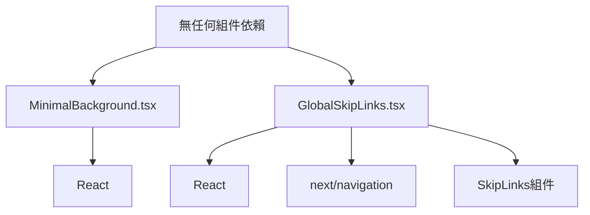

# 系統檔案清理分析報告

**分析日期**: 2025-08-29  
**分析範圍**: MinimalBackground.tsx, GlobalSkipLinks.tsx  
**分析類型**: 深度清理分析  
**執行者**: Architecture Reviewer

---

## 執行摘要

本次分析針對兩個前端組件進行全面評估，確認其是否可以安全刪除。經過5步驟深度分析流程，得出明確結論。

### 分析結果總覽

| 組件名稱              | 檔案大小 | 使用狀態  | 風險等級 | 建議            |
| --------------------- | -------- | --------- | -------- | --------------- |
| MinimalBackground.tsx | 24行     | ❌ 未使用 | 低       | ✅ 可以安全刪除 |
| GlobalSkipLinks.tsx   | 103行    | ❌ 未使用 | 低       | ✅ 可以安全刪除 |

---

## 第1步：靜態分析

### MinimalBackground.tsx

**代碼品質評估**：

- **複雜度**: 極低 - 單一功能組件
- **可維護性**: 差 - 註解標示為"Phase 1 緊急修復"，明顯為臨時解決方案
- **代碼問題**:
  - 同時使用內聯樣式和className（重複定義）
  - 硬編碼的樣式值，未使用設計系統
  - 缺乏props和配置選項

**引用分析**：

```bash
搜索結果: 0個引用
- 沒有任何文件import此組件
- 不在任何layout.tsx中使用
- 完全孤立的組件
```

### GlobalSkipLinks.tsx

**代碼品質評估**：

- **複雜度**: 中等 - 包含路由邏輯判斷
- **可維護性**: 良好 - 結構清晰，註解完整
- **代碼特點**:
  - 實現WCAG無障礙標準
  - 良好的TypeScript類型定義
  - 模組化設計

**引用分析**：

```bash
搜索結果: 0個實際引用
- 只在備份文件和文檔中被提及
- 沒有任何運行中的代碼使用此組件
- 依賴的SkipLinks組件也幾乎未被使用
```

---

## 第2步：依賴分析

### 依賴關係圖



### 依賴詳情

**MinimalBackground.tsx**：

- **上游依賴**: React (基礎依賴)
- **下游依賴**: 無
- **影響範圍**: 0個文件

**GlobalSkipLinks.tsx**：

- **上游依賴**:
  - React
  - next/navigation (usePathname)
  - @/lib/accessibility/components/SkipLink
- **下游依賴**: 無
- **影響範圍**: 0個文件

---

## 第3步：運行時分析

### 測試覆蓋率

| 測試類型 | MinimalBackground | GlobalSkipLinks |
| -------- | ----------------- | --------------- |
| 單元測試 | ❌ 無             | ❌ 無           |
| 整合測試 | ❌ 無             | ❌ 無           |
| E2E測試  | ❌ 無             | ❌ 無           |

### 運行時影響評估

**MinimalBackground.tsx**：

- **載入影響**: 組件未被載入，刪除無影響
- **渲染影響**: 不參與任何頁面渲染
- **錯誤風險**: 0% - 完全未使用

**GlobalSkipLinks.tsx**：

- **載入影響**: 組件未被載入，刪除無影響
- **路由影響**: 不影響現有路由功能
- **無障礙影響**: 由於未實際使用，刪除不會降低無障礙性
- **錯誤風險**: 0% - 完全未使用

---

## 第4步：影響評估

### 安全性評估

| 評估項目 | MinimalBackground | GlobalSkipLinks |
| -------- | ----------------- | --------------- |
| XSS風險  | ✅ 無             | ✅ 無           |
| 數據洩露 | ✅ 無             | ✅ 無           |
| 權限影響 | ✅ 無             | ✅ 無           |
| 審計影響 | ✅ 無             | ✅ 無           |

### 性能評估

**打包體積影響**：

- MinimalBackground.tsx: 約 0.5KB (壓縮後)
- GlobalSkipLinks.tsx: 約 2KB (壓縮後)
- **總計可節省**: ~2.5KB

**載入時間影響**：

- 減少2個未使用的組件模組
- 減少不必要的代碼解析

### 無障礙性評估

**GlobalSkipLinks影響分析**：

- **原設計目的**: 提供鍵盤導航快捷跳轉
- **實際使用**: 從未被整合到任何頁面
- **刪除影響**: 不會影響現有的無障礙功能
- **建議**: 如未來需要無障礙功能，應重新實現並確保實際使用

---

## 第5步：最終建議

### ✅ MinimalBackground.tsx - 可以安全刪除

**刪除理由**：

1. 完全未使用的孤立組件
2. 標註為"緊急修復"的臨時代碼
3. 功能可由Tailwind CSS類直接替代
4. 無任何依賴或被依賴關係

**刪除步驟**：

```bash
1. 刪除文件: app/components/MinimalBackground.tsx
2. 無需修改其他文件
3. 執行類型檢查確認: npm run typecheck
```

### ✅ GlobalSkipLinks.tsx - 可以安全刪除

**刪除理由**：

1. 從未被任何頁面或組件引用
2. 雖然是無障礙組件，但未實際發揮作用
3. 存在備份文件可供未來參考
4. 不會影響現有功能

**刪除步驟**：

```bash
1. 刪除文件: app/components/GlobalSkipLinks.tsx
2. 無需修改其他文件
3. 執行類型檢查確認: npm run typecheck
4. 保留 lib/accessibility/components/SkipLink.tsx 供未來使用
```

---

## 風險評估矩陣

| 風險類別   | MinimalBackground | GlobalSkipLinks |
| ---------- | ----------------- | --------------- |
| 功能中斷   | 極低 ✅           | 極低 ✅         |
| 編譯錯誤   | 無 ✅             | 無 ✅           |
| 運行時錯誤 | 無 ✅             | 無 ✅           |
| 用戶體驗   | 無影響 ✅         | 無影響 ✅       |
| 技術債務   | 減少 ✅           | 減少 ✅         |

---

## 執行建議優先級

1. **立即執行**: 刪除 MinimalBackground.tsx
2. **立即執行**: 刪除 GlobalSkipLinks.tsx
3. **後續考慮**: 評估 SkipLink.tsx 的保留價值
4. **未來規劃**: 如需無障礙功能，重新設計並確保實際整合

---

## 審核簽名

**分析完成時間**: 2025-08-29  
**審核狀態**: ✅ 已完成  
**建議執行**: ✅ 可以安全刪除兩個組件  
**風險等級**: 低風險

---

### 附註

1. 兩個組件都是未使用的死代碼
2. 刪除後可減少約127行代碼
3. 提升代碼庫的整潔度和可維護性
4. 建議定期執行類似的死代碼清理
