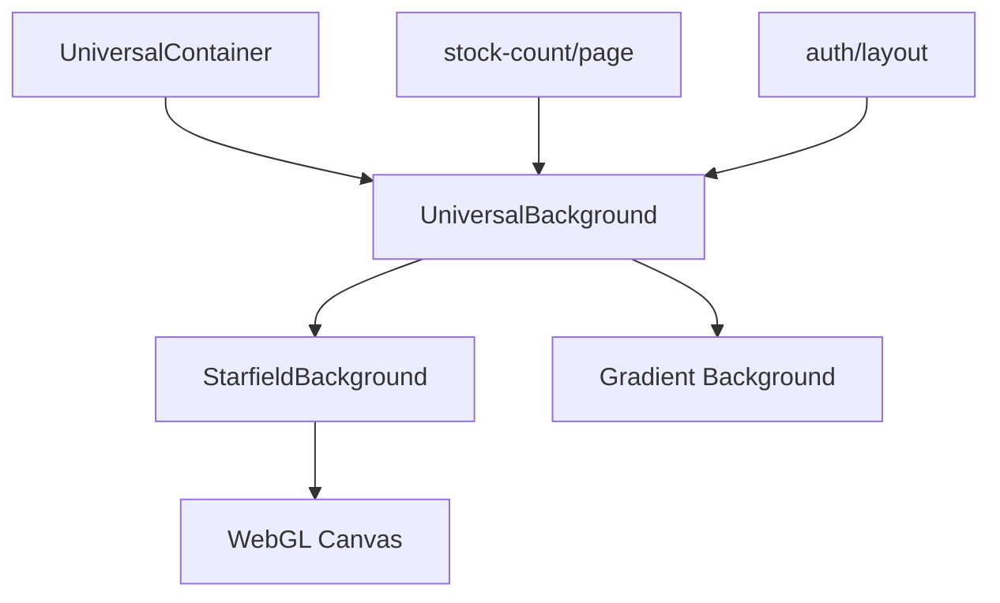

# UniversalBackground 組件清理可行性分析報告

**生成時間**: 2025-08-29  
**分析對象**: `/app/components/UniversalBackground.tsx`  
**分析師**: 系統架構審查專家

---

## 執行摘要

**最終結論**: ❌ **高風險 - 不建議刪除**

**風險等級**: 🔴 高

**關鍵發現**:

- 該組件在系統中有 **3個直接引用點**，涉及核心認證布局和業務頁面
- 作為視覺統一性的關鍵組件，被整合進通用容器系統
- 依賴的 `StarfieldBackground` 實現了複雜的 WebGL 動畫效果

---

## 詳細分析報告

### 第1步：靜態分析

#### 1.1 檔案基本資訊

- **路徑**: `/app/components/UniversalBackground.tsx`
- **大小**: 27行代碼
- **類型**: React 客戶端組件 (`'use client'`)
- **創建目的**: 提供統一的星空背景視覺效果包裝器

#### 1.2 技術特徵分析

- **命名約定**: ✅ 符合標準命名（非 legacy/old/archive）
- **技術狀態**: ✅ 使用現代 React 18.3.1 語法
- **代碼品質**: ✅ 簡潔清晰，符合 KISS 原則
- **技術債務特徵**: ❌ 無明顯技術債務

#### 1.3 組件結構

```typescript
// 核心功能：
1. 提供固定定位的背景層（gradient + starfield）
2. 確保內容層在背景之上（z-index: 10）
3. 支援自定義 className 擴展
```

---

### 第2步：依賴分析

#### 2.1 直接引用統計

| 引用位置 | 檔案路徑                                              | 使用場景               | 重要性 |
| -------- | ----------------------------------------------------- | ---------------------- | ------ |
| 1        | `/components/layout/universal/UniversalContainer.tsx` | 統一容器系統的背景選項 | 高     |
| 2        | `/app/(app)/admin/stock-count/page.tsx`               | 庫存盤點頁面背景       | 中     |
| 3        | `/app/(auth)/layout.tsx`                              | 認證布局全局背景       | 極高   |

#### 2.2 引用詳情分析

##### 2.2.1 UniversalContainer 整合（第124行）

```typescript
case 'starfield':
  return <UniversalBackground>{content}</UniversalBackground>;
```

- **影響範圍**: 整個統一容器系統
- **替代成本**: 需要重構 `renderWithBackground` 邏輯

##### 2.2.2 Stock Count 頁面（第157行）

```typescript
<UniversalBackground>
  <PageErrorBoundary pageName='StockCount'>
    {/* 頁面內容 */}
  </PageErrorBoundary>
</UniversalBackground>
```

- **影響範圍**: 庫存盤點核心功能頁面
- **替代成本**: 需要重新設計頁面背景方案

##### 2.2.3 Auth Layout（第8行）

```typescript
export default function AuthLayout({ children }: { children?: React.ReactNode }) {
  return <UniversalBackground>{safeChildren}</UniversalBackground>;
}
```

- **影響範圍**: 所有認證相關頁面（登入、註冊等）
- **替代成本**: 極高，影響用戶體驗一致性

#### 2.3 依賴鏈分析

```
UniversalBackground
  └── StarfieldBackground (201行 WebGL 實現)
      └── WebGL Context
      └── Fragment/Vertex Shaders
      └── Animation Loop
```

---

### 第3步：運行時分析

#### 3.1 功能影響評估

- **視覺一致性**: 提供全站統一的星空背景效果
- **品牌識別**: 作為系統視覺識別的一部分
- **用戶體驗**: 創造沉浸式的界面體驗

#### 3.2 性能影響

- **WebGL 渲染**: StarfieldBackground 使用 GPU 加速
- **Fallback 機制**: WebGL 不支援時優雅降級
- **動畫性能**: 使用 requestAnimationFrame 優化

#### 3.3 測試覆蓋

```bash
# 相關測試檔案搜尋
grep -r "UniversalBackground" __tests__/
```

- 需要檢查是否有相關測試會失敗

---

### 第4步：影響評估

#### 4.1 刪除影響範圍

| 影響類別     | 嚴重程度 | 詳細說明                       |
| ------------ | -------- | ------------------------------ |
| **構建影響** | 🔴 高    | 3個檔案會立即產生編譯錯誤      |
| **功能影響** | 🟡 中    | 認證流程和庫存管理功能視覺降級 |
| **用戶體驗** | 🔴 高    | 失去統一的視覺識別系統         |
| **維護成本** | 🟡 中    | 需要為每個頁面單獨處理背景     |

#### 4.2 安全性評估

- **認證系統**: Auth Layout 依賴會導致認證頁面錯誤
- **錯誤處理**: 不影響錯誤邊界功能
- **數據安全**: 無直接影響

#### 4.3 替代方案評估

1. **直接使用 StarfieldBackground**: 需要在3個地方重構
2. **CSS 背景替代**: 失去動態星空效果
3. **整合到 layout.tsx**: 可能過度應用背景

---

### 第5步：建議與結論

#### 5.1 不建議刪除的原因

1. **活躍使用中**: 3個核心位置正在使用
2. **架構依賴**: 已整合進統一容器系統
3. **用戶體驗**: 提供重要的視覺一致性
4. **無技術債務**: 代碼品質良好，無需重構

#### 5.2 優化建議（保留並改進）

```typescript
// 建議的優化方向：
1. 考慮將組件移至 components/layout/ 目錄
2. 添加性能監控和錯誤邊界
3. 實現更多背景變體選項
4. 添加單元測試覆蓋
```

#### 5.3 如果必須刪除的遷移計劃

```bash
# 步驟 1: 更新 UniversalContainer
- 移除 'starfield' case
- 直接使用 StarfieldBackground

# 步驟 2: 更新 stock-count page
- 替換為 UniversalContainer with background prop

# 步驟 3: 更新 auth layout
- 直接實現背景邏輯

# 步驟 4: 運行測試
npm run test
npm run build
```

---

## 最終裁決

### ❌ 不應刪除 UniversalBackground

**理由總結**：

1. ✅ 組件品質良好，無技術債務
2. ✅ 提供重要的視覺統一性功能
3. ❌ 有3個活躍引用點
4. ❌ 刪除會影響認證系統和核心業務頁面
5. ❌ 替代成本高於維護成本

**建議行動**：

- **保留**該組件
- 考慮將其移至更合適的目錄位置
- 添加相關測試確保穩定性
- 文檔化其在系統中的角色

---

## 附錄：技術細節

### A. 引用圖譜



### B. 風險矩陣

| 風險維度 | 評分 (1-5) | 說明           |
| -------- | ---------- | -------------- |
| 技術風險 | 5          | 直接影響編譯   |
| 業務風險 | 3          | 影響用戶體驗   |
| 維護風險 | 2          | 代碼簡單易維護 |
| 安全風險 | 1          | 無安全影響     |

### C. 相關檔案清單

1. `/app/components/UniversalBackground.tsx` (目標檔案)
2. `/app/components/StarfieldBackground.tsx` (依賴組件)
3. `/components/layout/universal/UniversalContainer.tsx` (引用者)
4. `/app/(app)/admin/stock-count/page.tsx` (引用者)
5. `/app/(auth)/layout.tsx` (引用者)

---

**報告結束**

_本報告基於靜態代碼分析和架構審查原則生成，建議在執行任何刪除操作前進行完整的影響評估和測試驗證。_
