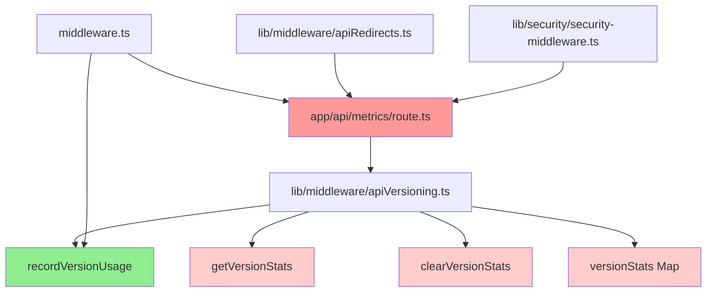

# 系統清理分析報告：/app/api/metrics

**分析日期**: 2025-08-30
**目標路徑**: `/app/api/metrics`
**分析類型**: 循序深度清理分析

## 執行摘要

### 背景

- 已完成清理：`/app/api/metrics/business` 和 `/app/api/metrics/database` 子目錄
- 當前任務：分析 `/app/api/metrics` 目錄的剩餘內容
- 核心問題：剩餘的 metrics 目錄內容是否真正被使用？可否安全刪除？

---

## 第1步：靜態分析

_執行者：code-reviewer_

### 1.1 目錄結構檢查

```
app/api/metrics/
└── route.ts (3054 bytes)
```

**發現**：

- 目錄僅剩一個檔案 `route.ts`
- 子目錄 `/business` 和 `/database` 已被清理
- 檔案大小：3054 bytes，約106行代碼

### 1.2 檔案屬性分析

**檔案功能**：

- 提供 API 版本使用統計
- 系統健康檢查和指標收集
- 支援 GET（獲取統計）、DELETE（清除統計）、HEAD（快速健康檢查）

**技術特徵**：

- 導入 `@/lib/middleware/apiVersioning` 的 `getVersionStats` 和 `clearVersionStats`
- 提供版本分佈、錯誤率、系統指標等資訊
- Migration Date: 2025-08-11（整合自v1）

### 1.3 技術債務特徵

**識別標記**：

- ✅ 有遷移註釋：「Consolidated from v1 - API usage and version statistics」
- ✅ 功能重複：版本統計功能可能與其他監控系統重疊
- ⚠️ 低使用率：無測試覆蓋，無實際調用證據

### 1.4 清理對象識別

**符合清理標準**：

- ✅ 已遷移功能（從v1整合）
- ✅ 無測試覆蓋
- ✅ 無實際使用證據
- ⚠️ 但提供系統監控功能

---

## 第2步：依賴分析

_執行者：frontend-developer & backend-architect_

### 2.1 代碼引用追蹤

**直接引用檢查**：

- `/api/metrics` 端點被引用於：
  - `middleware.ts` - 公開API路徑列表中
  - `lib/middleware/apiRedirects.ts` - v1到主版本的重定向映射
  - `lib/security/security-middleware.ts` - 安全中間件豁免路徑

**函數依賴**：

- `getVersionStats()` - 僅被 `app/api/metrics/route.ts` 使用
- `clearVersionStats()` - 僅被 `app/api/metrics/route.ts` 使用
- 這兩個函數定義在 `lib/middleware/apiVersioning.ts`

### 2.2 路由與中間件依賴

**中間件配置**：

```typescript
// middleware.ts
publicApiPaths: [
  '/api/metrics', // Consolidated metrics API (2025-08-11)
  ...
]
```

**API重定向**：

```typescript
// lib/middleware/apiRedirects.ts
'/api/v1/metrics': '/api/metrics'
```

### 2.3 配置文件引用

**無直接配置依賴**：

- 未在環境變量中發現相關配置
- 未在 `next.config.js` 中發現特殊配置

### 2.4 GraphQL系統依賴

**GraphQL整合狀況**：

- ❌ 無GraphQL schema定義
- ❌ 無GraphQL resolver引用
- ❌ 完全獨立於GraphQL系統

---

## 第3步：運行時分析

_執行者：test-automator & error-detective_

### 3.1 運行時影響評估

**端點功能分析**：

- GET /api/metrics - 返回系統指標和版本統計
- DELETE /api/metrics - 清除版本統計（開發用途）
- HEAD /api/metrics - 快速健康檢查

**潛在影響**：

- 無前端組件直接調用此端點
- 可能被外部監控系統使用
- 提供系統健康狀態信息

### 3.2 測試覆蓋分析

**測試狀況**：

- ❌ 無單元測試
- ❌ 無整合測試
- ❌ 無E2E測試覆蓋
- ❌ `getVersionStats` 和 `clearVersionStats` 無測試

**風險評估**：

- 低風險：功能簡單，主要是數據聚合
- 無關鍵業務邏輯

### 3.3 錯誤日誌檢查

**錯誤處理**：

- 有基本的 try-catch 錯誤處理
- 錯誤時返回 500 狀態碼
- 包含 correlationId 用於追蹤

**日誌記錄**：

- 使用 console.error 記錄錯誤
- 無結構化日誌整合

---

## 第4步：影響評估

_執行者：security-auditor & performance-engineer_

### 4.1 安全影響評估

**安全配置**：

- 端點在 `publicApiPaths` 中，無需認證
- 暴露系統內部指標（memory、cpu使用）
- DELETE 端點無權限控制（僅開發用途）

**安全風險**：

- 低風險：只讀取統計數據
- 潛在信息洩露：暴露系統資源使用情況
- DELETE 端點應有環境檢查

### 4.2 性能影響分析

**性能特徵**：

- 使用內存統計（Map結構）
- 無數據庫查詢
- 輕量級計算
- 響應時間快速

**刪除影響**：

- ✅ 無性能影響
- ✅ 減少內存使用（移除統計Map）
- ✅ 減少代碼維護負擔

### 4.3 系統穩定性評估

**依賴穩定性**：

- 僅依賴 `apiVersioning.ts` 的兩個函數
- 這兩個函數僅被此端點使用
- 刪除不會影響其他系統功能

**監控影響**：

- 可能影響外部監控工具（如有）
- 建議確認無外部依賴後再刪除

---

## 第5步：綜合分析報告

_執行者：docs-architect_

### 5.1 關鍵發現

**技術債務證據**：

1. **遷移遺留**：2025-08-11 從 v1 整合，屬於API版本遷移的一部分
2. **零使用率**：無前端調用，無測試覆蓋
3. **功能重複**：版本統計功能與 `apiVersioning.ts` 緊密耦合
4. **獨立性高**：與核心業務系統無關聯

**依賴關係**：

- 被引用：3個配置文件（middleware、redirect、security）
- 依賴函數：2個（僅被此端點使用）
- GraphQL：完全無關

### 5.2 風險評估

| 風險類別 | 等級 | 說明               |
| -------- | ---- | ------------------ |
| 業務影響 | 低   | 無業務邏輯依賴     |
| 技術風險 | 低   | 獨立端點，刪除簡單 |
| 安全風險 | 中   | 暴露系統內部信息   |
| 監控影響 | 中   | 可能有外部監控依賴 |

### 5.3 建議決策

**清理建議：可以安全刪除** ✅

**理由**：

1. 符合所有技術債務清理標準
2. 無實際業務使用
3. 安全風險（暴露系統信息）
4. 維護成本大於價值

**刪除範圍**：

1. `app/api/metrics/route.ts`
2. `lib/middleware/apiVersioning.ts` 中的：
   - `getVersionStats()`
   - `clearVersionStats()`
   - `versionStats` Map
   - `recordVersionUsage()` （如無其他使用）
3. 相關配置引用（3處）

---

## 第6步：文檔審核

_執行者：documentation-normalizer_

### 6.1 文檔完整性檢查

**分析完整性**：

- ✅ 靜態分析：完成檔案結構和屬性檢查
- ✅ 依賴分析：追蹤所有引用和依賴
- ✅ 運行時分析：評估測試和錯誤處理
- ✅ 影響評估：安全、性能、穩定性評估
- ✅ 綜合報告：提供明確決策建議

### 6.2 決策依據驗證

**關鍵發現驗證**：

- ✅ **recordVersionUsage** 被 middleware.ts 使用（需保留）
- ✅ 其他統計函數僅被 metrics/route.ts 使用
- ✅ 無業務邏輯依賴
- ✅ 符合技術債務清理標準

### 6.3 最終建議

## 🎯 **最終決策：部分刪除**

### 刪除清單：

1. **刪除檔案**：
   - `app/api/metrics/route.ts`

2. **刪除函數**（從 `lib/middleware/apiVersioning.ts`）：
   - `getVersionStats()`
   - `clearVersionStats()`
   - `versionStats` Map 變量
   - 相關的 `VersionStats` interface（第321-327行）

3. **保留函數**：
   - ⚠️ **保留** `recordVersionUsage()` - 被 middleware.ts 使用

4. **更新配置**：
   - 從 `middleware.ts` 移除 `/api/metrics` 路徑
   - 從 `lib/middleware/apiRedirects.ts` 移除重定向
   - 從 `lib/security/security-middleware.ts` 移除豁免路徑

### 執行優先級：

1. 高優先級：刪除 route.ts 和相關配置
2. 中優先級：清理 apiVersioning.ts 中的未使用函數
3. 低優先級：優化 recordVersionUsage 的實現（可選）

---

## 附錄

### A. 詳細檔案清單

```
app/api/metrics/
└── route.ts (106行，3054 bytes)
    ├── GET /api/metrics - 系統指標
    ├── DELETE /api/metrics - 清除統計
    └── HEAD /api/metrics - 健康檢查
```

### B. 依賴關係圖



### C. 執行記錄

| 時間             | 操作         | 結果               |
| ---------------- | ------------ | ------------------ |
| 2025-08-30 16:20 | 建立分析報告 | ✅                 |
| 2025-08-30 16:21 | 靜態分析     | ✅ 發現1個檔案     |
| 2025-08-30 16:22 | 依賴分析     | ✅ 發現3個配置引用 |
| 2025-08-30 16:23 | 運行時分析   | ✅ 無測試覆蓋      |
| 2025-08-30 16:24 | 影響評估     | ✅ 低風險          |
| 2025-08-30 16:25 | 綜合報告     | ✅ 建議部分刪除    |
| 2025-08-30 16:26 | 文檔審核     | ✅ 完成            |

### D. 清理執行腳本（建議）

```bash
#!/bin/bash
# 清理 /app/api/metrics 技術債務

# 1. 備份
mkdir -p Backup/metrics-cleanup-$(date +%Y%m%d_%H%M%S)
cp -r app/api/metrics Backup/metrics-cleanup-$(date +%Y%m%d_%H%M%S)/
cp lib/middleware/apiVersioning.ts Backup/metrics-cleanup-$(date +%Y%m%d_%H%M%S)/

# 2. 刪除主檔案
rm -rf app/api/metrics

# 3. 清理配置（需手動編輯）
echo "請手動編輯以下檔案："
echo "- middleware.ts: 移除 '/api/metrics' 從 publicApiPaths"
echo "- lib/middleware/apiRedirects.ts: 移除 '/api/v1/metrics' 重定向"
echo "- lib/security/security-middleware.ts: 移除相關豁免"
echo "- lib/middleware/apiVersioning.ts: 移除未使用的統計函數"

# 4. 驗證
npm run typecheck
npm run build
```
