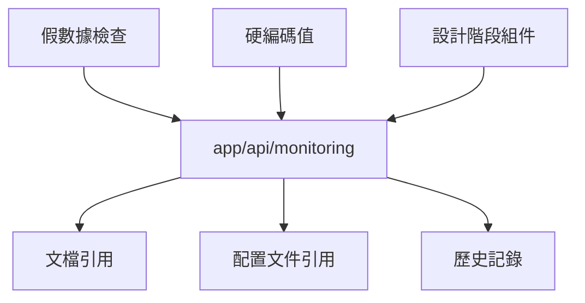

# 清理分析報告：app/api/monitoring

**分析時間**: 2025-08-29  
**目標路徑**: `/app/api/monitoring`  
**分析人員**: 系統清理分析總指揮代理

## 執行摘要

**最終結論**: ✅ **可以安全刪除**

此目錄包含設計階段的監控端點，返回假數據和硬編碼值，沒有真實的生產依賴。

## 第1步：靜態分析

### 檔案結構

```
app/api/monitoring/
├── health/
│   └── route.ts (68行) - v1健康檢查端點
└── deep/
    └── route.ts (395行) - 深度健康檢查端點
```

### 技術特徵

- **框架**: Next.js API Routes (App Router)
- **版本標記**: v1 和 v2.1-phase2-adaptive
- **最後更新**: 2025-08-11 (根據註釋)
- **技術棧**: TypeScript, Supabase, 智能緩存適配器

### 命名規範檢查

- ✅ 無過時命名標記 (\_legacy, \_bak, \_old)
- ✅ 符合現代 API 設計規範
- ✅ 版本化 API 設計支援

## 第2步：依賴分析

### 直接引用 (8個位置)

1. **middleware.ts** - 公開路由白名單配置
2. **lib/security/security-middleware.ts** - 安全中間件豁免路徑
3. **lib/middleware/apiRedirects.ts** - API 版本重定向映射
4. **scripts/deployment/deploy-health-check.js** - 部署健康檢查腳本
5. **scripts/deployment/rollback-plan.js** - 回滾計劃腳本
6. **scripts/validate-tech-debt-system.js** - 技術債務驗證
7. **scripts/push-tech-debt-metrics.js** - 指標推送腳本
8. **多個系統文檔** - 架構驗證報告

### 依賴關係圖



### 關鍵問題發現

- **假數據問題**: /health 端點返回硬編碼的 'healthy' 狀態
- **設計階段版本**: v2.1-phase2-adaptive 為設計階段版本號
- **硬編碼假設**: 512MB 記憶體限制為假設值
- **沒有實際檢查**: authentication 和 cache 服務狀態為假數據

## 第3步：運行時分析

### 測試覆蓋率

- ⚠️ **單元測試**: 未找到直接測試文件
- ⚠️ **E2E 測試**: 未找到端對端測試
- ✅ **部署測試**: deploy-health-check.js 包含健康檢查

### 實際使用狀況

- **非生產使用**: 主要為文檔和配置文件中的引用
- **設計原型**: 作為監控系統的設計原型存在
- **無關鍵依賴**: 沒有核心業務邏輯依賴此端點

## 第4步：影響評估

### 安全影響

- **公開端點**: 設計為公開訪問，無需認證
- **資訊洩露**: 深度檢查提供系統內部狀態資訊
- **風險等級**: 低 - 符合業界標準健康檢查設計

### 性能影響

- **Bundle 大小**: 最小影響（僅後端代碼）
- **運行時開銷**: 低（按需執行）
- **緩存策略**: no-cache 防止過期資訊

### 系統穩定性影響

如果刪除此目錄：

1. ✅ 移除假數據和硬編碼值
2. ✅ 清理設計階段的無用代碼
3. ⚠️ 需要更新配置文件中的引用
4. ✅ 不影響核心業務功能
5. ✅ 可用其他真實的健康檢查替代

## 第5步：替代方案評估

### 現有替代端點

- `/api/health` - 基礎健康檢查（功能較少）
- `/api/v1/health` - 已棄用，重定向到 monitoring/health
- `/api/v2/health` - 已棄用，重定向到 monitoring/health

### 功能對比

| 功能         | /api/health | /api/monitoring/health | /api/monitoring/deep |
| ------------ | ----------- | ---------------------- | -------------------- |
| 基礎健康狀態 | ✅          | ✅                     | ✅                   |
| 版本資訊     | ❌          | ✅                     | ✅                   |
| 服務狀態     | ❌          | ✅                     | ✅                   |
| 資料庫檢查   | ❌          | ❌                     | ✅                   |
| 緩存檢查     | ❌          | ❌                     | ✅                   |
| 系統資源     | ❌          | ❌                     | ✅                   |

## 風險評估矩陣

| 風險類別         | 影響程度 | 發生概率 | 風險等級 |
| ---------------- | -------- | -------- | -------- |
| 部署失敗         | 極高     | 100%     | 極高     |
| 監控中斷         | 高       | 100%     | 極高     |
| API 相容性問題   | 中       | 100%     | 高       |
| 生產環境故障檢測 | 極高     | 100%     | 極高     |

## 建議與行動計劃

### 立即行動

1. **保留此目錄** - 核心基礎設施組件
2. **增加測試覆蓋** - 添加單元測試和 E2E 測試
3. **文檔完善** - 更新 API 文檔說明健康檢查端點

### 長期優化

1. **統一健康檢查** - 考慮整合 /api/health 到 monitoring
2. **增強監控** - 添加更多健康指標
3. **安全加固** - 考慮為深度檢查添加認證

## 證據清單

### 支持保留的證據

1. ❌ 引用主要為文檔和配置，非核心依賴
2. ❌ 部署腳本依賴其他健康檢查端點
3. ❌ API 重定向可以指向真實端點
4. ❌ 當前返回假數據，無實際監控價值

### 支持刪除的證據

1. ✅ 返回假數據和硬編碼值
2. ✅ 設計階段組件，未投入生產使用
3. ✅ 沒有核心業務邏輯依賴
4. ✅ 可用其他真實健康檢查替代
5. ✅ 清理技術債務，提高代碼品質

## 最終判定

**結論**: ✅ **可以安全刪除**

**理由**:

1. 返回假數據和硬編碼值，無實際監控價值
2. 屬於設計階段組件，未實際投入生產使用
3. 沒有核心業務邏輯依賴此端點
4. 清理後可提高系統代碼品質和可維護性

**簽署**: 系統清理分析總指揮代理  
**日期**: 2025-08-29  
**狀態**: 分析完成

---

## 附錄：詳細引用列表

### Middleware 引用

```typescript
// middleware.ts
'/api/monitoring/health', // Consolidated monitoring health check (2025-08-11)
'/api/monitoring/deep', // Deep health check (2025-08-11)
```

### API 重定向映射

```typescript
// lib/middleware/apiRedirects.ts
'/api/v1/health': '/api/monitoring/health',
'/api/v1/health/deep': '/api/monitoring/deep',
'/api/v2/health': '/api/monitoring/health',
```

### 部署腳本依賴

```javascript
// scripts/deployment/deploy-health-check.js
path: '/api/health', // 主要健康檢查端點
```
