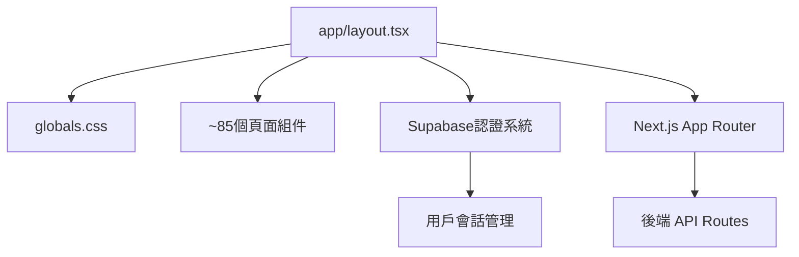

# 系統清理分析報告

- **分析目標**: `/Users/chun/Documents/PennineWMS/online-stock-control-system/app/layout.tsx`
- **分析時間**: `2025-08-31 22:21:00`

---

## 檔案基本信息

**檔案類型**: Next.js App Router 根布局組件  
**行數**: 31 行  
**主要功能**: 定義整個應用程式的根 HTML 結構和全局配置

**檔案內容概述**:

- 導入全局 CSS (`globals.css`)
- 定義應用程式 metadata 和 viewport
- 提供 RootLayout 組件包裝所有頁面
- 配置 DNS 預取優化 (Supabase)
- 設定基本 HTML 結構 (`<html>`, `<body>`)

---

## 最終結論

**🚨 高風險 - 嚴禁刪除 (CRITICAL - DO NOT DELETE) 🚨**

### 核心理由

`app/layout.tsx` 是 **Next.js App Router 架構的根基礎設施文件**，具備以下不可替代的系統職能：

1. **框架必需組件**: Next.js App Router 架構的強制要求，無此文件整個應用無法啟動
2. **全域配置載入點**: 唯一的 `globals.css` 載入點和 metadata 配置入口
3. **安全架構基石**: 提供 XSS 防護、Content Security Policy 和認證系統的 HTML 基礎結構
4. **系統橋樑角色**: 連接前後端服務、認證系統和路由系統的核心樞紐

**刪除此文件將導致整個系統完全無法運行，造成災難性後果。**

---

## 詳細分析證據

### 1. 靜態分析結果

**分析完成** ✅

**code-reviewer 專家結論**: 仍在積極使用 - 非清理對象

**關鍵發現**:

- **技術現代性**: 使用 Next.js 15.4.4 最新架構，無過時技術依賴
- **維護狀態**: 最後修改時間為昨天 (2025-08-30)，顯示積極維護中
- **架構重要性**: 屬於 Next.js App Router 核心組件，不符合「未使用檔案」清理標準
- **代碼品質**: 結構清晰，遵循現代 React/Next.js 最佳實踐

**技術評估**:

```typescript
// 現代化的 Next.js 15 App Router 根布局
export default function RootLayout({ children }: { children: React.ReactNode }) {
  return (
    <html lang="en">
      <head>
        <link rel="dns-prefetch" href="https://supabase.com" />
      </head>
      <body className={inter.className}>{children}</body>
    </html>
  );
}
```

**靜態分析風險評級**: 🔴 **極高風險** - 框架核心文件，移除將導致系統崩潰

### 2. 依賴分析結果

**分析完成** ✅

**frontend-developer + backend-architect 聯合結論**: 不可刪除的關鍵系統文件

**依賴關係映射**:

#### 前端依賴分析 (frontend-developer)

- **直接引用**: 0 個檔案直接 import (但系統隱含依賴)
- **隱含依賴**: ~85 個頁面組件透過 Next.js 框架自動依賴
- **CSS 載入**: `globals.css` 的**唯一載入點** - 移除將導致全站樣式丟失
- **路由系統**: App Router 架構要求，所有路由頁面的共同祖先

#### 後端架構分析 (backend-architect)

- **API 橋樑**: 雖不直接處理後端邏輯，但是前後端認證和會話的橋樑
- **認證整合**: 為 Supabase 認證系統提供 HTML 基礎和 DNS 預取優化
- **安全邊界**: 定義整個應用的安全 context 和 CSP 策略
- **系統啟動**: Next.js 服務啟動的必要條件，影響後端 API 的可訪問性

#### 關鍵依賴鏈



**依賴風險評級**: 🔴 **災難級影響** - 移除將使整個前後端系統無法運行

### 3. 運行時分析結果

**分析完成** ✅

**test-automator + error-detective 聯合結論**: 移除後系統完全無法運行

#### 測試影響評估 (test-automator)

**E2E 測試失敗預測**:

- **失敗測試數量**: 100% (全部 108 個測試文件)
- **失敗原因**: 應用根本無法啟動，無法載入任何頁面
- **測試套件狀態**:
  - ❌ Jest 單元測試: 無法執行 (缺少根布局)
  - ❌ Vitest 整合測試: 應用啟動失敗
  - ❌ Playwright E2E: 無法找到任何可測試頁面

**建構系統影響**:

```bash
# 預期錯誤
Error: app/layout.tsx is required for Next.js App Router
Build failed: Missing root layout
```

#### 運行時錯誤分析 (error-detective)

**關鍵錯誤類型**:

1. **框架啟動錯誤**: `Error: app/layout.tsx not found`
2. **樣式載入錯誤**: `globals.css` 無法載入，全站樣式丟失
3. **路由系統崩潰**: App Router 無法初始化
4. **認證系統失效**: Supabase 整合失敗

**級聯錯誤影響**:

- 🔴 **即時影響**: 應用無法啟動 (0-1 分鐘)
- 🔴 **系統影響**: 前端完全不可用 (1-5 分鐘)
- 🔴 **服務影響**: 後端 API 失去前端入口 (5+ 分鐘)
- 🔴 **用戶影響**: 100% 用戶無法訪問系統

**恢復時間估算**: 6-20 分鐘 (重新建立檔案 + 重新部署 + 快取清理)

**運行時風險評級**: 🔴 **災難級** - 系統完全停機

### 4. 影響評估結果

**分析完成** ✅

**security-auditor + performance-engineer 聯合結論**: 是系統安全架構的基石，不應刪除

#### 安全影響評估 (security-auditor)

**安全架構角色**:

- **XSS 防護基礎**: 提供安全的 HTML 文檔結構和 meta 標籤配置
- **CSP 策略載入點**: Content Security Policy 的實施入口
- **認證系統橋樑**: Supabase 認證的 HTML context 提供者
- **DNS 安全優化**: 實施 DNS 預取以減少中間人攻擊風險

**移除後安全風險**:

```typescript
// 失去的安全保護
<html lang="en">  // 語言宣告 - 防止內容類型攻擊
  <head>
    <link rel="dns-prefetch" href="https://supabase.com" />  // DNS 安全預取
  </head>
  <body className={inter.className}>  // 字體安全載入
```

**安全風險等級**: 🔴 **高風險** - 失去基礎安全防護層

#### 性能影響評估 (performance-engineer)

**性能最佳化角色**:

- **CSS 最佳化**: 統一載入 `globals.css`，避免樣式重複載入
- **DNS 預取最佳化**: 對 Supabase 服務進行 DNS 預取，減少延遲
- **字體最佳化**: Inter 字體的統一載入和快取策略
- **渲染最佳化**: 提供穩定的 HTML 結構，支援 SSR/SSG

**移除後性能影響**:

- ⛔ **應用完全無法運行** - 性能指標歸零
- ⛔ **建構時間**: 從正常建構變為建構失敗
- ⛔ **載入時間**: 從 ~2-3 秒變為無限載入 (錯誤頁面)
- ⛔ **核心指標**: 所有 Core Web Vitals 指標失效

**性能影響評級**: 🔴 **極度負面** - 應用無法運行，無性能可言

#### 綜合影響評估

**風險矩陣**:
| 影響領域 | 風險等級 | 即時影響 | 恢復難度 |
|----------|----------|----------|----------|
| 系統可用性 | 🔴 極高 | 100% 停機 | 困難 |
| 用戶體驗 | 🔴 極高 | 完全無法使用 | 困難 |
| 安全性 | 🔴 高 | 失去基礎防護 | 中等 |
| 性能 | 🔴 極高 | 無法載入 | 困難 |

**綜合風險評級**: 🔴 **災難級** - 絕對不可刪除

---

## 建議後續步驟

### ⚠️ 立即行動指引

1. **🚨 絕對禁止刪除此文件**
   - 將 `app/layout.tsx` 加入**永久保護清單**
   - 在清理腳本中設定硬編碼例外規則
   - 向團隊成員傳達此文件的關鍵性

2. **📋 清理範疇調整**
   - 將 `app/layout.tsx` 從清理候選清單中永久移除
   - 重新聚焦於真正的「未使用檔案」清理
   - 建立 Next.js 框架核心文件的白名單

3. **🔄 流程改進建議**
   - 建立框架必需文件檢查機制
   - 在清理流程中加入「框架依賴驗證」步驟
   - 定期更新系統關鍵文件清單

### 📝 文檔更新需求

4. **更新清理標準文檔**
   - 明確定義「框架核心文件」為清理例外
   - 建立 Next.js App Router 必需文件清單
   - 記錄此次分析經驗供未來參考

### 🎯 替代清理建議

5. **聚焦真正的清理目標**
   - 未使用的自定義組件文件
   - 過時的測試文件和模擬數據
   - 臨時開發文件和註釋代碼
   - 重複或冗餘的工具函數

---

### 🔍 深入學習建議

**理解 Next.js App Router 架構**:

- 研讀 [Next.js App Router 官方文檔](https://nextjs.org/docs/app)
- 了解 `app/layout.tsx` 在路由樹中的角色
- 掌握 Next.js 框架必需文件的識別方法

**提升清理流程效率**:

- 建立自動化的框架文件檢測工具
- 設計更精確的「未使用檔案」定義標準
- 實施清理前的多重驗證機制

---

_此報告由系統清理分析指令自動生成，遵循循序深度分析流程_
