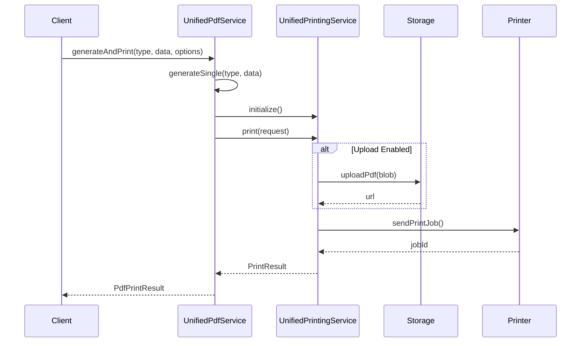

# 統一 PDF 生成與打印服務整合

_更新日期: 2025-08-28_

## 概述

本文檔記錄了統一 PDF 服務 (`UnifiedPdfService`) 與統一打印服務 (`UnifiedPrintingService`) 的整合實施，提供了一站式的 PDF 生成和打印解決方案。

## 架構設計

### 核心組件

1. **UnifiedPdfService** - PDF 生成服務
   - 負責 PDF 文檔生成
   - 支援多種 PDF 類型（QC標籤、GRN標籤、報告等）
   - 提供批量生成功能
   - 管理 PDF 緩存和資源

2. **UnifiedPrintingService** - 打印服務
   - 負責打印作業管理
   - 支援多種打印機類型
   - 提供打印隊列管理
   - 處理打印狀態監控

### 整合流程



## 新增功能

### 1. generateAndPrint 方法

單個 PDF 生成並打印的整合方法：

```typescript
public async generateAndPrint<T>(
  type: PdfType,
  data: T,
  printOptions?: PdfPrintOptions,
  pdfOptions?: Partial<PdfConfig>
): Promise<PdfPrintResult>
```

**特點：**

- 一次調用完成 PDF 生成和打印
- 支援打印選項配置（份數、優先級、打印機偏好）
- 可選的 PDF 上傳功能
- 返回詳細的執行結果和時間統計

### 2. generateAndPrintBatch 方法

批量 PDF 生成並打印的整合方法：

```typescript
public async generateAndPrintBatch<T>(
  type: PdfType,
  dataArray: T[],
  printOptions?: PdfPrintOptions,
  pdfOptions?: Partial<PdfConfig>,
  onProgress?: ProgressCallback
): Promise<BatchPrintResult>
```

**特點：**

- 批量處理多個 PDF
- 實時進度回調
- 支援合併模式（將多個 PDF 合併為一個）
- 詳細的批量處理統計

### 3. 打印選項介面

```typescript
export interface PdfPrintOptions {
  copies?: number; // 打印份數
  priority?: 'high' | 'normal' | 'low'; // 優先級
  printerPreference?: string; // 打印機偏好
  immediateMode?: boolean; // 立即模式（合併 PDFs）
  uploadBeforePrint?: boolean; // 打印前上傳
}
```

## 使用範例

### 基本使用

```typescript
const pdfService = UnifiedPdfService.getInstance();

// QC 標籤打印
const qcData: QcLabelInputData = {
  productCode: 'PRD-001',
  productDescription: 'Product A',
  quantity: 100,
  series: 'BATCH-001',
  palletNum: 'PLT-001',
  operatorClockNum: 'OP-001',
  qcClockNum: 'QC-001',
};

const result = await pdfService.generateAndPrint(PdfType.QC_LABEL, qcData, {
  copies: 2,
  priority: 'high',
});
```

### 批量處理

```typescript
const dataArray = [
  /* 多個標籤數據 */
];

const result = await pdfService.generateAndPrintBatch(
  PdfType.GRN_LABEL,
  dataArray,
  {
    copies: 1,
    immediateMode: true, // 合併為單個 PDF
    uploadBeforePrint: true,
  },
  undefined,
  (current, total, status) => {
    console.log(`Progress: ${current}/${total} - ${status}`);
  }
);
```

## 類型映射

PDF 類型自動映射到對應的打印類型：

| PDF 類型          | 打印類型                   |
| ----------------- | -------------------------- |
| PdfType.QC_LABEL  | PrintType.QC_LABEL         |
| PdfType.GRN_LABEL | PrintType.GRN_LABEL        |
| PdfType.REPORT    | PrintType.INVENTORY_REPORT |
| PdfType.CUSTOM    | PrintType.CUSTOM_DOCUMENT  |

## 性能優化

1. **緩存管理**：PDF 庫按需載入，避免初始載入開銷
2. **批量優化**：支援並行和串行處理模式
3. **資源釋放**：提供 `clearCache()` 方法釋放資源
4. **超時保護**：PDF 生成設有 30 秒超時保護

## 錯誤處理

整合服務提供完善的錯誤處理：

- PDF 生成失敗時不會執行打印
- 打印失敗時返回詳細錯誤信息
- 批量處理支援部分失敗容錯
- 所有錯誤都記錄在結果中

## 安全性

- 使用 `LoggerSanitizer` 過濾敏感信息
- 支援基於用戶權限的打印控制
- PDF 上傳使用安全的存儲服務

## 測試覆蓋

提供完整的測試套件：

- 單元測試：`unified-pdf-print-integration.test.ts`
- 使用範例：`pdf-print-integration-example.tsx`
- 測試場景：
  - 單個和批量生成打印
  - 錯誤處理
  - 類型映射
  - 打印選項配置

## 遷移指南

現有代碼可以逐步遷移到新的整合方法：

### 舊方法

```typescript
// 分離的生成和打印
const pdfResult = await generatePdf(data);
await printPdf(pdfResult.blob);
```

### 新方法

```typescript
// 整合的生成和打印
const result = await pdfService.generateAndPrint(PdfType.QC_LABEL, data, printOptions);
```

## 後續優化建議

1. **打印機管理**：增加打印機狀態實時監控
2. **隊列優化**：實現更智能的打印隊列調度
3. **模板系統**：擴展 PDF 模板支援
4. **監控儀表板**：建立打印服務監控界面
5. **批量優化**：實現更高效的批量 PDF 合併算法

## 相關文件

- `/lib/services/unified-pdf-service.ts` - PDF 服務實現
- `/lib/printing/services/unified-printing-service.ts` - 打印服務實現
- `/lib/services/examples/pdf-print-integration-example.tsx` - 使用範例
- `/lib/services/__tests__/unified-pdf-print-integration.test.ts` - 測試套件
