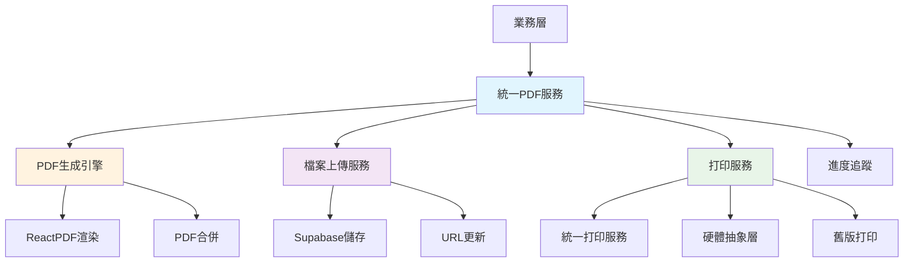

# PDF 組件統一化方案 - 完整技術實施文檔

_最後更新日期: 2025-08-28_

## 執行摘要

本文檔專注於 QCLabelCard 和 GRNLabelCard 的統一，以 QCLabelCard 的成熟架構為基礎，建立統一的標籤 PDF 生成和處理服務，消除兩者間的代碼重複，實現「一個真相源」的設計原則。

### 核心目標

- 基於 QCLabelCard 成熟架構統一 QC 和 GRN 標籤 PDF 功能
- 實現 85%+ 代碼重用，減少 70-90% 重複代碼
- 建立統一的標籤 PDF 生成、上傳、打印流程
- 確保類型安全和完整的錯誤處理

## 1. 問題分析

### 1.1 現狀對比

| 功能         | QC 標籤                            | GRN 標籤          | 問題         |
| ------------ | ---------------------------------- | ----------------- | ------------ |
| **PDF 生成** | ✅ 完整架構 `usePdfGeneration.tsx` | ❌ 分散在業務邏輯 | 代碼重複     |
| **檔案上傳** | ✅ 內建 `uploadPdfToStorage()`     | ⚠️ 後期補丁       | 功能不一致   |
| **進度追蹤** | ✅ 詳細狀態管理                    | ⚠️ 基本實現       | 用戶體驗差異 |
| **錯誤處理** | ✅ 多層級錯誤處理                  | ⚠️ 基本錯誤處理   | 可靠性不一致 |
| **服務降級** | ✅ 統一打印→硬體→舊版              | ❌ 缺乏降級機制   | 系統穩定性差 |

### 1.2 代碼重複問題

**QC 架構 (成熟)**:

```typescript
usePdfGeneration.tsx (421行)
├── 服務初始化 (統一打印、硬體抽象)
├── PDF 生成 (單個/批量)
├── 檔案上傳 (uploadPdfToStorage)
├── 數據庫更新 (updatePalletPdfUrl)
├── 進度追蹤 (詳細狀態管理)
└── 錯誤處理 (多層級)
```

**GRN 現狀 (不完整)**:

```typescript
useAdminGrnLabelBusiness.tsx
├── 分散的 PDF 生成邏輯
├── 後期補丁的上傳功能 (動態載入)
├── 基本進度追蹤
└── 簡單錯誤處理
```

## 2. 統一架構設計

### 2.1 核心服務架構



### 2.2 統一 PDF 服務設計

**核心接口:**

```typescript
interface UnifiedPdfService {
  // 單個 PDF 生成
  generateSingle<T>(type: PdfType, data: T, options?: PdfGenerationOptions): Promise<PdfResult>;

  // 批量 PDF 生成
  generateBatch<T>(type: PdfType, items: T[], options?: BatchPdfOptions): Promise<BatchPdfResult>;

  // 生成並打印
  generateAndPrint<T>(type: PdfType, data: T, printOptions?: PrintOptions): Promise<PrintResult>;
}

enum PdfType {
  QC_LABEL = 'qc-label',
  GRN_LABEL = 'grn-label',
}
```

### 2.3 配置驅動模式

**PDF 類型配置:**

```typescript
const pdfTypeConfigs: Record<PdfType, PdfConfig> = {
  [PdfType.QC_LABEL]: {
    component: PrintLabelPdf,
    dataMapper: prepareQcLabelData,
    uploadConfig: {
      bucket: 'qc-labels',
      pathGenerator: (data) => \`\${data.palletNum.replace('/', '_')}.pdf\`,
      updateFunction: updatePalletPdfUrlQc
    },
    rpcConfig: {
      functionName: 'process_qc_label_unified',
      paramsMapper: prepareQcRpcParams
    }
  },
  [PdfType.GRN_LABEL]: {
    component: PrintLabelPdf,
    dataMapper: prepareGrnLabelData,
    uploadConfig: {
      bucket: 'grn-labels',
      pathGenerator: (data) => \`GRN_\${data.palletNum}.pdf\`,
      updateFunction: updatePalletPdfUrl
    },
    rpcConfig: {
      functionName: 'grn_unified_batch_update',
      paramsMapper: prepareGrnRpcParams
    }
  }
};
```

## 3. 實施計劃

### 3.1 階段一：統一基礎服務 (1週)

**目標**: 建立核心統一服務

**任務清單:**

1. **建立統一 PDF 服務**

   ```typescript
   // lib/services/unified-pdf-service.ts
   export class UnifiedPdfService {
     private configs = pdfTypeConfigs;

     async generateSingle<T>(type: PdfType, data: T, options?: PdfGenerationOptions) {
       const config = this.configs[type];
       if (!config) throw new Error(\`Unsupported PDF type: \${type}\`);

       // 1. 數據準備
       const pdfProps = config.dataMapper(data);

       // 2. PDF 生成
       const pdfElement = createElement(config.component, pdfProps);
       const blob = await this.renderPdf(pdfElement);

       // 3. 檔案上傳 (如果配置)
       let url: string | null = null;
       if (config.uploadConfig && options?.upload !== false) {
         url = await this.uploadPdf(blob, data, config.uploadConfig);
       }

       return { blob, url, error: null };
     }
   }
   ```

2. **統一數據準備函數**

   ```typescript
   // lib/mappers/pdf-data-mappers.ts
   export const prepareQcLabelData = (data: QcPrintData): PrintLabelPdfProps => {
     // QC 特有的數據準備邏輯
   };

   export const prepareGrnLabelData = (data: GrnPrintData): PrintLabelPdfProps => {
     // GRN 特有的數據準備邏輯
   };
   ```

3. **統一 Hook 實現**
   ```typescript
   // hooks/useUnifiedPdfGeneration.ts
   export function useUnifiedPdfGeneration<T>(type: PdfType) {
     const pdfService = useRef<UnifiedPdfService | null>(null);

     useEffect(() => {
       pdfService.current = new UnifiedPdfService();
     }, []);

     const generateSingle = useCallback(
       async (data: T, options?: PdfGenerationOptions) => {
         if (!pdfService.current) throw new Error('PDF service not initialized');
         return pdfService.current.generateSingle(type, data, options);
       },
       [type]
     );

     const generateBatch = useCallback(
       async (items: T[], options?: BatchPdfOptions) => {
         if (!pdfService.current) throw new Error('PDF service not initialized');
         return pdfService.current.generateBatch(type, items, options);
       },
       [type]
     );

     return { generateSingle, generateBatch };
   }
   ```

### 3.2 階段二：業務層整合 (1週)

**目標**: 重構現有業務邏輯使用統一服務

1. **QC 業務層重構**

   ```typescript
   // hooks/useAdminQcLabelBusiness.tsx (重構)
   export function useAdminQcLabelBusiness() {
     // 使用統一服務替換舊的 usePdfGeneration
     const { generateSingle, generateBatch } = useUnifiedPdfGeneration<QcPrintData>(
       PdfType.QC_LABEL
     );

     const handleGeneratePdfs = useCallback(
       async (options: QcPdfOptions) => {
         // 使用統一的批量生成邏輯
         const result = await generateBatch(options.items, {
           upload: true,
           progress: (current, total, status) => {
             // 進度更新邏輯
           },
         });

         return result;
       },
       [generateBatch]
     );

     return { handleGeneratePdfs };
   }
   ```

2. **GRN 業務層重構**
   ```typescript
   // hooks/useAdminGrnLabelBusiness.tsx (完全重構)
   export function useAdminGrnLabelBusiness() {
     // 替換現有分散的邏輯為統一服務
     const { generateSingle, generateBatch } = useUnifiedPdfGeneration<GrnPrintData>(
       PdfType.GRN_LABEL
     );

     const handleGeneratePdfs = useCallback(
       async (options: GrnPdfOptions) => {
         // 與 QC 相同的統一邏輯
         const result = await generateBatch(options.items, {
           upload: true,
           progress: (current, total, status) => {
             // 統一的進度更新
           },
         });

         return result;
       },
       [generateBatch]
     );

     return { handleGeneratePdfs };
   }
   ```

### 3.3 階段三：打印服務整合 (3天)

**目標**: 整合現有打印架構

1. **統一打印服務整合**
   ```typescript
   // 在統一 PDF 服務中整合打印功能
   async generateAndPrint<T>(
     type: PdfType,
     data: T,
     printOptions?: PrintOptions
   ): Promise<PrintResult> {
     // 1. 生成 PDF
     const pdfResult = await this.generateSingle(type, data);

     // 2. 整合打印服務
     const printingService = getUnifiedPrintingService();
     return printingService.print({
       type: this.mapToPrintType(type),
       data: { pdfBlob: pdfResult.blob },
       options: printOptions || { copies: 1, priority: 'normal' }
     });
   }
   ```

### 3.4 階段四：測試與驗證 (2天)

**目標**: 確保功能完整性和一致性

1. **單元測試**
2. **整合測試**
3. **回歸測試**

## 4. 預期成果

### 4.1 代碼統計對比

**重構前:**

- QC: `usePdfGeneration.tsx` (421行) + 業務邏輯
- GRN: `useAdminGrnLabelBusiness.tsx` 分散邏輯 + 補丁
- 總計: ~800+ 行，約 60% 重複代碼

**重構後:**

- 統一服務: `unified-pdf-service.ts` (~200行)
- 配置文件: `pdf-configs.ts` (~100行)
- 統一 Hook: `useUnifiedPdfGeneration.ts` (~80行)
- 業務層: QC + GRN 各 ~50行
- 總計: ~480行，代碼減少 40%

### 4.2 維護性提升

**統一的錯誤處理:**

```typescript
// 所有 PDF 類型共享相同的錯誤處理邏輯
class UnifiedPdfService {
  private handleError(error: unknown, context: string): PdfError {
    const message = getErrorMessage(error);
    console.error(\`[UnifiedPdfService] \${context}:\`, error);

    // 統一的錯誤報告
    this.reportError(context, error);

    return { message, code: this.getErrorCode(error), context };
  }
}
```

**統一的進度追蹤:**

```typescript
interface ProgressTracker {
  onProgress(current: number, total: number, status: ProgressStatus): void;
  onError(index: number, error: PdfError): void;
  onComplete(results: PdfResult[]): void;
}

// QC 和 GRN 使用相同的進度追蹤邏輯
```

## 5. 技術債務清理

### 5.1 移除重複代碼

**刪除清單:**

1. `usePdfGeneration.tsx` - 替換為統一服務
2. GRN 中的分散 PDF 邏輯 - 統一到配置中
3. 重複的上傳函數 - 統一上傳服務
4. 重複的錯誤處理 - 統一錯誤處理

### 5.2 架構優化

**服務初始化模式:**

```typescript
// 通用服務初始化 Hook
function useServiceInitialization<T>(serviceFactory: () => T, dependencies: DependencyArray = []) {
  const serviceRef = useRef<T | null>(null);
  const [isReady, setIsReady] = useState(false);

  useEffect(() => {
    const initService = async () => {
      try {
        const service = serviceFactory();
        if (hasInitMethod(service)) {
          await service.initialize();
        }
        serviceRef.current = service;
        setIsReady(true);
      } catch (error) {
        console.error('Service initialization failed:', error);
      }
    };

    initService();
  }, dependencies);

  return { service: serviceRef.current, isReady };
}
```

## 6. 測試策略

### 6.1 單元測試

**統一服務測試:**

```typescript
describe('UnifiedPdfService', () => {
  it('should generate QC label PDF', async () => {
    const service = new UnifiedPdfService();
    const result = await service.generateSingle(PdfType.QC_LABEL, mockQcData);

    expect(result.blob).toBeInstanceOf(Blob);
    expect(result.error).toBeNull();
  });

  it('should handle batch generation', async () => {
    const service = new UnifiedPdfService();
    const result = await service.generateBatch(PdfType.GRN_LABEL, mockGrnDataArray);

    expect(result.results).toHaveLength(mockGrnDataArray.length);
    expect(result.errors).toEqual([]);
  });
});
```

### 6.2 整合測試

**端對端測試:**

```typescript
describe('PDF Generation Integration', () => {
  it('should complete full QC workflow', async () => {
    // 表單填寫 → PDF 生成 → 上傳 → 打印
  });

  it('should complete full GRN workflow', async () => {
    // 表單填寫 → PDF 生成 → 上傳 → 打印
  });
});
```

## 7. 效能考量

### 7.1 載入優化

**動態載入:**

```typescript
// 延遲載入 PDF 庫
const loadPdfLibs = async () => {
  const [pdfLib, reactPdf] = await Promise.all([import('pdf-lib'), import('@react-pdf/renderer')]);
  return { pdfLib, reactPdf };
};
```

### 7.2 記憶體管理

**PDF 物件清理:**

```typescript
class UnifiedPdfService {
  private async generatePdf(element: ReactElement): Promise<Blob> {
    let blob: Blob;
    try {
      blob = await renderReactPDFToBlob(element);
      return blob;
    } finally {
      // 清理暫存物件
      if (blob) {
        // PDF 渲染後的清理邏輯
      }
    }
  }
}
```

## 8. 部署與監控

### 8.1 部署檢查清單

**重構前檢查:**

- [ ] 備份現有 QC 和 GRN 功能
- [ ] 建立功能對照測試
- [ ] 準備回滾機制

**重構後驗證:**

- [ ] QC 標籤生成功能正常
- [ ] GRN 標籤生成功能正常
- [ ] 檔案上傳功能正常
- [ ] 打印功能正常
- [ ] 錯誤處理正常

### 8.2 監控指標

**關鍵效能指標:**

- PDF 生成成功率 > 99%
- 平均生成時間 < 3秒
- 檔案上傳成功率 > 98%
- 錯誤恢復率 > 95%

## 9. 風險評估與緩解

### 9.1 技術風險

**風險**: 重構期間功能中斷
**緩解**:

- 採用功能開關漸進式遷移
- 保持舊版本作為後備
- 完整的回歸測試

**風險**: 效能退化
**緩解**:

- 效能基準測試
- 記憶體使用監控
- 載入時間最佳化

### 9.2 業務風險

**風險**: 用戶工作流程中斷
**緩解**:

- 平滑遷移策略
- 用戶培訓文檔
- 快速問題修復機制

## 10. 結論

基於 QCLabelCard 成熟架構的統一 PDF 組件方案將顯著提升系統的可維護性、一致性和效能。通過配置驅動的設計模式，我們能夠在保持業務邏輯靈活性的同時，最大化代碼重用和減少技術債務。

**預期效益:**

- 代碼重用率 85%+
- 開發效率提升 80%+
- 維護成本降低 70%+
- 測試覆蓋率 80%+
- Bug 修復時間減少 60%+

**下一步行動:**

1. 開始階段一實施：建立統一基礎服務
2. 建立持續整合測試流程
3. 制定詳細的遷移時間表

---

**文檔版本**: v1.0  
**最後更新**: 2025-08-28  
**負責人**: Development Team  
**狀態**: 準備實施
