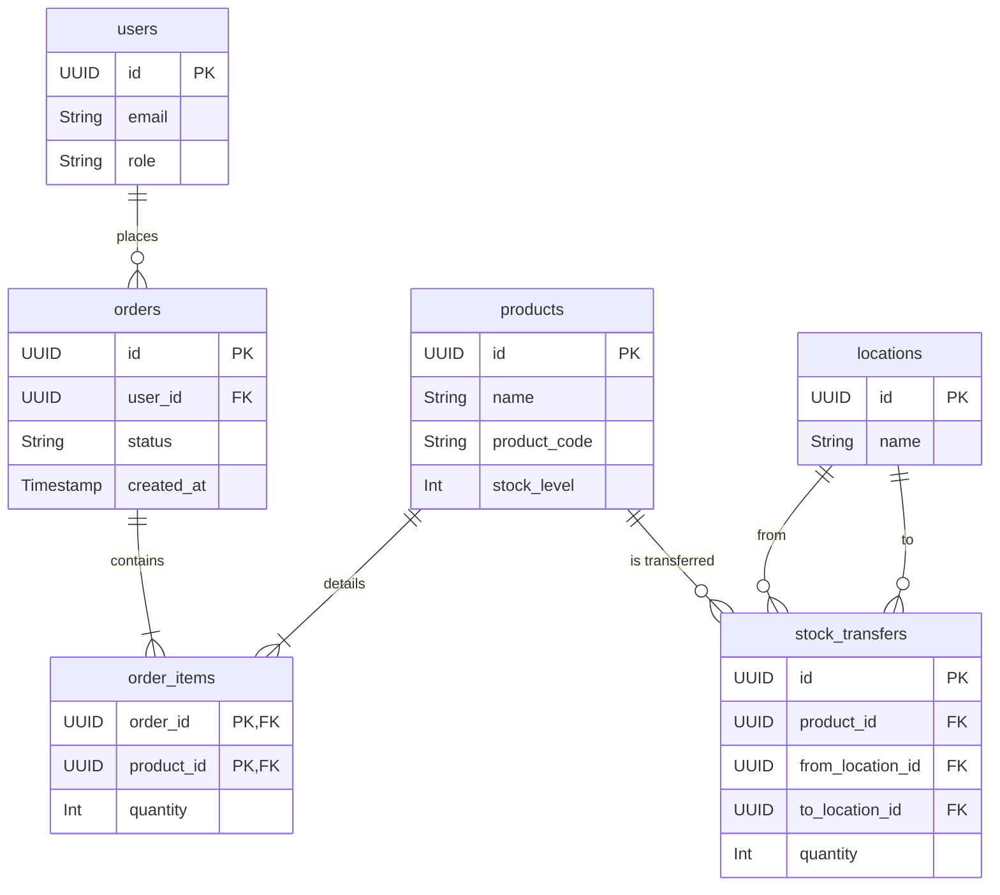

# 資料庫技術棧 (Database Technology Stack)

_最後更新日期: 2025-08-27 10:42:20_

## 核心配置

- **供應商**: Supabase 2.49.8 (PostgreSQL)
- **表格數量**: 23個表 (public schema)
- **關係**: 16個外鍵關係

## 數據庫架構

- **資料庫關係**: 23個表，16個外鍵關係
- **行級安全策略 (RLS)**: 109個RLS策略
- **驗證工具**: Supabase MCP 工具

## 核心資料表關係圖

