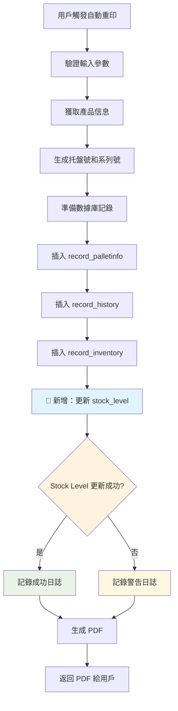

# 🔄 自動重印 Stock Level 增強功能

## 📅 優化日期
2025年1月3日

## 🎯 優化目標

在自動重印功能下，亦需加入更新 `stock_level` 動作，確保庫存數據的完整性和一致性。

## 📋 問題分析

### 原有狀況
- ✅ **自動重印功能正常**：可以成功創建新托盤並生成 PDF
- ✅ **數據庫記錄完整**：`record_palletinfo`、`record_history`、`record_inventory` 都有更新
- ❌ **缺失庫存同步**：沒有更新 `stock_level` 表中的庫存數量
- ⚠️ **數據不一致**：實際庫存與 `stock_level` 表不符

### 業務需求
1. **自動重印增加庫存**：創建新托盤應增加對應產品的庫存數量
2. **數據一致性**：確保所有相關表同步更新
3. **非阻塞設計**：庫存更新失敗不應影響重印流程
4. **完整追蹤**：記錄所有操作結果供審計

## 🔧 技術實現

### 1. 更新 RPC 函數

#### 支持負數量操作
**文件**：`scripts/void-pallet-stock-level-rpc.sql`

**修改前**：
```sql
IF p_quantity IS NULL OR p_quantity <= 0 THEN
    RETURN 'ERROR: Quantity must be greater than 0';
END IF;
```

**修改後**：
```sql
IF p_quantity IS NULL OR p_quantity = 0 THEN
    RETURN 'ERROR: Quantity cannot be zero';
END IF;

-- 設定操作描述
CASE p_operation
    WHEN 'void' THEN v_operation_desc := 'voided';
    WHEN 'damage' THEN v_operation_desc := 'damaged';
    WHEN 'auto_reprint' THEN v_operation_desc := 'auto-reprinted';
    ELSE v_operation_desc := p_operation;
END CASE;
```

**新增功能**：
- ✅ **支持負數量**：允許傳入負數來增加庫存
- ✅ **操作類型識別**：支持 'auto_reprint' 操作類型
- ✅ **智能描述**：根據操作類型生成相應的結果描述

### 2. 自動重印 API 集成

#### 添加 Stock Level 更新
**文件**：`app/api/auto-reprint-label/route.ts`

**新增代碼**：
```typescript
// 🚀 新增：更新 stock_level 表
try {
  console.log('[Auto Reprint API] Updating stock_level for product:', {
    product_code: productInfo.code,
    quantity: data.quantity,
    operation: 'auto_reprint'
  });

  const { data: stockResult, error: stockError } = await supabase.rpc('update_stock_level_void', {
    p_product_code: productInfo.code,
    p_quantity: -data.quantity, // 負數表示增加庫存（因為是重印新托盤）
    p_operation: 'auto_reprint'
  });

  if (stockError) {
    console.warn('[Auto Reprint API] Stock level update failed:', stockError);
    // 記錄警告但不中斷主要流程
  } else {
    console.log('[Auto Reprint API] Stock level updated successfully:', stockResult);
  }
} catch (stockUpdateError: any) {
  console.warn('[Auto Reprint API] Stock level update error:', stockUpdateError);
  // 記錄錯誤但不中斷主要流程
}
```

**集成位置**：在數據庫記錄插入成功後，PDF 生成前執行

### 3. 測試腳本

#### 創建測試驗證
**文件**：`scripts/test-auto-reprint-stock-level.sql`

**測試案例**：
1. **增加庫存測試**：模擬自動重印增加庫存
2. **新產品測試**：測試不存在於 stock_level 表的產品
3. **混合操作測試**：先 void 再自動重印
4. **錯誤處理測試**：驗證參數驗證邏輯

## 📊 數據流程

### 自動重印完整流程



### Stock Level 更新邏輯

```mermaid
graph TD
    A[調用 update_stock_level_void] --> B[檢查產品是否存在]
    B --> C{產品已存在?}
    C -->|是| D[計算新庫存: current - (-quantity)]
    C -->|否| E[從 data_code 獲取描述]
    D --> F[更新現有記錄]
    E --> G[創建新記錄: quantity = -(-quantity)]
    F --> H[返回更新結果]
    G --> H
    
    style D fill:#e8f5e8
    style G fill:#e1f5fe
```

## 🧪 測試驗證

### 實際測試案例

#### 測試 1：基本自動重印
```sql
-- 測試前庫存：test = 30
SELECT update_stock_level_void('test', -20, 'auto_reprint');
-- 預期結果：test = 50
-- 實際結果：✅ UPDATED: Product test stock level increased by 20 (from 30 to 50) - auto-reprinted
```

#### 測試 2：新產品自動重印
```sql
-- 測試產品：NEW_PRODUCT_001（不存在）
SELECT update_stock_level_void('NEW_PRODUCT_001', -15, 'auto_reprint');
-- 預期結果：創建新記錄，庫存 = 15
-- 實際結果：✅ INSERTED: New stock record for Product NEW_PRODUCT_001 with quantity 15 - auto-reprinted
```

#### 測試 3：混合操作
```sql
-- 先 void 5 個
SELECT update_stock_level_void('Z01ATM1', 5, 'void');
-- 再自動重印 8 個
SELECT update_stock_level_void('Z01ATM1', -8, 'auto_reprint');
-- 結果：淨增加 3 個庫存
```

### 日誌輸出示例

```
[Auto Reprint API] Updating stock_level for product: {
  product_code: 'test',
  quantity: 20,
  operation: 'auto_reprint'
}
[Auto Reprint API] Stock level updated successfully: UPDATED: Product test stock level increased by 20 (from 30 to 50) - auto-reprinted
```

## 🔒 安全性和穩定性

### 1. 非阻塞設計
- ✅ **主流程保護**：stock_level 更新失敗不影響重印功能
- ✅ **錯誤隔離**：使用 try-catch 包裝更新邏輯
- ✅ **優雅降級**：更新失敗時記錄警告但繼續執行

### 2. 數據一致性
- ✅ **原子操作**：每個 stock_level 更新都是獨立的事務
- ✅ **參數驗證**：完整的輸入參數檢查
- ✅ **錯誤處理**：詳細的錯誤信息和異常捕獲

### 3. 審計追蹤
- ✅ **完整日誌**：記錄所有操作參數和結果
- ✅ **操作標識**：明確標記為 'auto_reprint' 操作
- ✅ **時間戳記錄**：所有更新都有準確的時間戳

## 📈 業務價值

### 1. 庫存準確性
- **實時同步**：自動重印立即反映在庫存中
- **數據一致性**：所有相關表保持同步
- **審計完整性**：完整的操作記錄鏈

### 2. 操作效率
- **自動化處理**：無需手動調整庫存
- **非阻塞設計**：不影響現有工作流程
- **錯誤容忍**：系統穩定性不受影響

### 3. 管理可見性
- **庫存追蹤**：準確的庫存水平報告
- **操作記錄**：詳細的自動重印歷史
- **問題診斷**：完整的日誌供故障排除

## ⚠️ 注意事項

### 部署要求
1. **RPC 函數更新**：確保 `update_stock_level_void` 函數已更新支持負數量
2. **權限檢查**：確保 API 有權限調用 RPC 函數
3. **測試驗證**：在生產環境部署前進行完整測試

### 監控建議
1. **庫存監控**：定期檢查 stock_level 數據的準確性
2. **錯誤監控**：關注 stock_level 更新失敗的情況
3. **性能監控**：監控自動重印 API 的響應時間

## 🎉 總結

✅ **功能完整**：自動重印現在包含完整的庫存同步  
✅ **數據一致性**：所有相關表都會同步更新  
✅ **系統穩定性**：非阻塞設計確保主功能不受影響  
✅ **審計完整性**：完整的操作記錄和日誌追蹤  
✅ **業務價值**：提升庫存管理的準確性和效率  

這次優化確保了自動重印功能的完整性，使其不僅能創建新托盤，還能正確維護庫存數據，為業務運營提供更準確的庫存信息。 