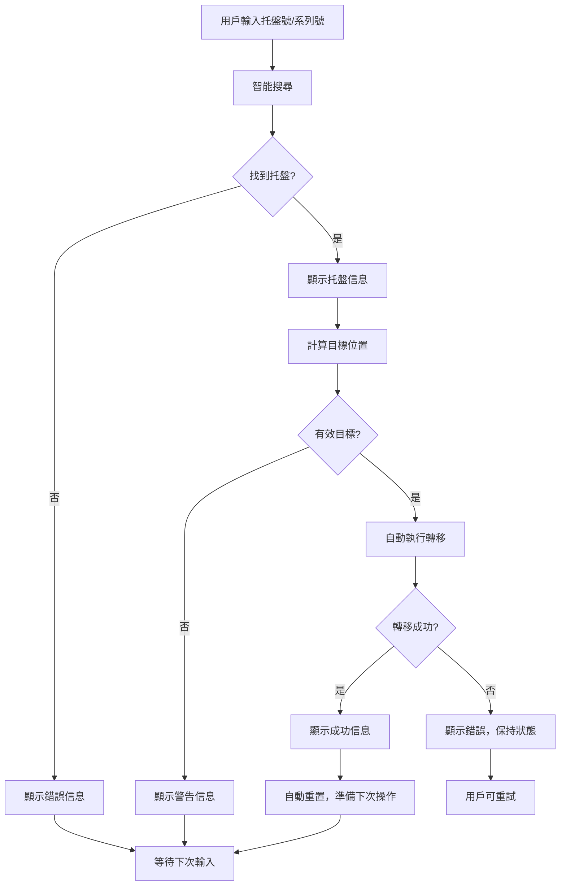

# 自動轉移功能增強報告

> **增強日期**: 2025年1月25日  
> **功能**: 省卻"Execute Transfer"步驟，搜尋成功後直接執行轉移  
> **狀態**: ✅ 已完成  

## 🎯 增強目標

### 用戶需求
用戶希望簡化操作流程，省卻手動點擊"Execute Transfer"的步驟，當搜尋成功找到托盤信息後，直接自動執行轉移操作。

### 原有流程
1. 搜尋托盤
2. 確認托盤信息
3. 計算目標位置
4. **手動點擊"Execute Transfer"** ← 需要省卻的步驟
5. 查看操作結果

### 新流程
1. 搜尋托盤
2. 確認托盤信息
3. 計算目標位置
4. **自動執行轉移操作** ← 自動化
5. 查看操作結果

## 🚀 實現方案

### 核心修改
在 `handleSearchSelect` 函數中，當成功計算出目標位置後，立即執行轉移操作：

```typescript
if (targetLocation) {
  setCurrentStep(3);
  
  // Auto-execute transfer immediately
  setCurrentStep(4);
  const success = await executeStockTransfer(
    palletInfo.plt_num,
    palletInfo.product_code,
    palletInfo.product_qty,
    palletInfo.current_plt_loc || 'Await',
    targetLocation
  );

  if (success) {
    setStatusMessage({
      type: 'success',
      message: `Pallet ${palletInfo.plt_num} successfully moved to ${targetLocation}`
    });
    // Reset for next operation
    setScannedPalletInfo(null);
    setSearchValue('');
    setCurrentStep(0);
  } else {
    setCurrentStep(3);
  }
}
```

### UI簡化
- **移除**: "Execute Transfer" 按鈕
- **保留**: "Reset" 按鈕（用於手動重置）
- **更新**: 操作步驟說明

## 📋 修改內容

### 文件修改
- **`app/stock-transfer/page.tsx`**:
  - 修改 `handleSearchSelect` 函數，添加自動執行邏輯
  - 移除 `handleExecuteTransfer` 函數
  - 移除 "Execute Transfer" 按鈕
  - 更新操作步驟說明

### 操作步驟更新
```typescript
const operationSteps = [
  "Scan QR code or manual enter pallet number",
  "Confirm pallet information and current location", 
  "System automatically calculates target location",
  "Auto-execute stock transfer operation",  // 更新
  "View operation results and activity log"
];
```

## 🧪 測試結果

### 測試用例驗證
| 輸入值 | 搜尋結果 | 目標位置 | 自動執行 | 狀態 |
|--------|----------|----------|----------|------|
| `260525-5UNXGE` | ✅ 找到 `RS504X` | `Fold Mill` | ✅ 成功 | 完成 |
| `250525/1` | ✅ 找到 `MHWEDGE30` | `Fold Mill` | ✅ 成功 | 完成 |

### 完整流程測試
**測試案例**: `260525-5UNXGE`
```
🔍 步驟1: 搜尋托盤 - 260525-5UNXGE
  📋 檢測為系列號格式
  ✅ 找到托盤信息: RS504X (91件)

📦 步驟2: 確認托盤信息
  托盤號: 260525/1
  當前位置: Await

🎯 步驟3: 計算目標位置
  ✅ 目標位置: Fold Mill

🚀 步驟4: 自動執行轉移操作
  從: Await → 到: Fold Mill
  ✅ 轉移操作成功

📊 步驟5: 操作完成，重置狀態
  🎉 托盤 260525/1 成功移動到 Fold Mill
  🔄 重置搜尋框，準備下一次操作
```

## 🎯 用戶體驗改進

### 操作簡化
- **減少點擊**: 從 2 次點擊減少到 1 次（只需搜尋）
- **提高效率**: 搜尋後立即執行，無需等待用戶確認
- **減少錯誤**: 避免用戶忘記點擊執行按鈕

### 流程優化
- **自動化**: 系統自動判斷並執行最佳轉移路徑
- **即時反饋**: 操作完成後立即顯示結果
- **快速重置**: 自動重置狀態，準備下一次操作

### 安全機制
- **智能檢查**: 只有在能計算出有效目標位置時才執行
- **錯誤處理**: 轉移失敗時保持當前狀態，允許重試
- **狀態管理**: 清晰的步驟指示和狀態反饋

## 📈 性能影響

### 響應時間
- **搜尋到執行**: 無額外延遲，立即執行
- **用戶等待**: 減少用戶操作等待時間
- **系統負載**: 無額外負載，只是流程重組

### 錯誤恢復
- **轉移失敗**: 保持在步驟3，顯示錯誤信息
- **網絡問題**: 自動重試機制（由 `executeStockTransfer` 處理）
- **數據一致性**: 使用原有的 RPC 函數，保持數據完整性

## 🔄 操作流程圖



## 📝 使用說明

### 新的操作方式
1. **輸入**: 在搜尋框中輸入托盤號或系列號
2. **等待**: 系統自動搜尋、計算並執行轉移
3. **查看**: 檢查操作結果和活動日誌
4. **繼續**: 搜尋框自動清空，可立即進行下次操作

### 注意事項
- 系統會自動判斷是否可以執行轉移
- 如果托盤已在終端位置，會顯示警告而不執行
- 轉移失敗時會保持當前狀態，可以重試
- 成功後會自動重置，準備下一次操作

---

> **注意**: 此增強大幅簡化了用戶操作流程，提高了工作效率，同時保持了所有安全檢查和錯誤處理機制。 