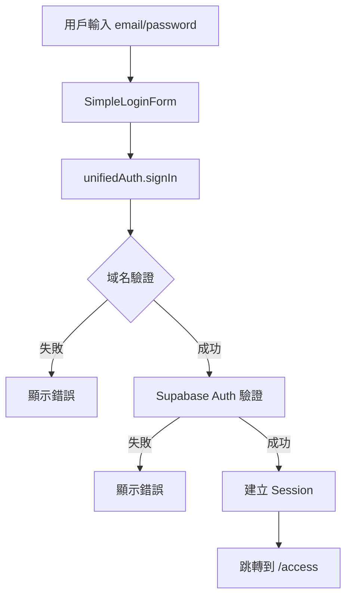
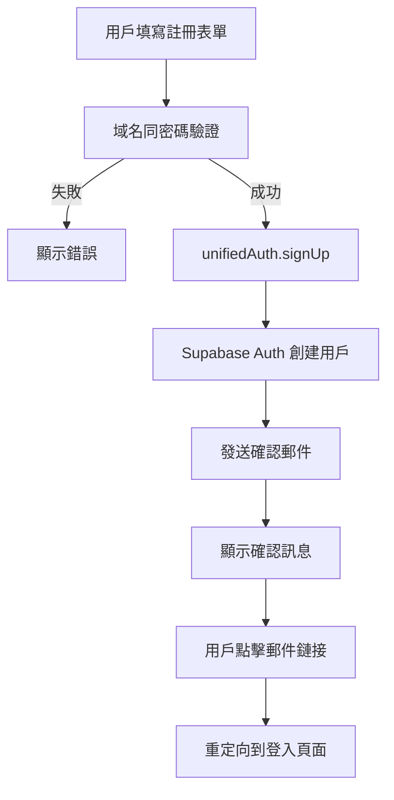
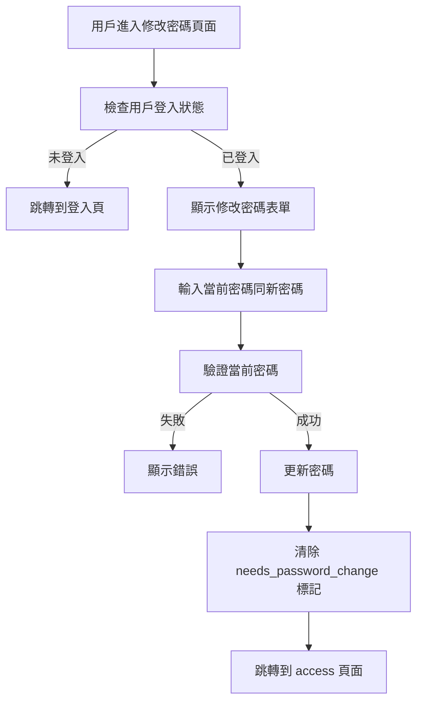

# 認證系統技術文檔

## 目錄
1. [系統概述](#系統概述)
2. [頁面架構](#頁面架構)
3. [數據流向 (Dataflow)](#數據流向-dataflow)
4. [技術棧](#技術棧)
5. [主要組件](#主要組件)
6. [Server Actions](#server-actions)
7. [認證邏輯](#認證邏輯)
8. [錯誤處理](#錯誤處理)
9. [安全機制](#安全機制)
10. [文件結構](#文件結構)

## 系統概述

NewPennine 認證系統採用統一嘅認證架構，整合 Supabase Auth 同傳統數據庫認證，提供安全、可靠嘅用戶認證體驗。系統支援：

- 統一登入入口 (`/main-login`)
- 用戶註冊同電郵確認
- 密碼重設流程
- 密碼修改功能
- 首次登入強制修改密碼
- 域名限制 (只允許 @pennineindustries.com)

## 頁面架構

### 1. 主登入頁面 (`/main-login`)
- **位置**: `app/main-login/page.tsx`
- **功能**: 統一登入入口
- **特點**:
  - 現代化 UI 設計，配有動畫效果
  - 支援電郵確認後重定向
  - 強制清理舊版認證數據
  - Starfield 背景效果

### 2. 註冊頁面 (`/main-login/register`)
- **位置**: `app/main-login/register/page.tsx`
- **功能**: 新用戶註冊
- **特點**:
  - 域名驗證
  - 密碼強度檢查
  - 電郵確認流程
  - 註冊成功後顯示確認訊息

### 3. 密碼重設頁面 (`/main-login/reset`)
- **位置**: `app/main-login/reset/page.tsx`
- **功能**: 忘記密碼重設請求
- **特點**:
  - 簡化版本，暫時只顯示成功訊息
  - 域名驗證

### 4. 修改密碼頁面 (`/main-login/change`)
- **位置**: `app/main-login/change/page.tsx`
- **功能**: 已登入用戶修改密碼
- **特點**:
  - 需要驗證當前密碼
  - 密碼強度驗證
  - 成功後自動跳轉

### 5. 修改密碼頁面 (`/change-password`)
- **位置**: `app/change-password/page.tsx`
- **功能**: 使用 Server Action 修改密碼
- **特點**:
  - 使用 `useFormState` 處理表單狀態
  - Server-side 密碼更新
  - 成功後重定向到 dashboard

### 6. 新密碼設置頁面 (`/new-password`)
- **位置**: `app/new-password/page.tsx`
- **功能**: 通過 URL 參數設置新密碼
- **特點**:
  - 從 URL 獲取 userId
  - 使用 bcrypt 加密密碼
  - 更新 data_id 表
  - 記錄到 history

## 數據流向 (Dataflow)

### 登入流程


### 註冊流程


### 密碼修改流程


## 技術棧

### 前端技術
- **React 18**: 使用 hooks 同 functional components
- **Next.js 14**: App Router, Server Components, Server Actions
- **TypeScript**: 類型安全
- **Tailwind CSS**: 樣式系統
- **Framer Motion**: 動畫效果
- **shadcn/ui**: UI 組件庫
- **React Hook Form**: 表單處理 (部分頁面)
- **Sonner**: Toast 通知

### 後端技術
- **Supabase Auth**: 主要認證服務
- **PostgreSQL**: 用戶數據存儲 (data_id 表)
- **bcryptjs**: 密碼加密
- **Server Actions**: 服務器端邏輯處理

### 狀態管理
- **React useState**: 本地狀態管理
- **useFormState**: Server Action 表單狀態
- **Supabase Auth Session**: 全局認證狀態

## 主要組件

### 1. SimpleLoginForm
- **位置**: `app/main-login/components/SimpleLoginForm.tsx`
- **功能**: 統一登入表單組件
- **特點**:
  - 動畫效果
  - 錯誤處理
  - Loading 狀態
  - 域名驗證

### 2. ChangePasswordForm
- **位置**: `app/main-login/components/ChangePasswordForm.tsx`
- **功能**: 密碼修改表單
- **特點**:
  - 密碼顯示/隱藏切換
  - 實時驗證
  - 密碼強度檢查

### 3. PasswordValidator
- **位置**: `app/main-login/components/PasswordValidator.tsx`
- **功能**: 密碼驗證規則
- **規則**:
  - 最少 6 個字符
  - 只允許字母同數字

### 4. SecurityMonitor
- **位置**: `app/main-login/components/SecurityMonitor.tsx`
- **功能**: 安全監控組件

## Server Actions

### 1. updateUserPasswordInDbAction
- **位置**: `app/change-password/actions.ts`
- **功能**: 更新用戶密碼
- **流程**:
  1. 驗證新密碼同確認密碼
  2. 獲取當前用戶 session
  3. 調用 `updatePasswordWithSupabaseAuth`
  4. 重新驗證路徑
  5. 返回成功/錯誤狀態

### 2. resetPasswordAction
- **位置**: `app/new-password/actions.ts`
- **功能**: 重設用戶密碼
- **流程**:
  1. 驗證 userId 同新密碼
  2. 使用 bcrypt 加密密碼
  3. 更新 data_id 表
  4. 記錄到 record_history
  5. 返回操作結果

## 認證邏輯

### UnifiedAuth 類 (`app/main-login/utils/unified-auth.ts`)
統一認證客戶端，處理所有認證相關操作：

```typescript
class UnifiedAuth {
  // 登入
  async signIn(email: string, password: string)
  
  // 註冊
  async signUp(email: string, password: string)
  
  // 登出
  async signOut()
  
  // 獲取當前用戶
  async getCurrentUser()
  
  // 檢查 session 是否過期
  isSessionExpiringSoon(): boolean
  
  // 獲取安全配置
  getSecurityInfo()
}
```

### Supabase Auth 整合 (`app/services/supabaseAuth.ts`)
處理 Supabase Auth 相關操作：

- `userExistsInSupabaseAuth`: 檢查用戶是否存在
- `migrateUserToSupabaseAuth`: 遷移舊用戶到 Supabase Auth
- `signInWithSupabaseAuth`: 使用 Supabase Auth 登入
- `updatePasswordWithSupabaseAuth`: 更新密碼

### 傳統認證 (`app/services/auth.ts`)
處理傳統 data_id 表認證：

- `authenticateUser`: 驗證用戶憑證
- 支援首次登入檢測
- 支援臨時登入 (密碼重設請求)

## 錯誤處理

### 統一錯誤訊息
- 域名錯誤: "Only @pennineindustries.com email addresses are allowed"
- 密碼長度: "Password must be at least 6 characters"
- 密碼格式: "Password must contain only letters and numbers"
- 密碼不匹配: "Passwords do not match"
- 登入失敗: "Invalid login credentials"

### 錯誤處理策略
1. **前端驗證**: 即時反饋，減少服務器請求
2. **後端驗證**: 確保數據安全性
3. **用戶友好訊息**: 清晰指示錯誤原因
4. **日誌記錄**: 開發環境詳細日誌

## 安全機制

### 1. 域名限制
- 只允許 @pennineindustries.com 郵箱
- 前後端雙重驗證

### 2. 密碼安全
- bcrypt 加密存儲
- 最少 6 字符要求
- 只允許字母數字組合
- 首次登入強制修改

### 3. Session 管理
- Supabase Auth 自動 token 管理
- 安全存儲配置
- Session 過期檢測
- 域名驗證標記

### 4. 清理機制
- 自動清理過期數據
- 舊版認證數據清理
- LocalStorage 安全存儲

## 文件結構

```
app/
├── main-login/
│   ├── page.tsx                    # 主登入頁面
│   ├── register/
│   │   └── page.tsx               # 註冊頁面
│   ├── reset/
│   │   └── page.tsx               # 密碼重設頁面
│   ├── change/
│   │   └── page.tsx               # 修改密碼頁面
│   ├── components/
│   │   ├── SimpleLoginForm.tsx    # 登入表單
│   │   ├── ChangePasswordForm.tsx # 修改密碼表單
│   │   ├── PasswordValidator.tsx  # 密碼驗證器
│   │   ├── EmailValidator.tsx     # 郵箱驗證器
│   │   ├── RegisterForm.tsx       # 註冊表單
│   │   ├── ResetForm.tsx          # 重設表單
│   │   └── SecurityMonitor.tsx    # 安全監控
│   └── utils/
│       ├── unified-auth.ts        # 統一認證客戶端
│       ├── supabase.ts           # Supabase 客戶端
│       ├── supabase-client.ts    # Supabase 客戶端工廠
│       ├── auth-config.ts        # 認證配置
│       └── cleanup-legacy-auth.ts # 清理舊版認證
├── change-password/
│   ├── page.tsx                   # 修改密碼頁面 (Server Action)
│   └── actions.ts                 # Server Actions
├── new-password/
│   ├── page.tsx                   # 新密碼設置頁面
│   └── actions.ts                 # Server Actions
├── services/
│   ├── auth.ts                    # 傳統認證服務
│   └── supabaseAuth.ts           # Supabase 認證服務
├── hooks/
│   └── useAuth.ts                # 認證 Hook
└── utils/
    ├── authUtils.ts              # 認證工具函數
    └── supabase/
        ├── client.ts             # 客戶端 Supabase
        └── server.ts             # 服務端 Supabase
```

## 相關配置

### 環境變量
```env
NEXT_PUBLIC_SUPABASE_URL=<supabase_url>
NEXT_PUBLIC_SUPABASE_ANON_KEY=<anon_key>
SUPABASE_SERVICE_ROLE_KEY=<service_role_key>
```

### TypeScript 類型
主要類型定義分散喺各個文件：
- `UserData`: 用戶數據結構
- `AuthState`: 認證狀態
- `UserRole`: 用戶角色
- `ChangePasswordActionResult`: Server Action 結果

## 注意事項

1. **開發環境清理**: 可通過 URL 參數 `?cleanup=force` 強制清理認證數據
2. **電郵確認**: 註冊後需要點擊郵件鏈接確認
3. **首次登入**: 使用 clock number 作為初始密碼
4. **權限系統**: 基於 department 同 position 的角色權限控制
5. **向後兼容**: 支援舊版 data_id 表認證同 Supabase Auth 並存