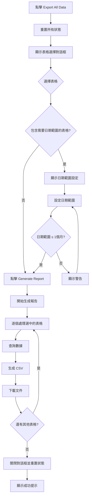

# Export All Data 功能實裝文檔

> **實裝日期**: 2025年1月25日  
> **功能狀態**: ✅ 已完成  
> **位置**: Admin Panel > Export Reports > Export All Data  
> **最後更新**: 2025年1月25日 - 界面語言改為英文，修正界面重置問題

## 📋 功能概述

Export All Data 功能允許用戶從下拉選單中選擇多個數據庫表格，並以 CSV 格式批量導出數據。此功能取代了原有的 Export Code List 和 Export Inventory Transaction 功能，提供更靈活和全面的數據導出解決方案。

## 🎯 主要特性

### 1. 表格選擇
用戶可以從以下表格中選擇要導出的數據：

| 表格名稱 | 對應 Supabase 表格 | 描述 | 特殊要求 |
|---------|-------------------|------|----------|
| **Pallet Information** | `record_palletinfo` | 托盤資訊記錄 | - |
| **Code List** | `data_code` | 產品代碼清單 | - |
| **Voided Inventory** | `report_void` | 作廢庫存記錄 | - |
| **Operation History** | `record_history` | 操作歷史記錄 | 🗓️ 需要日期範圍 |
| **Full Inventory** | `record_inventory` | 完整庫存記錄 | 🗓️ 需要日期範圍 |

### 2. 日期範圍限制
- **適用表格**: Operation History 和 Full Inventory
- **最大範圍**: 一個月（31天）
- **驗證機制**: 自動檢查日期範圍，超過限制時顯示警告
- **UI 提示**: 橙色標籤標示需要日期範圍的表格

### 3. 界面重置機制
- **打開對話框時**: 自動重置所有選擇狀態
- **關閉對話框時**: 清除所有輸入和選擇
- **成功生成報告後**: 自動關閉對話框並重置狀態
- **確保用戶體驗**: 每次操作都是全新的開始，不會顯示上一次的選擇

### 4. 智能排序
系統根據不同表格自動選擇最適合的排序欄位：

```typescript
// 排序邏輯
let sortField = 'id'; // 預設
if (tableName === 'record_palletinfo') {
  sortField = 'generate_time';
} else if (tableName === 'data_code') {
  sortField = 'code';
} else if (tableName === 'report_void') {
  sortField = 'time';
} else if (tableName === 'record_history') {
  sortField = 'time';
} else if (tableName === 'record_inventory') {
  sortField = 'latest_update';
}
```

### 5. 錯誤處理
- **排序失敗**: 自動回退到無排序查詢
- **表格無數據**: 顯示警告但繼續處理其他表格
- **查詢錯誤**: 記錄警告並跳過該表格

## 🎨 用戶界面設計

### 界面語言
- **主要語言**: 英文
- **標籤文字**: 
  - "Select Tables to Export"
  - "Requires Date Range"
  - "Date Range Settings"
  - "Start Date" / "End Date"
  - "Date range cannot exceed one month"

### 表格選擇界面
- **設計風格**: 深色主題，翠綠色漸層背景
- **交互元素**: 
  - 複選框選擇表格
  - 橙色標籤標示需要日期範圍的表格
  - 懸停效果和過渡動畫

### 日期範圍設定
- **觸發條件**: 選擇 Operation History 或 Full Inventory 時自動顯示
- **視覺設計**: 橙色主題區塊，包含警告圖標和說明文字
- **驗證提示**: 即時檢查日期範圍，超過一個月時顯示 toast 警告

### 界面重置行為
```typescript
// 打開對話框時重置所有狀態
const handleReportClick = async (reportType: string) => {
  // Reset all states first
  setSelectedTables([]);
  setNeedsDateRange(false);
  setStartDate('');
  setEndDate('');
  setSelectedAcoOrder('');
  setSelectedGrnRef('');
  setAvailableAcoOrders([]);
  setAvailableGrnRefs([]);
  
  setCurrentReportType(reportType);
  setShowReportDialog(true);
  // ...
};
```

### 文件命名規則
```
{表格名稱}_{開始日期}_to_{結束日期}_{當前日期}.csv
```

例如：
- `record_history_2025-01-01_to_2025-01-31_2025-01-25.csv`
- `data_code_2025-01-25.csv`

## 🔧 技術實現

### 核心函數
```typescript
const generateAllDataReport = async () => {
  try {
    for (const tableName of selectedTables) {
      // 1. 構建查詢
      let query = supabase.from(tableName).select('*');
      
      // 2. 添加日期範圍過濾
      if (needsDateRange && (tableName === 'record_history' || tableName === 'record_inventory')) {
        const timeField = tableName === 'record_history' ? 'time' : 'latest_update';
        query = query
          .gte(timeField, startDate)
          .lte(timeField, endDate + 'T23:59:59');
      }
      
      // 3. 執行查詢（含錯誤處理）
      // 4. 生成 CSV 內容
      // 5. 下載文件
    }
  } catch (error) {
    // 錯誤處理
  }
};
```

### 狀態管理
```typescript
// 新增的狀態變數
const [selectedTables, setSelectedTables] = useState<string[]>([]);
const [needsDateRange, setNeedsDateRange] = useState<boolean>(false);
```

### 界面重置邏輯
```typescript
// 關閉對話框時完全重置
const closeReportDialog = () => {
  setShowReportDialog(false);
  setCurrentReportType('');
  setSelectedAcoOrder('');
  setSelectedGrnRef('');
  setAvailableAcoOrders([]);
  setAvailableGrnRefs([]);
  setStartDate('');
  setEndDate('');
  // Reset All Data Export states
  setSelectedTables([]);
  setNeedsDateRange(false);
};
```

### CSV 生成邏輯
- **標頭處理**: 自動提取第一行數據的鍵作為 CSV 標頭
- **數據轉換**: 處理 null/undefined 值，轉義包含逗號的字符串
- **編碼**: 使用 UTF-8 編碼確保中文字符正確顯示

## 📊 功能流程



## 🚀 改進內容

### 移除的功能
- ❌ Export Code List（獨立功能）
- ❌ Export Inventory Transaction（獨立功能）

### 新增的功能
- ✅ 多表格選擇導出
- ✅ 智能日期範圍驗證
- ✅ 自適應排序邏輯
- ✅ 批量文件下載
- ✅ 錯誤恢復機制
- ✅ 完整的界面重置機制

### UI/UX 改進
- ✅ 現代化的深色主題設計
- ✅ 直觀的表格選擇界面
- ✅ 清晰的日期範圍提示
- ✅ 即時驗證和反饋
- ✅ 界面語言統一為英文
- ✅ 每次操作都是全新開始，無殘留狀態

## 📝 使用說明

### 基本操作
1. 在 Admin Panel 中點擊 "Export Reports" 類別
2. 選擇 "Export All Data"
3. 在對話框中勾選要導出的表格
4. 如果選擇了需要日期範圍的表格，設定開始和結束日期
5. 點擊 "Generate Report" 開始導出
6. 系統將自動下載選中表格的 CSV 文件
7. 對話框自動關閉並重置所有狀態

### 注意事項
- 📅 Operation History 和 Full Inventory 表格必須設定日期範圍
- ⏰ 日期範圍最多不能超過一個月
- 📁 每個表格會生成獨立的 CSV 文件
- 🔄 文件下載之間有 500ms 的延遲，避免瀏覽器阻擋
- 🔄 每次打開對話框都是全新狀態，不會顯示上一次的選擇

## 🔍 測試建議

### 功能測試
- [ ] 選擇單個表格導出
- [ ] 選擇多個表格批量導出
- [ ] 測試日期範圍驗證（超過一個月）
- [ ] 測試空數據表格的處理
- [ ] 測試網絡錯誤的處理
- [ ] 測試界面重置功能（打開/關閉對話框）
- [ ] 測試成功生成報告後的狀態重置

### UI 測試
- [ ] 表格選擇的視覺反饋
- [ ] 日期範圍區塊的顯示/隱藏
- [ ] 響應式設計在不同屏幕尺寸下的表現
- [ ] 深色主題的一致性
- [ ] 英文界面文字的正確性
- [ ] 界面重置的完整性

## 📈 未來擴展

### 可能的改進方向
1. **文件格式支持**: 添加 Excel (.xlsx) 格式導出
2. **數據預覽**: 在導出前提供數據預覽功能
3. **自定義欄位**: 允許用戶選擇要導出的特定欄位
4. **排程導出**: 支持定時自動導出功能
5. **壓縮下載**: 多個文件打包為 ZIP 下載

### 性能優化
1. **分頁查詢**: 對大數據量表格實施分頁查詢
2. **後台處理**: 將大型導出任務移至後台處理
3. **進度指示**: 添加導出進度條顯示

---

> **開發者**: Assistant  
> **審核者**: 待定  
> **版本**: 1.1.0  
> **最後更新**: 2025年1月25日 