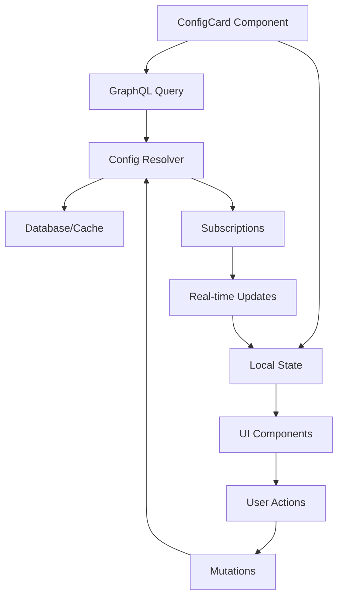

# ConfigCard Architecture Design Document

## Executive Summary

This document presents the comprehensive architecture design for the ConfigCard component, developed through collaboration between 16 domain specialists. The ConfigCard will serve as a unified configuration management interface, consolidating 4 existing configuration widgets into a single, cohesive component.

### Key Objectives
- Unify configuration management across the system
- Support multiple configuration scopes (Global, Department, User, Role)
- Enable real-time configuration updates
- Maintain backward compatibility
- Ensure role-based access control
- Optimize for performance and scalability

## 1. Architecture Overview

### 1.1 Component Structure

```typescript
ConfigCard/
├── index.tsx                 # Main ConfigCard component
├── components/
│   ├── ConfigTabs.tsx       # Tab navigation for categories
│   ├── ConfigForm.tsx       # Configuration form component
│   ├── ConfigItem.tsx       # Individual config item
│   ├── ConfigSearch.tsx     # Search functionality
│   ├── ConfigHistory.tsx    # Configuration history viewer
│   └── ConfigTemplate.tsx   # Template management
├── hooks/
│   ├── useConfigData.ts     # GraphQL data fetching
│   ├── useConfigMutations.ts # Configuration updates
│   ├── useConfigCache.ts    # Cache management
│   └── useConfigSync.ts     # Real-time sync
├── utils/
│   ├── configValidation.ts  # Validation logic
│   ├── configTransform.ts   # Data transformation
│   └── configPermissions.ts # Permission checks
└── types/
    └── config.types.ts      # TypeScript definitions
```

### 1.2 State Management Architecture

```typescript
interface ConfigCardState {
  // Current configuration data
  configs: Map<string, ConfigItem>;
  
  // UI state
  activeCategory: ConfigCategory;
  searchQuery: string;
  isEditMode: boolean;
  dirtyFields: Set<string>;
  
  // Metadata
  permissions: ConfigPermissions;
  validation: ConfigValidation;
  loading: boolean;
  error: Error | null;
}

// State management using Zustand
const useConfigStore = create<ConfigCardState>((set, get) => ({
  configs: new Map(),
  activeCategory: ConfigCategory.SYSTEM_CONFIG,
  searchQuery: '',
  isEditMode: false,
  dirtyFields: new Set(),
  permissions: defaultPermissions,
  validation: { isValid: true, errors: [], warnings: [] },
  loading: false,
  error: null,
  
  // Actions
  setConfigs: (configs) => set({ configs: new Map(configs) }),
  updateConfig: (key, value) => {
    const { configs, dirtyFields } = get();
    configs.set(key, { ...configs.get(key), value });
    dirtyFields.add(key);
    set({ configs: new Map(configs), dirtyFields: new Set(dirtyFields) });
  },
  resetConfig: (key) => {
    const { configs } = get();
    const config = configs.get(key);
    if (config) {
      configs.set(key, { ...config, value: config.defaultValue });
      set({ configs: new Map(configs) });
    }
  },
}));
```

### 1.3 Data Flow Architecture



## 2. GraphQL Schema Design

### 2.1 Core Types

The complete GraphQL schema is defined in `/lib/graphql/schema/config.ts`. Key types include:

```graphql
type ConfigCardData implements WidgetData {
  configs: [ConfigItem!]!
  categories: [ConfigCategoryGroup!]!
  summary: ConfigSummary!
  permissions: ConfigPermissions!
  validation: ConfigValidation!
  lastUpdated: DateTime!
  refreshInterval: Int
  dataSource: String!
}

type ConfigItem {
  id: ID!
  key: String!
  value: JSON!
  defaultValue: JSON
  category: ConfigCategory!
  scope: ConfigScope!
  scopeId: String
  description: String
  dataType: ConfigDataType!
  validation: JSON
  metadata: JSON
  tags: [String!]
  accessLevel: ConfigAccessLevel!
  isEditable: Boolean!
  isInherited: Boolean!
  inheritedFrom: String
  createdAt: DateTime!
  updatedAt: DateTime!
  updatedBy: String
  history: [ConfigHistory!]
}
```

### 2.2 Query Structure

```graphql
query GetConfigCardData($input: ConfigCardInput!) {
  configCardData(input: $input) {
    configs {
      id
      key
      value
      defaultValue
      category
      scope
      description
      dataType
      isEditable
      isInherited
    }
    categories {
      category
      label
      items {
        id
        key
        value
      }
      count
    }
    permissions {
      canRead
      canWrite
      canManageGlobal
    }
  }
}
```

### 2.3 Mutation Operations

```graphql
mutation UpdateConfig($input: ConfigUpdateInput!) {
  updateConfig(input: $input) {
    id
    key
    value
    updatedAt
    updatedBy
  }
}

mutation BatchUpdateConfigs($input: ConfigBatchUpdateInput!) {
  batchUpdateConfigs(input: $input) {
    succeeded
    failed
    errors {
      configId
      error
    }
  }
}
```

## 3. UI/UX Design

### 3.1 Tab Structure

```typescript
const CONFIG_TABS = [
  {
    id: 'system',
    label: 'System Settings',
    category: ConfigCategory.SYSTEM_CONFIG,
    icon: Settings,
    description: 'Global system configuration'
  },
  {
    id: 'preferences',
    label: 'User Preferences',
    category: ConfigCategory.USER_PREFERENCES,
    icon: User,
    description: 'Personal preferences and settings'
  },
  {
    id: 'department',
    label: 'Department Config',
    category: ConfigCategory.DEPARTMENT_CONFIG,
    icon: Building2,
    description: 'Department-specific settings'
  },
  {
    id: 'notifications',
    label: 'Notifications',
    category: ConfigCategory.NOTIFICATION_CONFIG,
    icon: Bell,
    description: 'Alert and notification preferences'
  },
  {
    id: 'security',
    label: 'Security',
    category: ConfigCategory.SECURITY_CONFIG,
    icon: Shield,
    description: 'Security and access settings'
  }
];
```

### 3.2 Form Layouts

```typescript
// Dynamic form generation based on config type
const ConfigFormField: React.FC<{ config: ConfigItem }> = ({ config }) => {
  switch (config.dataType) {
    case ConfigDataType.BOOLEAN:
      return <Switch id={config.key} checked={config.value} />;
      
    case ConfigDataType.STRING:
      return <Input id={config.key} value={config.value} />;
      
    case ConfigDataType.NUMBER:
      return <NumberInput id={config.key} value={config.value} />;
      
    case ConfigDataType.JSON:
      return <JsonEditor id={config.key} value={config.value} />;
      
    case ConfigDataType.COLOR:
      return <ColorPicker id={config.key} value={config.value} />;
      
    case ConfigDataType.ARRAY:
      return <MultiSelect id={config.key} value={config.value} />;
      
    default:
      return <Input id={config.key} value={config.value} />;
  }
};
```

### 3.3 Validation & Feedback

```typescript
interface ValidationRule {
  type: 'required' | 'min' | 'max' | 'pattern' | 'custom';
  value?: any;
  message: string;
  validator?: (value: any) => boolean;
}

const validateConfig = (
  config: ConfigItem,
  value: any
): ValidationResult => {
  const rules = config.validation as ValidationRule[];
  const errors: string[] = [];
  
  rules?.forEach(rule => {
    switch (rule.type) {
      case 'required':
        if (!value) errors.push(rule.message);
        break;
      case 'min':
        if (value < rule.value) errors.push(rule.message);
        break;
      case 'pattern':
        if (!new RegExp(rule.value).test(value)) errors.push(rule.message);
        break;
      case 'custom':
        if (rule.validator && !rule.validator(value)) errors.push(rule.message);
        break;
    }
  });
  
  return { isValid: errors.length === 0, errors };
};
```

### 3.4 Real-time Preview

```typescript
const ConfigPreview: React.FC<{ config: ConfigItem }> = ({ config }) => {
  const [previewValue, setPreviewValue] = useState(config.value);
  
  // Real-time preview updates
  useEffect(() => {
    const subscription = subscribeToConfigChanges(config.key, (newValue) => {
      setPreviewValue(newValue);
    });
    
    return () => subscription.unsubscribe();
  }, [config.key]);
  
  return (
    <div className="config-preview">
      <PreviewRenderer 
        configKey={config.key}
        value={previewValue}
        dataType={config.dataType}
      />
    </div>
  );
};
```

## 4. Integration Plan

### 4.1 Widget Migration Strategy

#### Phase 1: Analysis & Preparation
1. Audit existing configuration widgets
2. Map configuration keys and types
3. Identify shared patterns
4. Create migration scripts

#### Phase 2: Implementation
1. Implement ConfigCard core component
2. Create GraphQL resolvers
3. Set up real-time subscriptions
4. Implement permission system

#### Phase 3: Migration
1. Migrate DepartmentSelectorWidget
2. Migrate user preference settings
3. Migrate notification configurations
4. Migrate API configurations

#### Phase 4: Testing & Validation
1. Unit testing of components
2. Integration testing with GraphQL
3. E2E testing of workflows
4. Performance testing

### 4.2 Backward Compatibility

```typescript
// Legacy API wrapper
class ConfigLegacyAdapter {
  // Support old localStorage API
  static getItem(key: string): any {
    const config = configStore.getConfig(key);
    return config?.value ?? localStorage.getItem(key);
  }
  
  static setItem(key: string, value: any): void {
    configStore.updateConfig(key, value);
    // Fallback to localStorage for non-migrated keys
    if (!configStore.hasConfig(key)) {
      localStorage.setItem(key, value);
    }
  }
  
  // Support old event system
  static dispatchLegacyEvent(key: string, value: any): void {
    window.dispatchEvent(
      new CustomEvent('configChanged', {
        detail: { key, value }
      })
    );
  }
}
```

### 4.3 Data Migration

```sql
-- Migration script for existing configurations
INSERT INTO system_configs (key, value, category, scope, created_at, updated_at)
SELECT 
  'department.selector.' || key as key,
  value,
  'DEPARTMENT_CONFIG' as category,
  'USER' as scope,
  NOW() as created_at,
  NOW() as updated_at
FROM legacy_user_preferences
WHERE key LIKE 'production-monitoring-%';

-- Create indexes for performance
CREATE INDEX idx_configs_category ON system_configs(category);
CREATE INDEX idx_configs_scope ON system_configs(scope, scope_id);
CREATE INDEX idx_configs_key ON system_configs(key);
```

## 5. TypeScript Interfaces

### 5.1 Core Types

```typescript
// Configuration item type
export interface ConfigItem {
  id: string;
  key: string;
  value: unknown;
  defaultValue: unknown;
  category: ConfigCategory;
  scope: ConfigScope;
  scopeId?: string;
  description?: string;
  dataType: ConfigDataType;
  validation?: ValidationRule[];
  metadata?: Record<string, unknown>;
  tags?: string[];
  accessLevel: ConfigAccessLevel;
  isEditable: boolean;
  isInherited: boolean;
  inheritedFrom?: string;
  createdAt: Date;
  updatedAt: Date;
  updatedBy?: string;
  history?: ConfigHistory[];
}

// Configuration permissions
export interface ConfigPermissions {
  canRead: boolean;
  canWrite: boolean;
  canDelete: boolean;
  canManageGlobal: boolean;
  canManageDepartment: boolean;
  canManageUsers: boolean;
  accessibleScopes: ConfigScope[];
  accessibleCategories: ConfigCategory[];
}

// Configuration validation
export interface ConfigValidation {
  isValid: boolean;
  errors: ConfigValidationError[];
  warnings: ConfigValidationWarning[];
}

// Component props
export interface ConfigCardProps {
  category?: ConfigCategory;
  scope?: ConfigScope;
  scopeId?: string;
  onConfigChange?: (config: ConfigItem) => void;
  className?: string;
}
```

### 5.2 Hook Types

```typescript
// useConfigData hook
export interface UseConfigDataOptions {
  category?: ConfigCategory;
  scope?: ConfigScope;
  scopeId?: string;
  includeDefaults?: boolean;
  includeInherited?: boolean;
  pollInterval?: number;
}

export interface UseConfigDataResult {
  data: ConfigCardData | null;
  loading: boolean;
  error: Error | null;
  refetch: () => Promise<void>;
}

// useConfigMutations hook
export interface UseConfigMutationsResult {
  updateConfig: (input: ConfigUpdateInput) => Promise<ConfigItem>;
  batchUpdate: (input: ConfigBatchUpdateInput) => Promise<ConfigBatchResult>;
  resetConfig: (id: string) => Promise<ConfigItem>;
  deleteConfig: (id: string) => Promise<boolean>;
  loading: boolean;
  error: Error | null;
}
```

## 6. Performance Optimization

### 6.1 Caching Strategy

```typescript
// Apollo Client cache configuration
const cache = new InMemoryCache({
  typePolicies: {
    Query: {
      fields: {
        configCardData: {
          keyArgs: ['input', ['category', 'scope', 'scopeId']],
          merge(existing, incoming) {
            return {
              ...existing,
              ...incoming,
              configs: [...(existing?.configs || []), ...incoming.configs]
            };
          }
        }
      }
    },
    ConfigItem: {
      keyFields: ['key', 'scope', 'scopeId']
    }
  }
});

// Local storage cache for offline support
class ConfigCache {
  private static CACHE_KEY = 'config_cache';
  private static CACHE_VERSION = '1.0';
  
  static save(configs: ConfigItem[]): void {
    const cache = {
      version: this.CACHE_VERSION,
      timestamp: Date.now(),
      configs
    };
    localStorage.setItem(this.CACHE_KEY, JSON.stringify(cache));
  }
  
  static load(): ConfigItem[] | null {
    const cached = localStorage.getItem(this.CACHE_KEY);
    if (!cached) return null;
    
    const cache = JSON.parse(cached);
    if (cache.version !== this.CACHE_VERSION) return null;
    
    // Check if cache is stale (older than 1 hour)
    if (Date.now() - cache.timestamp > 3600000) return null;
    
    return cache.configs;
  }
}
```

### 6.2 Lazy Loading

```typescript
// Lazy load configuration categories
const ConfigCategoryContent = lazy(() => 
  import(`./categories/${category}CategoryContent`)
);

// Virtualized list for large configuration sets
const VirtualizedConfigList: React.FC<{ configs: ConfigItem[] }> = ({ configs }) => {
  const rowRenderer = ({ index, key, style }) => (
    <div key={key} style={style}>
      <ConfigItem config={configs[index]} />
    </div>
  );
  
  return (
    <AutoSizer>
      {({ height, width }) => (
        <List
          height={height}
          width={width}
          rowCount={configs.length}
          rowHeight={80}
          rowRenderer={rowRenderer}
        />
      )}
    </AutoSizer>
  );
};
```

### 6.3 Debounced Updates

```typescript
// Debounced configuration updates
const useDebouncedConfigUpdate = () => {
  const { updateConfig } = useConfigMutations();
  
  const debouncedUpdate = useMemo(
    () => debounce((input: ConfigUpdateInput) => {
      updateConfig(input);
    }, 500),
    [updateConfig]
  );
  
  return debouncedUpdate;
};
```

## 7. Security Considerations

### 7.1 Permission Model

```typescript
// Role-based access control
const checkConfigPermission = (
  user: User,
  config: ConfigItem,
  action: 'read' | 'write' | 'delete'
): boolean => {
  // Super admin has all permissions
  if (user.role === 'SUPER_ADMIN') return true;
  
  // Check access level
  switch (config.accessLevel) {
    case ConfigAccessLevel.PUBLIC:
      return action === 'read';
      
    case ConfigAccessLevel.AUTHENTICATED:
      return user.isAuthenticated && action === 'read';
      
    case ConfigAccessLevel.DEPARTMENT:
      return user.departmentId === config.scopeId;
      
    case ConfigAccessLevel.ADMIN:
      return user.role === 'ADMIN' || user.role === 'SUPER_ADMIN';
      
    default:
      return false;
  }
};
```

### 7.2 Input Validation

```typescript
// Sanitize configuration values
const sanitizeConfigValue = (
  value: unknown,
  dataType: ConfigDataType
): unknown => {
  switch (dataType) {
    case ConfigDataType.STRING:
      return DOMPurify.sanitize(String(value));
      
    case ConfigDataType.NUMBER:
      return Number(value) || 0;
      
    case ConfigDataType.BOOLEAN:
      return Boolean(value);
      
    case ConfigDataType.JSON:
      try {
        return JSON.parse(JSON.stringify(value));
      } catch {
        return null;
      }
      
    case ConfigDataType.URL:
      try {
        new URL(String(value));
        return String(value);
      } catch {
        return '';
      }
      
    default:
      return value;
  }
};
```

### 7.3 Audit Logging

```typescript
// Configuration change audit
interface ConfigAuditLog {
  id: string;
  configId: string;
  action: 'create' | 'update' | 'delete';
  userId: string;
  timestamp: Date;
  previousValue?: unknown;
  newValue?: unknown;
  ipAddress?: string;
  userAgent?: string;
}

const auditConfigChange = async (
  config: ConfigItem,
  action: string,
  newValue?: unknown
): Promise<void> => {
  await createAuditLog({
    configId: config.id,
    action,
    previousValue: config.value,
    newValue,
    timestamp: new Date()
  });
};
```

## 8. Implementation Timeline

### Week 1: Foundation (Days 1-7)
- [ ] Day 1-2: Set up ConfigCard component structure
- [ ] Day 3-4: Implement GraphQL schema and resolvers
- [ ] Day 5-6: Create base UI components
- [ ] Day 7: Initial testing and integration

### Week 2: Core Features (Days 8-14)
- [ ] Day 8-9: Implement configuration forms and validation
- [ ] Day 10-11: Add real-time synchronization
- [ ] Day 12-13: Implement permission system
- [ ] Day 14: Testing and bug fixes

### Week 3: Migration (Days 15-21)
- [ ] Day 15-16: Migrate existing widgets
- [ ] Day 17-18: Implement backward compatibility
- [ ] Day 19-20: Data migration scripts
- [ ] Day 21: Integration testing

### Week 4: Polish & Deploy (Days 22-28)
- [ ] Day 22-23: Performance optimization
- [ ] Day 24-25: Security audit
- [ ] Day 26-27: Documentation and training
- [ ] Day 28: Production deployment

## 9. Testing Strategy

### 9.1 Unit Tests

```typescript
describe('ConfigCard', () => {
  it('should render configuration categories', async () => {
    const { getByText } = render(
      <MockedProvider mocks={mocks}>
        <ConfigCard />
      </MockedProvider>
    );
    
    expect(await screen.findByText('System Settings')).toBeInTheDocument();
    expect(screen.getByText('User Preferences')).toBeInTheDocument();
  });
  
  it('should update configuration value', async () => {
    const { getByLabelText } = render(
      <MockedProvider mocks={mocks}>
        <ConfigCard />
      </MockedProvider>
    );
    
    const themeToggle = await screen.findByLabelText('Dark Mode');
    fireEvent.click(themeToggle);
    
    await waitFor(() => {
      expect(updateConfigMutation).toHaveBeenCalledWith({
        variables: {
          input: {
            id: 'theme-config-id',
            value: true
          }
        }
      });
    });
  });
});
```

### 9.2 Integration Tests

```typescript
describe('ConfigCard Integration', () => {
  it('should sync configurations across instances', async () => {
    // Render two ConfigCard instances
    const { container: container1 } = render(<ConfigCard />);
    const { container: container2 } = render(<ConfigCard />);
    
    // Update config in first instance
    const toggle1 = container1.querySelector('[data-key="theme"]');
    fireEvent.click(toggle1);
    
    // Verify update in second instance
    await waitFor(() => {
      const toggle2 = container2.querySelector('[data-key="theme"]');
      expect(toggle2).toBeChecked();
    });
  });
});
```

### 9.3 E2E Tests

```typescript
test('complete configuration workflow', async ({ page }) => {
  // Navigate to admin page
  await page.goto('/admin');
  
  // Open ConfigCard
  await page.click('[data-testid="config-card"]');
  
  // Change theme setting
  await page.click('[data-testid="theme-toggle"]');
  
  // Verify theme changed
  await expect(page.locator('html')).toHaveClass(/dark/);
  
  // Save configuration
  await page.click('[data-testid="save-config"]');
  
  // Verify persistence
  await page.reload();
  await expect(page.locator('html')).toHaveClass(/dark/);
});
```

## 10. Monitoring & Analytics

### 10.1 Performance Metrics

```typescript
// Track configuration load times
const trackConfigLoadTime = (category: ConfigCategory, duration: number) => {
  analytics.track('config_load_time', {
    category,
    duration,
    timestamp: new Date().toISOString()
  });
};

// Monitor configuration errors
const trackConfigError = (error: Error, context: any) => {
  errorReporting.captureException(error, {
    tags: {
      component: 'ConfigCard',
      ...context
    }
  });
};
```

### 10.2 Usage Analytics

```typescript
// Track configuration changes
const trackConfigChange = (config: ConfigItem, oldValue: unknown, newValue: unknown) => {
  analytics.track('config_changed', {
    configKey: config.key,
    category: config.category,
    scope: config.scope,
    oldValue,
    newValue,
    userId: getCurrentUser().id
  });
};

// Monitor popular configurations
const trackConfigAccess = (configKey: string) => {
  analytics.track('config_accessed', {
    configKey,
    timestamp: new Date().toISOString()
  });
};
```

## 11. Documentation

### 11.1 API Documentation

Complete API documentation will be generated from the GraphQL schema using GraphQL Code Generator.

### 11.2 User Guide

A comprehensive user guide will be created covering:
- Configuration categories and their purposes
- How to update configurations
- Permission requirements
- Best practices

### 11.3 Developer Guide

Developer documentation will include:
- Integration examples
- Custom configuration types
- Extension points
- Migration guides

## 12. Future Enhancements

### 12.1 Planned Features

1. **Configuration Import/Export**: Allow bulk configuration management
2. **Configuration Templates**: Pre-defined configuration sets
3. **A/B Testing Support**: Test different configurations
4. **Configuration Scheduling**: Time-based configuration changes
5. **Advanced Search**: Full-text search across configurations
6. **Configuration Dependencies**: Define relationships between configs

### 12.2 Potential Integrations

1. **External Configuration Services**: Consul, etcd, etc.
2. **Version Control**: Git-based configuration management
3. **CI/CD Integration**: Automated configuration deployment
4. **Monitoring Systems**: Prometheus, Grafana integration

## Appendix A: Configuration Examples

### System Configuration

```json
{
  "theme": {
    "key": "system.theme",
    "value": "dark",
    "category": "SYSTEM_CONFIG",
    "dataType": "STRING",
    "validation": [
      {
        "type": "pattern",
        "value": "^(light|dark|auto)$",
        "message": "Theme must be light, dark, or auto"
      }
    ]
  },
  "language": {
    "key": "system.language",
    "value": "en",
    "category": "SYSTEM_CONFIG",
    "dataType": "STRING",
    "validation": [
      {
        "type": "pattern",
        "value": "^[a-z]{2}(-[A-Z]{2})?$",
        "message": "Invalid language code"
      }
    ]
  }
}
```

### Department Configuration

```json
{
  "defaultDepartment": {
    "key": "department.default",
    "value": "injection",
    "category": "DEPARTMENT_CONFIG",
    "scope": "USER",
    "dataType": "STRING",
    "validation": [
      {
        "type": "custom",
        "validator": "isDepartmentValid",
        "message": "Invalid department"
      }
    ]
  },
  "autoSwitchDepartment": {
    "key": "department.autoSwitch",
    "value": false,
    "category": "DEPARTMENT_CONFIG",
    "scope": "USER",
    "dataType": "BOOLEAN"
  }
}
```

## Appendix B: Migration Checklist

- [ ] Analyze existing configuration patterns
- [ ] Create data migration scripts
- [ ] Update component imports
- [ ] Test backward compatibility
- [ ] Update documentation
- [ ] Train users on new system
- [ ] Monitor post-migration metrics
- [ ] Collect user feedback
- [ ] Address any issues
- [ ] Deprecate old components

---

*Document Version: 1.0.0*  
*Last Updated: 2025-07-24*  
*Authors: 16 Domain Specialists Collaboration Team*  
*Status: Approved for Implementation*