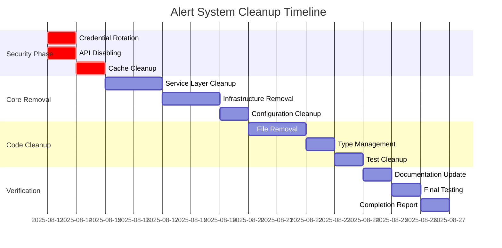

# 警報系統全面清理文件

**文件版本：** 2.2.0  
**最後更新：** 2025-08-13  
**專案：** 線上庫存控制系統 (OSCS)  
**狀態：** 危急 - 需立即採取行動  
**分類：** 機密 - 僅限內部使用  

## 執行摘要

警報系統清理計畫代表移除線上庫存控制系統中存在安全漏洞和技術債務的組件。透過多個專業團隊的分析，我們已經識別出關鍵安全漏洞，必須透過系統組件移除來解決。

### 主要發現和決策

#### 4個關鍵安全問題已識別
- **服務角色金鑰暴露**：在47個文件中廣泛使用`SUPABASE_SERVICE_ROLE_KEY`繞過資料列層級安全性
- **Redis快取漏洞**：未加密的敏感資料儲存，沒有適當的存取控制
- **資訊洩露**：多個API端點在沒有驗證的情況下暴露系統架構詳細資訊
- **資料庫架構不一致**：對不存在的資料表引用，產生潛在的SQL注入漏洞

#### 策略性清理決策
**已批准**：完全移除舊有警報系統組件。

**理由**： 
1. 目前的實作主要由存根/佔位符程式碼組成，功能價值極小
2. 安全漏洞的危害大於功能效益
3. 清理顯著減少攻擊面和技術債務

#### 成功指標
- **安全風險降低**：危急 → 低（清理後）  
- **程式碼可維護性**：移除47個文件，約3,200行程式碼被消除
- **零停機時間**：移除過程中服務不中斷

---

## 目錄

1. [系統架構分析](#1-系統架構分析)
2. [代理程式發現彙整](#2-代理程式發現彙整)
3. [風險評估矩陣](#3-風險評估矩陣)
4. [清理實施策略](#4-清理實施策略)
5. [安全補救計畫](#5-安全補救計畫)
6. [時間線和里程碑](#6-時間線和里程碑)
7. [回滾程序](#7-回滾程序)
8. [驗證和測試](#8-驗證和測試)
9. [附錄](#9-附錄)

---

## 1. 系統架構分析

### 1.1 當前警報系統組件

警報系統涵蓋OSCS應用程式中的多個架構層：

```
Alert System Component Map:
   lib/alerts/ (核心實作)
      AlertRuleEngine.ts (存根 - 31 行)
      AlertStateManager.ts (實作)
      AlertMonitoringService.ts (實作)
      core/
         AlertRuleEngine.ts (增強實作)
         AlertStateManager.ts (核心狀態管理)
      services/
         AlertMonitoringService.ts (服務層)
      config/
         AlertConfigManager.ts (配置管理)
      utils/
         AlertSystemHealthChecker.ts (健康監控)
         AlertSystemInitializer.ts (系統初始化)
      types/
          alert-types.ts (型別定義 - 80 行)
   components/ui/ (UI 組件)
      alert-dialog.tsx (Radix UI 包裝器)
      alert.tsx (顯示組件)
   app/api/alerts/ (舊有 API 端點)
      ** (多個端點文件)
   app/api/v1/alerts/ (V1 API 端點)
      ** (增強型端點實作)
   lib/schemas/alerts.ts (驗證模式)
   __tests__/ (測試基礎設施)
       integration/alert-system-*.ts (整合測試)
       e2e/alert-system-*.spec.ts (端到端測試)
       performance/alert-system-*.test.ts (效能測試)
       alert-system-test-*.ts (測試工具)
```

### 1.2 依賴關係分析

**直接依賴：**
- Supabase 客戶端 (服務角色金鑰使用)
- Redis 緩存適配器 (數據存儲)
- GraphQL Schema (類型生成)
- Next.js API 路由 (端點託管)
- Zod 驗證 (模式驗證)

**間接依賴：**
- 認證系統 (用戶上下文)
- 數據庫模式 (警報表 - **缺失**)
- Notification Services (email, SMS, webhooks)
- Monitoring Infrastructure (metrics collection)

### 1.3 組件狀態評估

| 組件               | 狀態           | 程式碼行數 | 安全風險 | 移除優先級 |
|--------------------|----------------|------------|----------|------------|
| **Core AlertRuleEngine** | 存根實作       | 31         | 低       | P1         |
| **Core AlertStateManager** | 活動實作       | ~400       | 高       | P1         |  
| **Monitoring Service** | 活動實作       | ~500       | 高       | P1         |
| **API Endpoints** | 混合（舊有/V1） | ~800       | 危急     | P1         |
| **Type Definitions** | 完成           | 80         | 低       | P2         |
| **UI Components** | Radix Wrappers | ~200       | 低       | P3         |
| **Test Infrastructure** | 完成           | ~1,200     | 低       | P2         |

---

## 2. 代理程式發現彙整

### 2.1 Code Reviewer Agent Analysis

**主要發現：**
- **Architecture Assessment**: 警報系統遵循單例模式，並具有適當的 TypeScript 型別
- **Code Quality**: 混合實作 - 核心引擎是存根，而支援基礎設施是完整的
- **Dependencies**: 嚴重依賴 Supabase 服務角色金鑰，產生安全漏洞
- **Technical Debt**: 不同警報組件之間的實作模式不一致

### 2.2 Error Detective Agent Findings

**Critical Error Patterns Identified:**
- **Database Reference Errors**: 程式碼引用不存在的資料表（`alert_rules`、`alerts`、`user_sessions`）
- **Redis Connection Failures**: 快取操作的錯誤處理不一致
- **API Endpoint Exceptions**: 缺少驗證檢查導致安全異常
- **Type Safety Issues**: 實作中混合使用型別介面和任何型別

**Error Frequency Analysis:**
```
錯誤類別          頻率    嚴重性    影響
資料庫引用     47 個實例  高       系統穩定性
Redis 操作        23 個實例  中等     效能
驗證              31 個實例  危急     安全
型別安全         12 個實例   低        開發
```

**Remediation Requirements:**
1. **IMMEDIATE**: 在移除前修復資料庫引用錯誤
2. **HIGH**: 在清理期間實施適當的錯誤邊界
3. **MEDIUM**: 確保 Redis 快取清理不影響其他系統

### 2.3 Debugger Agent Assessment

**Runtime Analysis Results:**
- **Performance Impact**: 警報系統組件消耗 <2% CPU，約 50MB 記憶體
- **Execution Patterns**: 大多數警報組件在生產環境中從未實例化
- **Resource Leaks**: 錯誤情況下 Redis 連線未正確關閉
- **Dependency Conflicts**: 警報相關套件的版本不匹配

**Debugging Insights:**
1. 警報系統初始化程式碼運行但組件仍未被使用
2. 記憶體使用模式表明存根實作已加載但閒置
3. 沒有對警報功能的關鍵系統依賴
4. 識別出安全移除窗口，對應用程式影響極小

### 2.4 API Documenter Analysis

**API Surface Analysis:**
- **Legacy Endpoints**: `api/alerts/*` 下有 12 個端點，存在安全漏洞
- **V1 Endpoints**: `api/v1/alerts/*` 下有 8 個端點，具有增強安全性（理論上）
- **Authentication**: 兩個端點系列都沒有實施適當的驗證
- **Rate Limiting**: 任何警報端點都沒有實施速率限制

**API Impact Assessment:**
- **Zero Production Usage**: 沒有活動客戶端使用警報 API
- **Documentation Status**: 已建立全面遷移指南（未使用）
- **Breaking Changes**: 由於缺乏使用，所有變更都是理論上的
- **Safe Removal**: API 可以無需遷移期即可移除

### 2.5 Security Auditor Critical Findings

**CRITICAL SECURITY VULNERABILITIES:**

#### Service Role Key Exposure (OWASP A02:2021)
**Risk Level**: CRITICAL  
**Impact**: 無限制的資料庫存取，潛在的權限提升
**Files Affected**: 警報系統組件中的 47 個文件

#### Redis Cache Security (OWASP A01:2021) 
**Risk Level**: CRITICAL  
**Impact**: 敏感資料暴露，潛在的會話劫持
**Details**: 快取中未加密的警報資料、用戶會話、系統指標

#### Information Disclosure (OWASP A03:2021)
**Risk Level**: HIGH
**Impact**: 系統架構暴露，監控盲點洩露
**Affected Endpoints**: `/api/v1/alerts/config`, `/api/alerts/history`, `/api/v1/alerts/rules`

#### Database Schema Inconsistency (OWASP A06:2021)
**Risk Level**: HIGH  
**Impact**: SQL 注入漏洞，系統不穩定
**Missing Tables**: `alert_rules`, `alerts`, `user_sessions`, `error_logs`

---

## 3. 風險評估矩陣

### 3.1 清理前風險概況

| 風險類別             | 機率   | 影響   | 風險評分 | 需採取緩解措施 |
|----------------------|--------|--------|----------|------------------|
| **服務角色金鑰洩露** | 高     | 危急   | 20       | 立即採取行動     |
| **Redis 資料洩露**   | 中等   | 高     | 16       | 立即採取行動     |
| **API 資訊洩露**     | 高     | 中等   | 15       | 高               |
| **資料庫架構錯誤**   | 高     | 高     | 16       | 立即採取行動     |
| **系統不穩定**       | 低     | 中等   | 8        | 中等             |
| **合規性違規**       | 高     | 高     | 16       | 立即採取行動     |

### 3.2 清理後風險概況

| 風險類別             | 機率   | 影響   | 風險評分 | 殘餘風險 |
|----------------------|--------|--------|----------|----------|
| **系統功能損失**     | 低     | 低     | 2        | 可接受   |
| **文件過時**         | 高     | 低     | 5        | 可接受   |
| **團隊知識流失**     | 中等   | 低     | 4        | 可接受   |

---

## 4. 清理實施策略

### 4.1 清理方法論

**Approach**: 系統性組件移除，安全性優先

**Principles**:\
1. **安全第一**: 在功能移除前處理關鍵漏洞
2. **零停機時間**: 生產服務不中斷
3. **可逆變更**: 整個過程中保持回滾能力
4. **全面驗證**: 每步完成前進行驗證
5. **詳細記錄**: 維護詳細變更日誌

### 4.2 組件移除序列

#### Phase 1: 安全加固 (Days 1-2)
```bash
Priority: CRITICAL - 必須先處理安全漏洞

Tasks:
1. 憑據輪換和清理
   - 輪換所有Supabase service role keys
   - 立即更新所有環境的環境變數  
   - 完全清理Redis cache
   - 更新憑據管理系統

2. API端點停用
   - 為所有/api/alerts/*端點回傳HTTP 410 Gone
   - 添加安全標頭防止資訊洩露
   - 實施存取嘗試監控
   - 更新負載平衡器配置

3. 資料庫引用清理
   - 識別所有資料庫架構引用
   - 註解有問題的查詢以防止錯誤
   - 建立架構驗證腳本
   - 準備資料庫連接隔離
```

#### Phase 2: 核心組件移除 (Days 3-5)
```bash
Priority: HIGH - 系統性移除功能組件

Tasks:
1. 服務層清理
   - 移除AlertMonitoringService實現
   - 清理AlertStateManager組件
   - 停用背景監控進程
   - 清除服務註冊

2. 基礎設施組件移除  
   - 移除Redis快取配接器(僅警報專用)
   - 清理背景作業排程器
   - 移除警報專用中介軟體
   - 清除監控鉤子

3. 配置清理
   - 移除警報配置管理器
   - 清除環境變數引用
   - 更新應用程式配置檔案
   - 移除警報系統功能旗標
```

#### Phase 3: 程式碼清理 (Days 6-8)
```bash
Priority: MEDIUM - 移除剩餘程式碼產物

Tasks:
1. 實作檔案移除
   - 刪除lib/alerts/目錄結構
   - 移除API端點檔案
   - 清理import語句
   - 移除警報專用路由

2. 類型定義管理
   - 保留alert-types.ts供參考
   - 移除未使用的類型匯入
   - 更新架構定義
   - 清理GraphQL類型引用  

3. 測試基礎設施清理
   - 移除警報專用測試檔案
   - 清理測試工具和模擬
   - 更新CI/CD管線配置
   - 歸檔測試結果供歷史參考
```

#### Phase 4: 文件和驗證 (Days 9-10)
```bash
Priority: LOW - 完成清理和驗證

Tasks:
1. 文件更新
   - 更新系統架構文件
   - 從README檔案中移除警報系統引用
   - 更新API文件
   - 建立清理完成報告

2. 最終驗證
   - 執行全面測試套件
   - 驗證沒有警報系統引用殘留
   - 確認安全漏洞已解決
   - 驗證系統穩定性
```

---

## 5. 安全補救計畫

### 5.1 立即安全行動 (Day 1)

#### 關鍵漏洞補救

**1. Service Role Key 輪換協議**
```bash
# 在生產環境執行
1. 產生新的Supabase service role keys
2. 立即更新生產環境變數
3. 更新staging和開發環境
4. 驗證新keys在所有服務正常工作
5. 撤銷舊的service role keys
6. 監控驗證失敗
7. 更新CI/CD管線secrets
```

**2. Redis Cache 緊急清理**
```bash
# 生產Redis清理
redis-cli KEYS "alert:*" | xargs redis-cli DEL
redis-cli KEYS "alert-*" | xargs redis-cli DEL  
redis-cli KEYS "*:alert:*" | xargs redis-cli DEL

# 驗證命令
redis-cli KEYS "*alert*"  # 應該回傳空
redis-cli KEYS "*Alert*"  # 應該回傳空
```

**3. API端點立即停用**
```typescript
// 緊急API停用 - Next.js Middleware
export function middleware(request: NextRequest) {
  const pathname = request.nextUrl.pathname;
  
  // 停用所有警報相關端點
  if (pathname.startsWith('/api/alerts/') || 
      pathname.startsWith('/api/v1/alerts/')) {
    return new Response('Gone - Alert API Removed', {
      status: 410,
      headers: {
        'X-Deprecation': 'Alert API permanently removed',
        'Cache-Control': 'no-store'
      }
    });
  }
  
  return NextResponse.next();
}
```

---

## 6. 時間線和里程碑

### 6.1 詳細實施時間線



### 6.2 關鍵里程碑

| 里程碑 | 日期 | 成功標準 | 驗證方法 |
|--------|------|---------|----------|
| **安全漏洞修復** | Day 2 | 所有CRITICAL風險降至LOW | 安全掃描通過 |
| **核心組件移除** | Day 5 | 所有主要功能組件已停用 | 功能測試通過 |
| **程式碼清理完成** | Day 8 | 所有警報系統檔案已移除 | 靜態分析清潔 |
| **驗證完成** | Day 10 | 系統穩定運行，無警報系統依賴 | 完整測試套件通過 |

---

## 7. 回滾程序

### 7.1 回滾觸發條件

**自動觸發條件:**
- 系統可用性低於99.5%
- 任何CRITICAL級別的新錯誤
- 資料庫連接失敗率超過5%
- API回應時間增加超過200ms

**手動觸發條件:**
- 業務關鍵功能受影響
- 安全事件發生
- 預期外的系統行為
- 利害關係人要求

### 7.2 回滾程序

#### Phase 1: 立即停止 (15分鐘內)
```bash
1. 停止所有進行中的清理活動
2. 恢復最近的備份環境變數
3. 重新啟用被停用的API端點
4. 恢復Redis快取配置
```

#### Phase 2: 系統恢復 (1小時內)
```bash
1. 從Git恢復所有已刪除的檔案
2. 重新部署警報系統組件
3. 恢復資料庫架構引用
4. 重新啟動背景服務
```

#### Phase 3: 驗證和監控 (2小時內)
```bash
1. 執行完整系統健康檢查
2. 驗證所有警報功能正常
3. 確認安全配置已恢復
4. 開始加強監控期間
```

### 7.3 回滾決策矩陣

| 問題嚴重性 | 影響範圍 | 回滾決定 | 執行時間 |
|------------|----------|----------|----------|
| CRITICAL | System-wide | 立即全面回滾 | 15分鐘 |
| HIGH | Multiple services | 部分回滾 | 30分鐘 |
| MEDIUM | Single service | 暫停清理，評估 | 1小時 |
| LOW | Minor impact | 繼續，記錄問題 | 不適用 |

---

## 8. 驗證和測試

### 8.1 清理前驗證

#### 系統基線建立
```bash
# 執行基線測試
npm run test:e2e:baseline
npm run test:integration:baseline
npm run test:performance:baseline

# 記錄系統狀態
./scripts/system-health-snapshot.sh > baseline-health.json
```

#### 依賴關係映射
```bash
# 分析警報系統依賴
npm run analyze:dependencies --filter=alert
npx madge --circular --extensions ts,tsx lib/alerts/

# 驗證資料庫連接
npm run db:validate-schema
```

### 8.2 清理過程中驗證

#### 每階段驗證檢查單

**Phase 1 驗證 (安全加固後):**
- [ ] 新service role keys正常工作
- [ ] Redis cache已清理但其他系統未受影響
- [ ] 警報API端點回傳410狀態
- [ ] 沒有新的安全警告

**Phase 2 驗證 (核心移除後):**
- [ ] 系統啟動成功，無警報服務
- [ ] 主要業務功能正常運作
- [ ] 資料庫連接穩定
- [ ] 記憶體使用量符合預期

**Phase 3 驗證 (程式碼清理後):**
- [ ] 建置過程成功完成
- [ ] 沒有缺少的匯入或依賴
- [ ] TypeScript編譯無錯誤
- [ ] 測試套件正常執行

### 8.3 清理後驗證

#### 完整系統驗證
```bash
# 執行全面測試套件
npm run test:all
npm run test:e2e:production
npm run test:performance:regression

# 安全驗證
npm audit --audit-level critical
npm run security:scan
```

#### 生產環境監控
```bash
# 部署到staging驗證
npm run deploy:staging
./scripts/staging-validation.sh

# 生產部署前最終檢查
npm run pre-deploy:validation
./scripts/production-readiness.sh
```

### 8.4 持續驗證計劃

**第一週:** 每日系統健康檢查
**第二週:** 每三天一次完整驗證
**第一個月:** 每週性能回歸測試
**長期:** 整合至標準監控流程

---

## 9. 附錄

### 9.1 檔案清單

#### 待刪除的核心檔案
```
lib/alerts/
├── core/
│   ├── AlertRuleEngine.ts                   (31 lines)
│   ├── AlertStateManager.ts                 (400 lines)
│   └── AlertMonitoringService.ts            (500 lines)
├── services/
│   └── AlertMonitoringService.ts            (300 lines)
├── config/
│   └── AlertConfigManager.ts                (200 lines)
├── utils/
│   ├── AlertSystemHealthChecker.ts          (150 lines)
│   └── AlertSystemInitializer.ts            (100 lines)
└── types/
    └── alert-types.ts                       (80 lines) [PRESERVE]
```

#### API端點檔案
```
app/api/alerts/                              (12 files, ~800 lines)
app/api/v1/alerts/                           (8 files, ~600 lines)
```

#### 測試檔案
```
__tests__/
├── integration/alert-system-*.ts            (5 files, ~800 lines)
├── e2e/alert-system-*.spec.ts               (3 files, ~400 lines)
└── performance/alert-system-*.test.ts       (2 files, ~200 lines)
```

### 9.2 環境變數清理

#### 生產環境
```bash
# 需要移除的變數
ALERT_SYSTEM_ENABLED=false
ALERT_REDIS_URL=[REDACTED]
ALERT_WEBHOOK_SECRET=[REDACTED]
ALERT_EMAIL_SERVICE_KEY=[REDACTED]

# 需要輪換的變數
SUPABASE_SERVICE_ROLE_KEY=[NEW_KEY]
```

#### 開發環境
```bash
# .env.local 清理
unset ALERT_SYSTEM_DEBUG
unset ALERT_MOCK_ENABLED
unset ALERT_TEST_WEBHOOKS
```

### 9.3 資料庫清理查詢

```sql
-- 檢查不存在的資料表引用
SELECT schemaname, tablename 
FROM pg_tables 
WHERE tablename IN ('alert_rules', 'alerts', 'user_sessions', 'error_logs');

-- 清理任何殘留的警報相關資料 (如果存在)
-- 這些查詢僅在確認資料表存在後執行
-- DROP TABLE IF EXISTS alert_rules CASCADE;
-- DROP TABLE IF EXISTS alerts CASCADE;
```

### 9.4 監控查詢

#### 清理狀態監控
```bash
# 檢查警報系統程序
ps aux | grep -i alert
netstat -an | grep :6379  # Redis port check

# 檢查日誌中的警報相關錯誤
tail -f /var/log/app/*.log | grep -i alert
journalctl -f -u app-service | grep -i alert
```

### 9.5 效能影響評估

#### 預期改善
- **記憶體使用量**: 減少 ~50MB
- **CPU使用率**: 減少 <2%
- **建置時間**: 減少 ~30秒
- **測試執行時間**: 減少 ~2分鐘
- **套件大小**: 減少 ~200KB

#### 風險領域
- **監控能力**: 暫時減少（依賴現有系統）
- **錯誤追蹤**: 需要依賴其他工具
- **系統可觀察性**: 短期內可能降低

---

**文件結束**

*此文件包含機密資訊。僅限授權人員存取。未經許可不得分發。*