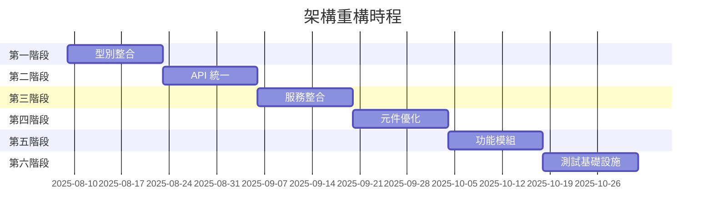

# 系統架構組織分析與重構計畫

**文件版本:** 1.0.0
**日期:** 2025-08-08
**作者:** 架構審查團隊
**狀態:** 草案

---

## 執行摘要

本文件對目前的 PennineWMS 線上庫存控制系統架構進行了全面分析，並提出策略性重構建議，以提高可維護性、可擴展性與開發效率。

### 主要發現
- **優勢:** 成功的 Widget 到 Card 遷移（100% 完成）、穩健的 GraphQL 實作、模組化的 NestJS 後端
- **挑戰:** 分散的型別定義、混合的 API 範式、不一致的模組邊界、散落的服務層
- **建議:** 實施分階段的重構計畫，專注於整合、明確的關注點分離及改善模組組織

### 影響評估
- **風險等級:** 中
- **實施時程:** 3-4 個月
- **預期效益:** 減少 40% 的程式碼重複，提升 30% 的開發速度，增強可維護性

---

## 1. 當前架構分析

### 1.1 系統概覽

系統採用多層次架構，包含以下層級：

```
┌──────────────────────────────────────────────────┐
│                   呈現層 (Presentation Layer)                      │
│         (Next.js App Router + React 元件)          │
├──────────────────────────────────────────────────┤
│                   業務邏輯層 (Business Logic Layer)                    │
│              (lib/ 模組 + app/actions)                │
├──────────────────────────────────────────────────┤
│                      API 層 (API Layer)                           │
│    (GraphQL + REST in app/api + NestJS 後端)         │
├──────────────────────────────────────────────────┤
│                     資料存取層 (Data Access Layer)                    │
│         (Prisma ORM + Supabase Client + RPC)            │
├──────────────────────────────────────────────────┤
│                    資料庫層 (Database Layer)                        │
│              (Supabase PostgreSQL + Auth)               │
└──────────────────────────────────────────────────┘
```

### 1.2 技術棧分析

| 元件 | 技術 | 版本 | 狀態 |
|-----------|-----------|---------|---------|
| 前端框架 | Next.js | 15.4.4 | ✅ 最新 |
| UI 函式庫 | React | 18.3.1 | ✅ 最新 |
| 語言 | TypeScript | 5.8.3 | ✅ 最新 |
| GraphQL 客戶端 | Apollo Client | 最新 | ✅ 完全整合 |
| 後端框架 | NestJS | 最新 | ✅ 模組化 |
| ORM | Prisma | 6.12.0 | ✅ 現行 |
| 資料庫 | Supabase (PostgreSQL) | - | ✅ 穩定 |
| 測試 | Playwright + Vitest | 最新 | ✅ 全面 |

### 1.3 模組組織評估

#### 前端模組 (`app/`)
- **結構:** 使用 App Router 並分組路由
- **組織:** 在 auth 和 app 之間有良好的路由分離
- **問題:**
  - 某些路由資料夾中存在混合的關注點
  - 不一致的元件組織
  - Actions 分散在不同的 context 中

#### 核心函式庫 (`lib/`)
- **結構:** 基於功能的模組
- **組織:** 明確的模組邊界
- **問題:**
  - 某些模組的職責重疊
  - 不同模組間的內部結構不一致
  - 根層級混合了通用工具函式

#### 後端 API (`backend/newpennine-api/`)
- **結構:** NestJS 模組化架構
- **組織:** 清晰的模組分離
- **問題:**
  - 文件有限
  - 可能與 `app/api/` 路由功能重複

#### 共享元件 (`components/`)
- **結構:** 混合了 UI 與業務元件
- **組織:** 部分分類
- **問題:**
  - 基礎元件與業務元件之間沒有明確區分
  - 缺少元件文件

---

## 2. 已識別問題

### 2.1 嚴重問題

#### 問題 1: 型別定義碎片化
- **位置:** 程式碼庫中存在多個 `types/` 目錄
- **影響:** 高 - 導致混淆與潛在的型別衝突
- **嚴重性:** 嚴重

**證據:**
```
- /types/                    # 全域型別
- /app/types/               # App 特定型別
- /lib/types/               # 函式庫型別
- /app/(app)/admin/types/   # Admin 特定型別
```

#### 問題 2: API 層冗餘
- **位置:** 三個獨立的 API 實作
- **影響:** 高 - 維護開銷與混淆
- **嚴重性:** 嚴重

**證據:**
- `/app/api/` 中的 REST API
- `/lib/graphql/` 中的 GraphQL
- `/backend/newpennine-api/` 中的 NestJS API

#### 問題 3: 服務層分散
- **位置:** 服務散佈在多個位置
- **影響:** 中 - 難以定位與維護
- **嚴重性:** 高

**證據:**
```
- /app/services/
- /lib/services/
- /app/(app)/admin/services/
- 個別模組內的服務
```

### 2.2 中度問題

#### 問題 4: 元件組織不一致
- **問題:** 元件分散在多個目錄，缺乏清晰的層次結構
- **影響:** 開發人員混淆，難以發現元件

#### 問題 5: 測試結構碎片化
- **問題:** 測試檔案散佈在整個程式碼庫中
- **影響:** 難以執行全面的測試套件

#### 問題 6: 工具函式重複
- **問題:** 相似的工具函式出現在不同位置
- **影響:** 程式碼重複與維護負擔

### 2.3 輕微問題

#### 問題 7: 設定檔散亂
- **問題:** 設定檔位於多個位置
- **影響:** 設定管理複雜

#### 問題 8: 文件缺口
- **問題:** 不同模組的文件不一致
- **影響:** 新開發人員上手困難

---

## 3. 提議的重構計畫

### 3.1 高層次架構願景

```
online-stock-control-system/
└── src/                           # 所有原始碼
    ├── app/                       # Next.js App Router
    │   ├── (routes)/             # 所有應用程式路由
    │   ├── _components/          # 路由特定元件
    │   └── _actions/             # Server actions
    ├── core/                     # 核心業務邏輯
    │   ├── domain/               # 領域模型與邏輯
    │   ├── services/             # 業務服務
    │   └── repositories/         # 資料存取層
    ├── infrastructure/           # 技術關注點
    │   ├── api/                  # API 客戶端與伺服器
    │   ├── database/             # 資料庫工具
    │   ├── cache/                # 快取層
    │   └── monitoring/           # 性能與日誌
    ├── shared/                   # 共享資源
    │   ├── components/           # 可重複使用的 UI 元件
    │   ├── hooks/                # 可重複使用的 hooks
    │   ├── utils/                # 工具函式
    │   └── types/                # 共享的 TypeScript 型別
    └── features/                 # 功能模組
        ├── inventory/            # 庫存管理
        ├── orders/               # 訂單處理
        ├── reporting/            # 報告系統
        └── warehouse/            # 倉儲操作
└── tests/                        # 所有測試檔案
    ├── unit/                     # 單元測試
    ├── integration/              # 整合測試
    └── e2e/                      # 端對端測試
└── docs/                         # 文件
└── config/                       # 設定檔
└── scripts/                      # 建置與部署腳本
```

### 3.2 詳細重構策略

#### 第一階段: 型別整合 (第 1-2 週)

**目標:** 將所有型別定義整合到單一、組織良好的位置

**行動:**
1. 建立 `/src/shared/types/` 作為單一真實來源
2. 按領域組織型別:
   ```
   /src/shared/types/
   ├── domain/           # 業務領域型別
   ├── api/             # API 請求/回應型別
   ├── database/        # 資料庫結構型別
   ├── ui/              # UI 元件型別
   └── index.ts         # 公開 API 導出
   ```
3. 更新所有 import 以使用集中的型別
4. 移除重複的型別定義

**成功指標:**
- 無重複的型別定義
- 所有型別 import 來自單一位置
- TypeScript 編譯無誤

#### 第二階段: API 層統一 (第 3-4 週)

**目標:** 建立清晰的 API 策略並消除冗餘

**行動:**
1. 指定 GraphQL 為客戶端-伺服器通訊的主要 API
2. 將 NestJS API 移至僅處理外部整合
3. 棄用 `/app/api/` 中多餘的 REST 端點
4. 建立清晰的 API 路由結構:
   ```
   /src/infrastructure/api/
   ├── graphql/         # GraphQL 伺服器與 schema
   ├── rest/            # 遺留的 REST 端點
   └── external/        # 用於外部 API 的 NestJS
   ```

**成功指標:**
- 單一 GraphQL 端點供前端使用
- 清晰的 API 文件
- 減少 API 維護開銷

#### 第三階段: 服務層整合 (第 5-6 週)

**目標:** 建立具有清晰邊界的統一服務層

**行動:**
1. 建立服務層級結構:
   ```
   /src/core/services/
   ├── domain/          # 業務邏輯服務
   ├── application/     # 應用程式服務
   └── infrastructure/  # 技術服務
   ```
2. 將分散的服務遷移至適當位置
3. 定義清晰的服務介面
4. 實作依賴注入模式

**成功指標:**
- 所有服務位於集中位置
- 清晰的服務依賴
- 改善的可測試性

#### 第四階段: 元件架構優化 (第 7-8 週)

**目標:** 建立清晰的元件層級與組織

**行動:**
1. 重新組織元件:
   ```
   /src/shared/components/
   ├── primitives/      # 基礎 UI 元件
   ├── composites/      # 複合元件
   ├── layouts/         # 佈局元件
   └── features/        # 特定功能元件
   ```
2. 實作元件文件
3. 建立元件展示/storybook
4. 建立元件命名慣例

**成功指標:**
- 清晰的元件層級
- 完整的元件文件
- 改善的元件可重複使用性

#### 第五階段: 功能模組實作 (第 9-10 週)

**目標:** 按業務功能組織程式碼

**行動:**
1. 建立功能模組:
   ```
   /src/features/
   ├── inventory/
   │   ├── components/
   │   ├── hooks/
   │   ├── services/
   │   └── types/
   ├── orders/
   ├── reporting/
   └── warehouse/
   ```
2. 將特定功能的程式碼移至模組中
3. 定義清晰的模組邊界
4. 實作模組公開 API

**成功指標:**
- 清晰的功能邊界
- 減少模組間耦合
- 改善的程式碼組織

#### 第六階段: 測試基礎設施 (第 11-12 週)

**目標:** 集中並改善測試基礎設施

**行動:**
1. 整合所有測試:
   ```
   /tests/
   ├── unit/           # 鏡像 src/ 結構
   ├── integration/    # API 與服務測試
   ├── e2e/           # 使用者旅程測試
   └── fixtures/      # 測試資料與 mocks
   ```
2. 實作測試工具函式庫
3. 建立全面的測試文件
4. 設定持續測試管線

**成功指標:**
- 集中的測試位置
- 改善的測試覆蓋率 (>80%)
- 更快的測試執行速度

---

## 4. 實施路線圖

### 4.1 時程概覽



### 4.2 資源需求

| 階段 | 團隊成員 | 時長 | 優先級 |
|-------|-------------|----------|----------|
| 型別整合 | 2 位開發者 | 2 週 | 嚴重 |
| API 統一 | 3 位開發者 | 2 週 | 嚴重 |
| 服務整合 | 2 位開發者 | 2 週 | 高 |
| 元件優化 | 2 位開發者 | 2 週 | 中 |
| 功能模組 | 3 位開發者 | 2 週 | 中 |
| 測試基礎設施 | 2 位開發者 | 2 週 | 高 |

### 4.3 遷移策略

1. **增量遷移:** 每個階段獨立完成
2. **功能旗標:** 使用功能旗標進行逐步推出
3. **平行開發:** 在遷移期間維持向後相容性
4. **自動化重構:** 使用工具進行安全的程式碼遷移
5. **持續驗證:** 在每個遷移步驟後執行測試

---

## 5. 風險評估

### 5.1 技術風險

| 風險 | 可能性 | 影響 | 緩解措施 |
|------|------------|--------|------------|
| 遷移期間的破壞性變更 | 中 | 高 | 全面測試、功能旗標 |
| 性能下降 | 低 | 高 | 性能監控、基準測試 |
| 整合時的型別衝突 | 高 | 中 | 增量遷移、TypeScript 嚴格模式 |
| API 相容性問題 | 中 | 高 | API 版本控制、棄用通知 |

### 5.2 操作風險

| 風險 | 可能性 | 影響 | 緩解措施 |
|------|------------|--------|------------|
| 影響開發速度 | 高 | 中 | 分階段方法、平行軌道 |
| 團隊對變更的抗拒 | 中 | 中 | 培訓、文件、逐步採用 |
| 整合複雜性 | 中 | 高 | 清晰的介面、整合測試 |

### 5.3 業務風險

| 風險 | 可能性 | 影響 | 緩解措施 |
|------|------------|--------|------------|
| 功能交付延遲 | 中 | 中 | 維持平行開發軌道 |
| 對客戶的影響 | 低 | 高 | 功能旗標、逐步推出 |
| 資源分配衝突 | 中 | 中 | 清晰的優先級、專職團隊 |

---

## 6. 成功指標

### 6.1 技術指標

- **程式碼品質:**
  - 減少 40% 的程式碼重複
  - 提升型別覆蓋率至 100%
  - 達成 80%+ 的測試覆蓋率

- **性能:**
  - 維持或改善目前的性能基準
  - 減少 20% 的打包大小
  - 改善 30% 的建置時間

- **開發者體驗:**
  - 減少 30% 的平均功能實作時間
  - 改善程式碼可發現性 (透過調查衡量)
  - 減少 50% 的新開發人員上手時間

### 6.2 操作指標

- **維護:**
  - 減少 25% 的錯誤修復時間
  - 減少 30% 的生產環境事故
  - 提升 40% 的部署頻率

- **文件:**
  - 100% API 文件覆蓋率
  - 完整的元件文件
  - 全面的架構文件

### 6.3 業務指標

- **交付:**
  - 維持或改善功能交付速度
  - 減少 50% 的技術債
  - 提升系統可靠性至 99.9% 正常運行時間

---

## 7. 建議

### 7.1 立即行動 (第 1 週)

1. **成立架構團隊:** 指派專職團隊成員
2. **建立遷移分支:** 設定平行開發環境
3. **文件化當前狀態:** 完成系統文件
4. **設定監控:** 實作架構指標追蹤
5. **溝通計畫:** 通知所有利害關係人

### 7.2 短期優先事項 (第 1 個月)

1. 完成第一階段 (型別整合)
2. 開始第二階段 (API 統一)
3. 建立編碼標準與慣例
4. 建立遷移工具與腳本
5. 為新結構設定持續整合

### 7.3 長期願景 (6 個月)

1. **微服務評估:** 評估服務分解的潛力
2. **雲原生遷移:** 考慮容器化與編排
3. **事件驅動架構:** 評估事件溯源模式
4. **API 閘道:** 實作集中式 API 管理
5. **可觀察性平台:** 增強的監控與追蹤

---

## 8. 考量的替代方案

### 8.1 一次性遷移 (Big Bang Migration)
- **優點:** 更快完成、乾淨的切割
- **缺點:** 風險高、顯著的停機時間
- **決定:** 因業務連續性要求而拒絕

### 8.2 微服務架構
- **優點:** 更好的可擴展性、獨立部署
- **缺點:** 增加的複雜性、基礎設施開銷
- **決定:** 推遲至未來考慮

### 8.3 使用 Workspaces 的 Monorepo
- **優點:** 更好的程式碼共享、統一的工具
- **缺點:** 建置複雜性、潛在的性能問題
- **決定:** 在第七階段進行評估

---

## 9. 結論

提議的重構計畫在維持系統穩定性與業務連續性的同時，解決了關鍵的架構問題。分階段的方法最小化了風險，同時帶來了增量改進。

### 主要效益:
1. **改善的可維護性:** 清晰的模組邊界與職責
2. **增強的開發者體驗:** 更好的程式碼組織與可發現性
3. **減少的技術債:** 消除冗餘與不一致
4. **更好的可擴展性:** 為未來成長與功能奠定基礎
5. **提升的可靠性:** 全面的測試與監控

### 後續步驟:
1. 與利害關係人審查並批准此計畫
2. 分配資源並成立實施團隊
3. 開始第一階段的實施
4. 建立定期的進度審查
5. 根據學習與回饋調整計畫

---

## 附錄

### A. 當前檔案結構分析
[詳細的檔案樹分析見單獨文件]

### B. 依賴關係圖
[系統依賴關係視覺化見單獨文件]

### C. 遷移腳本
[自動化遷移工具文件]

### D. API 文件
[完整的 API 參考與遷移指南]

### E. 元件目錄
[目前的元件庫存與使用模式]

---

**文件控制:**
- 版本: 1.0.0
- 狀態: 草案
- 最後更新: 2025-08-08
- 審查日期: 2025-08-15
- 需核准: 技術長、首席架構師、開發團隊主管

**貢獻者:**
- 架構審查團隊
- 後端架構專家
- 前端架構專家
- DevOps 團隊主管

---

*本文件為動態文件，將隨著重構進度持續更新。*