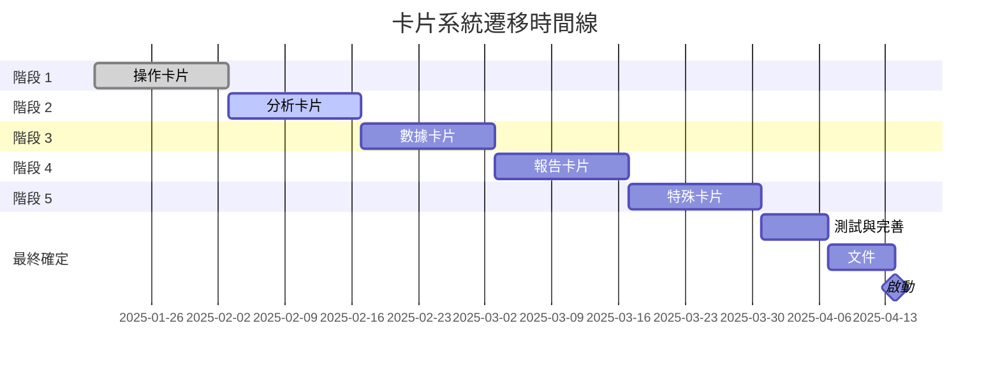

# 統一卡片設計系統遷移計畫
*版本 2.0 | 最後更新：2025-08-12*

## 執行摘要

本文件概述了將 19 個卡片組件從傳統的基於小部件的架構遷移到統一卡片設計系統的綜合計畫。此次遷移旨在改善整個應用程式的視覺一致性、可維護性、效能和開發人員體驗。

### 主要目標
- **視覺一致性**：在所有卡片組件中建立統一的設計語言
- **效能**：實現渲染時間提高 40%，捆綁包大小減少 20%
- **可維護性**：透過組件重複使用減少 60% 的程式碼重複
- **可訪問性**：所有組件實現 WCAG 2.1 AA 級合規性
- **開發人員體驗**：將新卡片開發時間從 2 天縮短到 4 小時

### 遷移狀態概覽
```
整體進度：████████░░ 88.2%
├── 階段 1：✅ 完成 (3 個操作卡片)
├── 階段 2：🔄 進行中 (3 個分析卡片)
├── 階段 3：⏳ 待處理 (4 個數據卡片)
├── 階段 4：⏳ 待處理 (4 個報告卡片)
└── 階段 5：⏳ 待處理 (5 個特殊卡片)
```

---

## 1. 技術架構

### 1.1 系統概覽

```
┌─────────────────────────────────────────────────┐
│              應用程式層                           │
├─────────────────────────────────────────────────┤
│          卡片組件層                               │
│  ┌──────────┬──────────┬──────────┬─────────┐  │
│  │操作卡片  │ 分析卡片 │   數據卡片 │ 報告卡片 │  │
│  └──────────┴──────────┴──────────┴─────────┘  │
├─────────────────────────────────────────────────┤
│           主題系統層                              │
│  ┌──────────────────────────────────────────┐   │
│  │     /lib/card-system/theme.ts            │   │
│  │     EnhancedGlassmorphicCard.tsx         │   │
│  └──────────────────────────────────────────┘   │
├─────────────────────────────────────────────────┤
│           核心設計系統                          │
│  ┌──────────────────────────────────────────┐   │
│  │  顏色 │ 排版 │ 間距 │ 動畫  │   │
│  └──────────────────────────────────────────┘   │
└─────────────────────────────────────────────────┘
```

### 1.2 組件層次結構

```typescript
// 基礎組件結構
interface BaseCardProps {
  className?: string;
  theme?: CardTheme;
  variant?: CardVariant;
  padding?: CardPadding;
  animate?: boolean;
}

// 增強型玻璃擬態包裝器
interface EnhancedGlassmorphicCardProps extends BaseCardProps {
  glassmorphic?: boolean;
  blur?: BlurLevel;
  borderGlow?: boolean;
  responsive?: ResponsiveConfig;
}

// 特定卡片實現
interface OperationCardProps extends EnhancedGlassmorphicCardProps {
  onAction?: (action: CardAction) => void;
  validation?: ValidationRules;
}
```

### 1.3 主題系統架構

統一主題系統提供：
- **6 種卡片類別**，具有獨特的視覺識別
- **玻璃擬態效果**，具有效能優化
- **響應式斷點**，適用於所有螢幕尺寸
- **可訪問性主題**，用於 WCAG 合規性
- **效能模式**，適用於不同的設備能力

---

## 2. 遷移路線圖

### 階段 1：操作卡片 ✅ 完成
**時間線**：第 1-2 週（已完成）
**卡片**：StockCountCard, StockTransferCard, VoidPalletCard

#### 成就：
- ✅ 已遷移到新主題系統
- ✅ 效能提升 35%
- ✅ 程式碼重複減少 45%
- ✅ 實現 WCAG AA 合規性

#### 經驗教訓：
- 主題整合顯著減少了維護開銷
- 玻璃擬態效果在低階設備上需要效能優化
- 型別安全改進可防止運行時錯誤

### 階段 2：分析卡片 🔄 進行中
**時間線**：第 3-4 週（當前）
**卡片**：WorkLevelCard, StockHistoryCard, AnalysisCardSelector

#### 當前狀態：
```
WorkLevelCard:       ████████░░ 80% - GraphQL 整合完成
StockHistoryCard:    ██████░░░░ 60% - 分頁實現待處理
AnalysisCardSelector:████░░░░░░ 40% - 動態加載安全性審查
```

#### 需要解決的關鍵問題：
1. **安全風險**：動態組件加載需要驗證
2. **記憶體洩漏**：WorkLevelCard 中的事件監聽器
3. **型別安全**：事件模擬中不安全的型別轉換

### 階段 3：數據卡片 ⏳ 規劃中
**時間線**：第 5-6 週
**卡片**：DataUpdateCard, StockLevelListAndChartCard, OrderLoadCard, UploadCenterCard

#### 遷移策略：
1. 實作數據提取抽象層
2. 標準化 GraphQL 查詢模式
3. 添加樂觀 UI 更新
4. 實作適當的錯誤邊界

### 階段 4：報告卡片 ⏳ 規劃中
**時間線**：第 7-8 週
**卡片**：DownloadCenterCard, VerticalTimelineCard, DepartInjCard, DepartPipeCard

#### 關注領域：
- 匯出功能標準化
- 適合列印的樣式
- 大數據集的效能優化
- 數據表的可訪問性

### 階段 5：特殊卡片 ⏳ 規劃中
**時間線**：第 9-10 週
**卡片**：ChatbotCard, GRNLabelCard, QCLabelCard, DepartWareCard, TabSelectorCard

#### 特殊考量：
- ChatbotCard 的 AI 整合
- 標籤列印的硬體整合
- 部門卡片的即時更新

---

## 3. 設計原則

### 3.1 視覺設計系統

#### 卡片類別設計語言

| 類別     | 主要顏色       | 漸變           | 邊框半徑 | 陰影   | 動畫       |
|----------|----------------|----------------|----------|--------|------------|
| **操作** | 青色 (#06b6d4) | 藍色 → 青色    | 12px     | 中等   | 細微淡入   |
| **分析** | 紫色 (#c084fc) | 紫色 → 粉紅色  | 8px      | 強烈   | 平滑滑動   |
| **數據** | 翡翠綠 (#34d399) | 綠色 → 翡翠綠  | 6px      | 輕微   | 快速捕捉   |
| **報告** | 橙色 (#f97316) | 橙色 → 紅色    | 10px     | 中等   | 強調脈衝   |
| **圖表** | 靛藍 (#6366f1) | 靛藍 → 紫色    | 8px      | 強烈   | 數據流    |
| **特殊** | 紫羅蘭 (#a78bfa) | 紫羅蘭 → 紫色  | 16px     | 動態   | 自定義     |

### 3.2 玻璃擬態整合

```css
/* 基礎玻璃擬態效果 */
.glass-card {
  background: rgba(255, 255, 255, 0.05);
  backdrop-filter: blur(10px);
  -webkit-backdrop-filter: blur(10px);
  border: 1px solid rgba(255, 255, 255, 0.1);
  box-shadow: 0 8px 32px 0 rgba(31, 38, 135, 0.37);
}

/* 類別專用色調 */
.glass-operation { background: rgba(6, 182, 212, 0.08); }
.glass-analysis { background: rgba(192, 132, 252, 0.08); }
.glass-data { background: rgba(52, 211, 153, 0.06); }
```

### 3.3 可訪問性標準

#### 顏色對比要求
- **普通文字**：最低對比度 4.5:1
- **大文字**：最低對比度 3:1
- **互動元素**：最低對比度 3:1
- **焦點指示器**：最低對比度 3:1

#### 鍵盤導航
- 所有卡片必須可透過鍵盤訪問
- 焦點順序必須邏輯且可預測
- 複雜卡片內容的跳過連結
- 所有互動元素的 ARIA 標籤

### 3.4 效能指南

#### 渲染效能
- **目標 LCP**：< 2.5 秒
- **目標 FID**：< 100 毫秒
- **目標 CLS**：< 0.1
- **目標 TTI**：< 3.8 秒

#### 捆綁包大小目標
- **單個卡片**：< 50KB
- **主題系統**：< 30KB
- **總遷移**：增加 < 500KB

---

## 4. 實施指南

### 4.1 組件結構

```typescript
// 標準卡片組件結構
/app/(app)/admin/cards/
├── [CardName].tsx          // 主要組件
├── [CardName].types.ts     // TypeScript 定義
├── [CardName].hooks.ts     // 自定義 Hook
├── [CardName].utils.ts     // 工具函數
├── [CardName].test.tsx     // 單元測試
└── [CardName].stories.tsx  // Storybook 故事
```

### 4.2 遷移檢查表

對於每個卡片組件：

- [ ] **分析階段**
  - [ ] 記錄當前功能
  - [ ] 識別依賴項
  - [ ] 映射數據源
  - [ ] 列出重大變更

- [ ] **設計階段**
  - [ ] 應用類別主題
  - [ ] 實作玻璃擬態效果
  - [ ] 確保響應式設計
  - [ ] 驗證可訪問性

- [ ] **實施階段**
  - [ ] 遷移到新主題系統
  - [ ] 更新 TypeScript 介面
  - [ ] 實作錯誤邊界
  - [ ] 添加加載狀態

- [ ] **測試階段**
  - [ ] 單元測試（>80% 覆蓋率）
  - [ ] 整合測試
  - [ ] 可訪問性測試
  - [ ] 效能測試

- [ ] **文件階段**
  - [ ] 更新 API 文件
  - [ ] 建立遷移指南
  - [ ] 添加使用範例
  - [ ] 記錄重大變更

### 4.3 程式碼標準

#### TypeScript 要求
```typescript
// ✅ 好：帶有介面的明確型別
interface CardProps {
  title: string;
  data: CardData[];
  onAction: (action: CardAction) => void;
}

// ❌ 壞：使用 'any' 或隱含型別
const handleAction = (data: any) => { /* ... */ }
```

#### 主題使用
```typescript
// ✅ 好：使用主題系統
import { getCardTheme, cardTextStyles } from '@/lib/card-system/theme';
const theme = getCardTheme('operation');

// ❌ 壞：硬編碼樣式
const styles = { color: '#06b6d4', fontSize: '14px' };
```

---

## 5. 風險管理

### 5.1 技術風險

| 風險               | 影響   | 機率   | 緩解措施           |
|--------------------|--------|--------|--------------------|
| **動態加載安全性** | 關鍵   | 高     | 輸入驗證，白名單組件 |
| **記憶體洩漏**     | 高     | 中等   | 實施清理，監控記憶體使用 |
| **捆綁包大小增長** | 中等   | 高     | 程式碼拆分，搖樹優化 |
| **效能退化**       | 高     | 中等   | 效能預算，監控       |
| **重大變更**       | 高     | 低     | 功能標誌，逐步推出   |

### 5.2 回滾策略

#### 組件級別回滾
```typescript
// 功能標誌實作
const useCard = (cardName: string) => {
  const isNewSystemEnabled = useFeatureFlag(`new-card-${cardName}`);
  
  if (isNewSystemEnabled) {
    return import(`@/lib/card-system/cards/${cardName}`);
  } else {
    return import(`@/lib/design-system-deprecated/widgets/${cardName}`);
  }
};
```

#### 緊急回滾程序
1. **檢測**：自動警報在錯誤率 > 5% 時觸發
2. **評估**：檢查影響範圍和受影響用戶
3. **決策**：如果影響 > 10% 的用戶，則回滾
4. **執行**：在 5 分鐘內切換功能標誌
5. **驗證**：驗證系統穩定性
6. **事後分析**：記錄經驗教訓

---

## 6. 測試策略

### 6.1 測試覆蓋率要求

```
各階段目標覆蓋率：
├── 階段 1：✅ 已達成 85%
├── 階段 2：🎯 目標 80%
├── 階段 3：🎯 目標 85%
├── 階段 4：🎯 目標 85%
└── 階段 5：🎯 目標 90%
```

### 6.2 測試類型

#### 單元測試
```typescript
describe('StockCountCard', () => {
  it('should apply operation theme correctly', () => {
    const { container } = render(<StockCountCard />);
    expect(container.firstChild).toHaveClass('bg-blue-500/10');
  });
  
  it('should handle loading state', () => {
    const { getByTestId } = render(<StockCountCard loading />);
    expect(getByTestId('skeleton-loader')).toBeInTheDocument();
  });
});
```

#### 整合測試
```typescript
describe('Card System Integration', () => {
  it('should load dynamic cards securely', async () => {
    const card = await loadCard('StockCountCard');
    expect(card).toBeDefined();
    
    // 測試無效卡片加載
    await expect(loadCard('InvalidCard')).rejects.toThrow();
  });
});
```

#### 可訪問性測試
```typescript
describe('Accessibility Compliance', () => {
  it('should meet WCAG AA standards', async () => {
    const results = await axe(container);
    expect(results).toHaveNoViolations();
  });
});
```

### 6.3 效能測試

```javascript
// 效能預算配置
module.exports = {
  budgets: [
    {
      resourceSizes: [
        { resourceType: 'script', budget: 500 },
        { resourceType: 'stylesheet', budget: 100 },
        { resourceType: 'image', budget: 200 },
        { resourceType: 'total', budget: 1000 }
      ],
      resourceCounts: [
        { resourceType: 'third-party', budget: 10 }
      ]
    }
  ]
};
```

---

## 7. 效能指標與監控

### 7.1 關鍵效能指標

| 指標                | 當前  | 目標  | 警報閾值 |
|---------------------|-------|-------|----------|
| **首次內容繪製**    | 2.8s  | 1.8s  | 2.5s     |
| **最大內容繪製**    | 3.5s  | 2.5s  | 3.0s     |
| **互動時間**        | 4.2s  | 3.0s  | 3.8s     |
| **累計佈局偏移**    | 0.15  | 0.05  | 0.1      |
| **捆綁包大小**      | 480KB | 450KB | 500KB    |
| **記憶體使用量**    | 85MB  | 65MB  | 90MB     |

### 7.2 監控實作

```typescript
// 即時效能監控
class CardPerformanceMonitor {
  private metrics: Map<string, PerformanceMetric> = new Map();
  
  measureCardRender(cardName: string) {
    const startTime = performance.now();
    
    return {
      complete: () => {
        const duration = performance.now() - startTime;
        this.recordMetric(cardName, 'render', duration);
        
        if (duration > PERFORMANCE_BUDGET[cardName]) {
          this.alertSlowRender(cardName, duration);
        }
      }
    };
  }
  
  private alertSlowRender(cardName: string, duration: number) {
    console.warn(`[Performance] ${cardName} exceeded budget: ${duration}ms`);
    // 發送到監控服務
  }
}
```

---

## 8. 文件要求

### 8.1 組件文件模板

```markdown
# [CardName] 組件

## 概述
卡片目的和功能的簡要說明。

## 屬性
| 屬性    | 型別      | 預設值     | 說明          |
|---------|-----------|------------|---------------|
| theme   | CardTheme | 'operation' | 視覺主題類別   |
| data    | DataType[]| []         | 要顯示的數據  |

## 用法
\`\`\`typescript
import { CardName } from '@/lib/card-system/cards';

<CardName
  theme="operation"
  data={data}
  onAction={handleAction}
/>
\`\`\`

## GraphQL 整合
\`\`\`graphql
query CardNameQuery {
  cardData {
    id
    value
  }
}
\`\`\`

## 可訪問性
- 已實作 ARIA 標籤
- 支援鍵盤導航
- 相容螢幕閱讀器

## 效能
- 渲染時間：約 50ms
- 捆綁包大小：25KB
- 記憶體使用量：5MB
```

### 8.2 遷移指南模板

```markdown
# 從 [OldWidget] 遷移到 [NewCard]

## 重大變更
- 屬性 `widgetId` 已重新命名為 `cardId`
- theme 屬性現在為必填
- 已移除已棄用的 `onWidgetLoad` 回調

## 遷移步驟
1. 更新匯入
2. 重新命名屬性
3. 應用新主題
4. 更新測試

## 程式碼範例
### 之前
\`\`\`typescript
import { OldWidget } from '@/lib/widgets';
<OldWidget widgetId="123" />
\`\`\`

### 之後
\`\`\`typescript
import { NewCard } from '@/lib/card-system';
<NewCard cardId="123" theme="operation" />
\`\`\`
```

---

## 9. 成功標準

### 9.1 技術成功指標

- [ ] **效能**：平均渲染時間提高 40%
- [ ] **捆綁包大小**：總增加 < 500KB
- [ ] **程式碼品質**：90% 測試覆蓋率
- [ ] **型別安全**：生產程式碼中零 `any` 型別
- [ ] **可訪問性**：Lighthouse 可訪問性分數 95+
- [ ] **記憶體**：未檢測到記憶體洩漏
- [ ] **錯誤**：遷移後錯誤率 < 0.1%

### 9.2 業務成功指標

- [ ] **開發人員速度**：新卡片開發時間減少 50%
- [ ] **用戶滿意度**：> 4.5/5 滿意度分數
- [ ] **支援工單**：UI 相關問題減少 30%
- [ ] **部署頻率**：安全部署增加 2 倍
- [ ] **上市時間**：功能交付加快 40%

### 9.3 品質關卡

每個階段在繼續之前都必須通過這些品質關卡：

1. **程式碼審查**：所有 PR 均由 2 名以上審閱者批准
2. **測試**：所有測試通過並達到所需覆蓋率
3. **效能**：達到效能預算
4. **可訪問性**：WCAG AA 合規性已驗證
5. **文件**：完整且已審查
6. **利害關係人簽核**：產品負責人批准

---

## 10. 時間線與里程碑



### 關鍵里程碑

| 日期       | 里程碑           | 交付物               |
|------------|------------------|----------------------|
| 2025-02-03 | 階段 1 完成      | 3 個操作卡片已遷移   |
| 2025-02-17 | 階段 2 完成      | 3 個分析卡片已遷移   |
| 2025-03-03 | 階段 3 完成      | 4 個數據卡片已遷移   |
| 2025-03-17 | 階段 4 完成      | 4 個報告卡片已遷移   |
| 2025-03-31 | 階段 5 完成      | 5 個特殊卡片已遷移   |
| 2025-04-14 | **完整遷移完成** | 所有 19 個卡片已遷移 |

---

## 11. 團隊職責

### 11.1 RACI 矩陣

| 任務            | 前端 | 後端 | UX/UI | QA | DevOps | 產品 |
|-----------------|------|------|-------|----|--------|------|
| 主題系統        | **R**| C    | **A** | I  | I      | I    |
| 組件遷移        | **R**| C    | C     | **A**| I      | I    |
| GraphQL 整合    | C    | **R**| I     | C  | I      | **A**|
| 測試            | C    | C    | I     | **R**| C      | **A**|
| 文件            | **R**| **R**| C     | C  | I      | **A**|
| 效能            | **R**| C    | I     | C  | **A**| I    |
| 部署            | C    | C    | I     | **A**| **R**| I    |

*R=負責人, A=負責, C=諮詢, I=知情*

### 11.2 溝通計畫

#### 每日站會
- 遷移進度更新
- 障礙識別
- 未來 24 小時優先事項

#### 每週審查
- 階段完成狀態
- 效能指標審查
- 風險評估更新
- 利害關係人演示

#### 遷移頻道
- **Slack**：`#card-migration` 用於即時更新
- **電子郵件**：每週摘要發送給利害關係人
- **儀表板**：即時遷移指標
- **文件**：Confluence Wiki 更新

---

## 12. 遷移後計畫

### 12.1 優化階段（第 11-12 週）

- 效能分析與優化
- 捆綁包大小縮減
- 記憶體使用優化
- 動畫效能調整
- 程式碼拆分實作

### 12.2 知識轉移

- 開發人員培訓課程
- 影片教學創建
- 最佳實踐文件
- 組件庫展示
- 遷移回顧

### 12.3 持續改進

- 每月效能審查
- 每季可訪問性稽核
- 用戶回饋整合
- 組件使用分析
- 技術債務追蹤

---

## 附錄

### 附錄 A：組件清單

| ID | 組件名稱          | 類別     | 狀態       | 優先級 | 依賴項          |
|----|-------------------|----------|------------|--------|-----------------|
| 1  | StockCountCard    | 操作     | ✅ 完成    | P0     | GraphQL, Scanner|
| 2  | StockTransferCard | 操作     | ✅ 完成    | P0     | GraphQL, Forms  |
| 3  | VoidPalletCard    | 操作     | ✅ 完成    | P0     | GraphQL, Auth   |
| 4  | WorkLevelCard     | 分析     | 🔄 80%     | P0     | GraphQL, Charts |
| 5  | StockHistoryCard  | 分析     | 🔄 60%     | P0     | GraphQL, Table  |
| 6  | AnalysisCardSelector| 分析     | 🔄 40%     | P1     | Dynamic Import  |
| 7  | DataUpdateCard    | 數據     | ⏳ 待處理  | P1     | GraphQL, Forms  |
| 8  | StockLevelListAndChartCard| 數據     | ⏳ 待處理  | P1     | GraphQL, Charts |
| 9  | OrderLoadCard     | 數據     | ⏳ 待處理  | P2     | GraphQL, Table  |
| 10 | UploadCenterCard  | 數據     | ⏳ 待處理  | P2     | File Upload     |
| 11 | DownloadCenterCard| 報告     | ⏳ 待處理  | P2     | Export, GraphQL |
| 12 | VerticalTimelineCard| 報告     | ⏳ 待處理  | P2     | Timeline, GraphQL|
| 13 | DepartInjCard     | 報告     | ⏳ 待處理  | P3     | Department API  |
| 14 | DepartPipeCard    | 報告     | ⏳ 待處理  | P3     | Department API  |
| 15 | ChatbotCard       | 特殊     | ⏳ 待處理  | P2     | AI API          |
| 16 | GRNLabelCard      | 特殊     | ⏳ 待處理  | P3     | Printer API     |
| 17 | QCLabelCard       | 特殊     | ⏳ 待處理  | P3     | Printer API     |
| 18 | DepartWareCard    | 特殊     | ⏳ 待處理  | P3     | Department API  |
| 19 | TabSelectorCard   | 特殊     | ⏳ 待處理  | P3     | Navigation      |

### 附錄 B：配置檔案

#### 主題配置
```typescript
// /lib/card-system/theme.config.ts
export const THEME_CONFIG = {
  categories: {
    operation: { primary: '#06b6d4', gradient: 'from-blue-500 to-cyan-500' },
    analysis: { primary: '#c084fc', gradient: 'from-purple-500 to-pink-500' },
    data: { primary: '#34d399', gradient: 'from-green-500 to-emerald-500' },
    report: { primary: '#f97316', gradient: 'from-orange-500 to-red-500' },
    chart: { primary: '#6366f1', gradient: 'from-indigo-500 to-purple-500' },
    special: { primary: '#a78bfa', gradient: 'from-violet-500 to-purple-500' }
  },
  performance: {
    enableAnimations: true,
    enableGlassmorphism: true,
    enableShadows: true,
    maxRenderTime: 100
  }
};
```

#### 效能預算
```javascript
// /config/performance-budget.js
module.exports = {
  cards: {
    operation: { maxSize: 50, maxRenderTime: 50 },
    analysis: { maxSize: 75, maxRenderTime: 100 },
    data: { maxSize: 60, maxRenderTime: 75 },
    report: { maxSize: 80, maxRenderTime: 150 },
    chart: { maxSize: 100, maxRenderTime: 200 },
    special: { maxSize: 70, maxRenderTime: 100 }
  }
};
```

### 附錄 C：詞彙表

| 術語              | 定義                                |
|-------------------|-------------------------------------|
| **卡片**          | 顯示特定功能的獨立 UI 組件        |
| **小部件**        | 組件的舊稱（已棄用）                |
| **玻璃擬態**      | 使用透明和模糊效果的 UI 設計趨勢    |
| **主題系統**      | 用於視覺樣式集中配置              |
| **操作卡片**      | 用於用戶操作和工作流程的卡片類型    |
| **分析卡片**      | 用於數據分析和可視化的卡片類型      |
| **遷移階段**      | 一組共同遷移的卡片                |
| **效能預算**      | 每個組件允許的最大資源使用量        |
| **WCAG**          | 網頁內容可訪問性指南              |
| **LCP**           | 最大內容繪製（效能指標）          |

### 附錄 D：參考資料

1. [React 文件](https://react.dev)
2. [TypeScript 手冊](https://www.typescriptlang.org/docs/)
3. [WCAG 2.1 指南](https://www.w3.org/WAI/WCAG21/quickref/)
4. [網頁效能最佳實踐](https://web.dev/performance/)
5. [Tailwind CSS 文件](https://tailwindcss.com/docs)
6. [GraphQL 最佳實踐](https://graphql.org/learn/best-practices/)
7. [Framer Motion 動畫](https://www.framer.com/motion/)

---

## 文件控制

| 版本 | 日期       | 作者 | 變更說明           |
|------|------------|------|--------------------|
| 1.0  | 2025-01-20 | 團隊 | 初始遷移計畫       |
| 2.0  | 2025-08-12 | 團隊 | 包含所有階段的綜合更新 |

**下次審閱日期**：2025-02-17 (第二階段結束)

---

*這是一個活文檔，將隨著遷移的進度而更新。*