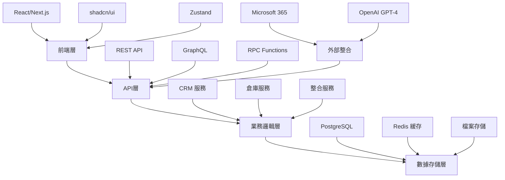
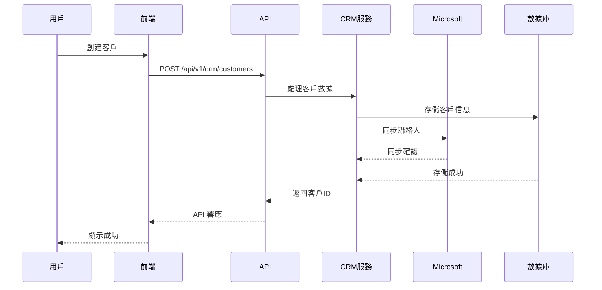
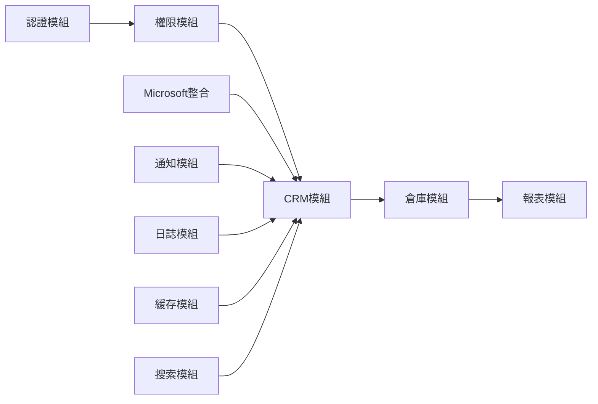

# CRM 系統強化開發計劃

**計劃版本**: v2.0  
**建立版本**: v2.0.3  
**負責人**: 系統架構專家 / 產品經理  
**項目狀態**: 📋 計劃中

## 📋 計劃概述

### 🎯 項目目標
- **主要目標**: 基於現有 NewPennine 倉庫管理系統，開發完整企業級 CRM 解決方案
- **次要目標**: 實現銷售自動化、提升客戶管理效率、整合 Microsoft 365 生態系統
- **成功標準**: 銷售效率提升 30%、手動工作減少 60%、ROI 8-10 個月內回收

### 📊 項目範圍
- **包含功能**: 
  - Microsoft 365 整合（OneDrive、Outlook、Calendar）
  - 實時聊天系統
  - 客戶關係管理核心功能
  - 銷售管道管理
  - 商業智能分析
- **排除功能**: 
  - 財務會計系統
  - 人力資源管理
  - 製造執行系統
- **邊界條件**: 
  - 基於現有倉庫管理系統架構
  - 支援 30-40 個並發用戶
  - 僅限企業內部使用

### 🏆 預期效益
- **業務價值**: 銷售效率提升 30%、營收增長 15-20%、客戶滿意度提升 25%
- **技術價值**: 統一數據架構、API 標準化、系統模組化提升
- **用戶價值**: 減少 60% 手動工作、統一操作界面、實時協作能力

## 🗓️ 版本規劃

### v0.9 - 基礎準備版本
**依賴版本**: v2.0.3（當前版本）

#### 🎯 核心功能
- [ ] 認證系統修復：解決會話遺失問題
- [ ] 測試覆蓋提升：E2E 測試達 80%
- [ ] 技術債務清理：移除 GraphQL 遺留代碼

#### 📋 技術任務
- [ ] 實施 JWT refresh token 機制
- [ ] 加強會話持久化存儲
- [ ] 統一 API 響應格式
- [ ] 優化 CI/CD 管道

#### ✅ 完成標準
- [ ] 系統穩定性達 99.9%
- [ ] 零關鍵 TypeScript 錯誤
- [ ] 所有 API 端點測試覆蓋

### v1.0 - 基礎版本（Microsoft 整合）
**依賴版本**: v0.9（基礎準備完成）

#### 🎯 核心功能
- [ ] Microsoft OAuth 2.0 整合
- [ ] OneDrive 訂單自動化處理
- [ ] Outlook 郵件整合
- [ ] Calendar 日程同步

#### 📋 技術任務
- [ ] Azure AD 應用註冊配置
- [ ] Token 加密存儲實施（AES-256）
- [ ] 自動 token 刷新機制
- [ ] OneDrive webhook 監控
- [ ] PDF OCR 自動分析引擎

#### ✅ 完成標準
- [ ] 24/7 訂單自動處理運行
- [ ] 處理速度提升 10 倍
- [ ] 日均節省 4 小時人工

### v1.1 - 增強版本（實時協作）
**依賴版本**: v1.0（Microsoft 整合完成）

#### 🎯 增強功能
- [ ] 實時聊天系統架構
- [ ] 一對一即時通訊
- [ ] 群組協作功能
- [ ] 檔案分享系統

#### 📋 優化任務
- [ ] Supabase Realtime 配置
- [ ] WebSocket 連接管理
- [ ] 訊息隊列實施
- [ ] 離線訊息處理
- [ ] 50MB 檔案上傳支援

### v1.2 - 完善版本（CRM 核心）
**依賴版本**: v1.1（實時協作完成）

#### 🎯 完善功能
- [ ] 客戶 360° 視圖
- [ ] 聯絡人網絡管理
- [ ] 活動追蹤系統
- [ ] 銷售管道管理
- [ ] 商業智能報表

## 🏗️ 技術架構

### 🛠️ 技術棧
- **前端**: Next.js 14 (App Router)、React 18、TypeScript、Tailwind CSS
- **後端**: Supabase PostgreSQL、REST API、RPC Functions
- **實時功能**: Supabase Realtime、WebSocket
- **整合**: Microsoft Graph API、OAuth 2.0
- **部署**: Docker、Nginx、Redis

### 📐 架構設計

#### 🏗️ 系統架構圖


#### 🔄 CRM 業務流程圖


### 🔧 技術架構
```
┌─────────────────────────────────────────────────────────────┐
│                        前端層                                │
├─────────────────────────────────────────────────────────────┤
│ React/Next.js │ TypeScript │ Tailwind CSS │ shadcn/ui       │
├─────────────────────────────────────────────────────────────┤
│                        API層                                 │
├─────────────────────────────────────────────────────────────┤
│ REST API     │ RPC Functions │ Middleware  │ Auth Guard     │
├─────────────────────────────────────────────────────────────┤
│                      業務邏輯層                              │
├─────────────────────────────────────────────────────────────┤
│ CRM服務      │ 倉庫服務     │ 整合服務     │ 通知服務         │
├─────────────────────────────────────────────────────────────┤
│                      數據存儲層                              │
├─────────────────────────────────────────────────────────────┤
│ PostgreSQL   │ Redis       │ Supabase    │ 檔案存儲          │
└─────────────────────────────────────────────────────────────┘
```

### 🌐 部署架構

```
生產環境:
┌─────────────┐    ┌─────────────┐    ┌─────────────┐
│    CDN      │    │  前端服務    │    │  API服務    │
│  (靜態資源)  │    │ (Next.js)   │    │ (Supabase)  │
└─────────────┘    └─────────────┘    └─────────────┘
        │                  │                  │
        └──────────────────┼──────────────────┘
                           │
                   ┌─────────────┐    ┌─────────────┐
                   │  數據庫服務  │    │  緩存服務    │
                   │(PostgreSQL) │    │   (Redis)   │
                   └─────────────┘    └─────────────┘
```

### 🔗 模組關係圖



### 🔧 技術決策
| 決策點 | 選擇方案 | 理由 | 替代方案 |
|--------|----------|------|----------|
| 實時通訊 | Supabase Realtime | 已有基礎設施、成本低 | Socket.io |
| 狀態管理 | Zustand | 輕量、TypeScript 友好 | Redux |
| UI 組件庫 | shadcn/ui | 可定制、現代化 | Material-UI |
| API 架構 | REST + RPC | 靈活、已有實踐 | 純 GraphQL |

## 🧪 測試策略

### 📝 測試計劃
- **單元測試**: 業務邏輯 90% 覆蓋率，使用 Jest
- **整合測試**: API 端點 100% 覆蓋，關鍵流程測試
- **E2E測試**: Playwright 測試用戶關鍵路徑
- **性能測試**: API 響應時間 < 200ms，並發支援 100 用戶

### 🎯 測試目標
- **代碼覆蓋率**: 85%
- **關鍵路徑**: 100%
- **性能基準**: 
  - 頁面加載 < 2s
  - API 響應 < 200ms
  - 實時消息延遲 < 100ms

## 🚨 風險評估

### ⚠️ 主要風險
| 風險 | 可能性 | 影響程度 | 風險等級 | 緩解策略 |
|------|--------|----------|----------|----------|
| 認證系統不穩定 | 高 | 高 | 🔴 | 優先修復，實施 fallback 機制 |
| Microsoft API 限制 | 中 | 中 | 🟡 | 實施請求限流，智能緩存 |
| 數據遷移錯誤 | 低 | 高 | 🟡 | 分批遷移，完整備份，回滾計劃 |
| 用戶採用率低 | 中 | 高 | 🔴 | 漸進推出，充分培訓，收集反饋 |
| 性能瓶頸 | 中 | 中 | 🟡 | 預先性能測試，優化關鍵路徑 |

### 🛡️ 應急計劃
- **備選方案**: 
  - 認證失敗：本地認證 fallback
  - API 限制：批量處理隊列
  - 性能問題：功能降級模式
- **回滾計劃**: 
  - 數據庫快照備份
  - 藍綠部署架構
  - 版本快速切換
- **溝通計劃**: 
  - 內部 Slack 通知
  - 用戶郵件提醒
  - 狀態頁面更新

## 📊 資源規劃

### 👥 人力資源
- **開發團隊**: 2-3 名全棧工程師
- **測試團隊**: 1 名 QA 工程師
- **項目管理**: 1 名產品經理（兼職）
- **技術支援**: 1 名 DevOps 工程師

### ⏱️ 版本規劃
- **總版本數**: 5 個主要版本
- **關鍵里程碑**: 
  - v0.9：第 1 個月完成
  - v1.0：第 2-3 個月完成
  - v1.1：第 4-5 個月完成
  - v1.2：第 6-7 個月完成
- **緩衝版本**: 預留 2 個月應急時間

## 📈 成功指標

### 🎯 版本目標
- **v0.9 目標**: 系統穩定性 99.9%、零關鍵錯誤
- **v1.0 目標**: 訂單處理自動化 100%、日均節省 4 小時
- **v1.1 目標**: 內部溝通效率提升 40%、採用率 > 80%
- **v1.2 目標**: 客戶資料數字化 100%、銷售效率提升 30%

### 📊 量化指標
- **功能完成度**: 每版本 25% 遞進
- **性能指標**: 
  - API 響應時間 < 200ms
  - 頁面加載時間 < 2s
  - 系統可用性 > 99.9%
- **質量指標**: 
  - Bug 密度 < 0.5/KLOC
  - 測試覆蓋率 > 85%
  - 用戶滿意度 > 4.5/5

---

**計劃建立人**: 系統架構專家 / 產品經理  
**計劃狀態**: 📋 草案  
**相關文檔**: 
- [TypeScript 錯誤修復報告](../issue-library/v1.5.3-final-cleanup-and-validation-report.md)
- [系統架構文檔](../manual/system-architecture.md)
- [API 參考文檔](../manual/api-reference.md)