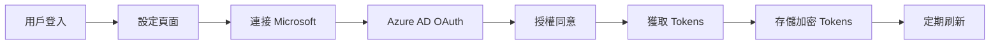
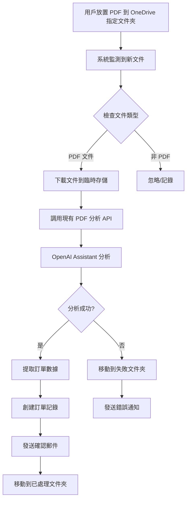

# Microsoft Outlook 同 OneDrive 整合計劃

## 概述
本計劃旨在將 Microsoft Outlook (包括 Outlook Calendar) 同 OneDrive 整合到 NewPennine 倉庫管理系統，提供企業級嘅通訊、排程同文件管理功能。

## 現有基礎設施

### 已實施功能
1. **Resend API 電郵服務**
   - 位置：`/app/services/emailService.ts`
   - 功能：訂單通知、ACO 完成通知、PDF 附件支援
   - 自動收件人分配（基於產品代碼）

2. **認證系統**
   - Supabase Auth 作為主要認證
   - Session 管理已完善
   - API keys 管理通過環境變數

3. **文件上載系統**
   - 現有多個 upload widgets
   - 支援 PDF、Excel、圖片上載
   - 檔案處理同存儲機制

#### 強化安全性計劃

1. 加密令牌存儲與管理
加密存儲訪問令牌和刷新令牌：所有的 OAuth 令牌，無論是訪問令牌（Access Token）還是刷新令牌（Refresh Token），都應該進行加密存儲。

應使用強加密算法（如 AES-256）來保護這些令牌，以防止它們在數據庫中被未經授權的用戶讀取。

加密處理邏輯：

使用 Vercel 環境變數 存儲 加密密鑰，並且將密鑰管理委託給專業的服務（如 AWS KMS 或 Azure Key Vault）。

確保加密密鑰與其他資料（如令牌）分開存儲，以增強安全性。

2. 在 Supabase 中設計安全的資料表
資料表結構：

為了保持整體架構的清晰與安全，使用以下資料表結構來管理令牌：

CREATE TABLE user_tokens (
  id UUID PRIMARY KEY DEFAULT gen_random_uuid(),
  user_id UUID REFERENCES auth.users(id) ON DELETE CASCADE,
  access_token TEXT,  -- 儲存加密後的訪問令牌
  refresh_token TEXT, -- 儲存加密後的刷新令牌
  access_token_expiry TIMESTAMP,
  refresh_token_expiry TIMESTAMP,
  created_at TIMESTAMP DEFAULT NOW(),
  updated_at TIMESTAMP DEFAULT NOW()
);

加密令牌存儲：
- 當令牌被創建或更新時，通過加密函數將 訪問令牌 和 刷新令牌 進行加密，再存儲到 user_tokens 資料表中。
- 使用 process.env.ENCRYPTION_KEY 來加密令牌（加密密鑰可以存儲在 Vercel 環境變數中）。

3. 使用強加密算法（AES-256）加密令牌
令牌存儲時，必須進行加密處理。以下是如何使用 Node.js 進行令牌加密和解密的示例。

const crypto = require('crypto');

// 用於加密令牌的密鑰（存儲於 Vercel 環境變數中）
const ENCRYPTION_KEY = process.env.ENCRYPTION_KEY;

// 加密訪問令牌
function encryptToken(token) {
  const iv = crypto.randomBytes(16);  // 生成初始化向量
  const cipher = crypto.createCipheriv('aes-256-cbc', Buffer.from(ENCRYPTION_KEY), iv);
  let encrypted = cipher.update(token, 'utf8', 'hex');
  encrypted += cipher.final('hex');
  return `${iv.toString('hex')}:${encrypted}`;
}

// 解密訪問令牌
function decryptToken(encryptedData) {
  const [ivHex, encryptedText] = encryptedData.split(':');
  const iv = Buffer.from(ivHex, 'hex');
  const decipher = crypto.createDecipheriv('aes-256-cbc', Buffer.from(ENCRYPTION_KEY), iv);
  let decrypted = decipher.update(encryptedText, 'hex', 'utf8');
  decrypted += decipher.final('utf8');
  return decrypted;
}
這樣存儲的令牌即使在數據庫中，也無法被未經授權的用戶直接訪問。

4. 令牌過期處理與自動更新
過期時間設置：為了避免訪問令牌過期後無法繼續使用，應該為每個令牌設置過期時間。
- 訪問令牌有效期(兩小時)
- 刷新令牌有效期(一個月)。

自動更新過期令牌：當訪問令牌過期時，應該自動使用刷新令牌來獲取新的訪問令牌。此過程應該無縫進行，並且需要根據用戶的令牌過期時間來計劃自動刷新。

例如，設置過期時間並定期檢查令牌是否過期。

如果過期，使用刷新令牌重新獲取新的訪問令牌並更新資料庫中的記錄。

// 自動刷新訪問令牌的邏輯範例
async function refreshAccessToken(userId: string, refreshToken: string) {
  const response = await fetch('https://login.microsoftonline.com/{tenant-id}/oauth2/v2.0/token', {
    method: 'POST',
    headers: {
      'Content-Type': 'application/x-www-form-urlencoded',
    },
    body: new URLSearchParams({
      client_id: '{client-id}',
      client_secret: '{client-secret}',
      grant_type: 'refresh_token',
      refresh_token: refreshToken,
      scope: 'https://graph.microsoft.com/.default',
    }),
  });

  if (response.ok) {
    const data = await response.json();
    const newAccessToken = data.access_token;
    const newExpiry = new Date(Date.now() + 3600 * 1000); // 假設過期時間為 1 小時後

    // 更新資料庫中的訪問令牌
    await supabase
      .from('user_tokens')
      .update({
        access_token: encryptToken(newAccessToken),
        access_token_expiry: newExpiry,
        updated_at: new Date(),
      })
      .eq('user_id', userId);
  } else {
    console.error('Failed to refresh access token');
  }
}

5. 撤銷與失效機制
登出與令牌撤銷：當用戶登出或更新密碼時，應立即撤銷其所有有效的令牌。
通過從資料庫中刪除用戶的令牌記錄或將其標記為無效來實現。

刷新令牌失效：如果刷新令牌過期或無效，則需要要求用戶重新授權，並創建新的令牌。


// 範例：撤銷用戶令牌
async function revokeToken(userId: string) {
  await supabase
    .from('user_tokens')
    .delete()
    .eq('user_id', userId);
}

6. 密鑰管理與密鑰輪換
- 使用 Vercel 環境變數管理密鑰
- 在 Vercel 上設置加密密鑰（如 AES-256）時，確保它們存儲在環境變數中
- 不要在代碼中直接顯示或硬編碼密鑰。

密鑰輪換策略：定期更換加密密鑰並更新資料庫中存儲的密鑰，以確保系統的安全性。每次密鑰輪換後，都要確保用戶的令牌能夠繼續被安全地加密和解密。

7. API 請求與密碼安全性
- HTTPS：確保所有的 API 請求都使用 HTTPS 來加密傳輸，避免數據在傳輸過程中被竊取。
- 最小權限原則：限制每個令牌可以執行的操作，避免過多權限造成風險
- 例如，只請求必要的 Mail.Read 或 Calendars.Read 權限，而不是 Mail.ReadWrite。


## Microsoft Graph API 整合架構

### 1. Outlook 郵件整合

#### 功能範圍
- **郵件管理**
  - 讀取收件箱（訂單確認、供應商通訊）
  - 發送郵件（報表、通知、帶附件）
  - 資料夾管理（自動分類訂單相關郵件）
  - 郵件搜尋同過濾

- **聯絡人整合**
  - 同步供應商聯絡人
  - 客戶資料管理
  - 自動完成收件人

#### 技術實施
```typescript
// /app/services/outlookMailService.ts
interface OutlookMailService {
  // 認證
  authenticate(userId: string): Promise<void>
  refreshToken(userId: string): Promise<void>
  
  // 郵件操作
  sendMail(options: {
    to: string[]
    subject: string
    body: string
    attachments?: File[]
  }): Promise<string>
  
  getMails(folder: string, filter?: MailFilter): Promise<Mail[]>
  moveMail(mailId: string, targetFolder: string): Promise<void>
  
  // 聯絡人
  getContacts(filter?: ContactFilter): Promise<Contact[]>
  createContact(contact: ContactData): Promise<string>
}
```

### 2. Outlook Calendar 整合

#### 功能範圍
- **事件管理**
  - 創建事件（訂單交付、庫存盤點）
  - 更新/取消事件
  - 週期性事件（定期盤點）
  - 會議邀請（供應商會議）

- **提醒功能**
  - 低庫存提醒
  - 訂單到期提醒
  - 產品過期警報

#### 技術實施
```typescript
// /app/services/outlookCalendarService.ts
interface OutlookCalendarService {
  // 事件操作
  createEvent(event: {
    subject: string
    start: Date
    end: Date
    location?: string
    attendees?: string[]
    body?: string
    isAllDay?: boolean
    recurrence?: RecurrencePattern
  }): Promise<string>
  
  updateEvent(eventId: string, updates: Partial<Event>): Promise<void>
  deleteEvent(eventId: string): Promise<void>
  
  // 查詢
  getEvents(start: Date, end: Date): Promise<Event[]>
  getUpcomingReminders(): Promise<Reminder[]>
}
```

### 3. OneDrive 整合

#### 功能範圍
- **文件存儲**
  - 報表自動備份
  - 訂單文件存儲
  - 產品規格文件管理
  - 相片同圖片存儲

- **文件分享**
  - 生成分享連結
  - 設定權限（只讀/編輯）
  - 過期時間管理

- **文件同步**
  - 自動上載生成嘅報表
  - 下載供應商文件
  - 版本控制

- **自動化訂單處理（重點功能）**
  - 監控指定 OneDrive 文件夾
  - 自動偵測新訂單 PDF
  - 自動執行 PDF 分析同入庫
  - 處理完成後移動或標記文件

#### 技術實施
```typescript
// /app/services/oneDriveService.ts
interface OneDriveService {
  // 文件操作
  uploadFile(file: File, path: string): Promise<string>
  downloadFile(fileId: string): Promise<Blob>
  deleteFile(fileId: string): Promise<void>
  moveFile(fileId: string, targetPath: string): Promise<void>
  
  // 資料夾操作
  createFolder(path: string): Promise<string>
  listFiles(folderId: string): Promise<DriveItem[]>
  watchFolder(folderId: string, callback: (changes: DriveItemChange[]) => void): Promise<void>
  
  // 分享
  createShareLink(fileId: string, options: {
    type: 'view' | 'edit'
    expirationDateTime?: Date
    password?: string
  }): Promise<string>
  
  // 搜尋
  searchFiles(query: string): Promise<DriveItem[]>
}

// /app/services/orderPdfMonitorService.ts
interface OrderPdfMonitorService {
  // 監控設定
  setWatchFolder(userId: string, folderPath: string): Promise<void>
  getWatchFolders(userId: string): Promise<WatchFolder[]>
  
  // 自動處理
  startMonitoring(): Promise<void>
  stopMonitoring(): Promise<void>
  processNewPdf(driveItem: DriveItem): Promise<OrderProcessResult>
  
  // 狀態管理
  getProcessingStatus(fileId: string): Promise<ProcessingStatus>
  retryFailedFile(fileId: string): Promise<void>
}
```

## 數據庫架構更新

### 新增表格

```sql
-- Microsoft 整合設定
CREATE TABLE microsoft_integrations (
  id UUID PRIMARY KEY DEFAULT gen_random_uuid(),
  user_id UUID REFERENCES auth.users(id),
  access_token TEXT,
  refresh_token TEXT,
  token_expires_at TIMESTAMP,
  outlook_email TEXT,
  calendar_id TEXT,
  onedrive_id TEXT,
  sync_enabled BOOLEAN DEFAULT true,
  created_at TIMESTAMP DEFAULT NOW(),
  updated_at TIMESTAMP DEFAULT NOW()
);

-- OneDrive 文件映射
CREATE TABLE onedrive_file_mappings (
  id UUID PRIMARY KEY DEFAULT gen_random_uuid(),
  local_id UUID, -- 可以係訂單ID、報表ID等
  local_type TEXT, -- 'order' | 'report' | 'product_spec' | 'photo'
  drive_item_id TEXT NOT NULL,
  file_name TEXT,
  file_path TEXT,
  share_link TEXT,
  created_at TIMESTAMP DEFAULT NOW(),
  updated_at TIMESTAMP DEFAULT NOW()
);

-- 日曆事件映射
CREATE TABLE outlook_event_mappings (
  id UUID PRIMARY KEY DEFAULT gen_random_uuid(),
  local_id UUID,
  local_type TEXT, -- 'order_delivery' | 'stock_take' | 'meeting'
  event_id TEXT NOT NULL,
  calendar_id TEXT,
  created_at TIMESTAMP DEFAULT NOW()
);

-- 郵件追蹤
CREATE TABLE outlook_mail_tracking (
  id UUID PRIMARY KEY DEFAULT gen_random_uuid(),
  mail_id TEXT NOT NULL,
  conversation_id TEXT,
  order_id UUID,
  mail_type TEXT, -- 'order_confirmation' | 'delivery_notice' | 'report'
  status TEXT, -- 'sent' | 'read' | 'replied'
  created_at TIMESTAMP DEFAULT NOW()
);

-- OneDrive 監控文件夾設定
CREATE TABLE onedrive_watch_folders (
  id UUID PRIMARY KEY DEFAULT gen_random_uuid(),
  user_id UUID REFERENCES auth.users(id),
  folder_path TEXT NOT NULL,
  folder_id TEXT,
  folder_type TEXT, -- 'order_inbox' | 'processed' | 'failed'
  is_active BOOLEAN DEFAULT true,
  last_checked TIMESTAMP,
  created_at TIMESTAMP DEFAULT NOW(),
  updated_at TIMESTAMP DEFAULT NOW()
);

-- PDF 處理記錄
CREATE TABLE pdf_processing_log (
  id UUID PRIMARY KEY DEFAULT gen_random_uuid(),
  drive_item_id TEXT NOT NULL,
  file_name TEXT NOT NULL,
  file_path TEXT,
  processing_status TEXT, -- 'pending' | 'processing' | 'completed' | 'failed'
  order_id UUID,
  error_message TEXT,
  retry_count INTEGER DEFAULT 0,
  processed_at TIMESTAMP,
  created_at TIMESTAMP DEFAULT NOW(),
  updated_at TIMESTAMP DEFAULT NOW()
);
```

## 整合流程

### 1. 認證流程


### 2. 自動化工作流程

#### 自動訂單 PDF 處理流程（新增）


#### 監控機制選項
1. **輪詢方式**（建議初期實施）
   - 每 2-5 分鐘檢查一次
   - 使用 Supabase Edge Functions 或 cron job
   - 記錄最後檢查時間避免重複

2. **Webhook 方式**（進階實施）
   - 使用 Microsoft Graph Webhooks
   - 實時通知文件變更
   - 需要公開 endpoint

#### 訂單處理流程（現有）
1. 新訂單創建
2. 自動發送確認郵件 (Outlook)
3. 創建交付日曆事件 (Outlook Calendar)
4. 上載訂單文件到 OneDrive
5. 生成分享連結給客戶

#### 報表生成流程
1. 生成報表 (Excel/PDF)
2. 自動備份到 OneDrive
3. 發送郵件通知相關人員
4. 創建下次報表提醒

## UI/UX 設計

### 1. Microsoft 整合設定
位置：`/app/settings/microsoft-integration`

```typescript
// 主要功能
- 連接/斷開 Microsoft 帳戶
- 選擇同步選項（郵件/日曆/OneDrive）
- 設定自動化規則
- 查看同步狀態同日誌

// OneDrive 自動處理設定
- 設定監控文件夾路徑（例如：/Orders/Inbox）
- 設定處理完成文件夾（例如：/Orders/Processed）
- 設定失敗文件夾（例如：/Orders/Failed）
- 啟用/停用自動處理
- 查看處理歷史記錄
```

### 2. 統一通訊中心
位置：`/app/communications`

```typescript
// 功能模組
- Outlook 收件箱整合
- 快速回覆模板
- 附件管理（連結 OneDrive）
- 郵件分類同標籤
```

### 3. 文件管理中心
位置：`/app/files`

```typescript
// OneDrive 整合功能
- 文件瀏覽器
- 拖放上載
- 批量下載
- 分享管理
- 搜尋功能
```

### 4. 日曆視圖
位置：`/app/calendar`

```typescript
// Outlook Calendar 整合
- 月/週/日視圖
- 訂單交付時間線
- 庫存盤點排程
- 會議管理
```

## 實施階段

### 第一階段：基礎設施（1週）
1. **Azure AD 設置**
   - 註冊應用程式
   - 配置權限 (Mail, Calendar, Files)
   - 設定重定向 URIs

2. **環境配置**
   ```env
   AZURE_CLIENT_ID=xxx
   AZURE_CLIENT_SECRET=xxx
   AZURE_TENANT_ID=xxx
   AZURE_REDIRECT_URI=xxx
   ONEDRIVE_ORDER_WATCH_FOLDER=/Orders/Inbox
   ONEDRIVE_ORDER_PROCESSED_FOLDER=/Orders/Processed
   ONEDRIVE_ORDER_FAILED_FOLDER=/Orders/Failed
   ```

3. **認證服務**
   - OAuth 2.0 流程實施
   - Token 管理服務
   - 自動刷新機制

### 第二階段：Outlook 郵件整合（2週）
1. 實施郵件服務層
2. 郵件發送功能（取代/補充 Resend）
3. 收件箱同步
4. 聯絡人管理

### 第三階段：Outlook Calendar 整合（1週）
1. 日曆服務層
2. 事件自動創建
3. 提醒系統
4. 週期性事件

### 第四階段：OneDrive 整合（2週）
1. **基礎文件服務**
   - 文件上載/下載服務
   - 資料夾結構管理
   - 分享連結生成

2. **自動訂單處理**（重點實施）
   - 實施文件夾監控服務
   - 整合現有 PDF 分析 API
   - 文件移動同狀態管理
   - 錯誤處理同重試機制

3. **自動備份機制**
   - 報表自動上載
   - 版本管理

### 第五階段：UI 實施（1週）
1. 設定頁面
2. 通訊中心更新
3. 文件管理介面
4. 日曆視圖

### 第六階段：測試同部署（1週）
1. 整合測試
2. 性能優化
3. 安全審核
4. 用戶培訓

## 安全同合規

### 1. 安全措施
- **Token 安全**
  - AES-256 加密存儲
  - 定期 token 刷新
  - 安全嘅 token 撤銷

- **權限控制**
  - 最小權限原則
  - 基於角色嘅訪問
  - 審計日誌

### 2. 合規要求
- **GDPR 合規**
  - 用戶同意機制
  - 數據可攜性
  - 刪除權利

- **企業政策**
  - 數據保留政策
  - 備份策略
  - 災難恢復

## 預期效益

### 1. 營運效率提升
- **減少 60% 手動郵件處理時間**
- **完全消除手動上載訂單 PDF 步驟**
  - 用戶只需將 PDF 放入 OneDrive 文件夾
  - 系統自動處理，無需登入網頁界面
  - 減少人為錯誤同遺漏
- **自動化報表分發**
- **統一文件管理平台**

### 2. 協作改善
- 實時日程同步
- 更好嘅團隊溝通
- 文件版本控制
- 多用戶可同時上載訂單

### 3. 客戶服務提升
- 及時嘅訂單確認
- 專業嘅郵件通訊
- 便捷嘅文件分享
- 24/7 訂單處理能力

## 成本分析

### 1. 開發成本
- 8週開發時間
- 1-2名開發人員
- 測試同部署

### 2. 許可成本
- Microsoft 365 Business (已有)
- Azure AD (包含在 M365)
- 額外 API 調用（預計每月 <$50）

### 3. 維護成本
- 每季度更新
- 技術支援
- 用戶培訓

## 風險管理

### 1. 技術風險
- **API 限制**: 實施速率限制同重試機制
- **服務中斷**: 本地緩存同降級方案
- **版本更新**: 定期監控 API 變更

### 2. 業務風險
- **用戶採用**: 提供培訓同支援
- **數據遷移**: 分階段遷移策略
- **供應商鎖定**: 保持數據可攜性

## 實施範例：OneDrive 訂單監控

### 監控服務實施範例
```typescript
// /app/services/orderPdfMonitor.ts
export class OrderPdfMonitor {
  private pollInterval: NodeJS.Timer | null = null;
  
  async startMonitoring(userId: string) {
    // 每 3 分鐘檢查一次
    this.pollInterval = setInterval(async () => {
      await this.checkForNewOrders(userId);
    }, 3 * 60 * 1000);
  }
  
  async checkForNewOrders(userId: string) {
    try {
      // 1. 獲取監控文件夾嘅新文件
      const watchFolder = await this.getWatchFolder(userId);
      const newFiles = await this.oneDriveService.listFiles(watchFolder.folder_id);
      
      // 2. 過濾出未處理嘅 PDF
      const pdfFiles = newFiles.filter(file => 
        file.name.endsWith('.pdf') && 
        !await this.isProcessed(file.id)
      );
      
      // 3. 處理每個 PDF
      for (const pdf of pdfFiles) {
        await this.processPdf(pdf);
      }
    } catch (error) {
      console.error('Error checking for new orders:', error);
    }
  }
  
  async processPdf(driveItem: DriveItem) {
    try {
      // 1. 下載文件
      const fileBlob = await this.oneDriveService.downloadFile(driveItem.id);
      const file = new File([fileBlob], driveItem.name, { type: 'application/pdf' });
      
      // 2. 調用現有嘅 PDF 分析 API
      const formData = new FormData();
      formData.append('file', file);
      
      const response = await fetch('/api/analyze-order-pdf-assistant', {
        method: 'POST',
        body: formData
      });
      
      if (response.ok) {
        // 3. 成功：移動到已處理文件夾
        await this.moveToProcessedFolder(driveItem.id);
        await this.logSuccess(driveItem);
      } else {
        // 4. 失敗：移動到失敗文件夾
        await this.moveToFailedFolder(driveItem.id);
        await this.logError(driveItem, await response.text());
      }
    } catch (error) {
      await this.logError(driveItem, error.message);
    }
  }
}
```

## 總結

Microsoft Outlook 同 OneDrive 整合將為 NewPennine 倉庫管理系統帶來企業級嘅通訊同文件管理能力。

**重點功能 - OneDrive 自動訂單處理：**
- 用戶只需將訂單 PDF 放入指定 OneDrive 文件夾
- 系統自動偵測、分析同入庫
- 完全消除手動上載步驟
- 支援多用戶同時操作
- 24/7 自動處理能力

通過利用 Microsoft Graph API 同現有嘅 PDF 分析基礎設施，我哋可以快速實施呢個功能，大大提升用戶體驗同營運效率。建議優先實施 OneDrive 訂單監控功能，因為佢可以立即為用戶帶來顯著嘅效率提升。