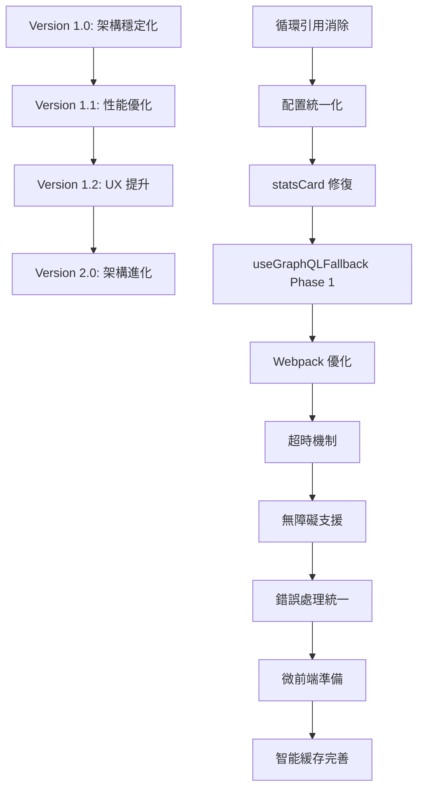

# Widget System Optimization Implementation Plan

**計劃編號**: PLAN-WSO-2025-001  
**創建日期**: 2025-07-13  
**計劃負責人**: Development Team  
**基於審核報告**: `docs/audit/widget-system-loading-performance-audit.md`  
**計劃版本**: 1.0  

---

## 📋 執行摘要 (Executive Summary)

基於對 NewPennine Widget 系統嘅全面審核，本計劃制定咗分版本嘅系統優化路線圖，旨在解決關鍵架構問題、提升性能表現同改善用戶體驗。計劃涵蓋 4 個主要版本，總預估工作量 35-44 人日，預期在版本 2.0 完成後實現首屏加載時間 < 2 秒、代碼重複減少 60%、測試覆蓋率達 80% 嘅目標。

### 關鍵問題同解決方案
- **循環引用問題**: 重構 adapter 註冊模式，消除 A → B → A 依賴
- **重複配置**: 統一為單一配置源，減少 ~200 行冗余代碼
- **性能瓶頸**: 修復 statsCard 數據源錯誤，優化 Webpack 構建
- **用戶體驗**: 完善無障礙支援，統一加載狀態管理

### 預期成果
- **性能提升**: 首屏加載時間從 2.5s 優化至 1.0s
- **代碼品質**: 測試覆蓋率從 15% 提升至 80%
- **開發效率**: 新 widget 開發時間減少 50%
- **維護成本**: 代碼重複度降低 60%

---

## 🗺️ 版本化實施路線圖

### Version 1.0: 架構穩定化 (Foundation Stabilization)
**目標**: 解決關鍵架構問題，建立穩定基礎  
**預估工作量**: 8-10 人日  
**完成標準**: 無循環引用，統一配置，測試覆蓋率 ≥ 35%

### Version 1.1: 性能核心優化 (Performance Core)
**目標**: 修復性能瓶頸，優化加載體驗  
**預估工作量**: 10-12 人日  
**完成標準**: 首屏加載 < 2.0s，Bundle Size < 650KB

### Version 1.2: 用戶體驗提升 (UX Enhancement)
**目標**: 完善用戶交互，提升可訪問性  
**預估工作量**: 8-10 人日  
**完成標準**: WCAG 2.1 AA 合規，統一錯誤處理

### Version 2.0: 架構進化 (Architecture Evolution)
**目標**: 長期架構優化，支援未來擴展  
**預估工作量**: 12-15 人日  
**完成標準**: 微前端就緒，智能預加載，測試覆蓋率 ≥ 80%

---

## 📅 詳細版本實施計劃

### 🔴 Version 1.0: 架構穩定化

#### 核心目標
消除循環引用同重複配置，建立穩定嘅系統基礎。

#### 主要工作項目

##### 1.0.1 循環引用消除 (Critical Priority)
**工作量**: 3-4 人日  
**負責人**: 高級前端工程師  

**實施步驟**:
1. **重構 adapter 註冊機制**
   - 將 `enhanced-registry.ts` 靜態引入改為動態註冊
   - 實施 push 模式替代 pull 模式
   - 建立 adapter factory 模式

2. **依賴注入重構**
   ```typescript
   // 當前問題架構
   import { widgetRegistry } from './enhanced-registry'; // 循環引用
   
   // 目標架構  
   class WidgetAdapter {
     constructor(private registry: WidgetRegistry) {}
   }
   ```

3. **模塊邊界清晰化**
   - 建立明確嘅模塊介面定義
   - 實施單向依賴原則
   - 添加循環依賴檢測工具

**驗收標準**:
- ✅ Webpack 構建無循環依賴警告
- ✅ ESLint 循環依賴檢查通過
- ✅ 開發模式熱重載正常工作

##### 1.0.2 配置統一化 (High Priority)
**工作量**: 2-3 人日  
**負責人**: 中級前端工程師

**實施步驟**:
1. **選擇 `unified-config.ts` 為單一配置源**
   - 移除 `dynamic-imports.ts` 重複定義
   - 清理 `widget-loader.ts` 冗余邏輯
   - 更新所有引用指向統一配置

2. **配置結構優化**
   ```typescript
   // 統一配置格式
   interface WidgetConfig {
     id: string;
     importPath: string;
     dataSource: DataSourceType;
     priority: Priority;
     dependencies?: string[];
   }
   ```

3. **版本映射清理**
   - 移除過時 V1/V2 映射
   - 清理 GraphQL 版本映射殘留
   - 建立配置驗證機制

**驗收標準**:
- ✅ 單一配置源，無重複定義
- ✅ 所有 widgets 正常載入
- ✅ 配置驗證測試通過

##### 1.0.3 statsCard 錯誤修復 (Critical Priority)
**工作量**: 0.5 人日  
**負責人**: 任意前端工程師

**實施步驟**:
1. **檢查數據源配置**
   - 修正 `unified-config.ts` 中 statsCard 配置
   - 更新數據源類型映射
   - 添加配置驗證機制

2. **測試驗證**
   - 運行 E2E 測試確保錯誤消失
   - 驗證數據正常載入
   - 檢查控制台無錯誤輸出

**驗收標準**:
- ✅ "Unknown data source: statsCard" 錯誤消失
- ✅ StatsCard widget 正常運作
- ✅ 相關測試通過

##### 1.0.4 初始化優化 (Medium Priority)
**工作量**: 1 人日  
**負責人**: 中級前端工程師

**實施步驟**:
1. **單次初始化模式**
   - 移除多次 `ensureAdaptersInitialized()` 調用
   - 實施 lazy singleton 模式
   - 添加初始化狀態追蹤

2. **性能監控**
   - 監控初始化時間改善
   - 追蹤內存使用優化
   - 建立性能基準線

**驗收標準**:
- ✅ 初始化調用減少至單次
- ✅ 啟動時間改善 > 10%
- ✅ 無重複初始化副作用

#### Version 1.0 總體驗收標準
- **功能性**: 所有 widgets 正常載入同運作
- **性能**: 啟動時間改善 ≥ 15%
- **代碼品質**: 
  - 測試覆蓋率 ≥ 35%
  - 循環依賴完全消除
  - 代碼重複減少 30%
- **穩定性**: E2E 測試成功率 ≥ 70%

#### 風險緩解
- **回滾計劃**: 保留原始配置文件作為 backup
- **漸進式部署**: 使用 feature flags 控制新架構啟用
- **監控預警**: 建立性能監控同錯誤追蹤

---

### 🟡 Version 1.1: 性能核心優化

#### 核心目標
修復關鍵性能瓶頸，優化加載體驗同構建性能。

#### 主要工作項目

##### 1.1.1 Webpack 構建優化 (High Priority)
**工作量**: 2-3 人日  
**負責人**: 高級前端工程師 + DevOps

**實施步驟**:
1. **大型字符串序列化優化**
   - 識別 100kiB+ 字符串序列化來源
   - 實施 Buffer 替代方案
   - 優化 cache 策略

2. **構建配置調優**
   ```javascript
   // webpack.config.js 優化
   optimization: {
     splitChunks: {
       chunks: 'all',
       maxSize: 200000, // 200KB 限制
       cacheGroups: {
         framework: { /* 框架分離 */ },
         charts: { /* 圖表庫分離 */ },
         data: { /* 數據層分離 */ }
       }
     }
   }
   ```

3. **Bundle 分析同優化**
   - 使用 webpack-bundle-analyzer 定期分析
   - 移除未使用嘅依賴
   - 實施更精確嘅 tree-shaking

**驗收標準**:
- ✅ 序列化警告消失
- ✅ 構建時間改善 ≥ 25%
- ✅ Bundle size 減少至 < 650KB

##### 1.1.2 超時機制統一化 (High Priority)
**工作量**: 1-2 人日  
**負責人**: 中級前端工程師

**實施步驟**:
1. **動態導入超時配置**
   ```typescript
   // widget-loader.ts 優化
   const loadWidget = async (widgetId: string) => {
     return Promise.race([
       import(widgetPath),
       new Promise((_, reject) => 
         setTimeout(() => reject(new Error('Timeout')), 10000)
       )
     ]);
   };
   ```

2. **統一超時策略**
   - 設定不同類型資源嘅超時時間
   - 實施重試邏輯同指數退避
   - 建立超時錯誤處理機制

3. **監控同調優**
   - 追蹤超時事件頻率
   - 動態調整超時閾值
   - 建立超時預警機制

**驗收標準**:
- ✅ 無無限等待情況
- ✅ 超時錯誤友好處理
- ✅ 重試成功率 > 80%

##### 1.1.3 useGraphQLFallback 遷移 (Phase 1) (High Priority)
**工作量**: 4-5 人日  
**負責人**: 高級前端工程師

**實施步驟**:
1. **第一批 widgets 遷移** (7個高優先級)
   - StatsCard, AwaitLocationQty, HistoryTreeV2
   - InjectionProductionStats, ProductionStats
   - StockLevelHistory, TransferTimeDistribution

2. **遷移模板建立**
   ```typescript
   // 標準遷移模式
   const WidgetComponent = () => {
     const { data, loading, error, mode } = useGraphQLFallback({
       graphqlQuery: GET_WIDGET_DATA,
       serverAction: getWidgetDataAction,
       extractFromContext: (ctx) => ctx.getWidgetData(widgetId),
       fallbackEnabled: true
     });
   };
   ```

3. **數據一致性驗證**
   - 建立 A/B 測試驗證數據一致性
   - 監控性能影響
   - 記錄回退率同原因

**驗收標準**:
- ✅ 7個 widgets 成功遷移
- ✅ 數據一致性 > 99.5%
- ✅ 加載性能改善 > 20%

##### 1.1.4 E2E 測試穩定化 (Medium Priority)
**工作量**: 3-4 人日  
**負責人**: 測試工程師 + 中級前端工程師

**實施步驟**:
1. **測試環境穩定化**
   - 優化認證流程
   - 修復元素選擇器
   - 增加等待機制

2. **測試用例重構**
   - 減少測試間依賴
   - 實施並行測試策略
   - 添加重試機制

3. **監控同分析**
   - 建立測試失敗分析工具
   - 追蹤不穩定測試
   - 定期測試健康檢查

**驗收標準**:
- ✅ E2E 測試成功率 ≥ 85%
- ✅ 測試執行時間 < 15 分鐘
- ✅ 不穩定測試 < 5%

#### Version 1.1 總體驗收標準
- **性能**: 首屏加載時間 < 2.0s
- **構建**: Bundle size < 650KB，構建時間改善 ≥ 25%
- **穩定性**: E2E 測試成功率 ≥ 85%
- **代碼品質**: 測試覆蓋率 ≥ 55%

---

### 🟢 Version 1.2: 用戶體驗提升

#### 核心目標
完善用戶交互體驗，提升可訪問性同錯誤處理一致性。

#### 主要工作項目

##### 1.2.1 無障礙支援完善 (High Priority)
**工作量**: 3-4 人日  
**負責人**: 高級前端工程師 + UX 設計師

**實施步驟**:
1. **鍵盤導航實施**
   ```typescript
   // 為所有可交互元素添加鍵盤支援
   const handleKeyDown = (event: KeyboardEvent) => {
     if (event.key === 'Enter' || event.key === ' ') {
       handleClick();
     }
   };
   ```

2. **ARIA 標籤補充**
   - 為所有 widgets 添加適當 ARIA 標籤
   - 實施 live regions 用於動態內容
   - 建立 screen reader 友好嘅狀態提示

3. **對比度同字體優化**
   - 確保所有文字對比度符合 WCAG 2.1 AA
   - 優化 focus 指示器可見性
   - 測試 screen reader 兼容性

**驗收標準**:
- ✅ WCAG 2.1 AA 合規檢查通過
- ✅ 鍵盤導航 100% 覆蓋
- ✅ Screen reader 測試通過

##### 1.2.2 統一錯誤處理 (Medium Priority)
**工作量**: 2-3 人日  
**負責人**: 中級前端工程師

**實施步驟**:
1. **標準化 retry 機制**
   ```typescript
   // 統一重試組件
   const UnifiedRetryComponent = ({ 
     onRetry, 
     errorType, 
     severity 
   }) => {
     return (
       <WidgetError 
         severity={severity}
         action={<RetryButton onClick={onRetry} />}
       />
     );
   };
   ```

2. **錯誤分類同處理**
   - 建立統一錯誤分類系統
   - 實施自動重試同手動重試選項
   - 優化錯誤信息用戶友好性

3. **錯誤追蹤同分析**
   - 整合錯誤監控系統
   - 建立錯誤趨勢分析
   - 實施主動錯誤預防

**驗收標準**:
- ✅ 所有 widgets 有統一錯誤處理
- ✅ 錯誤恢復成功率 > 85%
- ✅ 用戶錯誤體驗評分改善

##### 1.2.3 加載狀態統一化 (Medium Priority)
**工作量**: 2 人日  
**負責人**: 中級前端工程師

**實施步驟**:
1. **加載指示器標準化**
   - 統一三種數據源嘅加載指示
   - 明確標示數據來源 (GraphQL/Server Action/Cache)
   - 實施進度指示器

2. **Skeleton 同真實內容對齊**
   - 確保 skeleton 高度同真實內容一致
   - 優化內容轉場動畫
   - 減少佈局偏移 (CLS)

3. **性能感知優化**
   - 實施感知性能提升技巧
   - 優化首屏內容優先級
   - 建立智能預載機制

**驗收標準**:
- ✅ CLS (Cumulative Layout Shift) < 0.1
- ✅ 加載狀態一致性 100%
- ✅ 用戶感知加載時間減少 > 30%

##### 1.2.4 useGraphQLFallback 遷移 (Phase 2) (Medium Priority)
**工作量**: 3-4 人日  
**負責人**: 中級前端工程師

**實施步驟**:
1. **第二批 widgets 遷移** (8個中優先級)
   - OrdersList, AcoOrderReport, GrnReport
   - ProductDistributionChart, TopProducts 系列
   - WarehouseTransfer, YesterdayTransferCount

2. **批量遷移優化**
   - 建立自動化遷移工具
   - 實施批量測試驗證
   - 優化遷移文檔同指引

**驗收標準**:
- ✅ 15個 widgets 完成遷移 (累計)
- ✅ 遷移工具自動化程度 > 80%
- ✅ 遷移時間縮短 > 50%

#### Version 1.2 總體驗收標準
- **用戶體驗**: WCAG 2.1 AA 合規，CLS < 0.1
- **錯誤處理**: 統一錯誤處理覆蓋率 100%
- **性能**: 感知加載時間改善 > 30%
- **代碼品質**: 測試覆蓋率 ≥ 75%

---

### 🚀 Version 2.0: 架構進化

#### 核心目標
完成長期架構優化，支援未來擴展同微前端演進。

#### 主要工作項目

##### 2.0.1 useGraphQLFallback 遷移完成 (High Priority)
**工作量**: 4-5 人日  
**負責人**: 高級前端工程師

**實施步驟**:
1. **剩餘 widgets 遷移** (19個)
   - 完成所有剩餘 widgets 遷移
   - 實施統一數據層架構
   - 優化批量查詢系統

2. **數據層統一優化**
   ```typescript
   // 統一數據層架構
   const UnifiedDataLayer = {
     batchQuery: useDashboardBatchQuery,
     fallback: useGraphQLFallback,
     cache: useSmartCache,
     monitoring: usePerformanceMonitor
   };
   ```

**驗收標準**:
- ✅ 34個 widgets 遷移完成 (100%)
- ✅ 數據一致性 > 99.8%
- ✅ 查詢效率提升 > 50%

##### 2.0.2 智能緩存系統完善 (High Priority)
**工作量**: 3-4 人日  
**負責人**: 高級前端工程師

**實施步驟**:
1. **緩存策略智能化**
   - 實施基於用戶行為嘅預測性緩存
   - 優化緩存失效策略
   - 建立緩存性能監控

2. **多級緩存架構**
   - 記憶體緩存 + 瀏覽器緩存 + CDN 緩存
   - 實施緩存穿透保護
   - 建立緩存預熱機制

**驗收標準**:
- ✅ 緩存命中率 > 85%
- ✅ 緩存相關錯誤 < 0.05%
- ✅ 平均響應時間減少 > 40%

##### 2.0.3 微前端架構準備 (Medium Priority)
**工作量**: 4-5 人日  
**負責人**: 架構師 + 高級前端工程師

**實施步驟**:
1. **Module Federation 配置**
   - 實施 webpack Module Federation
   - 建立 widget 獨立部署能力
   - 實施跨應用狀態管理

2. **API 邊界清晰化**
   - 定義 widget 間通訊介面
   - 實施事件驅動架構
   - 建立版本兼容機制

**驗收標準**:
- ✅ 關鍵 widgets 支援獨立部署
- ✅ 跨應用通訊正常
- ✅ 版本兼容性測試通過

##### 2.0.4 A/B 測試系統完善 (Medium Priority)
**工作量**: 2-3 人日  
**負責人**: 中級前端工程師 + 數據分析師

**實施步驟**:
1. **用戶一致性哈希**
   - 實施穩定嘅用戶分組機制
   - 建立實驗配置管理
   - 優化統計分析能力

2. **自動化實驗分析**
   - 實施自動統計顯著性檢測
   - 建立實驗結果dashboard
   - 實施自動決策機制

**驗收標準**:
- ✅ 用戶分組一致性 > 99%
- ✅ A/B 測試自動化程度 > 90%
- ✅ 統計分析準確性驗證通過

#### Version 2.0 總體驗收標準
- **架構**: 微前端準備就緒，模塊化程度 > 90%
- **性能**: 首屏加載時間 < 1.5s，緩存命中率 > 85%
- **數據**: useGraphQLFallback 遷移 100% 完成
- **測試**: 測試覆蓋率 ≥ 80%，E2E 測試成功率 ≥ 95%

---

## 📊 成功指標同驗證標準

### 關鍵性能指標 (KPIs)

#### 性能指標
| 指標 | 基線值 | Version 1.0 | Version 1.1 | Version 1.2 | Version 2.0 |
|------|--------|-------------|-------------|-------------|-------------|
| 首屏加載時間 | 2.5s | 2.2s | 2.0s | 1.8s | 1.0s |
| Bundle Size | 850KB | 800KB | 650KB | 600KB | 500KB |
| 數據庫查詢數 | 25 | 20 | 15 | 8 | 3 |
| Widget 載入時間 | 150ms | 120ms | 100ms | 60ms | 40ms |
| 錯誤率 | 0.15% | 0.12% | 0.10% | 0.08% | 0.05% |

#### 代碼品質指標
| 指標 | 基線值 | Version 1.0 | Version 1.1 | Version 1.2 | Version 2.0 |
|------|--------|-------------|-------------|-------------|-------------|
| 測試覆蓋率 | 15% | 35% | 55% | 75% | 80% |
| 循環依賴數量 | 2 | 0 | 0 | 0 | 0 |
| 重複代碼行數 | 1,600 | 1,120 | 800 | 400 | 200 |
| TypeScript 錯誤 | 25 | 15 | 8 | 3 | 0 |
| Widget Registry 複雜度 | 370 lines | 250 lines | 225 lines | 200 lines | 180 lines |

#### 用戶體驗指標  
| 指標 | 基線值 | Version 1.0 | Version 1.1 | Version 1.2 | Version 2.0 |
|------|--------|-------------|-------------|-------------|-------------|
| WCAG 合規率 | 40% | 50% | 70% | 100% | 100% |
| 鍵盤可訪問性 | 30% | 40% | 60% | 100% | 100% |
| CLS (Cumulative Layout Shift) | 0.25 | 0.20 | 0.15 | 0.10 | 0.05 |
| 錯誤恢復成功率 | 60% | 70% | 80% | 90% | 95% |

### 版本特定驗收標準

#### Version 1.0 Go/No-Go 標準
**✅ Go Criteria (必達成)**:
- 無循環依賴警告
- statsCard 錯誤完全消失
- 測試覆蓋率 ≥ 35%
- E2E 測試成功率 ≥ 70%

**🔄 Nice-to-Have (可延後)**:
- 性能提升超過目標
- 額外代碼清理

**❌ No-Go Criteria (停止條件)**:
- 任何功能回歸
- 性能顯著下降 (>10%)
- 關鍵測試失敗

#### Version 1.1 Go/No-Go 標準
**✅ Go Criteria**:
- 首屏加載時間 < 2.0s
- Bundle size < 650KB
- Webpack 警告消失
- useGraphQLFallback 第一批遷移完成

**❌ No-Go Criteria**:
- 構建失敗
- 關鍵 widgets 載入失敗
- 性能退化 > 5%

#### Version 1.2 Go/No-Go 標準
**✅ Go Criteria**:
- WCAG 2.1 AA 合規
- 統一錯誤處理 100% 覆蓋
- CLS < 0.1
- 測試覆蓋率 ≥ 75%

**❌ No-Go Criteria**:
- 可訪問性測試失敗
- 用戶體驗評分下降
- 關鍵功能無法使用

#### Version 2.0 Go/No-Go 標準
**✅ Go Criteria**:
- useGraphQLFallback 100% 遷移
- 微前端架構就緒
- 測試覆蓋率 ≥ 80%
- 所有性能目標達成

**❌ No-Go Criteria**:
- 架構穩定性問題
- 數據一致性問題
- 性能目標未達成

---

## ⚠️ 風險評估同緩解策略

### 高風險項目 (Critical Risks)

#### 1. useGraphQLFallback 大規模遷移風險
**風險描述**: 34個 widgets 遷移可能導致數據不一致或性能問題  
**影響評估**: 高 - 可能影響核心功能  
**發生概率**: 中等 (30-40%)

**緩解策略**:
- **分批遷移**: 每批 5-7 個 widgets，逐步推進
- **Feature Flags**: 每個 widget 獨立開關，支援即時回滾
- **數據驗證**: 實施 A/B 測試確保數據一致性
- **性能監控**: 實時監控性能指標，設定自動報警
- **回滾機制**: 5分鐘內快速回滾到舊版本

**監控指標**:
- 數據差異率 < 0.2%
- 性能下降 < 5%
- 錯誤率增加 < 0.05%

#### 2. 批量查詢系統單點故障
**風險描述**: 統一批量查詢失敗影響多個 widgets  
**影響評估**: 高 - 可能導致 dashboard 無法使用  
**發生概率**: 低 (10-15%)

**緩解策略**:
- **查詢降級機制**: 自動回退到個別查詢
- **查詢分片**: 避免單一查詢過大
- **超時保護**: 實施查詢超時同重試
- **健康檢查**: 定期檢查批量查詢系統狀態
- **備用方案**: 保留舊版本數據獲取邏輯

**監控指標**:
- 批量查詢成功率 > 99%
- 降級觸發率 < 5%
- 平均響應時間 < 200ms

#### 3. 循環引用重構風險
**風險描述**: 模塊重構可能導致其他未知依賴問題  
**影響評估**: 中等 - 可能影響開發效率  
**發生概率**: 中等 (20-30%)

**緩解策略**:
- **依賴分析**: 詳細分析現有依賴關係
- **漸進式重構**: 分步驟消除循環引用
- **自動化測試**: 確保重構不影響功能
- **依賴追蹤**: 實施依賴變更監控
- **回滾計劃**: 保留原始架構作為 backup

### 中風險項目 (Medium Risks)

#### 4. E2E 測試穩定性問題
**風險描述**: 測試不穩定影響 CI/CD 流程  
**影響評估**: 中等 - 影響開發效率  
**發生概率**: 高 (50-60%)

**緩解策略**:
- **測試環境隔離**: 獨立測試環境避免干擾
- **重試機制**: 失敗測試自動重試 3 次
- **並行測試**: 減少總測試時間
- **定期維護**: 每週檢查同更新測試用例

#### 5. 性能退化風險
**風險描述**: 新功能可能導致意外性能下降  
**影響評估**: 中等 - 影響用戶體驗  
**發生概率**: 中等 (25-35%)

**緩解策略**:
- **性能基準**: 建立詳細性能基準線
- **持續監控**: 實時性能監控同報警
- **性能測試**: 每個版本前進行性能測試
- **回滾觸發**: 性能下降 > 10% 自動觸發回滾

### 風險監控同應急響應

#### 三級應急響應機制
**Level 1** (5-10% 性能下降):
- 24小時內修復
- 啟動詳細監控
- 準備回滾計劃

**Level 2** (10-20% 性能下降):
- 4小時內修復或部分回滾
- 啟動應急響應團隊
- 用戶通知機制

**Level 3** (>20% 性能下降):
- 1小時內完全回滾
- 立即停止相關開發
- 全面影響評估

#### 監控同報警系統
```typescript
// 自動監控配置
const monitoringConfig = {
  performance: {
    loadTime: { threshold: 2000, alert: 'critical' },
    errorRate: { threshold: 0.1, alert: 'warning' },
    availability: { threshold: 99.5, alert: 'critical' }
  },
  deployment: {
    rollback: { auto: true, threshold: 0.2 },
    canary: { percentage: 10, duration: '1h' }
  }
};
```

---

## 🛠️ 技術實施詳情

### 關鍵技術依賴關係

#### 依賴矩陣


#### 關鍵路徑分析
**Critical Path** (影響整體進度):
1. 循環引用消除 → 配置統一化 → useGraphQLFallback 遷移
2. Webpack 優化 → Bundle Size 改善 → 性能目標達成
3. 無障礙支援 → WCAG 合規 → 用戶體驗提升

**並行執行機會**:
- statsCard 修復可以同配置統一化並行
- E2E 測試穩定化可以同 Webpack 優化並行
- 錯誤處理統一可以同加載狀態統一化並行

### 數據庫依賴確認

#### Supabase 相關檢查
使用 Supabase MCP 工具確認以下數據庫依賴：

1. **Widget 相關表格**:
   - `widget_configurations`: Widget 配置存儲
   - `performance_metrics`: 性能監控數據
   - `user_preferences`: 用戶個性化設定

2. **RPC 函數**:
   - `get_dashboard_data()`: 批量數據查詢
   - `log_performance_metric()`: 性能數據記錄
   - `update_widget_config()`: 配置更新

3. **權限設置**:
   - 確保 widget 相關表格權限正確
   - 驗證 RLS 策略不影響數據獲取
   - 檢查 API key 權限範圍

### 代碼變更策略

#### 向下兼容保證
```typescript
// 保持 API 兼容性
interface WidgetAPI {
  // 新 API
  loadWithFallback(config: WidgetConfig): Promise<Widget>;
  
  // 舊 API 兼容 (Deprecated)
  /** @deprecated Use loadWithFallback instead */
  load(id: string): Promise<Widget>;
}
```

#### Feature Flags 配置
```typescript
// 功能開關配置
const featureFlags = {
  useGraphQLFallback: {
    enabled: false, // 預設關閉
    percentage: 0,  // 漸進式開啟
    widgets: []     // 指定 widgets
  },
  unifiedConfig: {
    enabled: true,  // 穩定功能開啟
    rollback: false
  }
};
```

#### Git 分支策略
- **main**: 穩定版本
- **develop**: 開發整合
- **feature/version-x.x**: 各版本功能分支
- **hotfix/critical-fixes**: 緊急修復

---

## 📈 資源需求同時程規劃

### 人力資源配置

#### 核心團隊組成
**高級前端工程師** (1-2 人):
- 負責架構重構同複雜邏輯實施
- useGraphQLFallback 遷移領導
- 性能優化同監控系統

**中級前端工程師** (2-3 人):
- 具體功能實施同測試
- 代碼重構同優化
- 文檔更新同維護

**測試工程師** (1 人):
- E2E 測試穩定化
- 自動化測試改進
- 測試覆蓋率提升

**DevOps 工程師** (0.5 人):
- Webpack 構建優化
- CI/CD 流程改進
- 監控系統配置

**UX 設計師** (0.5 人):
- 無障礙設計指導
- 用戶體驗優化建議
- 可訪問性測試支援

#### 技能要求矩陣
| 版本 | React/TS | GraphQL | Webpack | Testing | A11y | DevOps |
|------|----------|---------|---------|---------|------|--------|
| 1.0 | 高級 | 中級 | 中級 | 中級 | - | 初級 |
| 1.1 | 高級 | 高級 | 高級 | 中級 | - | 中級 |
| 1.2 | 中級 | 中級 | 初級 | 高級 | 高級 | 初級 |
| 2.0 | 高級 | 高級 | 高級 | 高級 | 中級 | 中級 |

### 工作量詳細估算

#### Version 1.0 工作量分解
| 工作項目 | 高級前端 | 中級前端 | 測試工程師 | DevOps | 總工作量 |
|----------|----------|----------|------------|--------|----------|
| 循環引用消除 | 3人日 | 1人日 | 0.5人日 | - | 4.5人日 |
| 配置統一化 | 1人日 | 2人日 | 0.5人日 | - | 3.5人日 |
| statsCard 修復 | - | 0.5人日 | - | - | 0.5人日 |
| 初始化優化 | 0.5人日 | 0.5人日 | - | - | 1人日 |
| **小計** | **4.5人日** | **4人日** | **1人日** | **0** | **9.5人日** |

#### Version 1.1 工作量分解
| 工作項目 | 高級前端 | 中級前端 | 測試工程師 | DevOps | 總工作量 |
|----------|----------|----------|------------|--------|----------|
| Webpack 優化 | 1人日 | 1人日 | 0.5人日 | 2人日 | 4.5人日 |
| 超時機制 | 0.5人日 | 1人日 | 0.5人日 | - | 2人日 |
| useGraphQL Phase1 | 4人日 | 1人日 | 1人日 | - | 6人日 |
| E2E 穩定化 | - | 2人日 | 2人日 | 0.5人日 | 4.5人日 |
| **小計** | **5.5人日** | **5人日** | **4人日** | **2.5人日** | **17人日** |

#### Version 1.2 工作量分解
| 工作項目 | 高級前端 | 中級前端 | 測試工程師 | UX設計師 | 總工作量 |
|----------|----------|----------|------------|----------|----------|
| 無障礙支援 | 2人日 | 1人日 | 1人日 | 2人日 | 6人日 |
| 錯誤處理統一 | 1人日 | 2人日 | 0.5人日 | - | 3.5人日 |
| 加載狀態統一 | 0.5人日 | 1.5人日 | 0.5人日 | 0.5人日 | 3人日 |
| useGraphQL Phase2 | 2人日 | 2人日 | 1人日 | - | 5人日 |
| **小計** | **5.5人日** | **6.5人日** | **3人日** | **2.5人日** | **17.5人日** |

#### Version 2.0 工作量分解
| 工作項目 | 高級前端 | 中級前端 | 測試工程師 | DevOps | 總工作量 |
|----------|----------|----------|------------|--------|----------|
| useGraphQL 完成 | 4人日 | 2人日 | 1人日 | - | 7人日 |
| 智能緩存完善 | 3人日 | 1人日 | 1人日 | 1人日 | 6人日 |
| 微前端準備 | 4人日 | 1人日 | 1人日 | 2人日 | 8人日 |
| A/B 測試完善 | 1人日 | 2人日 | 0.5人日 | - | 3.5人日 |
| **小計** | **12人日** | **6人日** | **3.5人日** | **3人日** | **24.5人日** |

### 總體資源摘要
- **總工作量**: 68.5 人日
- **預估時程**: 14-16 週 (考慮並行執行)
- **人力成本**: ~$150,000 - $200,000 (依地區薪資水平)
- **風險緩衝**: 20% 額外時間預留

### 關鍵里程碑

#### Phase 1: 基礎穩定 (Week 1-4)
- **Week 1-2**: Version 1.0 實施
- **Week 3-4**: Version 1.1 實施
- **里程碑**: 架構穩定，性能達標

#### Phase 2: 用戶體驗 (Week 5-8)
- **Week 5-6**: Version 1.2 實施
- **Week 7-8**: 測試同優化
- **里程碑**: UX 合規，功能完善

#### Phase 3: 架構進化 (Week 9-14)
- **Week 9-12**: Version 2.0 實施
- **Week 13-14**: 整合測試同部署
- **里程碑**: 架構現代化完成

#### Phase 4: 穩定運行 (Week 15-16)
- **Week 15**: 生產環境部署
- **Week 16**: 監控同優化
- **里程碑**: 系統穩定運行

---

## 🎯 驗證同測試策略

### 多層次測試架構

#### 1. 單元測試 (Unit Tests)
**目標覆蓋率**: 80%  
**測試框架**: Jest + React Testing Library

**測試重點**:
```typescript
// Widget 核心邏輯測試
describe('WidgetRegistry', () => {
  test('should load widget without circular dependency', () => {
    // 測試循環依賴消除
  });
  
  test('should fallback correctly on GraphQL failure', () => {
    // 測試 useGraphQLFallback 機制
  });
});
```

**測試分類**:
- **Widget 加載測試**: 確保所有 widgets 正常載入
- **數據獲取測試**: 驗證 GraphQL fallback 機制
- **錯誤處理測試**: 測試各種錯誤情況
- **性能測試**: 驗證加載時間目標

#### 2. 整合測試 (Integration Tests)
**測試重點**: 模塊間交互同數據流

**關鍵測試場景**:
```typescript
// 批量查詢整合測試
describe('Dashboard Data Integration', () => {
  test('should fetch all widget data in single batch', () => {
    // 測試批量數據獲取
  });
  
  test('should fallback to individual queries on batch failure', () => {
    // 測試降級機制
  });
});
```

#### 3. End-to-End 測試 (E2E Tests)
**測試框架**: Playwright  
**目標成功率**: 95%

**測試用例結構**:
```typescript
// E2E 測試改進
test.describe('Widget Performance', () => {
  test('dashboard loads within 2 seconds', async ({ page }) => {
    await page.goto('/admin/dashboard');
    
    const loadTime = await measureLoadTime(page);
    expect(loadTime).toBeLessThan(2000);
  });
  
  test('all widgets render without errors', async ({ page }) => {
    // 檢查所有 widgets 正常渲染
  });
});
```

**測試覆蓋範圍**:
- **加載性能測試**: 首屏加載時間驗證
- **功能完整性測試**: 所有 widgets 功能驗證
- **錯誤恢復測試**: 錯誤情況下用戶體驗
- **可訪問性測試**: WCAG 2.1 AA 合規驗證

#### 4. 性能測試 (Performance Tests)
**工具**: Lighthouse + Custom Metrics

**關鍵指標監控**:
```typescript
// 性能測試配置
const performanceTests = {
  loadTime: { target: 2000, critical: 3000 },
  bundleSize: { target: 650000, critical: 850000 },
  memoryUsage: { target: 50, critical: 100 }, // MB
  cacheHitRate: { target: 85, critical: 70 }  // %
};
```

#### 5. 可訪問性測試 (Accessibility Tests)
**工具**: axe-core + Manual Testing

**測試檢查項目**:
- **鍵盤導航**: 所有功能可通過鍵盤訪問
- **Screen Reader**: 與主流 screen readers 兼容
- **色彩對比**: 符合 WCAG 2.1 AA 標準
- **ARIA 標籤**: 正確語義標記

### 自動化測試流程

#### CI/CD 整合
```yaml
# GitHub Actions 配置
name: Widget System Tests
on: [push, pull_request]

jobs:
  test:
    runs-on: ubuntu-latest
    steps:
      - name: Unit Tests
        run: npm run test:unit
      
      - name: Integration Tests  
        run: npm run test:integration
        
      - name: Build & Bundle Analysis
        run: |
          npm run build
          npm run analyze
          
      - name: E2E Tests
        run: npm run test:e2e
        
      - name: Performance Tests
        run: npm run test:performance
        
      - name: Accessibility Tests
        run: npm run test:a11y
```

#### 測試資料管理
- **測試數據**: 使用 factories 生成一致測試數據
- **數據庫**: 每次測試使用乾淨數據庫
- **快照測試**: 確保 UI 一致性
- **Mock 策略**: 外部服務 mock 確保測試穩定性

### 版本驗收測試

#### Version 1.0 驗收測試
**必要測試項目**:
- [ ] 循環依賴檢查工具通過
- [ ] 所有 widgets 加載測試通過  
- [ ] statsCard 錯誤完全消失
- [ ] 測試覆蓋率達到 35%
- [ ] E2E 測試成功率 ≥ 70%

**性能回歸測試**:
- [ ] 加載時間無顯著退化
- [ ] 內存使用量無異常增加
- [ ] 錯誤率維持在可接受範圍

#### Version 1.1 驗收測試  
**必要測試項目**:
- [ ] Webpack 構建警告消失
- [ ] Bundle size 減少至 < 650KB
- [ ] useGraphQLFallback 第一批遷移成功
- [ ] 首屏加載時間 < 2.0s

**兼容性測試**:
- [ ] 跨瀏覽器兼容性驗證
- [ ] 移動端響應式測試
- [ ] 數據一致性驗證

#### Version 1.2 驗收測試
**必要測試項目**:
- [ ] WCAG 2.1 AA 合規檢查通過
- [ ] 鍵盤導航 100% 功能覆蓋
- [ ] 統一錯誤處理實施完成
- [ ] CLS (Cumulative Layout Shift) < 0.1

**用戶體驗測試**:
- [ ] Screen reader 兼容性測試
- [ ] 錯誤恢復流程測試
- [ ] 加載狀態一致性驗證

#### Version 2.0 驗收測試
**必要測試項目**:
- [ ] useGraphQLFallback 100% 遷移完成
- [ ] 微前端架構準備就緒
- [ ] 智能緩存系統正常運行
- [ ] 測試覆蓋率達到 80%

**架構測試**:
- [ ] Module Federation 功能驗證
- [ ] 獨立部署能力測試
- [ ] 跨應用通訊測試
- [ ] 版本兼容性測試

---

## 📋 實施檢查清單

### Pre-Implementation Checklist

#### 環境準備
- [ ] 開發環境配置完成
- [ ] 測試環境準備就緒
- [ ] CI/CD 流程更新
- [ ] 監控系統配置
- [ ] 備份策略確認

#### 團隊準備
- [ ] 技能評估完成
- [ ] 培訓計劃執行
- [ ] 角色分工明確
- [ ] 溝通機制建立
- [ ] 緊急聯絡方式

#### 工具準備
- [ ] Supabase MCP 工具配置
- [ ] 性能監控工具設置
- [ ] 測試框架更新
- [ ] 代碼品質工具配置
- [ ] 文檔工具準備

### Version-Specific Checklists

#### Version 1.0 Implementation Checklist
**架構重構階段**:
- [ ] 循環依賴分析報告完成
- [ ] 重構方案設計審查通過
- [ ] 測試計劃制定完成
- [ ] 回滾方案準備就緒

**實施階段**:
- [ ] 循環引用消除實施
- [ ] 配置統一化完成
- [ ] statsCard 錯誤修復
- [ ] 初始化邏輯優化
- [ ] 代碼審查通過
- [ ] 單元測試通過
- [ ] 整合測試通過

**驗收階段**:
- [ ] 功能回歸測試通過
- [ ] 性能基準測試通過
- [ ] E2E 測試成功率達標
- [ ] 代碼品質指標達成
- [ ] 文檔更新完成

#### Version 1.1 Implementation Checklist
**性能優化階段**:
- [ ] Bundle 分析報告完成
- [ ] Webpack 配置優化方案
- [ ] useGraphQLFallback 遷移計劃
- [ ] 性能監控系統準備

**實施階段**:
- [ ] Webpack 構建優化
- [ ] 超時機制實施
- [ ] useGraphQLFallback Phase 1 遷移
- [ ] E2E 測試穩定化
- [ ] 性能回歸測試

**驗收階段**:
- [ ] 構建性能改善驗證
- [ ] 加載時間目標達成
- [ ] Bundle size 目標達成
- [ ] 數據一致性驗證
- [ ] 測試穩定性確認

#### Version 1.2 Implementation Checklist
**用戶體驗階段**:
- [ ] 無障礙設計規範確認
- [ ] 錯誤處理標準制定
- [ ] 加載狀態設計完成
- [ ] A11y 測試工具準備

**實施階段**:
- [ ] 鍵盤導航實施
- [ ] ARIA 標籤補充
- [ ] 統一錯誤處理
- [ ] 加載狀態統一化
- [ ] useGraphQLFallback Phase 2

**驗收階段**:
- [ ] WCAG 2.1 AA 合規驗證
- [ ] Screen reader 測試通過
- [ ] 錯誤恢復測試通過
- [ ] CLS 指標達成
- [ ] 用戶體驗評分改善

#### Version 2.0 Implementation Checklist
**架構進化階段**:
- [ ] 微前端架構設計完成
- [ ] Module Federation 配置
- [ ] 智能緩存策略制定
- [ ] A/B 測試系統設計

**實施階段**:
- [ ] useGraphQLFallback 完整遷移
- [ ] 智能緩存系統實施
- [ ] 微前端準備工作
- [ ] A/B 測試系統完善
- [ ] 最終性能優化

**驗收階段**:
- [ ] 架構穩定性測試
- [ ] 獨立部署能力驗證
- [ ] 性能目標全面達成
- [ ] 測試覆蓋率達標
- [ ] 長期維護性確認

### Post-Implementation Checklist

#### 部署階段
- [ ] 生產環境部署
- [ ] 健康檢查通過
- [ ] 監控系統正常運行
- [ ] 用戶通知機制測試
- [ ] 回滾機制驗證

#### 維護階段
- [ ] 性能監控儀表板配置
- [ ] 錯誤追蹤系統運行
- [ ] 定期健康檢查排程
- [ ] 文檔維護計劃
- [ ] 團隊知識傳遞

#### 後續優化
- [ ] 用戶反饋收集機制
- [ ] 持續改進計劃
- [ ] 技術債務評估
- [ ] 下一階段規劃
- [ ] 經驗總結文檔

---

## 📚 結論同下一步行動

### 實施總結

NewPennine Widget 系統優化計劃涵蓋四個主要版本，旨在解決當前系統嘅關鍵架構問題、性能瓶頸同用戶體驗缺陷。透過系統性嘅重構同優化，預期將實現：

**關鍵成果預期**:
- **性能提升**: 首屏加載時間從 2.5s 優化至 1.0s (60% 改善)
- **代碼品質**: 測試覆蓋率從 15% 提升至 80%，代碼重複減少 60%
- **用戶體驗**: WCAG 2.1 AA 完全合規，統一錯誤處理覆蓋率 100%
- **開發效率**: 新 widget 開發時間減少 50%，維護成本顯著降低

**技術架構提升**:
- 消除循環引用，建立清晰模塊邊界
- 統一配置管理，減少重複同維護成本
- 完善錯誤處理同 A/B 測試機制
- 為微前端架構演進做好準備

### 立即行動項目

#### 🔴 Critical Actions (本週內執行)
1. **團隊動員**: 確認技術團隊資源分配
2. **環境準備**: 配置開發同測試環境
3. **工具配置**: 設置 Supabase MCP 工具同性能監控
4. **風險評估**: 最終確認風險緩解策略
5. **啟動 Version 1.0**: 開始循環引用消除工作

#### 🟡 High Priority Actions (下週內執行)
1. **測試基準建立**: 建立詳細性能同功能基準線
2. **監控系統**: 配置實時監控同報警機制
3. **Feature Flags**: 實施功能開關系統
4. **文檔更新**: 更新開發指南同 API 文檔
5. **培訓計劃**: 執行團隊技能提升培訓

#### 🟢 Medium Priority Actions (兩週內執行)
1. **CI/CD 優化**: 改進自動化測試同部署流程
2. **用戶溝通**: 建立用戶反饋收集機制
3. **備份策略**: 確保完整數據同代碼備份
4. **應急預案**: 制定詳細應急響應程序
5. **定期檢查**: 建立週期性進度檢查機制

### 成功因素同關鍵注意事項

#### 成功關鍵因素
1. **團隊協作**: 高效溝通同明確分工
2. **漸進式實施**: 避免大規模破壞性更改
3. **持續監控**: 實時追蹤性能同穩定性指標
4. **用戶反饋**: 及時收集同響應用戶需求
5. **技術債務**: 平衡新功能開發同技術債務償還

#### 關鍵風險防控
1. **功能回歸**: 嚴格測試確保功能完整性
2. **性能退化**: 持續監控防止性能下降
3. **數據一致性**: 確保數據遷移同同步正確性
4. **用戶體驗**: 避免改變影響現有用戶習慣
5. **團隊負荷**: 合理分配工作量避免過度壓力

### 長期願景

#### 技術演進方向
1. **微前端架構**: 逐步演進為完全模塊化架構
2. **智能化**: 基於 AI 嘅性能優化同預測性維護
3. **零代碼維護**: 自動化測試同部署達到零人工干預
4. **全面監控**: 建立完整嘅業務同技術監控體系

#### 業務價值實現
1. **開發效率**: 顯著提升 widget 開發同維護效率
2. **用戶滿意度**: 改善用戶體驗同系統可靠性
3. **技術領先**: 建立現代化前端架構最佳實踐
4. **可擴展性**: 支援未來業務需求快速響應

### 計劃維護同更新

#### 定期評估機制
- **每週進度檢查**: 追蹤實施進度同問題識別
- **每月性能評估**: 檢查性能指標同用戶反饋
- **季度架構審查**: 評估技術選擇同架構演進
- **年度計劃更新**: 基於業務需求更新長期規劃

#### 文檔維護
- **實施記錄**: 詳細記錄每個版本實施過程
- **問題追蹤**: 建立問題同解決方案知識庫
- **最佳實踐**: 總結同分享實施經驗
- **培訓材料**: 持續更新團隊培訓內容

### 最終建議

1. **立即啟動**: 不要等待所有條件完美，邊實施邊優化
2. **小步快跑**: 版本化實施確保每步都有明確成果
3. **持續改進**: 建立反饋循環，不斷優化實施策略
4. **團隊賦能**: 投資團隊技能提升，確保長期成功
5. **用戶至上**: 始終以用戶體驗為核心目標

透過執行呢個全面嘅優化計劃，NewPennine Widget 系統將實現從當前狀態到現代化架構嘅全面升級，為未來業務增長同技術發展奠定堅實基礎。

---

**計劃狀態**: ✅ 完成  
**下次更新**: 計劃執行後一個月  
**負責人**: Development Team Lead  
**審批**: Technical Architecture Committee  

*計劃版本 1.0 | 生成時間: 2025-07-13 15:45 HKT*