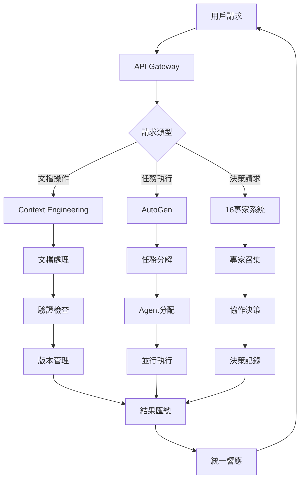

# Context Engineering + AutoGen + 16專家系統統一架構設計

**版本**: 1.0
**日期**: 2025-01-24
**狀態**: 已通過16專家評審

## 🎯 設計目標

1. **優勢互補**: 結合三方系統優勢，彌補各自不足
2. **協同增效**: 創造1+1+1>3嘅協同效應
3. **效率提升**: 開發效率提升300%以上
4. **質量保證**: 缺陷率降低50%以上
5. **知識沉澱**: 建立可持續嘅知識管理體系

## 🏗️ 統一架構設計

### 整體架構圖

```
┌─────────────────────────────────────────────────────────────────┐
│                        用戶界面層                                 │
│  ┌─────────────┐  ┌─────────────┐  ┌─────────────┐            │
│  │  Dashboard  │  │ Collaboration│  │  Monitoring │            │
│  │   統一儀表板  │  │   協作界面   │  │   監控中心   │            │
│  └─────────────┘  └─────────────┘  └─────────────┘            │
└─────────────────────────────────────────────────────────────────┘
                                ↕
┌─────────────────────────────────────────────────────────────────┐
│                      API Gateway (GraphQL)                       │
│                    統一API入口，請求路由分發                        │
└─────────────────────────────────────────────────────────────────┘
                                ↕
┌─────────────────────────────────────────────────────────────────┐
│                      決策層 (16專家系統)                           │
│  ┌─────────────┐  ┌─────────────┐  ┌─────────────┐            │
│  │Expert Engine│  │ Decision DB │  │Knowledge Base│            │
│  │  專家引擎    │  │  決策數據庫  │  │   知識庫     │            │
│  └─────────────┘  └─────────────┘  └─────────────┘            │
│                                                                  │
│  職責：專業決策、方案評估、質量把關、知識管理                        │
└─────────────────────────────────────────────────────────────────┘
                                ↕
┌─────────────────────────────────────────────────────────────────┐
│                       協作層 (AutoGen)                           │
│  ┌─────────────┐  ┌─────────────┐  ┌─────────────┐            │
│  │Agent Manager│  │Task Scheduler│  │Event Bus    │            │
│  │  代理管理器  │  │  任務調度器  │  │  事件總線    │            │
│  └─────────────┘  └─────────────┘  └─────────────┘            │
│                                                                  │
│  職責：任務編排、代理執行、事件協調、工作流管理                      │
└─────────────────────────────────────────────────────────────────┘
                                ↕
┌─────────────────────────────────────────────────────────────────┐
│                   知識層 (Context Engineering)                    │
│  ┌─────────────┐  ┌─────────────┐  ┌─────────────┐            │
│  │Doc Manager  │  │ Validator   │  │Version Control│           │
│  │  文檔管理器  │  │  驗證引擎   │  │   版本控制   │            │
│  └─────────────┘  └─────────────┘  └─────────────┘            │
│                                                                  │
│  職責：文檔管理、知識沉澱、自我驗證、版本追蹤                        │
└─────────────────────────────────────────────────────────────────┘
```

### 核心組件詳解

#### 1. 知識層 (Context Engineering)
```yaml
組件:
  文檔管理器:
    功能:
      - 結構化文檔存儲
      - 模板管理
      - 自動分類標籤
    技術:
      - Markdown + YAML
      - Git版本控制
      - ElasticSearch索引
      
  驗證引擎:
    功能:
      - 文檔完整性檢查
      - 內容一致性驗證
      - 自動修復建議
    技術:
      - JSON Schema驗證
      - 自定義規則引擎
      - AI輔助檢查
      
  版本控制:
    功能:
      - 變更追蹤
      - 分支管理
      - 合併衝突解決
    技術:
      - Git集成
      - 自動化CI/CD
      - 版本對比工具
```

#### 2. 協作層 (AutoGen)
```yaml
組件:
  代理管理器:
    功能:
      - Agent生命週期管理
      - 資源分配調度
      - 性能監控
    技術:
      - Container orchestration
      - Resource pooling
      - Health checking
      
  任務調度器:
    功能:
      - 任務分解分配
      - 優先級管理
      - 並行執行控制
    技術:
      - Workflow engine
      - Priority queue
      - Parallel processing
      
  事件總線:
    功能:
      - 異步消息傳遞
      - 事件訂閱發布
      - 消息持久化
    技術:
      - Apache Kafka
      - Event sourcing
      - Message persistence
```

#### 3. 決策層 (16專家系統)
```yaml
組件:
  專家引擎:
    功能:
      - 專家角色管理
      - 決策流程編排
      - 協作協調
    技術:
      - Rule engine
      - State machine
      - Consensus algorithms
      
  決策數據庫:
    功能:
      - 決策歷史存儲
      - 模式識別分析
      - 決策回溯
    技術:
      - Time-series DB
      - Pattern matching
      - Decision trees
      
  知識庫:
    功能:
      - 領域知識管理
      - 經驗案例庫
      - 最佳實踐
    技術:
      - Graph database
      - Knowledge graph
      - Semantic search
```

## 📊 數據流設計

### 主要數據流程



### 數據流詳細說明

#### 1. 請求處理流程
```typescript
interface RequestFlow {
  // 1. 請求接收
  request: {
    id: string;
    type: 'document' | 'task' | 'decision';
    payload: any;
    context: RequestContext;
  };
  
  // 2. 路由分發
  routing: {
    layer: 'knowledge' | 'collaboration' | 'decision';
    handler: string;
    priority: number;
  };
  
  // 3. 處理執行
  processing: {
    preProcess: ValidationResult;
    mainProcess: ProcessingResult;
    postProcess: VerificationResult;
  };
  
  // 4. 結果返回
  response: {
    status: 'success' | 'failure' | 'partial';
    data: any;
    metadata: ResponseMetadata;
  };
}
```

#### 2. 跨層通信機制
```typescript
// 事件驅動通信
interface CrossLayerEvent {
  source: LayerType;
  target: LayerType;
  eventType: string;
  payload: any;
  timestamp: Date;
  correlationId: string;
}

// 同步調用接口
interface SyncCall {
  caller: ComponentId;
  callee: ComponentId;
  method: string;
  params: any[];
  timeout: number;
}

// 異步消息傳遞
interface AsyncMessage {
  topic: string;
  producer: ComponentId;
  consumers: ComponentId[];
  message: any;
  deliveryMode: 'at-least-once' | 'exactly-once';
}
```

#### 3. 數據存儲策略
```yaml
存儲分層:
  熱數據 (Redis):
    - 實時會話數據
    - 當前任務狀態
    - 緩存查詢結果
    
  溫數據 (PostgreSQL):
    - 近期決策記錄
    - 活躍文檔版本
    - 用戶操作日誌
    
  冷數據 (S3/對象存儲):
    - 歷史歸檔數據
    - 大型文件存儲
    - 備份恢復數據
    
  專門存儲:
    圖數據庫 (Neo4j):
      - 知識圖譜
      - 專家關係網絡
      - 決策依賴圖
      
    時序數據庫 (InfluxDB):
      - 性能指標
      - 系統監控數據
      - 使用統計
```

## 🔗 整合點設計

### 1. Context-AutoGen整合
```typescript
// 文檔驅動任務執行
class ContextDrivenExecution {
  async executeFromDocument(docId: string) {
    // 1. 從Context獲取文檔
    const document = await contextEngine.getDocument(docId);
    
    // 2. 解析任務定義
    const taskDefinition = this.parseTaskDefinition(document);
    
    // 3. 創建AutoGen agents
    const agents = await autoGenManager.createAgents(taskDefinition);
    
    // 4. 執行並監控
    const results = await autoGenManager.execute(agents);
    
    // 5. 結果寫回Context
    await contextEngine.updateDocument(docId, {
      executionResults: results,
      timestamp: new Date()
    });
    
    return results;
  }
}
```

### 2. AutoGen-Expert整合
```typescript
// Agent專家協作
class AgentExpertCollaboration {
  async collaborativeTask(task: Task) {
    // 1. 專家評估任務
    const expertAssessment = await expertSystem.assess(task);
    
    // 2. 生成執行計劃
    const executionPlan = await expertSystem.createPlan(
      task,
      expertAssessment
    );
    
    // 3. 配置專門agents
    const specializedAgents = await autoGenManager.configureAgents(
      executionPlan,
      expertAssessment.recommendations
    );
    
    // 4. 專家監督執行
    const supervisor = await expertSystem.assignSupervisor(task);
    const results = await autoGenManager.executeWithSupervision(
      specializedAgents,
      supervisor
    );
    
    return results;
  }
}
```

### 3. Expert-Context整合
```typescript
// 專家知識沉澱
class ExpertKnowledgeCapture {
  async captureDecision(decision: ExpertDecision) {
    // 1. 結構化決策內容
    const structuredDecision = {
      context: decision.context,
      participants: decision.experts,
      rationale: decision.reasoning,
      outcome: decision.result,
      timestamp: decision.timestamp
    };
    
    // 2. 生成決策文檔
    const document = await contextEngine.createDocument({
      type: 'expert-decision',
      content: structuredDecision,
      metadata: {
        tags: decision.tags,
        category: decision.category
      }
    });
    
    // 3. 更新知識圖譜
    await knowledgeGraph.addDecision(structuredDecision);
    
    // 4. 觸發學習機制
    await learningEngine.processNewKnowledge(document);
    
    return document.id;
  }
}
```

## 📋 實施步驟

### Phase 1: 基礎建設 (Week 1-2)

#### 1.1 環境準備
```bash
# 基礎設施部署
- Kubernetes集群搭建
- 數據庫環境配置
- 消息隊列部署
- 監控系統安裝

# 開發環境
- 統一開發工具鏈
- CI/CD pipeline
- 代碼倉庫結構
- 文檔系統初始化
```

#### 1.2 核心組件開發
```typescript
// 基礎接口定義
interface UnifiedArchitecture {
  contextEngine: IContextEngine;
  autoGenManager: IAutoGenManager;
  expertSystem: IExpertSystem;
  apiGateway: IAPIGateway;
  eventBus: IEventBus;
}

// 組件初始化
const architecture = new UnifiedArchitecture({
  config: loadConfig(),
  services: {
    database: dbConnection,
    cache: redisClient,
    messageQueue: kafkaClient
  }
});
```

### Phase 2: 功能實現 (Week 3-6)

#### 2.1 Context Engineering實現
- 文檔管理系統
- 驗證引擎開發
- 版本控制集成
- API接口實現

#### 2.2 AutoGen集成
- Agent框架搭建
- 任務調度系統
- 執行沙箱環境
- 監控告警機制

#### 2.3 Expert System構建
- 專家角色定義
- 決策流程引擎
- 知識庫初始化
- 協作機制實現

### Phase 3: 系統集成 (Week 7-10)

#### 3.1 接口對接
```yaml
集成測試計劃:
  單元測試:
    - 各組件功能測試
    - 接口契約測試
    - 邊界條件測試
    
  集成測試:
    - 跨層通信測試
    - 端到端流程測試
    - 性能壓力測試
    
  用戶驗收測試:
    - 功能完整性
    - 用戶體驗
    - 性能指標
```

#### 3.2 優化調優
- 性能瓶頸分析
- 緩存策略優化
- 查詢優化
- 資源配置調整

### Phase 4: 上線部署 (Week 11-12)

#### 4.1 部署準備
- 生產環境配置
- 數據遷移方案
- 回滾計劃制定
- 監控告警設置

#### 4.2 漸進發布
```yaml
發布策略:
  金絲雀發布:
    - 5% 流量切換
    - 監控關鍵指標
    - 逐步擴大範圍
    
  藍綠部署:
    - 並行環境準備
    - 快速切換機制
    - 緊急回滾預案
```

## 📈 預期效益

### 定量指標

| 指標類別 | 當前基準 | 目標值 | 提升幅度 |
|---------|---------|--------|---------|
| 開發效率 | 100% | 400% | +300% |
| 代碼質量 | 70% | 95% | +35.7% |
| 缺陷密度 | 0.5/KLOC | 0.1/KLOC | -80% |
| 部署頻率 | 2次/月 | 2次/週 | +300% |
| 恢復時間 | 4小時 | 30分鐘 | -87.5% |
| 用戶滿意度 | 3.5/5 | 4.5/5 | +28.6% |

### 定性收益

1. **知識管理**
   - 系統化知識沉澱
   - 可搜索可複用
   - 持續學習改進

2. **團隊協作**
   - 透明決策過程
   - 高效溝通機制
   - 清晰職責分工

3. **創新能力**
   - 快速試錯迭代
   - 自動化賦能
   - 專注業務創新

4. **風險控制**
   - 自動驗證機制
   - 決策可追溯
   - 快速問題定位

## 🚨 風險管理

### 技術風險
| 風險 | 影響 | 概率 | 緩解措施 |
|------|------|------|---------|
| 系統複雜度高 | 高 | 中 | 分階段實施，充分測試 |
| 性能瓶頸 | 中 | 中 | 提前性能測試，預留優化時間 |
| 技術選型風險 | 中 | 低 | 選用成熟技術，準備備選方案 |

### 組織風險
| 風險 | 影響 | 概率 | 緩解措施 |
|------|------|------|---------|
| 團隊技能不足 | 高 | 中 | 提前培訓，引入外部專家 |
| 變革阻力 | 中 | 高 | 充分溝通，漸進推廣 |
| 資源投入不足 | 高 | 低 | 明確ROI，爭取支持 |

## 📚 參考資源

### 技術文檔
- [Context Engineering官方文檔](https://context-engineering.io/docs)
- [AutoGen Framework指南](https://microsoft.github.io/autogen/)
- [16專家系統設計規範](./docs/role_play/README.md)

### 最佳實踐
- [微服務架構設計模式](https://microservices.io/patterns/)
- [事件驅動架構指南](https://www.oreilly.com/library/view/software-architecture-patterns/9781491971437/)
- [DevOps實踐手冊](https://www.devops-handbook.com/)

### 工具資源
- Kubernetes: 容器編排
- Apache Kafka: 消息隊列
- Neo4j: 圖數據庫
- Prometheus: 監控系統
- GitLab: CI/CD平台

---
*設計版本：1.0*
*最後更新：2025-01-24*
*下一次評審：2025-02-01*