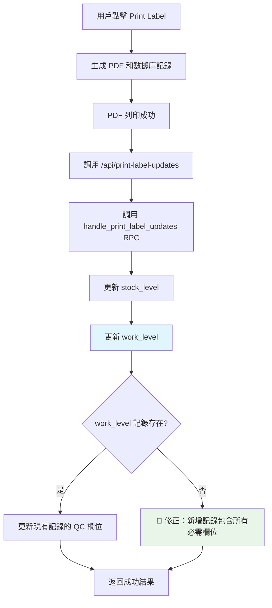

# 🔧 Print Label Work Level 錯誤修正

## 📅 修正日期
2025年1月3日

## 🎯 問題描述

在使用 Print Label 功能時出現數據庫錯誤：
```
Error updating work level: null value in column "grn" of relation "work_level" violates not-null constraint
```

## 📋 問題分析

### 錯誤來源
錯誤發生在 `/api/print-label-updates` API 調用 `handle_print_label_updates` RPC 函數時，具體在 `update_work_level_qc` 函數的 INSERT 操作中。

### 根本原因
在 `update_work_level_qc` 函數中，當新增 `work_level` 記錄時，沒有包含 `grn` 欄位，但該欄位在數據庫中設置了 NOT NULL 約束。

**問題代碼**：
```sql
-- ❌ 錯誤：缺少 grn 欄位
INSERT INTO work_level (id, QC, Move, latest_update)
VALUES (p_user_id, p_pallet_count, 0, NOW());
```

### 對比其他函數
其他相關的 RPC 函數都正確包含了 `grn` 欄位：

**`update_work_level_grn` 函數**：
```sql
-- ✅ 正確：包含 grn 欄位
INSERT INTO work_level (id, qc, move, grn, latest_update)
VALUES (p_user_id, 0, 0, p_grn_count, NOW());
```

**`update_work_level_move` 函數**：
```sql
-- ✅ 正確：包含 grn 欄位
INSERT INTO work_level (id, qc, move, grn, latest_update)
VALUES (p_user_id, 0, p_move_count, 0, NOW());
```

## 🔧 解決方案

### 修正 SQL 函數
**文件**：`scripts/print-label-enhancement-rpc.sql`

**修改前**：
```sql
ELSE
    -- 新增今天的記錄
    INSERT INTO work_level (id, QC, Move, latest_update)
    VALUES (p_user_id, p_pallet_count, 0, NOW());
END IF;
```

**修改後**：
```sql
ELSE
    -- 新增今天的記錄
    INSERT INTO work_level (id, QC, Move, grn, latest_update)
    VALUES (p_user_id, p_pallet_count, 0, 0, NOW());
END IF;
```

### 修正邏輯說明
- **`QC`**：設為 `p_pallet_count`（實際列印的托盤數量）
- **`Move`**：設為 `0`（QC 操作不涉及移動）
- **`grn`**：設為 `0`（QC 操作不涉及 GRN）
- **`latest_update`**：設為當前時間

## 📊 數據流程

### Print Label 完整流程



### Work Level 表結構

| 欄位 | 類型 | 約束 | 說明 |
|------|------|------|------|
| `id` | INTEGER | NOT NULL | 用戶 ID |
| `QC` | INTEGER | NOT NULL | QC 工作量（托盤數） |
| `Move` | INTEGER | NOT NULL | 移動工作量 |
| `grn` | INTEGER | NOT NULL | GRN 工作量 |
| `latest_update` | TIMESTAMP | NOT NULL | 最後更新時間 |

## 🧪 測試驗證

### 測試腳本
**文件**：`scripts/test-print-label-updates.sql`

**測試案例**：
1. **正常更新**：測試新增和累加邏輯
2. **同日累加**：驗證同一天多次操作的累加效果
3. **新產品**：測試新產品的 stock_level 創建
4. **錯誤處理**：驗證無效用戶 ID 和產品代碼的處理

### 預期結果
```sql
-- 新增記錄應包含所有必需欄位
INSERT INTO work_level (id, QC, Move, grn, latest_update)
VALUES (5997, 2, 0, 0, NOW());

-- 更新記錄應正確累加 QC 數量
UPDATE work_level 
SET QC = QC + 1, latest_update = NOW()
WHERE id = 5997 AND DATE(latest_update) = CURRENT_DATE;
```

## 🔒 安全性考量

### 數據完整性
- ✅ **約束遵循**：所有 NOT NULL 欄位都有適當的值
- ✅ **邏輯一致**：QC 操作只影響 QC 欄位，其他欄位設為 0
- ✅ **時間準確**：使用 NOW() 確保準確的時間戳

### 向後兼容性
- ✅ **函數簽名不變**：API 接口保持不變
- ✅ **業務邏輯一致**：只修正了數據庫約束問題
- ✅ **現有數據不受影響**：只影響新增記錄的邏輯

## 📈 業務價值

### 1. 系統穩定性
- **錯誤消除**：解決了 Print Label 功能的數據庫錯誤
- **功能恢復**：work_level 追蹤功能正常工作
- **用戶體驗**：用戶不再看到錯誤信息

### 2. 數據準確性
- **工作量追蹤**：正確記錄 QC 工作量
- **庫存同步**：stock_level 更新正常
- **報表可靠**：基於準確數據的工作量報表

### 3. 維護效率
- **問題定位**：清楚的錯誤原因和解決方案
- **測試覆蓋**：完整的測試腳本驗證修正
- **文檔完整**：詳細的修正記錄

## ⚠️ 注意事項

### 部署要求
1. **RPC 函數更新**：需要執行修正後的 SQL 腳本
2. **數據庫權限**：確保 authenticated 角色有執行權限
3. **測試驗證**：部署後執行測試腳本驗證功能

### 監控建議
1. **錯誤監控**：關注 work_level 相關的數據庫錯誤
2. **數據一致性**：定期檢查 work_level 記錄的完整性
3. **性能監控**：監控 print-label-updates API 的響應時間

## 🎉 總結

✅ **問題解決**：消除了 work_level 表的 NOT NULL 約束錯誤  
✅ **功能恢復**：Print Label 的 work_level 追蹤功能正常  
✅ **數據完整性**：所有必需欄位都有適當的值  
✅ **向後兼容**：不影響現有功能和數據  
✅ **測試覆蓋**：完整的測試腳本驗證修正效果  

這次修正確保了 Print Label 功能的完整性，使其能夠正確追蹤用戶的 QC 工作量，同時保持數據庫的完整性約束。 