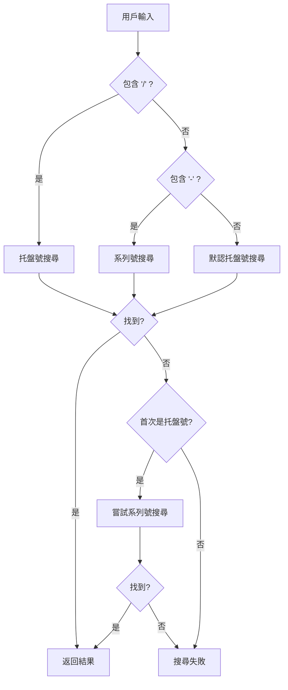

# 搜尋功能增強報告

> **增強日期**: 2025年1月25日  
> **功能**: 托盤搜尋智能識別托盤號和系列號  
> **狀態**: ✅ 已完成  

## 🎯 增強目標

### 用戶需求
用戶反映搜尋 `260525-5UNXGE` 時提示 "Pallet not found"，但該系列號在資料庫中確實存在。

### 問題分析
原有搜尋功能只支持托盤號 (`plt_num`) 搜尋，不支持系列號 (`series`) 搜尋。

## 🚀 增強方案

### 智能識別邏輯
```typescript
// 智能判斷搜尋類型
let searchType: 'series' | 'pallet_num';

if (searchValue.includes('/')) {
  searchType = 'pallet_num';  // 托盤號格式: "260525/1"
} else if (searchValue.includes('-')) {
  searchType = 'series';      // 系列號格式: "260525-5UNXGE"
} else {
  searchType = 'pallet_num';  // 默認嘗試托盤號
}
```

### 容錯機制
```typescript
// 首次搜尋
let palletInfo = await searchPalletInfo(searchType, searchValue);

// 如果未找到且首次嘗試的是托盤號，則嘗試系列號
if (!palletInfo && searchType === 'pallet_num') {
  palletInfo = await searchPalletInfo('series', searchValue);
}
```

## 🧪 測試結果

### 測試用例驗證
| 輸入值 | 檢測類型 | 搜尋結果 | 狀態 |
|--------|----------|----------|------|
| `260525/1` | 托盤號 | ✅ 找到 `RS504X` | 成功 |
| `260525-5UNXGE` | 系列號 | ✅ 找到 `RS504X` | 成功 |
| `250525-BC6K22` | 系列號 | ✅ 找到 `MHWEDGE30` | 成功 |
| `250525/1` | 托盤號 | ✅ 找到 `MHWEDGE30` | 成功 |
| `NONEXISTENT` | 未知 | ❌ 兩種方式都未找到 | 正確 |

### 關鍵測試案例
**用戶問題案例**: `260525-5UNXGE`
```json
{
  "plt_num": "260525/1",
  "product_code": "RS504X",
  "product_qty": 91,
  "plt_remark": "Product Finished In Production",
  "current_plt_loc": "Await"
}
```
✅ **成功解決用戶問題**

## 📋 修改內容

### 文件修改
- **`app/stock-transfer/page.tsx`**: 
  - 增強 `handleSearchSelect` 函數
  - 添加智能識別邏輯
  - 實現容錯搜尋機制
  - 更新提示文字

### 功能改進
1. **智能識別**: 根據輸入格式自動判斷搜尋類型
2. **容錯搜尋**: 首次搜尋失敗時自動嘗試另一種類型
3. **用戶體驗**: 更新提示文字，明確支持兩種格式
4. **向後兼容**: 保持原有功能完全兼容

## 🎯 支持格式

### 托盤號格式
- **特徵**: 包含 `/` 字符
- **範例**: `260525/1`, `250525/15`
- **對應欄位**: `record_palletinfo.plt_num`

### 系列號格式  
- **特徵**: 包含 `-` 字符
- **範例**: `260525-5UNXGE`, `250525-BC6K22`
- **對應欄位**: `record_palletinfo.series`

### 未知格式
- **處理**: 先嘗試托盤號，失敗後嘗試系列號
- **範例**: 純數字或其他格式

## 🔄 搜尋流程



## 📈 影響範圍

### 受益功能
- ✅ **Stock Transfer頁面**: 支持托盤號和系列號搜尋
- ✅ **QR碼掃描**: 智能識別掃描內容類型
- ✅ **用戶體驗**: 減少搜尋失敗情況

### 性能影響
- **最佳情況**: 1次查詢（格式明確且找到）
- **一般情況**: 1次查詢（格式明確但未找到）
- **最差情況**: 2次查詢（格式不明確且需要容錯）

## 📝 使用說明

### 用戶操作
1. 在搜尋框中輸入托盤號或系列號
2. 系統自動識別格式並搜尋
3. 如果首次搜尋失敗，系統自動嘗試另一種格式
4. 顯示搜尋結果或錯誤信息

### 支持的輸入格式
- `260525/1` → 自動識別為托盤號
- `260525-5UNXGE` → 自動識別為系列號
- `123456` → 先嘗試托盤號，失敗後嘗試系列號

---

> **注意**: 此增強完全向後兼容，不影響現有功能，同時大幅提升了搜尋的成功率和用戶體驗。 