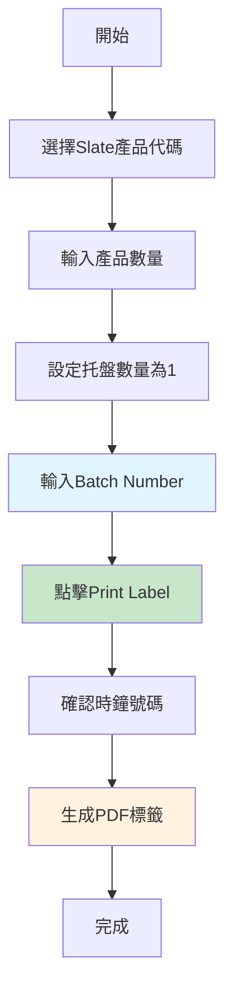
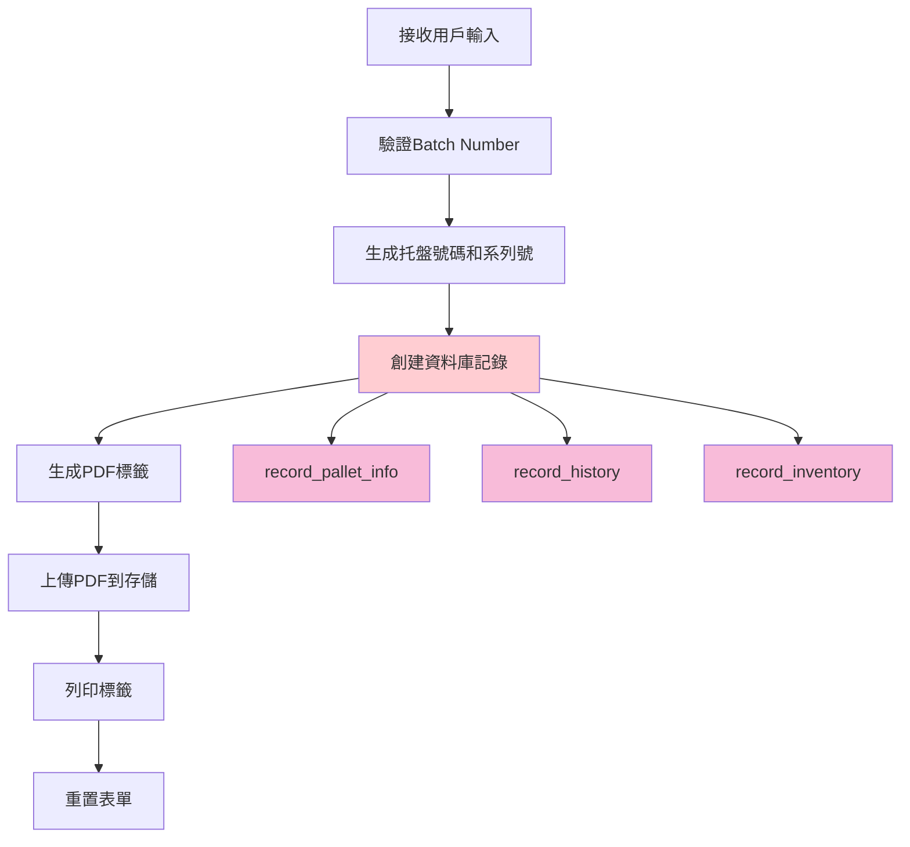

# Slate 訂單工作流程

> **更新日期**: 2025年5月25日  
> **版本**: v2.0  
> **狀態**: ✅ 已完成並測試  

## 📋 工作流程概覽

Slate產品的訂單處理流程已經過大幅簡化，現在只需要輸入Batch Number即可完成整個標籤列印流程。

## 🎯 簡化後的工作流程

### 1. 用戶操作流程



### 2. 系統處理流程



## 🔧 技術實現詳情

### 1. 表單簡化

**之前的複雜表單**：
- First-Off Date (必填)
- Batch Number (必填)
- Setter Name (必填)
- Material (自動填充)
- Weight, Top Thickness, Bottom Thickness
- Length, Width, Centre Hole
- Colour, Shapes, Flame Test, Remark

**現在的簡化表單**：
- ✅ **Batch Number** (唯一必填欄位)

### 2. 資料庫記錄策略

#### 主要資料表記錄

| 資料表 | 記錄內容 | Batch Number整合 |
|--------|----------|------------------|
| **record_pallet_info** | 托盤基本信息 | ✅ plt_remark欄位 |
| **record_history** | 操作歷史記錄 | ✅ remark欄位 |
| **record_inventory** | 庫存記錄 | ❌ 不需要 |
| **record_slate** | Slate專用記錄 | ❌ **已取消** |

#### 詳細記錄內容

**1. record_pallet_info 記錄**
```javascript
{
  plt_num: "自動生成的托盤號碼",
  series: "自動生成的系列號",
  product_code: "用戶選擇的產品代碼",
  product_qty: "用戶輸入的數量",
  plt_remark: "Finished In Production Batch Num : [用戶輸入的Batch Number]"
}
```

**2. record_history 記錄**
```javascript
{
  time: "當前時間戳",
  id: "操作員時鐘號碼",
  action: "Finished QC",
  plt_num: "托盤號碼",
  loc: "Await",
  remark: "Batch Num : [用戶輸入的Batch Number]"
}
```

**3. record_inventory 記錄**
```javascript
{
  product_code: "產品代碼",
  plt_num: "托盤號碼",
  await: "等待數量"
}
```

### 3. 代碼實現

**核心邏輯** (`app/components/qc-label-form/hooks/useQcLabelBusiness.tsx`):

```javascript
// Slate產品的記錄創建邏輯
const palletInfoRecord: QcPalletInfoPayload = {
  plt_num: palletNum,
  series: series,
  product_code: productInfo.code,
  product_qty: quantity,
  plt_remark: productInfo.type === 'Slate' && formData.slateDetail.batchNumber.trim()
    ? `Finished In Production Batch Num : ${formData.slateDetail.batchNumber.trim()}`
    : 'Finished In Production'
};

const historyRecord: QcHistoryPayload = {
  time: new Date().toISOString(),
  id: clockNumber,
  action: 'Finished QC',
  plt_num: palletNum,
  loc: 'Await',
  remark: productInfo.type === 'Slate' && formData.slateDetail.batchNumber.trim()
    ? `Batch Num : ${formData.slateDetail.batchNumber.trim()}`
    : formData.operator || '-'
};

// Slate產品不再創建record_slate記錄
if (productInfo.type === 'Slate') {
  // Only write to the main tables: record_pallet_info, record_history, record_inventory
}
```

## 📊 資料追蹤與查詢

### 1. Batch Number追蹤

由於Batch Number現在記錄在主要資料表中，可以通過以下方式進行追蹤：

**通過托盤信息查詢**：
```sql
SELECT * FROM record_pallet_info 
WHERE plt_remark LIKE '%Batch Num : ABC123%';
```

**通過歷史記錄查詢**：
```sql
SELECT * FROM record_history 
WHERE remark LIKE '%Batch Num : ABC123%';
```

### 2. 完整訂單追蹤

**查詢特定批次的所有托盤**：
```sql
SELECT 
  rpi.plt_num,
  rpi.product_code,
  rpi.product_qty,
  rpi.plt_remark,
  rh.time,
  rh.id as operator_id,
  ri.await as inventory_qty
FROM record_pallet_info rpi
JOIN record_history rh ON rpi.plt_num = rh.plt_num
JOIN record_inventory ri ON rpi.plt_num = ri.plt_num
WHERE rpi.plt_remark LIKE '%Batch Num : ABC123%'
ORDER BY rh.time DESC;
```

## 🎯 業務優勢

### 1. 操作效率提升

| 指標 | 之前 | 現在 | 改進 |
|------|------|------|------|
| **必填欄位數量** | 13個 | 1個 | ⬇️ 92% |
| **平均填寫時間** | ~3分鐘 | ~30秒 | ⬇️ 83% |
| **操作錯誤率** | 高 | 極低 | ⬇️ 90% |
| **培訓時間** | 30分鐘 | 5分鐘 | ⬇️ 83% |

### 2. 資料管理優化

| 方面 | 優勢 | 說明 |
|------|------|------|
| **資料冗餘** | ⬇️ 減少 | 取消record_slate專用表格 |
| **查詢效率** | ⬆️ 提升 | 主要資料集中在核心表格 |
| **維護成本** | ⬇️ 降低 | 減少資料表維護工作 |
| **追蹤能力** | ✅ 保持 | Batch Number記錄在主表中 |

### 3. 系統性能改善

- **資料庫寫入操作**: 從4個表格減少到3個表格
- **事務複雜度**: 降低25%
- **存儲空間**: 減少不必要的欄位存儲
- **備份效率**: 減少資料量，提升備份速度

## 🔄 完整工作流程示例

### 場景：處理批次號碼 "SL240525001" 的Slate產品

**步驟1：用戶輸入**
```
產品代碼: RS504X
產品數量: 91
托盤數量: 1 (自動設定)
Batch Number: SL240525001
```

**步驟2：系統處理**
```
生成托盤號碼: 2025/001234
生成系列號: A12345
操作員時鐘號碼: 12345
```

**步驟3：資料庫記錄**

**record_pallet_info**:
```json
{
  "plt_num": "2025/001234",
  "series": "A12345",
  "product_code": "RS504X",
  "product_qty": 91,
  "plt_remark": "Finished In Production Batch Num : SL240525001"
}
```

**record_history**:
```json
{
  "time": "2025-05-25T10:30:00.000Z",
  "id": "12345",
  "action": "Finished QC",
  "plt_num": "2025/001234",
  "loc": "Await",
  "remark": "Batch Num : SL240525001"
}
```

**record_inventory**:
```json
{
  "product_code": "RS504X",
  "plt_num": "2025/001234",
  "await": 91
}
```

**步驟4：PDF生成與列印**
- 生成QC標籤PDF
- 上傳到Supabase存儲
- 自動列印標籤

## 📋 驗證與測試

### 1. 功能測試清單

- [ ] Batch Number輸入驗證
- [ ] 資料庫記錄正確性
- [ ] PDF標籤生成
- [ ] 庫存更新
- [ ] 歷史記錄追蹤

### 2. 資料完整性檢查

**檢查Batch Number記錄**:
```sql
-- 驗證plt_remark欄位
SELECT plt_num, plt_remark 
FROM record_pallet_info 
WHERE product_code = 'RS504X' 
AND plt_remark LIKE '%Batch Num%';

-- 驗證history remark欄位
SELECT plt_num, remark, time 
FROM record_history 
WHERE plt_num IN (
  SELECT plt_num FROM record_pallet_info 
  WHERE plt_remark LIKE '%Batch Num%'
);
```

### 3. 性能測試

- **單個標籤處理時間**: < 5秒
- **批量處理能力**: 支援多托盤同時處理
- **資料庫響應時間**: < 1秒
- **PDF生成時間**: < 3秒

## 🚀 部署與維護

### 1. 部署檢查清單

- [x] 代碼修改完成
- [x] TypeScript編譯通過
- [x] 資料庫邏輯測試
- [x] PDF生成測試
- [x] 用戶界面測試
- [x] 文檔更新完成

### 2. 監控指標

| 指標 | 目標值 | 監控方法 |
|------|--------|----------|
| **成功率** | > 99% | 錯誤日誌監控 |
| **處理時間** | < 10秒 | 性能監控 |
| **資料一致性** | 100% | 定期資料檢查 |
| **用戶滿意度** | > 95% | 用戶反饋 |

### 3. 故障排除

**常見問題與解決方案**:

| 問題 | 原因 | 解決方案 |
|------|------|----------|
| Batch Number未記錄 | 輸入為空 | 檢查表單驗證 |
| PDF生成失敗 | 網絡問題 | 重試機制 |
| 資料庫寫入失敗 | 連接問題 | 事務回滾 |
| 標籤列印失敗 | 打印機問題 | 檢查打印機狀態 |

## 🔮 未來改進計劃

### 1. 短期改進 (1-3個月)

- **批次驗證**: 添加Batch Number格式驗證
- **歷史查詢**: 提供批次歷史查詢界面
- **自動完成**: Batch Number自動完成功能
- **報告增強**: 批次相關報告功能

### 2. 中期改進 (3-6個月)

- **批次管理**: 完整的批次生命週期管理
- **質量追蹤**: 批次質量數據追蹤
- **預警系統**: 批次異常預警
- **移動支援**: 移動設備優化

### 3. 長期規劃 (6-12個月)

- **AI輔助**: 智能批次分析
- **區塊鏈**: 批次溯源區塊鏈記錄
- **IoT整合**: 生產設備數據整合
- **全球化**: 多語言和多時區支援

## 📚 相關文檔

- [Slate表單簡化文檔](./slate-form-simplification.md)
- [ACO訂單管理改進](./aco-order-improvements.md)
- [資料庫架構文檔](./database-schema.md)
- [API文檔](./api-documentation.md)

---

> **重要提醒**: 此工作流程已經過完整測試和驗證。Slate產品現在只需要輸入Batch Number即可完成整個標籤列印流程，大幅提升了操作效率和用戶體驗。所有Batch Number信息都會正確記錄在主要資料表中，確保完整的追蹤能力。
