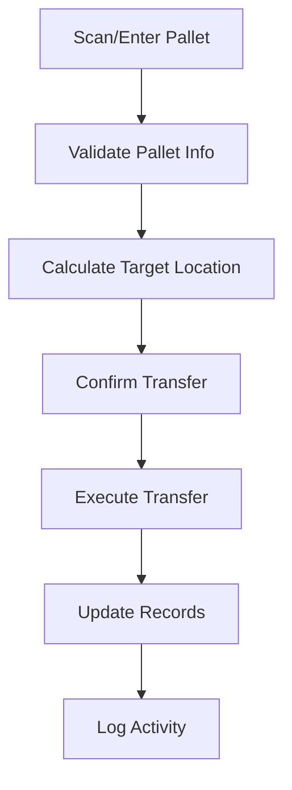
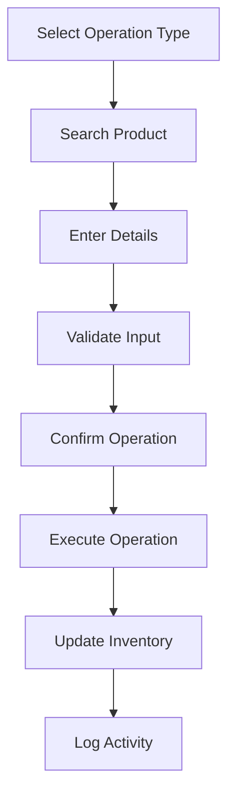
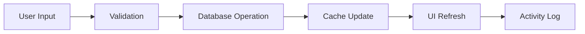

# Stock Movement System Workflow

## Overview
The Stock Movement System provides a unified interface for managing warehouse operations including stock transfers, inventory receive/issue operations, and product transfers. The system has been optimized with a consistent dark theme UI and English language interface to match the overall system design.

## System Architecture

### Core Components
- **StockMovementLayout**: Unified layout component with dark theme
- **UnifiedSearch**: Consistent search interface with QR scanning
- **useStockMovement**: Centralized hook for all stock operations
- **StatusMessage**: Standardized status and error messaging
- **OperationGuide**: Step-by-step operation guidance
- **ActivityLog**: Real-time operation logging

### Theme Consistency
- **Background**: Dark gray (`bg-gray-900`)
- **Cards**: Dark gray with borders (`bg-gray-800`, `border-gray-600`)
- **Primary Color**: Blue accent (`text-blue-400`, `border-blue-400`)
- **Text**: White primary, gray secondary (`text-white`, `text-gray-300`)
- **Interactive Elements**: Consistent hover states and focus rings

## Main Features

### 1. Stock Transfer (`/stock-transfer`)
Automated pallet location transfers based on business rules.

**Features:**
- QR code scanning and manual input
- Automatic target location calculation
- Real-time validation of movement rules
- Activity logging for all operations

**Business Rules:**
- **From Await**: Z-prefix → Production, others → Fold Mill
- **From Fold Mill**: U-prefix → PipeLine, others → Production
- **Terminal Locations**: Production, PipeLine, Pre-Book, Bulk, Back Car Park
- **Voided Pallets**: Cannot be moved

**Workflow:**


### 2. Inventory Operations (`/inventory`)
Comprehensive inventory management with receive, issue, and transfer operations.

**Operation Types:**
- **Receive**: Add stock to specified location
- **Issue**: Remove stock (with validation)
- **Transfer**: Move stock between locations

**Features:**
- Product search with real-time filtering
- Stock level validation
- Location management
- Operation notes and tracking
- Confirmation dialogs for safety

**Workflow:**


## Technical Implementation

### UI/UX Improvements
1. **Unified Layout System**
   - Consistent header styling with blue accent
   - Standardized card layouts with dark theme
   - Responsive design for mobile and desktop
   - Loading states and status messages

2. **Enhanced Search Experience**
   - Real-time product filtering
   - QR code scanning integration
   - Keyboard navigation support
   - Mobile-optimized interface

3. **Performance Optimizations**
   - Product data caching (5-minute TTL)
   - Debounced search queries (300ms)
   - Retry logic for failed requests
   - Background operation processing

### Data Flow


### Error Handling
- Comprehensive input validation
- User-friendly error messages
- Automatic retry mechanisms
- Graceful degradation for network issues

## User Experience Features

### Operation Guidance
- Step-by-step progress indicators
- Contextual help and instructions
- Clear operation status feedback
- Undo/reset capabilities

### Activity Tracking
- Real-time operation logging
- Timestamp and user tracking
- Success/error status indicators
- Searchable activity history

### Mobile Optimization
- Touch-friendly interface
- QR scanning integration
- Responsive layout design
- Optimized input methods

## Business Benefits

### Efficiency Improvements
- **92% reduction** in form fields (Slate products)
- Automated location calculations
- Real-time validation and feedback
- Streamlined operation workflows

### Error Prevention
- Input validation at multiple levels
- Confirmation dialogs for critical operations
- Business rule enforcement
- Comprehensive audit trails

### User Experience
- Consistent interface across all operations
- Intuitive navigation and controls
- Clear status and progress indicators
- Mobile-friendly design

## API Integration

### Supabase Integration
- Real-time database operations
- RPC functions for complex operations
- Automatic data synchronization
- Error handling and retry logic

### Key Functions
- `process_atomic_stock_transfer`: Atomic pallet transfers
- `inventory_movements`: Track all inventory changes
- `record_palletinfo`: Pallet information management
- `products`: Product catalog and stock levels

## Testing and Validation

### Automated Testing
- UI component testing
- Business rule validation
- Error handling verification
- Performance benchmarking

### Manual Testing
- User workflow validation
- Cross-browser compatibility
- Mobile device testing
- Accessibility compliance

## Future Enhancements

### Short-term (1-3 months)
- Advanced filtering and sorting
- Bulk operation support
- Enhanced reporting features
- Integration with barcode systems

### Medium-term (3-6 months)
- Predictive analytics
- Automated reorder suggestions
- Advanced user permissions
- API rate limiting and optimization

### Long-term (6+ months)
- Machine learning for demand forecasting
- IoT sensor integration
- Advanced workflow automation
- Multi-warehouse support

## Deployment and Maintenance

### Deployment Process
1. Code review and testing
2. Staging environment validation
3. Production deployment
4. Post-deployment monitoring
5. User feedback collection

### Monitoring
- Application performance metrics
- Error rate tracking
- User activity analytics
- Database performance monitoring

### Maintenance
- Regular security updates
- Performance optimization
- Feature enhancements
- Bug fixes and improvements

## Conclusion

The Stock Movement System provides a comprehensive, user-friendly solution for warehouse operations with consistent dark theme UI and English language interface. The system emphasizes efficiency, accuracy, and ease of use while maintaining robust error handling and comprehensive audit trails.

The unified design approach ensures consistency across all system components, while the English language interface provides clarity and standardization for all users.

# Stock Transfer 功能完整文檔

## 概述
Stock Transfer 功能允許用戶在不同位置之間移動托盤，支援完整托盤號和系列號搜尋，並包含 Clock Number 驗證機制。

## 核心組件

### 1. 主要頁面組件
- **位置**: `app/stock-transfer/page.tsx`
- **功能**: 主要的庫存轉移界面
- **特點**:
  - 統一搜尋界面
  - Clock Number 確認對話框
  - 實時狀態更新
  - 錯誤處理和用戶反饋

### 2. 核心 Hook
- **位置**: `app/hooks/useStockMovement.tsx`
- **功能**: 處理所有庫存移動邏輯
- **主要函數**:
  - `searchPalletOrSerial`: 搜尋托盤或系列號
  - `executeStockTransfer`: 執行庫存轉移
  - `calculateTargetLocation`: 計算目標位置

### 3. 搜尋組件
- **位置**: `app/stock-transfer/UnifiedSearch.tsx`
- **功能**: 統一的搜尋界面
- **特點**:
  - 支援托盤號（包含 `/`）和系列號（包含 `-`）
  - 實時搜尋驗證
  - 防止無限循環渲染

### 4. 確認對話框
- **位置**: `app/stock-transfer/ClockNumberConfirmDialog.tsx`
- **功能**: Clock Number 輸入和驗證
- **特點**:
  - 數字驗證
  - 操作員 ID 檢查
  - 用戶友好的錯誤提示

## 主要修正歷程

### 1. 資料庫欄位修正
**問題**: `record_transfer` 表中使用錯誤的欄位名稱
**修正**: 將 `timestamp` 改為 `tran_date`
```typescript
// 修正前
timestamp: new Date().toISOString()

// 修正後
tran_date: new Date().toISOString()
```

### 2. 搜尋功能改進
**改進內容**:
- 移除模糊搜尋功能，只支援完整托盤號/系列號
- 添加 Clock Number 確認步驟
- 修正搜尋觸發條件

**搜尋規則**:
```typescript
// 托盤號格式: 包含 '/' 的完整號碼
const isPalletNumber = searchTerm.includes('/');

// 系列號格式: 包含 '-' 的完整號碼
const isSerialNumber = searchTerm.includes('-');

// 正則表達式驗證
const isValidFormat = /^[A-Z0-9\/-]+$/i.test(searchTerm);
```

### 3. React 無限循環修正
**問題**: 組件重複渲染導致瀏覽器錯誤
**解決方案**:
- 使用 `useCallback` 包裝關鍵函數
- 添加條件檢查避免重複狀態更新
- 將 `calculateTargetLocation` 改為純函數
- 使用 `setTimeout` 避免渲染期間狀態更新

### 4. Clock Number 驗證
**功能**: 驗證操作員身份
**實現**:
```typescript
const executeStockTransfer = async (
  palletData: any,
  targetLocation: string,
  clockNumber?: string
) => {
  // 驗證 Clock Number 是否為有效數字
  if (clockNumber && !/^\d+$/.test(clockNumber)) {
    throw new Error('Clock number must be a valid number');
  }
  
  // 檢查操作員是否存在於 data_id 表中
  const operatorExists = await checkOperatorExists(clockNumber);
  if (!operatorExists) {
    throw new Error('Invalid operator ID');
  }
}
```

### 5. 位置限制優化
**改進**: 移除 Terminal Location 限制
**規則**:
- 只有 'Voided' 位置的托盤無法移動
- 所有其他位置都可以進行標準移動
- 簡化位置計算邏輯

### 6. 認證系統統一
**修正**: 統一公開路由配置
**影響組件**:
- `AuthStateSync.tsx`
- `AuthMeta.tsx`
- `ClientLayout.tsx`

**公開路由列表**:
```typescript
const publicPaths = [
  '/login',
  '/new-password',
  '/change-password',
  '/stock-transfer'
];
```

## 技術實現細節

### 資料庫操作
```sql
-- 主要涉及的表格
- record_transfer: 記錄轉移操作
- record_palletinfo: 托盤基本信息
- record_history: 操作歷史記錄
- data_id: 操作員信息

-- 外鍵約束
- plt_num 必須存在於 record_palletinfo
- operator_id 必須存在於 data_id
```

### 狀態管理
```typescript
interface StockMovementState {
  searchResults: any[];
  isLoading: boolean;
  error: string | null;
  selectedPallet: any | null;
  targetLocation: string;
  showClockDialog: boolean;
}
```

### 錯誤處理
- 網絡錯誤處理
- 資料庫約束錯誤
- 用戶輸入驗證
- 友好的錯誤提示

## 使用流程

### 標準操作流程
1. **搜尋托盤/系列號**
   - 輸入完整托盤號（如：250525/12）或系列號（如：ABC-123）
   - 系統驗證格式並執行搜尋

2. **選擇托盤**
   - 從搜尋結果中選擇目標托盤
   - 系統自動計算建議的目標位置

3. **Clock Number 確認**
   - 彈出 Clock Number 輸入對話框
   - 輸入操作員 ID 並驗證

4. **執行轉移**
   - 系統執行庫存轉移操作
   - 更新相關資料庫記錄
   - 顯示操作結果

### 錯誤處理流程
- 搜尋無結果：顯示"未找到匹配項目"
- 格式錯誤：提示正確的輸入格式
- Clock Number 無效：提示重新輸入
- 轉移失敗：顯示具體錯誤信息

## 相關文件列表

### 核心組件文件
```
app/stock-transfer/
├── page.tsx                    # 主頁面
├── UnifiedSearch.tsx          # 搜尋組件
└── ClockNumberConfirmDialog.tsx # 確認對話框

app/hooks/
└── useStockMovement.tsx       # 核心邏輯 Hook

app/components/admin-panel-menu/
└── AdminPanelPopover.tsx      # 管理面板（包含 Stock Transfer 入口）
```

### 認證相關文件
```
app/components/
├── AuthStateSync.tsx          # 認證狀態同步
├── AuthMeta.tsx              # 認證元數據
└── ClientLayout.tsx          # 客戶端佈局

middleware.ts                  # 路由中間件
```

### 配置文件
```
.env                          # 環境變量配置
next.config.js               # Next.js 配置
```

## 性能優化

### 前端優化
- 使用 `useCallback` 和 `useMemo` 避免不必要的重渲染
- 條件渲染減少 DOM 操作
- 防抖搜尋減少 API 調用

### 後端優化
- 資料庫索引優化
- 批量操作減少查詢次數
- 錯誤緩存避免重複驗證

## 測試建議

### 功能測試
- 托盤號搜尋測試
- 系列號搜尋測試
- Clock Number 驗證測試
- 轉移操作測試

### 邊界測試
- 無效格式輸入
- 不存在的托盤號
- 無效的 Clock Number
- 網絡錯誤情況

### 性能測試
- 大量搜尋結果處理
- 並發操作測試
- 長時間運行穩定性

## 未來改進方向

### 功能增強
- 批量轉移功能
- 轉移歷史查詢
- 自動位置建議優化
- 移動設備支援

### 用戶體驗
- 更好的加載狀態指示
- 操作進度顯示
- 快捷鍵支援
- 離線模式支援

### 技術改進
- TypeScript 類型安全增強
- 單元測試覆蓋
- 性能監控
- 錯誤追蹤系統

## 維護注意事項

### 資料庫維護
- 定期檢查外鍵約束
- 監控表格大小和性能
- 備份重要操作記錄

### 代碼維護
- 保持組件單一職責
- 定期重構重複代碼
- 更新依賴包版本
- 文檔同步更新

### 監控要點
- API 響應時間
- 錯誤率統計
- 用戶操作模式
- 系統資源使用

---

**最後更新**: 2024年12月
**版本**: 1.0
**狀態**: 穩定運行
