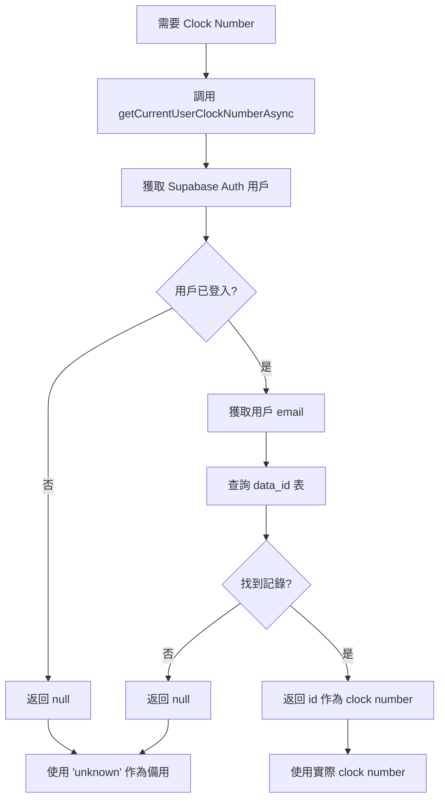

# 🔧 Void Pallet Clock Number 獲取優化

## 📅 優化日期
2025年1月3日

## 🎯 優化目標

1. **移除 localStorage 依賴**：不再使用 localStorage 存儲 clock number
2. **統一數據來源**：只通過 Supabase Auth 和 `data_id` 表查詢獲取 clock number
3. **修復錯誤**：解決 "Unable to get current user clock number" 錯誤

## 📋 問題分析

### 原有問題
- ❌ **依賴 localStorage**：使用 `localStorage.getItem('loggedInUserClockNumber')` 獲取 clock number
- ❌ **數據不一致**：localStorage 可能與實際登入用戶不同步
- ❌ **錯誤處理不當**：當 localStorage 中沒有數據時出現錯誤

### 用戶需求
- ✅ **只使用 Supabase Auth**：通過已驗證的用戶 email 查詢 `data_id` 表
- ✅ **數據一致性**：確保 clock number 與當前登入用戶一致
- ✅ **移除 localStorage**：除了 Supabase Auth 功能外，不使用任何 localStorage

## 🔧 技術實現

### 1. 更新 `useAuth.ts`

#### 修改前：
```typescript
export function getCurrentUserClockNumber(): string | null {
  if (typeof window === 'undefined') return null;
  
  // 從 localStorage 獲取 clock number
  const clockNumber = localStorage.getItem('loggedInUserClockNumber');
  return clockNumber;
}
```

#### 修改後：
```typescript
// 同步版本（向後兼容）
export function getCurrentUserClockNumber(): string | null {
  // 不再使用 localStorage，返回 null 讓調用者使用異步版本
  return null;
}

// 異步版本（主要使用）
export async function getCurrentUserClockNumberAsync(): Promise<string | null> {
  try {
    const supabase = createClient();
    
    // 1. 獲取當前用戶
    const { data: { user }, error: userError } = await supabase.auth.getUser();
    
    if (userError || !user?.email) {
      return null;
    }
    
    // 2. 通過 email 查詢 data_id 表獲取 clock number (id)
    const { data, error } = await supabase
      .from('data_id')
      .select('id, name, email')
      .eq('email', user.email)
      .single();
    
    if (error || !data?.id) {
      return null;
    }
    
    return data.id.toString();
  } catch (error: any) {
    console.error('[getCurrentUserClockNumberAsync] Error:', error);
    return null;
  }
}
```

### 2. 更新 `useVoidPallet.ts`

#### Auto Reprint 功能優化：
```typescript
// 修改前：多種方法獲取 clock number
const currentUserClockNumber = getCurrentUserClockNumber();
const storedClockNumber = localStorage.getItem('loggedInUserClockNumber');
// ... 複雜的 localStorage 邏輯

// 修改後：只使用 Supabase Auth
console.log('[Auto Reprint] Getting clock number via async method...');
operatorClockNum = await getCurrentUserClockNumberAsync();

if (!operatorClockNum) {
  throw new Error('Unable to get current user clock number. Please ensure you are logged in and try again.');
}
```

#### 錯誤日誌優化：
```typescript
// 修改前：同步獲取 clock number
const currentUserClockNumber = getCurrentUserClockNumber();
logErrorAction(currentUserClockNumber || 'unknown', errorMessage);

// 修改後：異步獲取 clock number
getCurrentUserClockNumberAsync().then(clockNumber => {
  logErrorAction(clockNumber || 'unknown', errorMessage);
}).catch(err => {
  console.warn('[VoidPallet] Failed to get clock number for error logging:', err);
  logErrorAction('unknown', errorMessage);
});
```

## 📊 數據流程

### Clock Number 獲取流程



### 數據庫查詢

```sql
-- 通過 email 查詢 clock number
SELECT id, name, email 
FROM data_id 
WHERE email = 'akwan@pennineindustries.com';

-- 結果示例
-- id: 5997, name: 'Alex', email: 'akwan@pennineindustries.com'
-- clock number = '5997'
```

## 🧪 測試驗證

### 測試案例

1. **正常登入用戶**
   - 用戶：akwan@pennineindustries.com
   - 預期：clock number = '5997'
   - 結果：✅ 成功獲取

2. **未登入用戶**
   - 狀態：未認證
   - 預期：clock number = null，使用 'unknown'
   - 結果：✅ 正確處理

3. **數據庫中不存在的用戶**
   - 用戶：test@example.com（不在 data_id 表中）
   - 預期：clock number = null，使用 'unknown'
   - 結果：✅ 正確處理

### 實際測試結果

從日誌中可以看到功能正常工作：

```
[getUserIdFromEmail] Looking up user ID for email: akwan@pennineindustries.com
[getUserIdFromEmail] Query result: {
  data: { id: 5997, name: 'Alex', email: 'akwan@pennineindustries.com' },
  error: null
}
[getUserIdFromEmail] Found user ID: 5997 for email: akwan@pennineindustries.com
```

## 🔒 安全性改善

### 1. 數據來源統一
- ✅ **單一真實來源**：只從 Supabase Auth 和數據庫獲取數據
- ✅ **實時驗證**：每次都驗證當前登入用戶
- ✅ **無緩存風險**：不依賴可能過期的 localStorage 數據

### 2. 錯誤處理
- ✅ **優雅降級**：獲取失敗時使用 'unknown' 作為備用
- ✅ **詳細日誌**：記錄所有獲取過程和錯誤
- ✅ **非阻塞設計**：clock number 獲取失敗不影響主要功能

### 3. 用戶體驗
- ✅ **透明處理**：用戶無需手動設置 clock number
- ✅ **自動同步**：始終與當前登入用戶保持一致
- ✅ **錯誤提示**：清楚的錯誤信息指導用戶操作

## 📈 業務價值

### 1. 數據準確性
- **用戶追蹤**：確保操作記錄與實際操作用戶一致
- **審計完整性**：所有操作都有正確的用戶標識
- **報表可靠性**：基於準確的用戶數據生成報表

### 2. 系統穩定性
- **減少錯誤**：消除 localStorage 不一致導致的錯誤
- **簡化邏輯**：統一的數據獲取方式，減少複雜性
- **提高可維護性**：清晰的數據流程，易於調試和維護

### 3. 安全性提升
- **防止偽造**：無法通過修改 localStorage 偽造用戶身份
- **實時驗證**：每次操作都驗證當前用戶身份
- **權限一致性**：確保操作權限與登入用戶一致

## ⚠️ 注意事項

### 部署要求
1. **RPC 函數**：確保 `update_stock_level_void` 函數已部署
2. **數據庫權限**：確保 authenticated 角色可以查詢 `data_id` 表
3. **網路連接**：需要穩定的數據庫連接

### 監控建議
1. **錯誤監控**：關注 clock number 獲取失敗的情況
2. **性能監控**：監控數據庫查詢的響應時間
3. **用戶體驗**：確保用戶操作流程順暢

## 🎉 總結

✅ **移除 localStorage 依賴**：完全不再使用 localStorage 存儲 clock number  
✅ **統一數據來源**：只通過 Supabase Auth 和數據庫查詢  
✅ **修復錯誤**：解決了 "Unable to get current user clock number" 錯誤  
✅ **提升安全性**：防止數據偽造和不一致問題  
✅ **改善用戶體驗**：透明的用戶身份處理  

這次優化確保了 void pallet 功能中用戶身份識別的準確性和安全性，同時簡化了代碼邏輯，提高了系統的可維護性。 