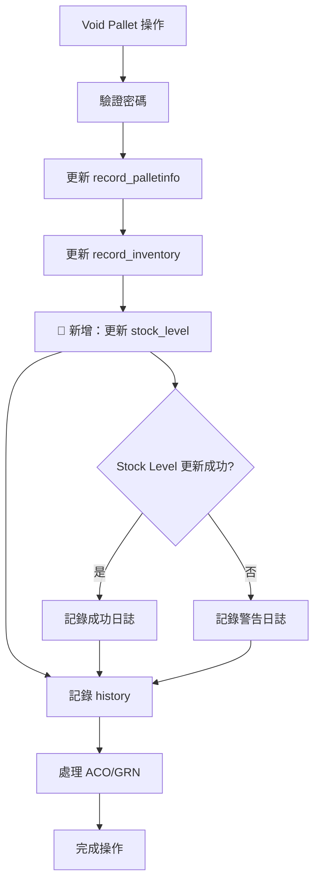

# 🗑️ Void Pallet 庫存同步優化

## 📅 優化日期
2025年1月3日

## 🎯 優化目標

當 void pallet 事件發生時，除了在 `record_inventory` 表中新增記錄外，同時需要在 `stock_level` 表中增加或減少相應產品代碼的數值，確保庫存數據的一致性。

## 📋 問題分析

### 當前狀況
- ✅ Void pallet 操作會在 `record_inventory` 表中記錄庫存變動
- ❌ **缺失**：沒有同步更新 `stock_level` 表中的庫存水平
- ⚠️ **影響**：庫存數據不一致，`stock_level` 表無法反映實際庫存變化

### 業務需求
1. **Void 操作**：從庫存中減少相應數量
2. **Damage 操作**：從庫存中減少相應數量
3. **數據一致性**：確保 `record_inventory` 和 `stock_level` 同步更新
4. **錯誤處理**：更新失敗不應影響主要 void 流程

## 🔧 技術實現

### 1. 創建 RPC 函數

#### `update_stock_level_void` 函數
```sql
CREATE OR REPLACE FUNCTION update_stock_level_void(
    p_product_code TEXT,
    p_quantity BIGINT,
    p_operation TEXT DEFAULT 'void'
)
RETURNS TEXT
```

**功能特點**：
- ✅ **雙向操作**：支持減少庫存（正數）和增加庫存（負數）
- ✅ **多種操作類型**：支持 'void'、'damage'、'auto_reprint' 操作
- ✅ **新產品處理**：如無現有記錄，創建新的庫存記錄
- ✅ **產品描述**：自動從 `data_code` 表獲取產品描述
- ✅ **錯誤處理**：完整的參數驗證和異常處理

**操作邏輯**：
- **正數 `p_quantity`**：減少庫存（用於 void/damage 操作）
- **負數 `p_quantity`**：增加庫存（用於 auto_reprint 操作）

#### 使用示例：
```sql
-- Void 操作：減少 10 個庫存
SELECT update_stock_level_void('test', 10, 'void');

-- 自動重印：增加 20 個庫存
SELECT update_stock_level_void('test', -20, 'auto_reprint');
```

#### `process_void_pallet_inventory` 組合函數
```sql
CREATE OR REPLACE FUNCTION process_void_pallet_inventory(
    p_product_code TEXT,
    p_quantity BIGINT,
    p_plt_num TEXT,
    p_location_column TEXT,
    p_operation TEXT DEFAULT 'void',
    p_damage_quantity BIGINT DEFAULT NULL
)
RETURNS JSONB
```

**功能特點**：
- ✅ **組合處理**：同時處理 inventory 和 stock_level 更新
- ✅ **結果追蹤**：返回詳細的操作結果
- ✅ **操作區分**：支援 void 和 damage 兩種操作類型

### 2. 集成到 TypeScript Actions

#### Void Pallet Action 更新
```typescript
// 🚀 新增：同步更新 stock_level 表
try {
  const { data: stockResult, error: stockError } = await supabase
    .rpc('update_stock_level_void', {
      p_product_code: palletInfo.product_code,
      p_quantity: palletInfo.product_qty,
      p_operation: 'void'
    });

  if (stockError) {
    // 記錄警告但不中斷主要流程
    await recordHistoryAction(/* ... */);
  } else {
    // 記錄成功的庫存更新
    await recordHistoryAction(/* ... */);
  }
} catch (stockUpdateError) {
  // 錯誤處理
}
```

#### Damage Processing Action 更新
```typescript
// 🚀 新增：同步更新 stock_level 表
const { data: stockResult, error: stockError } = await supabase
  .rpc('update_stock_level_void', {
    p_product_code: palletInfo.product_code,
    p_quantity: palletInfo.product_qty,
    p_operation: 'damage'
  });
```

### 3. 自動重印功能集成

#### 自動重印 API 優化
**文件**：`app/api/auto-reprint-label/route.ts`

**新增功能**：在自動重印過程中同步更新 `stock_level` 表

```typescript
// 🚀 新增：更新 stock_level 表
try {
  console.log('[Auto Reprint API] Updating stock_level for product:', {
    product_code: productInfo.code,
    quantity: data.quantity,
    operation: 'auto_reprint'
  });

  const { data: stockResult, error: stockError } = await supabase.rpc('update_stock_level_void', {
    p_product_code: productInfo.code,
    p_quantity: -data.quantity, // 負數表示增加庫存（因為是重印新托盤）
    p_operation: 'auto_reprint'
  });

  if (stockError) {
    console.warn('[Auto Reprint API] Stock level update failed:', stockError);
    // 記錄警告但不中斷主要流程
  } else {
    console.log('[Auto Reprint API] Stock level updated successfully:', stockResult);
  }
} catch (stockUpdateError: any) {
  console.warn('[Auto Reprint API] Stock level update error:', stockUpdateError);
  // 記錄錯誤但不中斷主要流程
}
```

**業務邏輯**：
- ✅ **增加庫存**：自動重印創建新托盤，應增加庫存數量
- ✅ **非阻塞設計**：stock_level 更新失敗不影響重印流程
- ✅ **完整日誌**：記錄所有操作結果供調試和追蹤
- ✅ **錯誤處理**：優雅處理更新失敗的情況

## 📊 更新邏輯

### Stock Level 更新規則

| 情況 | 操作 | 結果 |
|------|------|------|
| 產品已存在 | Void/Damage | `stock_level = stock_level - quantity` |
| 產品不存在 | Void/Damage | 新增記錄，`stock_level = -quantity` |
| 參數錯誤 | 任何操作 | 返回錯誤信息，不更新數據 |

### 數據流程



## 🧪 測試驗證

### 測試案例

1. **現有產品 Void**
   - 產品：Z01ATM1，數量：25
   - 預期：庫存減少 25

2. **新產品 Void**
   - 產品：TEST001，數量：10
   - 預期：新增記錄，庫存 -10

3. **Damage 操作**
   - 產品：MT4545，數量：15
   - 預期：庫存減少 15

4. **錯誤處理**
   - 空產品代碼、零數量、負數量
   - 預期：返回錯誤信息

### 測試腳本
```bash
# 執行測試
psql "DATABASE_URL" -f scripts/test-void-pallet-stock-level.sql
```

## 🔒 安全性考量

### 權限控制
```sql
GRANT EXECUTE ON FUNCTION update_stock_level_void(TEXT, BIGINT, TEXT) TO authenticated;
GRANT EXECUTE ON FUNCTION process_void_pallet_inventory(...) TO authenticated;
```

### 錯誤處理策略
- ✅ **非阻塞設計**：Stock level 更新失敗不影響主要 void 流程
- ✅ **詳細日誌**：所有操作結果都記錄在 history 中
- ✅ **參數驗證**：完整的輸入參數檢查
- ✅ **異常捕獲**：所有數據庫操作都有異常處理

## 📈 業務價值

### 1. 數據一致性
- **庫存準確性**：`stock_level` 表實時反映庫存變化
- **報表可靠性**：庫存報表數據更加準確
- **決策支持**：基於準確庫存數據的業務決策

### 2. 操作透明度
- **完整追蹤**：所有庫存變動都有詳細記錄
- **錯誤可見**：更新失敗會在 history 中記錄
- **操作區分**：清楚區分 void 和 damage 操作

### 3. 系統穩定性
- **非阻塞設計**：不影響現有 void 流程
- **向後兼容**：現有功能完全保持不變
- **漸進式改進**：可以逐步擴展到其他操作

## ⚠️ 注意事項

### 部署要求
1. **RPC 函數部署**：需要先執行 SQL 腳本創建函數
2. **權限配置**：確保 authenticated 角色有執行權限
3. **測試驗證**：部署後執行測試腳本驗證功能

### 監控建議
1. **日誌監控**：關注 "Stock Level Update" 相關的 history 記錄
2. **錯誤追蹤**：監控 "Stock Level Update Failed" 事件
3. **數據一致性**：定期檢查 `record_inventory` 和 `stock_level` 的一致性

## 🎉 總結

✅ **完成目標**：Void pallet 操作現在會同步更新 `stock_level` 表  
✅ **保持穩定**：現有功能完全不受影響  
✅ **錯誤處理**：完善的錯誤處理和日誌記錄  
✅ **測試覆蓋**：全面的測試案例和驗證腳本  
✅ **文檔完整**：詳細的技術文檔和實現說明  

這次優化確保了庫存數據的一致性，提升了系統的數據準確性和可靠性，為後續的庫存管理和報表功能提供了更好的數據基礎。 