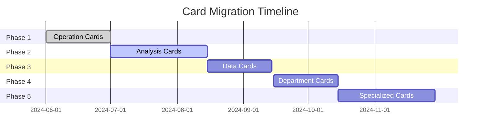

# Card System Migration Context Management Strategy

_Version: 1.0.0 | Date: 2025-08-12_

## Executive Summary

Comprehensive context management strategy for migrating 19 card components from widget-based to card-based architecture across 5 phases, ensuring zero production disruption and maintaining full system consistency.

## Current Migration Status

- **Total Components**: 19 Cards
- **Completion Rate**: 88.2% (as per monitoring config)
- **Phase 1**: ✅ Complete (3 operation cards)
- **Phase 2**: 🔄 In Progress (3 analysis cards)
- **Phase 3-5**: ⏳ Pending (13 cards)

## 1. Migration Tracking Strategy

### 1.1 Component Inventory System

```typescript
interface MigrationTracker {
  componentId: string;
  oldPath: string;
  newPath: string;
  phase: 1 | 2 | 3 | 4 | 5;
  status: 'pending' | 'in-progress' | 'testing' | 'completed' | 'rolled-back';
  dependencies: string[];
  dataSource: 'REST' | 'GraphQL' | 'Hybrid';
  migrationStartDate?: Date;
  migrationEndDate?: Date;
  performanceBaseline: PerformanceMetrics;
  issues: Issue[];
}
```

### 1.2 Tracking Dashboard

- **Real-time Progress**: `/lib/migration-context/dashboard.tsx`
- **Component Matrix**: Visual grid showing all 19 cards with status indicators
- **Dependency Graph**: Interactive visualization of card relationships
- **Performance Comparison**: Side-by-side metrics (old vs new)

### 1.3 Automated Tracking

```json
{
  "tracking_automation": {
    "file_watchers": ["app/**/cards/**/*.tsx", "lib/design-system-deprecated/**/*.tsx"],
    "git_hooks": {
      "pre-commit": "npm run migration:validate",
      "post-merge": "npm run migration:update-status"
    },
    "ci_checks": {
      "component_coverage": "100%",
      "test_coverage": ">80%",
      "performance_budget": "LCP<2.5s, INP<200ms"
    }
  }
}
```

## 2. Context Preservation Between Phases

### 2.1 Context Store Structure

```typescript
interface PhaseContext {
  phaseNumber: number;
  startDate: Date;
  completedComponents: string[];
  decisions: {
    id: string;
    decision: string;
    rationale: string;
    impact: string[];
    timestamp: Date;
  }[];
  patterns: {
    name: string;
    implementation: string;
    usedIn: string[];
  }[];
  breakingChanges: BreakingChange[];
  rollbackPoints: RollbackPoint[];
}
```

### 2.2 Context Persistence

- **Primary Store**: Supabase table `migration_context`
- **Backup**: Local JSON files in `/lib/migration-context/snapshots/`
- **Version Control**: Git tags for each phase completion
- **Documentation**: Auto-generated phase reports

### 2.3 Context Transfer Protocol

1. **Phase Completion Checklist**
   - All components tested
   - Performance benchmarks met
   - Documentation updated
   - Context snapshot created

2. **Next Phase Preparation**
   - Import previous context
   - Identify new dependencies
   - Update migration plan
   - Brief development team

## 3. Dependencies Mapping

### 3.1 Dependency Categories

```typescript
interface DependencyMap {
  cardId: string;
  dependencies: {
    data: {
      apis: string[]; // REST/GraphQL endpoints
      tables: string[]; // Supabase tables
      queries: string[]; // GraphQL queries
    };
    components: {
      shared: string[]; // Shared UI components
      cards: string[]; // Other card dependencies
      hooks: string[]; // Custom hooks
    };
    services: {
      auth: boolean;
      printing?: boolean;
      analytics?: boolean;
      ai?: boolean;
    };
  };
  migrationOrder: number;
}
```

### 3.2 Migration Order (Based on Dependencies)

```
Phase 1 (Complete):
1. StockCountCard (base operation)
2. StockTransferCard (base operation)
3. VoidPalletCard (base operation)

Phase 2 (In Progress):
4. StockLevelListAndChartCard (depends on stock data)
5. StockHistoryCard (depends on stock operations)
6. WorkLevelCard (depends on warehouse data)

Phase 3 (Data Cards):
7. DataUpdateCard (core data operations)
8. OrderLoadCard (depends on data update)
9. UploadCenterCard (file operations)
10. DownloadCenterCard (file operations)

Phase 4 (Department Cards):
11. DepartWareCard (warehouse ops)
12. DepartPipeCard (pipeline ops)
13. DepartInjCard (injection ops)

Phase 5 (Specialized Cards):
14. GRNLabelCard (printing service)
15. QCLabelCard (printing service)
16. ChatbotCard (AI service)
17. VerticalTimelineCard (visualization)
18. TabSelectorCard (navigation)
19. AnalysisCardSelector (meta component)
```

## 4. Risk Assessment Matrix

### 4.1 Risk Categories

| Risk Level  | Description             | Mitigation Strategy               |
| ----------- | ----------------------- | --------------------------------- |
| 🔴 Critical | Production breaking     | Feature flags, immediate rollback |
| 🟠 High     | Performance degradation | Canary deployment, monitoring     |
| 🟡 Medium   | UX inconsistency        | A/B testing, user feedback        |
| 🟢 Low      | Minor issues            | Standard testing, fixes           |

### 4.2 Phase-Specific Risks

```yaml
Phase 2 (Current):
  - Risk: GraphQL query performance
    Level: High
    Mitigation: Query optimization, caching layer

  - Risk: Chart rendering issues
    Level: Medium
    Mitigation: Progressive enhancement, fallbacks

Phase 3:
  - Risk: File upload/download interruption
    Level: Critical
    Mitigation: Dual system operation, queue management

Phase 4:
  - Risk: Department-specific logic conflicts
    Level: High
    Mitigation: Comprehensive integration testing

Phase 5:
  - Risk: Printing service compatibility
    Level: Critical
    Mitigation: Hardware abstraction layer testing
```

## 5. Rollback Strategy

### 5.1 Rollback Mechanisms

```typescript
interface RollbackStrategy {
  automatic: {
    triggers: ['error_rate > 5%', 'response_time > 2000ms', 'availability < 99.5%'];
    action: 'revert_to_previous_version';
    notification: ['slack', 'pager'];
  };
  manual: {
    command: 'npm run migration:rollback --phase=X';
    verification: 'npm run migration:verify-rollback';
    documentation: '/docs/rollback-procedures.md';
  };
}
```

### 5.2 Rollback Checkpoints

1. **Pre-deployment snapshot**
2. **Feature flag toggle**
3. **Database migration reversal**
4. **CDN cache purge**
5. **User session migration**

## 6. Testing Context Requirements

### 6.1 Test Coverage Matrix

```typescript
interface TestContext {
  unitTests: {
    coverage: number; // Target: >80%
    focusAreas: ['component', 'hooks', 'utils'];
  };
  integrationTests: {
    coverage: number; // Target: >70%
    scenarios: ['data-flow', 'user-journey', 'api-integration'];
  };
  e2eTests: {
    coverage: number; // Target: >60%
    browsers: ['chromium', 'firefox', 'webkit'];
    devices: ['desktop', 'tablet', 'mobile'];
  };
  performanceTests: {
    metrics: ['LCP', 'INP', 'CLS', 'TBT'];
    baseline: PerformanceBaseline;
  };
}
```

### 6.2 Phase-Specific Test Requirements

- **Phase 1-2**: Focus on data integrity and API compatibility
- **Phase 3**: File operation reliability and error handling
- **Phase 4**: Department-specific business logic validation
- **Phase 5**: Hardware integration and print quality assurance

## 7. Documentation Context Needs

### 7.1 Documentation Structure

```
/docs/migration/
├── overview.md              # High-level strategy
├── phase-1-completed.md     # Phase 1 retrospective
├── phase-2-progress.md      # Current status
├── phase-3-5-planning.md    # Future phases
├── api-changes.md           # Breaking changes log
├── component-guide.md       # New component usage
├── troubleshooting.md       # Common issues
└── rollback-procedures.md   # Emergency procedures
```

### 7.2 Auto-generated Documentation

- **Component API docs**: Using TypeDoc
- **GraphQL schema docs**: Using GraphQL Codegen
- **Performance reports**: Using Lighthouse CI
- **Migration logs**: Using custom tooling

## 8. Performance Baseline Tracking

### 8.1 Key Metrics

```typescript
interface PerformanceBaseline {
  renderTime: {
    p50: number; // Target: <100ms
    p75: number; // Target: <200ms
    p95: number; // Target: <500ms
  };
  apiLatency: {
    rest: number; // Current baseline
    graphql: number; // Target: REST - 20%
  };
  bundleSize: {
    initial: number; // KB
    lazy: number; // KB
    total: number; // Target: <500KB
  };
  memoryUsage: {
    initial: number; // MB
    peak: number; // MB
    average: number; // Target: <50MB
  };
}
```

### 8.2 Monitoring Implementation

- **Real-time dashboard**: Grafana integration
- **Alerting**: Threshold-based alerts via Slack
- **Reporting**: Weekly performance comparison reports
- **Optimization**: Automatic performance suggestions

## 9. Breaking Change Management

### 9.1 Breaking Change Categories

1. **API Changes**: Endpoint deprecation, schema changes
2. **Component Props**: Interface modifications
3. **State Management**: Store structure changes
4. **Routing**: Path changes, parameter updates
5. **Styling**: Theme system migration

### 9.2 Change Communication Protocol

```yaml
notification_timeline:
  - 2_weeks_before:
      action: 'Announce in team meeting'
      document: 'Create migration guide'
  - 1_week_before:
      action: 'Send email to stakeholders'
      test: 'Run compatibility tests'
  - deployment_day:
      action: 'Enable feature flags'
      monitor: 'Watch error rates'
  - 1_week_after:
      action: 'Gather feedback'
      optimize: 'Performance tuning'
```

## 10. Team Communication Strategy

### 10.1 Communication Channels

```typescript
interface CommunicationPlan {
  channels: {
    slack: {
      migration_updates: '#card-migration';
      alerts: '#system-alerts';
      discussions: '#architecture';
    };
    meetings: {
      daily_standup: '10:00 AM';
      weekly_review: 'Friday 2:00 PM';
      phase_retrospective: 'Phase completion';
    };
    documentation: {
      confluence: 'Migration Wiki';
      github: 'Migration Issues';
      dashboards: 'Grafana boards';
    };
  };
}
```

### 10.2 Stakeholder Matrix

| Stakeholder | Information Needs | Frequency  | Format            |
| ----------- | ----------------- | ---------- | ----------------- |
| Dev Team    | Technical details | Daily      | Standup, Slack    |
| Product     | Progress, issues  | Weekly     | Reports, meetings |
| Management  | High-level status | Bi-weekly  | Dashboard, email  |
| QA Team     | Test requirements | Per phase  | Docs, sessions    |
| DevOps      | Deployment plans  | Pre-deploy | Runbooks, alerts  |

### 10.3 Knowledge Transfer

1. **Pair Programming**: Senior/junior pairing for complex migrations
2. **Documentation Days**: Dedicated time for writing guides
3. **Lunch & Learn**: Weekly knowledge sharing sessions
4. **Migration Playbook**: Step-by-step procedures for each phase

## Implementation Timeline



## Success Metrics

1. **Migration Completion**: 100% of 19 cards migrated
2. **Performance Improvement**: 20% reduction in render time
3. **Error Rate**: <0.1% post-migration
4. **User Satisfaction**: >4.5/5 feedback score
5. **Developer Velocity**: 30% improvement in feature delivery

## Continuous Improvement

- **Weekly Reviews**: Assess progress and adjust strategy
- **Phase Retrospectives**: Learn and apply improvements
- **Performance Monitoring**: Continuous optimization
- **Feedback Loops**: Regular user and developer input
- **Documentation Updates**: Keep all guides current

---

_This strategy document should be reviewed and updated weekly during active migration phases._
